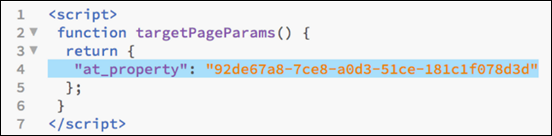

#  엔터프라이즈 권한 구성{#configure-enterprise-permissions}

[!DNL Target] 구현에 사용자를 추가하는 데 필요한 작업에 대한 정보;작업 영역, 사용자 그룹 및 속성 만들기;`at_property` 매개 변수를 포함하도록 [!DNL Target] 구현을 업데이트합니다.역할 및 권한을 지정합니다.

>[!NOTE]
>
>속성 및 권한 기능은 [Target Premium](/help/c-intro/intro.md#premium) 솔루션의 일부로 사용할 수 있습니다. 이 기능은 [!DNL Target Premium] 라이센스가 없는 [!DNL Target Standard]에서는 사용할 수 없습니다.

다음 표에는 속성을 만들고 사용자 역할 및 권한을 지정하기 위해 수행해야 하는 작업이 나와 있습니다. 각 작업에 대한 자세한 내용은 아래 섹션을 참조하십시오.

| 작업 | 수행 위치 |
|--- |--- |
| 1. 사용자 추가(선택 사항) | [!DNL Adobe Admin Console for Enterprise] |
| 2. 작업 공간(제품 프로필) 만들기 | [!DNL Adobe Admin Console for Enterprise] |
| 3. 사용자 그룹 만들기(선택 사항) | [!DNL Adobe Admin Console for Enterprise] |
| 4. 속성 만들기 | [!DNL Target] UI |
| 5: `at_property` 매개 변수를 포함하도록 구현 업데이트 | [!DNL Target] UI, at.js 함수, [!DNL Adobe Launch] 또는 [!DNL Dynamic Tag Management] |
| 6: 역할 및 권한 지정 | [!DNL Adobe Admin Console for Enterprise] |

[!DNL Adobe Admin Console for Enterprise]에서 수행되는 작업의 경우 다음 단계에 따라 콘솔에 액세스합니다.

1. Adobe Target에서 **[!UICONTROL 관리]** > **[!UICONTROL 속성]** > **[!UICONTROL 작업 영역에 속성 지정]**&#x200B;을 클릭합니다.

   또는

   아직 로그인하지 않은 경우 [https://adminconsole.adobe.com/enterprise](https://adminconsole.adobe.com/enterprise/) > Adobe ID을 사용하여 로그인합니다.

1. (조건부) 두 개 이상의 조직을 위한 [!DNL Admin Console for Enterprise]에 액세스할 수 있는 경우 오른쪽 모서리나 맨 위 탐색 막대의 사용자 아바타를 클릭한 다음, 원하는 조직을 선택하십시오.

## 1단계. 사용자 추가(선택 사항) {#section_A92AF0F921B743FEB9E9033433BD816A}

새 [!UICONTROL 속성] 기능을 사용하기 시작할 때 [!DNL Adobe Admin Console for Enterprise]에서 모든 사용자 관리를 수행해야 합니다. 그러나 [!DNL Target]의 모든 기존 사용자는 [!DNL Target]에서 [!DNL Admin Console for Enterprise]로 마이그레이션됩니다.

1. [Admin Console에서](/help/administrating-target/c-user-management/property-channel/properties-overview.md#section_79796E0227D048F59BAE0AB02E544EBE) 페이지 상단에 있는 **[!UICONTROL 사용자]** 탭 > **[!UICONTROL 사용자 추가]**&#x200B;를 클릭하여 새로운 사용자를 생성하거나 기존 사용자를 편집합니다.
1. *Enterprise 사용 안내서*&#x200B;의 [Experience Cloud에서 사용자 및 그룹 관리](https://helpx.adobe.com/enterprise/help/users.html)에 있는 지침을 따릅니다.

## 2단계. 작업 공간 만들기(제품 프로필) {#section_B82EB409B67C4D9D9D20CE30E48DB1DC}

작업 공간(제품 프로필)을 사용하면 조직에서 특정 사용자 집합을 특정 속성 집합에 할당할 수 있습니다. 여러 가지 방식에서 작업 공간은 [!DNL Analytics]의 보고서 세트와 비슷합니다.

조직은 [!DNL Admin Console] 내에 새 작업 영역을 만들고, 이러한 작업 영역에 [!DNL Target] 속성을 할당하고, 사용자가 &quot;기본 작업 공간&quot; 구성에서 이러한 새롭고 제한된 액세스 작업 영역으로 이동하여 엔터프라이즈 권한 기능을 활용할 수 있습니다.

고객은 이러한 작업 공간을 사용하여 지역, 사업부, 사이트 섹션별로 또는 선택한 다른 방법을 통해 여러 다른 팀에 대한 액세스를 구분할 수 있습니다.

사용자는 여러 작업 공간에 속할 수 있으며, 각 작업 공간에서 서로 다른 역할을 가질 수도 있습니다.

1. [!DNL Admin Console]에서 **[!UICONTROL 제품]**&#x200B;을 클릭한 다음, 원하는 제품의 이름을 선택합니다.

   

1. 원하는 작업 공간(제품 프로필) 만들기:

   * **기본 액세스:**&#x200B;기존의 모든 활동은 &quot;기본 액세스&quot;라는 단일 프로젝트로 병합됩니다. 이는 고객에게 영향을 주지 않습니다. 모든 사용자 역할 및 기능은 이 변경 이전과 정확히 동일하게 유지됩니다.

      AEM([!DNL Adobe Experience Manager]), [!DNL Adobe Mobile Services] 및 [!DNL Target Classic]을 통해 만든 모든 활동도 &quot;기본 액세스&quot; 작업 공간에 포함됩니다. 현재, 프로젝트를 &quot;기본 액세스&quot;에서 다른 프로젝트로 이동할 수 없습니다.

   * **새 작업 공간(제품 프로필):**&#x200B;다음을 수행하여 새 권한 기능을 활용할 수 있습니다.

      * [!DNL Admin Console for Enterprise]에서 새 작업 공간 만들기
      * 작업 공간에 Target 속성 지정

   이러한 작업 공간을 사용하여 지역, 사업부, 사이트 섹션별로 또는 선택한 다른 방법을 통해 여러 다른 팀에 대한 액세스를 구분할 수 있습니다. 사용자는 여러 작업 공간에 속할 수 있으며, 각 작업 공간에서 서로 다른 역할을 가질 수 있습니다.

1. *Enterprise 사용 안내서*&#x200B;에 포함된 [제품 구성 만들기 및 관리](https://helpx.adobe.com/enterprise/help/manage-products-and-configurations.html)의 지침에 따르십시오.

>[!NOTE]
>작업 공간 구성에 대한 자세한 내용은 아래 교육 비디오를 참조하십시오.

### 작업 영역 ID {#workspace-id} 받기

[Target API](/help/c-implementing-target/c-api-and-sdk-overview/api-and-sdk-overview.md)에서 엔터프라이즈 권한을 활용하려면 작업 공간 ID를 전달해야 합니다.

1. [Adobe Admin Console](https://adminconsole.adobe.com)에서 [!UICONTROL 제품] 탭을 클릭한 다음 왼쪽 메뉴에서 제품을 클릭하여 PLC(작업 공간) 목록을 표시합니다.
1. 원하는 PLC(작업 공간)를 클릭한 다음 아래 표시된 대로 URL에서 &quot;프로필&quot; ID를 찾습니다.

   

## 3단계. 사용자 그룹 만들기(선택 사항) {#section_5F5CB9AA7A9F4D26953E22016DA59605}

개발자, 분석가, 마케터, 경영진 등과 같은 사용자 그룹을 만든 다음 여러 Adobe 제품 및 작업 공간에서 권한을 지정할 수 있습니다. 새 팀 구성원에게 다른 Adobe 제품에 대한 모든 적절한 권한을 지정하면 특정 사용자 그룹에 팀 구성원을 쉽게 추가할 수 있습니다.

1. Admin Console에서 **[!UICONTROL 사용자]** 탭 > **[!UICONTROL 사용자 그룹]**&#x200B;을 클릭하여 새로운 사용자 그룹을 생성하거나 기존 그룹을 편집합니다.
1. *Enterprise 사용 안내서*&#x200B;에 포함된 [제품 구성의 사용자 및 그룹 관리](https://helpx.adobe.com/enterprise/help/manage-products-and-configurations.html)의 지침을 따르십시오.

## 4단계. 속성 {#section_E8F2C92BE0F4466AB87604059C9CF3FD} 만들기

속성은 특정 이름/값 쌍을 호출과 함께 매개 변수로 추가하여 사용할 수 있습니다(Target 호출, api 호출 등). Target 호출(mbox, API 등)의 매개 변수로 추가하면 활성화됩니다. 

속성은 특정 채널(웹, 모바일, 이메일 및 API/기타)에 속합니다.

**팁**: 속성 생성 방법에 대한 자세한 내용은 아래 교육 비디오를 참조하십시오.

1. [!DNL Target]에서 **[!UICONTROL 관리]** > **[!UICONTROL 속성]**&#x200B;을 클릭하여 [!UICONTROL 속성] 목록을 표시합니다.
1. **속성 만들기**&#x200B;를 클릭합니다.

   

   다음 필드를 채웁니다.

   * **속성 이름(필수):** 속성의 설명형 이름을 지정합니다.
   * **설명:** 속성에 대한 선택적 설명을 지정합니다.
   * **채널:**&#x200B;속성에 대해 원하는 채널, 즉 웹, 모바일 앱, 이메일 또는 기타/API(예를 들어 셋톱 박스 또는 PlayStation 콘솔)를 선택합니다.

1. **[!UICONTROL 복사]**&#x200B;를 클릭하여 [5의 단계를 수행하는 동안 사용할 코드를 클립보드에 복사합니다.at_property 매개 변수](/help/administrating-target/c-user-management/property-channel/properties-overview.md#section_9B17A59807A94712BE642942442EBBC8)를 포함하도록 구현을 업데이트합니다.
1. 완료되면 **[!UICONTROL 저장]**&#x200B;을 클릭합니다.

>[!NOTE]
>속성 생성에 대한 자세한 내용은 아래 교육 비디오를 참조하십시오.

## 5단계:at_property 매개 변수 {#section_9B17A59807A94712BE642942442EBBC8}를 포함하도록 구현을 업데이트합니다.

[!DNL Target] 사용자 권한 기능을 사용하려면 [!DNL Target](Target 호출, api 호출 등)을 히트하는 모든 호출에 `at_property` 매개 변수를 추가해야 합니다.

**`at_property` 매개 변수 코드를 획득하려면:**

1. (조건부) [4. 속성 만들기](/help/administrating-target/c-user-management/property-channel/properties-overview.md#section_E8F2C92BE0F4466AB87604059C9CF3FD)의 단계를 수행하면서 생성하고 클립보드에 저장한 구현 코드를 사용하고 2단계를 계속 진행합니다.

   또는

   [!DNL Target]에서 **[!UICONTROL 관리]** > **[!UICONTROL 속성]**&#x200B;을 클릭하여 [!UICONTROL 속성] 목록을 표시합니다.

   1. [!UICONTROL 최근 업데이트] 열에 마우스 포인터를 가져가 원하는 속성을 표시하고 [!UICONTROL 코드] 아이콘을 클릭합니다.

      

   1. 강조 표시된 구현 코드를 마우스 오른쪽 단추로 클릭하여 클립보드에 복사합니다.

      

1. 이전 단계에서 얻은 구현 코드로 [!DNL Target] 구현을 업데이트합니다.

   [!DNL Target] 구현을 업데이트하는 방법에는 여러 가지가 있습니다. 예를 들어, 웹 페이지에는 다음 방법을 사용할 수 있습니다.

   * **[!DNL Adobe Launch]의 &quot;전역 매개 변수&quot;를 통해:**

      자세한 내용은 *Adobe Experience Platform Launch* 설명서의 [전역 Target 매개 변수](https://docs.adobelaunch.com/extension-reference/web/adobe-target-extension#add-global-mbox-params) 추가를 참조하십시오.

   * **[!DNL Dynamic Tag Management]의 &quot;전역 매개 변수&quot;를 통해:**

      

      자세한 내용은 *다이내믹 태그 관리 제품 설명서*&#x200B;의 [글로벌 매개 변수 - Adobe Target](https://experienceleague.adobe.com/docs/dtm/using/tools-reference/target.html#global-parameters---adobe-target)을 참조하십시오.

   * **targetPageParams() 함수 사용:** at.js 또는 mbox.js 참조  `<head>` 위의 태그에 다음 코드를 배치합니다.

      

      at.js를 사용하여 이 작업을 수행하는 방법에 대한 자세한 내용은 [targetPageParams()](/help/c-implementing-target/c-implementing-target-for-client-side-web/targetpageparams.md)를 참조하십시오.

   * **mboxCreate() 함수를 통해:**

      

      at.js를 사용하여 이 작업을 수행하는 방법에 대한 자세한 내용은 [targetPageParams()](/help/c-implementing-target/c-implementing-target-for-client-side-web/targetpageparams.md) 및 [mboxCreate(mbox,params)](/help/c-implementing-target/c-implementing-target-for-client-side-web/mboxcreate-atjs.md).

## 6단계:역할 및 권한 지정 {#section_8C425E43E5DD4111BBFC734A2B7ABC80}

1. Admin Console에서 **[!UICONTROL 제품]**&#x200B;을 클릭한 다음, 원하는 제품의 이름을 선택합니다.

   

1. 원하는 프로필의 이름(예: 기본 작업 공간)을 클릭합니다.

   

1. **[!UICONTROL 사용자를 클릭합니다]**.

   [!UICONTROL 사용자] 탭에는 해당 작업 공간의 모든 사용자가 표시됩니다.

   

1. [!UICONTROL 제품 역할] 열에 있는 각 사용자에 대한 드롭다운 목록을 사용하여 원하는 권한 역할(승인자, 편집자, 관찰자 또는 게시자)을 선택합니다.

   

   | 역할 | 설명 |
   |--- |--- |
   | 승인자 | 활동을 만들고, 편집하고 활성화하거나 중지할 수 있습니다. |
   | 편집자 | 활동이 라이브 상태가 되기 전에 활동을 만들고 편집할 수 있지만 활동 시작을 승인할 수는 없습니다. |
   | 관찰자 | 활동을 볼 수 있지만 만들거나 편집할 수는 없습니다. |
   | 게시자 | 관찰자 역할과 유사합니다(활동을 볼 수는 있지만 만들거나 편집할 수는 없습니다). 그러나 게시자 역할에는 활동을 활성화할 수 있는 추가 권한이 있습니다. |

   자세한 내용은 *Enterprise 사용 안내서*&#x200B;의 [Admin Console에서 제공 권한 및 역할 관리](https://helpx.adobe.com/enterprise/help/manage-permissions-and-roles.html)를 참조하십시오.

## 교육 비디오

다음 비디오에는 이 문서에서 설명한 개념에 대한 자세한 정보가 포함되어 있습니다.

>[!NOTE]
>
>[!DNL Target] [!UICONTROL 관리] 메뉴 UI(이전의 [!UICONTROL 설치])가 향상된 성능을 제공하고, 새 기능을 출시할 때 필요한 유지 관리 시간을 줄이고, 제품 전반의 사용자 경험을 개선하기 위해 다시 디자인되었습니다. 다음 비디오의 정보는 일반적으로 정확합니다.그러나 옵션이 약간 다른 위치에 있을 수 있습니다. 업데이트된 비디오가 곧 게시될 예정입니다.

### Target 작업 영역 구성 방법(6:55) 

이 비디오에서는 작업 공간을 만드는 방법을 설명합니다.

* Adobe Target 인터페이스에서 Adobe Admin Console에 액세스(3가지 방법)
* Adobe Admin Console에서 작업 공간 구성

   * 작업 공간에 사용자 추가
   * 작업 공간에 속성 추가

* 기본 작업 공간 이해

>[!VIDEO](https://video.tv.adobe.com/v/19463/)

### Adobe Target에서 속성을 만드는 방법(3:05) 

* [!DNL Adobe Target] 인터페이스에서 속성을 만드는 방법
* 속성 구현에 포함할 속성 토큰을 생성하는 방법
* 다음 세 가지 구현 방법을 숙지하십시오.

   * 웹
   * 모바일 앱
   * 이메일, 셋톱 박스 또는 API 호출

>[!VIDEO](https://video.tv.adobe.com/v/18990/)
