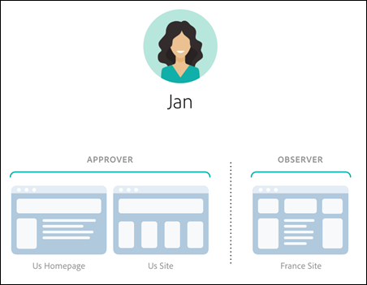

#  엔터프라이즈 사용자 권한{#enterprise-user-permissions}

기업 사용자 권한은 [!DNL Adobe Target]에 대한 기업 전체 사용자 액세스를 공식적으로 관리하는 수단입니다. 사용자를 [!DNL Target]에 추가하고, 역할에 따라 권한을 할당하고, 여러 부서, 글로벌 위치, 채널 및 기타 논리 그룹을 기반으로 팀을 위한 작업 영역을 만듭니다. 사용자에게 [!UICONTROL Observer], [!UICONTROL Editor] 또는 [!UICONTROL 승인자]의 역할을 할당할 수 있습니다.

## Enterprise 사용자 권한에 대한 액세스 권한이 있는지 여부 확인

>[!NOTE]
>
>속성 및 권한 기능은  Premium 솔루션의 일부로 사용할 수 있습니다. [!DNL Target] 이 기능은 [!DNL Target] Premium 라이센스가 없는 [!DNL Target] Standard에서는 사용할 수 없습니다.
>
>[!DNL Target] 구현에서 at.js의 모든 버전을 사용할 수 있습니다.

[!DNL Target] UI 맨 위에 있는 [!UICONTROL 관리] 링크를 클릭하여 조직에서 표준 또는 프리미엄 라이선스를 보유하고 있는지 확인할 수 있습니다.

* **[!DNL Target Standard]고객**:사용자   탭([!UICONTROL 관리 > 사용자])(속성  이 아니라)이 표시되는 경우 조직에 라이센스가  [!DNL Target Standard] 있습니다. [!DNL Target Standard] 고객은 사용자 지침을     [!DNL Adobe Admin Console]따라 사용자를 추가하고

* **[!DNL Target Premium]고객**:속성   탭([[!UICONTROL 관리] > [속성]])과   [사용자] 탭이 표시되면 조직에 라이센스가  [!DNL Target Premium] 있습니다. [!DNL Target Premium] 고객은 이 문서와 [엔터프라이즈 권한 구성](/help/administrating-target/c-user-management/property-channel/properties-overview.md)의 지침을 따라야 합니다.

## 엔터프라이즈 권한을 시작하기 전에

>[!IMPORTANT]
>
>엔터프라이즈 권한을 계속 진행하기 전에 아래 [Caveats](/help/administrating-target/c-user-management/property-channel/property-channel.md#section_9714311B1CD9497A86F4910F8AE635E2) 섹션을 읽어야 합니다.

## 이 섹션 {#section_F8D229544FEA41C3BC2EFD1F95AA0116}에 사용된 용어 및 정의

다음 용어는 이 섹션 전체에서 사용되며 [!DNL Target] Premium의 속성 및 권한 기능을 사용하고자 하는 사용자에게 처음일 수 있습니다.

### 속성

속성은 고유한 코드 조각을 사용하여 이를 구분한다는 점에서 [!DNL Adobe Platform Launch] 내의 속성과 본질적으로 유사합니다.

웹 속성은 규칙들과 하나의 내장 코드로 이루어진 라이브러리로서, 웹 속성은 하나 이상의 도메인과 하위 도메인을 그룹화한 것일 수 있습니다.

속성은 호출(Target 호출, api 호출 등)이 있는 매개 변수로 특정 이름/값 쌍을 [!DNL Target]에 추가하여 사용할 수 있습니다.

속성은 특정 채널(웹, 모바일, 이메일 또는 API/기타)에 속합니다.

### 작업 공간(제품 프로필)

작업 공간을 사용하면 조직에서는 특정 사용자 세트를 특정 속성 세트에 할당할 수 있습니다. 여러 가지 방식에서 작업 공간은 [!DNL Adobe Analytics]의 보고서 세트와 비슷합니다.

참고:작업 영역은 [!DNL Adobe Admin Console for Enterprise]에서 [!UICONTROL 제품 프로필]이라고 합니다.

다국적 조직에 속하는 경우 유럽 웹 페이지, 속성 또는 사이트를 위한 작업 공간과 미국 웹 페이지, 속성 또는 사이트를 위한 또 다른 작업 공간이 있을 수 있습니다. 복수 브랜드 조직에 속하는 경우에는 각 브랜드를 위한 독립된 작업 공간이 있을 수 있습니다.

사용자는 여러 작업 공간에 속할 수 있으며, 각 작업 공간에서 서로 다른 역할을 가질 수도 있습니다.

사용자는 보고서 세트 간을 이동함으로써 [!DNL Analytics] 사용자가 [!DNL Analytics]의 서로 다른 보기를 갖는 방식과 유사하게 작업 영역 간을 이동함으로써 [!DNL Adobe Target]의 보기를 다르게 볼 수 있습니다.

작업 공간에는 완전한 다른 대상, 코드 오퍼 및 활동이 포함될 수 있습니다.

새로운 엔터프라이즈 권한 모델 마이그레이션 전에 만들어진 모든 대상 및 활동은 아래에 설명된 &quot;기본 작업 공간&quot;에서 그룹화됩니다.

[!DNL Adobe Experience Manager](AEM), [!DNL Adobe Mobile Services] 및 [!DNL Adobe Target Classic]를 통해 만든 모든 활동은 &quot;기본 작업 공간&quot;의 일부입니다.

### 기본 작업 영역

[!DNL Admin Console] 내의 모든 기존 작업 영역(제품 프로필)은 조직에서 새로운 엔터프라이즈 권한 모델로 마이그레이션하는 동안 &quot;기본 작업 영역&quot;이라는 단일 작업 영역으로 병합됩니다.

>[!IMPORTANT]
>
>기본 작업 공간은 삭제하지 마십시오.

모든 [!DNL Target] 기능에 대한 모든 사용자 역할 및 액세스 권한은 새로운 엔터프라이즈 권한 모델로 마이그레이션하기 전의 모든 사용자 역할과 동일하게 유지됩니다.

### 사용자 그룹

개발자, 분석가, 마케터, 경영진 등과 같은 사용자 그룹을 만들 수 있습니다. 그런 다음 여러 Adobe 제품 및 작업 영역에 대한 권한을 할당할 수 있습니다. 새 팀 구성원에게 다른 Adobe 제품에 대한 모든 적절한 권한을 지정하면 특정 사용자 그룹에 팀 구성원을 쉽게 추가할 수 있습니다.

### 역할 및 권한

역할 및 권한은 사용자가 [!DNL Target] 구현에서 활동을 만들고 관리하기 위해 보유해야 하는 액세스 권한 수준을 결정합니다. [!DNL Target]에서 역할에는 다음이 포함됩니다.

| 역할 | 설명 |
|--- |--- |
| 승인자 | 활동을 만들고, 편집하고 활성화하거나 중지할 수 있습니다. |
| 편집자 | 활동이 라이브 상태가 되기 전에 활동을 만들고 편집할 수 있지만 활동 시작을 승인할 수는 없습니다. |
| 관찰자 | 활동을 볼 수 있지만 만들거나 편집할 수는 없습니다. |
| 게시자 | 관찰자 역할과 유사합니다(활동을 볼 수는 있지만 만들거나 편집할 수는 없습니다). 그러나 게시자 역할에는 활동을 활성화할 수 있는 추가 권한이 있습니다. |

### 채널

채널은 [!DNL Target] 활동이 전달되는 컨텐츠 유형, 즉 웹 페이지, 모바일 앱, 이메일 메시지 등을 나타냅니다.

활동을 만들면 현재 선택된 작업 영역에 만들어집니다. 활동에 대해 원하는 채널을 선택할 수 있는 첫 번째 대화 상자에서 채널 선택 옵션이 표시됩니다.웹, 모바일 앱, 이메일 또는 기타/API.

## 권한 개요 {#section_DC2172520DA84605B218A5E9FB6D187A}

다음에서는 [!DNL Target]에서 이전에 권한이 적용되던 방식과 [!UICONTROL 속성] 및 [!UICONTROL 권한] 기능을 사용하여 적용되는 방식을 설명합니다.

새로운 [!UICONTROL Permissions] 기능을 사용하면 다른 프로젝트([!DNL Adobe Admin Console for Enterprise]에서 &quot;제품 프로필&quot;이라고 함)를 만들 수 있습니다. 프로젝트를 사용하면 각 프로젝트에 대한 사용자의 액세스 권한을 제어하는 단일 사용자에 대해 다른 권한을 할당할 수 있습니다. 이렇게 서로 구별되는 프로젝트들은 [!DNL Adobe Analytics]에서 보고서 세트가 작동하는 방식에 비유할 수 있습니다. 각 프로젝트는 속성 세트에 적용되는 특정 역할이 있는 특정 사용자를 가질 수 있습니다. 그 결과 고객은 아래와 같이 지역, 환경(개발/단계/제품), 채널 또는 기타 사용자 지정 기준을 기반으로 사용자에 대한 보기, 편집 및 승인 액세스를 제한할 수 있습니다.

예를 들어, 특정 사용자에게 미국 웹 사이트에 대해서는 &quot;승인&quot; 액세스 권한이 있지만 유럽 모바일 앱에 대해서는 &quot;보기&quot; 액세스 권한만 있을 수 있습니다. 같은 사용자가 APAC 지역의 웹 및 모바일 속성에 제공되는 활동에 대해서는 보기 액세스 권한조차 없을 수 있습니다.

현재 [!DNL Target][!UICONTROL  권한] 모델에는 다음 그림과 같이 3가지 권한 역할(관찰자, 편집자 및 승인자)이 있습니다.

각 역할에는 다음과 같은 여러 가지 권한 수준이 있습니다.

| 역할 | 설명 |
|--- |--- |
| 승인자 | 활동을 만들고, 편집하고 활성화하거나 중지할 수 있습니다. |
| 편집자 | 활동이 라이브 상태가 되기 전에 활동을 만들고 편집할 수 있지만 활동 시작을 승인할 수는 없습니다. |
| 관찰자 | 활동을 볼 수 있지만 만들거나 편집할 수는 없습니다. |
| 게시자 | 관찰자 역할과 유사합니다(활동을 볼 수는 있지만 만들거나 편집할 수는 없습니다). 그러나 게시자 역할에는 활동을 활성화할 수 있는 추가 권한이 있습니다. |

아래와 같이 [!DNL Target] 태그를 포함하는 계정의 모든 페이지, 속성 또는 사이트에 각 사용자의 역할이 적용된다는 점에 유의해야 합니다.

새 [!DNL Target][!UICONTROL  권한] 모델에도 동일한 3가지 권한 역할(관찰자, 편집자 및 승인자)이 있지만 아래에 표시된 것처럼 개별 페이지, 속성 또는 사이트에 대해 별도로 사용자의 권한 역할을 지정할 수 있습니다.

이 예에서는 Jan은 미국 홈페이지 및 미국 사이트에 대해 승인자 권한이 있고, 프랑스 사이트에 대해서는 관찰자 권한이 있습니다.

또한 Jan은 아래와 같이 [!DNL Target]에 볼 권한이 없는 페이지, 속성 또는 사이트를 볼 수 없습니다.

이 예에서 Jan은 제품 페이지, 러시아 사이트 및 경력 사이트를 볼 수 없습니다.

## 사용 사례 시나리오 {#section_F3CE8576959E4F4CB13BEEED38311DD8}

다음 사용 사례는 속성, 프로젝트, 역할 및 권한이 [!DNL Target]을 통해 마케팅 목표를 달성하는 데 어떻게 도움이 될 수 있는지를 이해하는 데 유용합니다.

### 다국적 조직

다국적 조직에 속하는 경우 유럽 웹 페이지, 속성 또는 사이트를 위한 작업 공간과 미국 웹 페이지, 속성 또는 사이트를 위한 또 다른 작업 공간이 있을 수 있습니다.
재구성 후에는 위의 그림에 나오는 직원들을 사용하여 다음과 유사한 작업 공간 및 권한을 설정할 수 있습니다.

* **Jan**: Jan은 조직의 미국 웹 페이지, 속성 및 사이트에 대한 전문가 조직의 최적화 담당 책임자입니다. Jan은 Adobe Experience Cloud에서 시스템 관리자 권한이 있을 가능성이 큽니다.

   역할에 따라 미국 홈페이지 및 미국 사이트에 대한 승인자 권한을 보유하고 있습니다. 승인자 권한을 사용하여 활동을 만들고, 편집하고, 활성화하거나 중지할 수 있습니다.

   또한 Jan은 프랑스의 최적화 팀과 협력하므로, 프랑스 사이트에 대해 활동에 대한 읽기 전용 액세스 권한을 제공하는 관찰자 권한이 있습니다. Jan은 활동을 볼 수 있지만 만들거나 편집할 수 없습니다.

   Jan은 제품 페이지, 러시아 사이트 또는 경력 사이트를 볼 필요가 있는 역할을 맡고 있지 않으므로 해당 사이트에 대한 활동을 볼 수 없습니다.

* **Ernie**: Ernie는 미국에서 마케팅을 담당하는 조직의 마케팅 관리자입니다.

   Ernie는 조직에 매우 새롭고 Target에 익숙하지 않기 때문에 미국 홈 페이지, 미국 사이트 및 제품 페이지에 대한 편집자 권한이 있습니다. 편집자 권한을 사용하여 생기 전에 활동을 만들고 편집할 수 있습니다.활동 시작을 승인할 수 없습니다. 즉, Jan과 같은 승인 권한이 있는 사람은 활동에 투입되기 전에 활동을 승인해야 합니다.

   Ernie는 러시아 사이트, 프랑스 사이트 또는 경력 사이트를 볼 필요가 있는 역할을 맡고 있지 않으므로 해당 사이트에 대한 활동을 볼 수 없습니다.

* **Diana**: Diana는 현재, 조직의 분석가로서, 미국 홈페이지, 미국 사이트, 제품 사이트, 러시아 사이트 및 프랑스 사이트에서 활동에 대해 읽기 전용 액세스 권한을 제공하는 관찰자 권한이 있습니다. Diana는 활동을 볼 수 있지만 만들거나 편집할 수 없습니다.

   Diana는 경력 사이트를 볼 필요가 있는 역할을 맡고 있지 않으므로 해당 사이트에 대한 활동을 볼 수 없습니다.

### 다중 브랜드 조직

다중 브랜드 조직에 속하는 경우, 각 브랜드 웹 페이지, 속성 또는 사이트에 대한 별도 작업 공간이 있을 수 있습니다.

재구성 후에는 위의 그림에 나오는 직원들을 사용하여 다음과 유사한 프로젝트 및 권한을 설정할 수 있습니다.

* **Jan**: Jan은 병원용 제품 및 소비자 제품 영역에서 활동하는 의료 전문가 조직의 최적화 담당 책임자입니다. Jan은 Adobe Experience Cloud에서 시스템 관리자 권한이 있을 가능성이 큽니다.

   그녀는 병원 사이트에 대한 승인자 권한을 보유하고 있습니다. 승인자 권한을 사용하여 활동을 만들고, 편집하고, 활성화하거나 중지할 수 있습니다.

   또한 Jan은 소비자 제품 영역에서 최적화 팀과 협력하므로, 해당 사이트에 대해 활동에 대한 읽기 전용 액세스 권한을 제공하는 관찰자 권한이 있습니다. Jan은 활동을 볼 수 있지만 만들거나 편집할 수 없습니다.

* **Ernie**: Ernie는 소비자 제품 영역에서 마케팅을 담당하는 조직의 마케팅 관리자입니다.

   Ernie는 조직에 매우 새로우면서 Target에 대한 경험이 부족하기 때문에 소비자 사이트에 대한 편집자 권한이 있습니다. 편집자 권한을 사용하여 생기 전에 활동을 만들고 편집할 수 있습니다.그는 활동 시작을 승인할 수 없습니다. 소비자 사이트에 대한 승인 권한이 있지만 이 시나리오에서 1월은 아닌 사람이 활동에 투입되기 전에 활동을 승인해야 합니다.

   Ernie는 병원 사이트를 볼 필요가 있는 역할을 맡고 있지 않으므로 해당 사이트에 대한 활동을 볼 수 없습니다.

* **Diana**: Diana는 현재 조직의 분석가로, 활동에 대한 읽기 전용 액세스 권한을 제공하는 병원 사이트 및 소비자 사이트에 대한 관찰자 권한을 부여받았습니다. Diana는 활동을 볼 수 있지만 만들거나 편집할 수 없습니다.

## Target UI 속성 및 권한 터치포인트 {#section_3414371393BB42999A268628B5456EC9}

새 권한 기능은 [!DNL Target] UI의 다양한 위치에서 볼 수 있습니다.

* **작업 공간(제품 프로필) 드롭다운 목록:**&#x200B;작업 공간 드롭다운 목록은 [!UICONTROL 활동], [!UICONTROL 대상] 및 [!UICONTROL 오퍼] 페이지 맨 위에 표시됩니다. 원하는 작업 공간을 선택하여 선택한 작업 공간의 항목만 표시하도록 목록을 필터링합니다.

   

* **활동 만들기:** 활동을 만들면 현재 선택된 작업 영역에 만들어집니다. 활동에 대해 원하는 채널을 선택할 수 있는 첫 번째 대화 상자에서 채널 선택 옵션이 표시됩니다.웹, 모바일 앱, 이메일 또는 기타/API.

   

* **대상자 만들기:** 대상을 만들면 현재 선택한 작업 영역에 만들어집니다.
* **오퍼 만들기:** 오퍼를 만들면 현재 선택한 작업 영역에 만들어집니다.
* **속성 페이지(관리 > 속성):** 검색 상자를 사용하여   속성 목록을   검색할 수 있습니다.

   

## 주의 사항 {#section_9714311B1CD9497A86F4910F8AE635E2}

[!DNL Target] Premium에서 속성 및 권한을 사용하거나 구성할 때는 다음 사항을 고려하십시오.

* **중요**: 활동이 있는 작업 공간은 삭제하지 마십시오. 활동이 있는 작업 공간을 삭제하는 경우 클라이언트 지원 팀에 문의하여 이러한 활동을 복구합니다.
* 모든 내 작업 공간 보기를 사용하는 경우:

   * 액세스할 적절한 역할 및 권한이 있는 모든 작업 공간에 대한 활동, 대상 및 오퍼를 볼 수 있습니다.
   * [!UICONTROL 모든 내 작업 영역] 보기를 선택하면 활동, 대상 및 오퍼 페이지에 새 열이 추가됩니다. 이 열에는 항목의 작업 공간과 해당 항목과 연관된 사용자 권한(관찰자, 편집자 또는 승인자)이 나열됩니다.
   * 모든 내 작업 공간 보기에서 활동, 대상 또는 오퍼를 작성할 때 항목을 작성할 작업 공간을 선택해야 합니다. 편집자 또는 승인자 권한이 있는 작업 공간만 선택할 수 있습니다.
   * 모든 내 작업 공간 보기에서 활동, 대상 또는 오퍼를 복사할 때 항목을 복사할 작업 공간을 선택해야 합니다. 편집자 또는 승인자 권한이 있는 작업 공간만 선택할 수 있습니다.

* 관리 페이지 다음 설정에 대한 모든 설정은 모든 작업 영역에서 승인자에 의해 제어됩니다.

   * 시각적 경험 작성기
   * 보고
   * Scene7 구성
   * 구현
   * 속성
   * 호스트
   * 환경
   * 응답 토큰
   * 사용자

* 사용자는 한 작업 공간(제품 프로필)에서 다른 작업 공간으로 리소스를 이동할 수 없습니다. 그러나 복사는 지원됩니다.
* [!DNL Audiences] 페이지에서 대상을 볼 때 페이지가 예상보다 더 느리게 로드됩니다. 어떤 방식으로든 검색 막대와 상호 작용하는 경우 대상이 더 빠르게 표시됩니다. 이 문제는 알려진 문제이며 향후 업데이트에서 해결될 예정입니다. 이 문제는 활동 생성 워크플로우 중에 대상을 선택하는 데 영향을 주지 않습니다.
* 다음 리소스는 새 Enterprise 권한 모델에 속합니다.

   * 고객이 사용 권한에 대해 활성화된 후 Target Standard/Premium 내에서 생성된 활동, 대상 및 코드 오퍼. (참고: 고객은 Target Premium에 대해 사용 권한이 부여되어야 합니다.)
   * 기본 작업 공간의 기존 활동에 속성을 추가할 수 있습니다.하지만 이 방법은 변경될 수 있습니다.
   * 엔터프라이즈 권한이 활성화된 후에 Target Premium에서 만든 새 리소스(활동, 코드 오퍼 및 대상 등)만 권한을 기준으로 제한할 수 있습니다.
   * 외부 리소스는 기본 작업 공간의 사용자만 사용할 수 있습니다. 기본 작업 공간의 사용자 역할은 전역적으로 (모든 Target 요청 및 모든 Target 리소스에) 적용됩니다.

* 다음 리소스는 새 엔터프라이즈 권한 모델에 속하지 *않습니다*.

   * 이미지 오퍼
   * 기준 라이브러리, 디자인 라이브러리, 카탈로그, 권장 사항 설정 등을 포함한 모든 권장 사항 리소스.
   * 엔터프라이즈 권한을 활성화하기 전에 Target Premium에서 만든 기존 리소스(활동, 코드 오퍼 및 대상 등)를 복사할 수 있지만 다른 작업 영역으로 이동할 수는 없습니다.
   * 다음 솔루션 또는 방법을 사용하여 만든 활동, 대상, 코드 오퍼, 이미지 오퍼 또는 기타 리소스는 엔터프라이즈 권한 모델에 의해 제어될 수 없지만 기본 작업 영역의 일부입니다.Target Classic, Adobe Experience Manager(AEM), Adobe Mobile Services 및 API를 통해 생성된 리소스 API를 통해 만든 리소스에는 활동, 대상, 코드 오퍼, 이미지 오퍼가 포함됩니다.
   * 이미지 오퍼(현재 `https://[tenantName].marketing.adobe.com/content/mac/[tenantName]/target/offers.html#image-library`에 저장된 에셋은 기업 권한 모델에서 제어할 수 없습니다.
   * 클릭 추적 및 리디렉션은 대상 링크 또는 대상 페이지가 활동에 포함된 속성의 일부일 때 작동합니다. 또한 `targetPageParams()` 함수를 사용할 때는 clickTracking이 작동하지 않을 수 있습니다. `targetPageParamsAll()`이 권장되는 함수입니다.

   [!DNL Target] 현재 추적 `at_property` 이 발생하는 페이지에 토큰이 있어야 합니다. 토큰이 (1) 없거나, (2) 활동 설정 시(VEC 내) 감지되지 않았거나, (3) `targetPageParamsAll()` 함수를 통해 clickTracking Target 호출으로 전달되지 않으면 지표가 증가하지 않고 &quot;0&quot;으로 표시됩니다.

   리디렉션을 사용하는 활동의 경우도 마찬가지입니다. 대상 페이지에는 `at_property` 토큰이 있어야 하며 VEC 내에서 설정할 때 인식되어야 합니다.

   향후 릴리스에서 Target은 `at_property` 토큰이 없는 페이지 또는 다른 `at_property` 토큰이 있는 페이지에서 작동합니다.

* 엔터프라이즈 사용자 권한 기능은 [Adobe I/O API 호출](https://developers.adobetarget.com)에서 지원되지 않습니다.

## FAQ {#faqs}

엔터프라이즈 권한에 대한 FAQ:

### 한 작업 공간에서 다른 작업 공간으로 활동을 이동할 수 있습니까?

한 작업 공간에서 다른 작업 공간으로 활동을 이동할 수 없습니다. 하지만 보고 데이터가 전달되지 않는다는 점을 알고 있으면 모든 작업 영역에 활동을 복사할 수 있습니다. 자세한 내용은 [작업 공간을 사용할 때 활동 복사/편집](/help/c-activities/edit-activity.md#section_45A92E1DD3934523B07E71EF90C4F8B6)에서 &quot;작업 공간을 사용할 때 활동 복사/편집&quot;을 참조하십시오.

마이그레이션이 편집되고 속성이 지정되지 않는 한, 마이그레이션 전에 만든 활동은 기본 작업 공간에서 동일한 방법으로 계속 실행됩니다. 특정 작업 공간의 활동은 해당 작업 공간에 할당된 속성을 따르므로 비헤이비어는 마이그레이션 전과 동일하게 유지되지 않을 수 있습니다.

### 속성이 지정된 경우에도 이 활동과 연결되어 있지 않다는 오류 메시지가 표시되는 이유는 무엇입니까?

[!DNL Adobe Experience Platform Launch]를 사용하여 [!DNL Target]을 구현했을 때 활동과 연결된 속성이 없다는 오류 메시지가 나타나면, `targetPageParams` 함수와 함께 `at_property` 매개 변수를 전달합니다.

### 리디렉션 페이지 및 활동 URL이 다른 속성에 속하는 경우 클릭 추적 전환이 기록됩니까?

클릭 추적은 페이지 및 활동 URL이 다른 속성에 속하는 페이지에 기록되지 않습니다.

다음 시나리오를 참조하십시오.

* Page1은 Property1에 속합니다.
* Page2는 Property2에 속합니다.
* 활동에서 Page1은 clicktracks가 포함된 Page2로 리디렉션됩니다.

방문자가 브라우저에서 Page1을 열면 방문자가 Page2로 리디렉션됩니다. Page2는 활동을 전달할 수 없기 때문에 해당 Target 호출은 해당 응답에 clicktracks를 포함하지 않습니다.

리디렉션 페이지와 활동 URL이 동일한 속성에 속하는 경우 clicktracks가 예상대로 작동합니다. 자세한 내용은 [클릭 추적](/help/c-activities/r-success-metrics/click-tracking.md)을 참조하십시오.

## 교육 비디오

다음 비디오에는 이 문서에서 설명한 개념에 대한 자세한 정보가 포함되어 있습니다.

### 교육 비디오:엔터프라이즈 권한 교육 비디오 

학습 목표:

* Adobe Target 사용자가 보유할 수 있는 세 가지 역할 수준입니다.
* 속성 및 작업 공간의 개념과 이러한 경계 및 그룹화를 통해 사용자의 액세스 수준을 제어하는 방법
* 조직이 고려할 다양한 속성 예제

>[!VIDEO](https://video.tv.adobe.com/v/19042/)

### 업무 시간:Target 프리미엄 작업 영역

이 비디오는 Adobe 고객 지원 팀에서 진행한 이니셔티브인 &quot;운영시간&quot; 기록입니다.

* 작업 영역 만들기(제품 프로필)
* 속성 만들기
* 사용자 추가
* 구현 업데이트

>[!NOTE]
>
>[!DNL Target] [!UICONTROL 관리] 메뉴 UI(이전의 [!UICONTROL 설치])가 향상된 성능을 제공하고, 새 기능을 출시할 때 필요한 유지 관리 시간을 줄이고, 제품 전반의 사용자 경험을 개선하기 위해 다시 디자인되었습니다. 다음 비디오의 정보가 올바르다.그러나 옵션이 약간 다른 위치에 있을 수 있습니다.

>[!VIDEO](https://video.tv.adobe.com/v/23643/)
