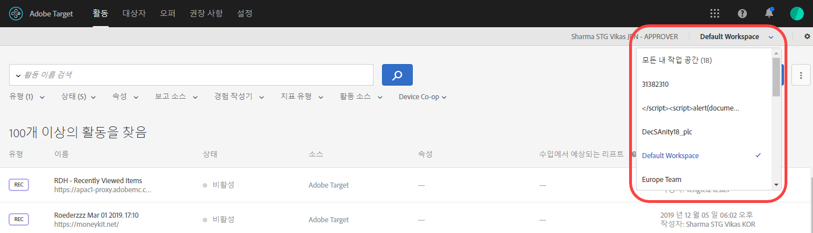
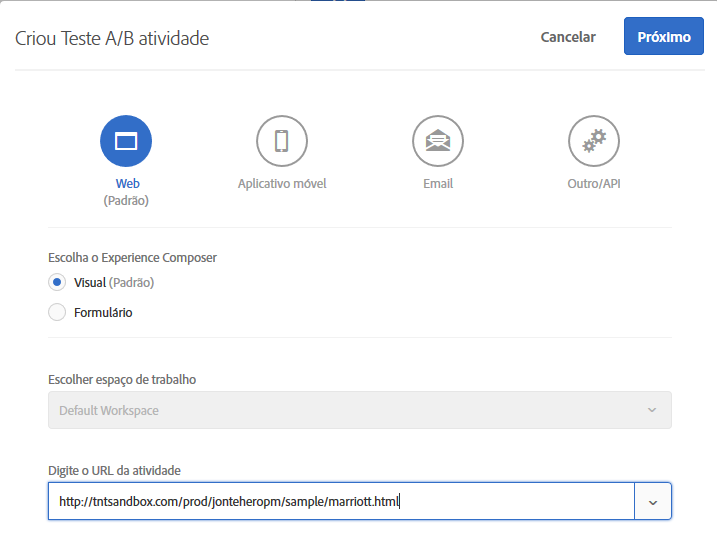
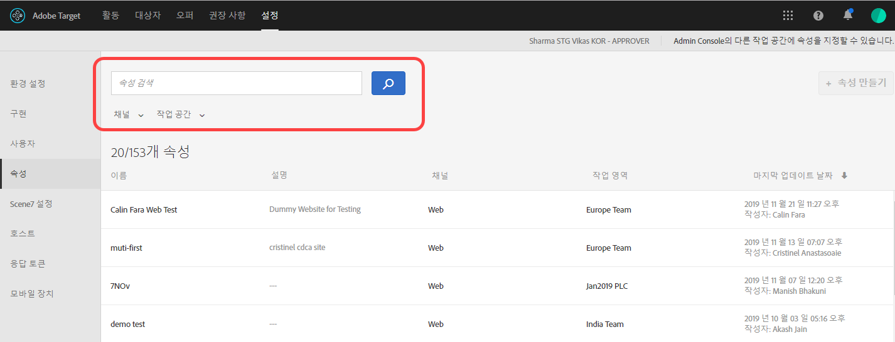

#  엔터프라이즈 사용자 권한{#enterprise-user-permissions}

Enterprise user permissions is a means of formal administering enterprise-wide user access to [!DNL Target]. Add users to [!DNL Target], assign permissions based on their roles, and create workspaces for teams based on different departments, global locations, channels, and other logical groupings. You can assign users the roles of [!UICONTROL Observer], [!UICONTROL Editor], or [!UICONTROL Approver].

## 엔터프라이즈 사용자 권한에 대한 액세스 권한 여부 확인

>[!NOTE]
>
>속성 및 권한 기능은  Premium 솔루션의 일부로 사용할 수 있습니다. [!DNL Target] 이 기능은 [!DNL Target] Premium 라이센스가 없는 [!DNL Target] Standard에서는 사용할 수 없습니다.
>
>Your [!DNL Target] implementation can be using any version of at.js or mbox.js.

You can tell whether your organization has a Standard or Premium license by clicking the [!UICONTROL Administration] link at the top of the [!DNL Target] UI.

* **[!DNL Target Standard]고객**:[ [!UICONTROL 사용자] ] 탭([관리][!UICONTROL > [사용자]]가 [!UICONTROL 아니라)이 표시되는 경우] 조직의 [!DNL Target Standard] 라이센스는있습니다. [!DNL Target Standard]고객은 [사용자](/help/administrating-target/c-user-management/c-user-management/user-management.md) [!DNL Adobe Admin Console]지침을 따라 사용자를 추가하고

* **[!DNL Target Premium]고객**:[ [!UICONTROL 속성] ] 탭([!UICONTROL 관리]> 속성 [!UICONTROL )과] 사용자 [!DNL Target Premium] 탭이 표시되면 조직에라이센스가 있는 것입니다. [!DNL Target Premium] 고객은 이 문서와 [엔터프라이즈 권한 구성](/help/administrating-target/c-user-management/property-channel/properties-overview.md)의 지침을 따라야 합니다.

## 엔터프라이즈 권한을 시작하기 전

>[!IMPORTANT]
>
>Ensure that you read the [Caveats](../../../administrating-target/c-user-management/property-channel/property-channel.md#section_9714311B1CD9497A86F4910F8AE635E2) section below before proceeding with enterprise permissions.

## Terms and definitions used in this section {#section_F8D229544FEA41C3BC2EFD1F95AA0116}

The following terms are used throughout this section and might be new to users wanting to use the Properties and Permissions functionality in [!DNL Target] Premium.

### 속성

Properties are similar in nature to those within [!DNL Adobe Platform Launch] in that they use a unique snippet of code to differentiate them.

웹 속성은 규칙들과 하나의 내장 코드로 이루어진 라이브러리로서, 웹 속성은 하나 이상의 도메인과 하위 도메인을 그룹화한 것일 수 있습니다.

속성은 특정 이름/값 쌍을 모든 호출(Target 호출, api 호출 등)과 함께 매개 변수로 추가하여 사용할 수 있습니다. 에서 [!DNL Target].

속성은 특정 채널(웹, 모바일, 이메일 또는 API/기타)에 속합니다.

### 작업 공간(제품 프로필)

작업 공간을 사용하면 조직에서는 특정 사용자 세트를 특정 속성 세트에 할당할 수 있습니다. 여러 가지 방식에서 작업 공간은 [!DNL Adobe Analytics]의 보고서 세트와 비슷합니다.

참고:작업 영역은 의 [!UICONTROL 제품] 프로필이라고 합니다 [!DNL Adobe Admin Console for Enterprise].

다국적 조직에 속하는 경우 유럽 웹 페이지, 속성 또는 사이트를 위한 작업 공간과 미국 웹 페이지, 속성 또는 사이트를 위한 또 다른 작업 공간이 있을 수 있습니다. 복수 브랜드 조직에 속하는 경우에는 각 브랜드를 위한 독립된 작업 공간이 있을 수 있습니다.

사용자는 여러 작업 공간에 속할 수 있으며, 각 작업 공간에서 서로 다른 역할을 가질 수도 있습니다.

Users can have different views of [!DNL Adobe Target] by moving between workspaces, similar to how [!DNL Analytics] users have different views of [!DNL Analytics] by moving between Report Suites.

작업 공간에는 완전한 다른 대상, 코드 오퍼 및 활동이 포함될 수 있습니다.

새 Enterprise 권한 모델 마이그레이션 전에 만든 모든 대상 및 활동은 아래 설명된 &quot;기본 작업 공간&quot;에 함께 그룹화됩니다.

All activities created via [!DNL Adobe Experience Manager] (AEM), [!DNL Adobe Mobile Services], and [!DNL Adobe Target Classic] will be part of the &quot;Default Workspace.&quot;

### 기본 작업 영역

All existing workspaces (product profiles) within [!DNL Admin Console] are merged into a single workspace called &quot;Default Workspace&quot; during your organization&#39;s migration to the new Enterprise Permissions model.

>[!IMPORTANT]
>
>기본 작업 공간은 삭제하지 마십시오.

All user roles and access to all [!DNL Target] functionality remains exactly the same as they were prior to the migration to the new Enterprise Permissions model.

### 사용자 그룹

개발자, 분석가, 마케터, 경영진 등과 같은 사용자 그룹을 만든 다음 여러 Adobe 제품 및 작업 공간에서 권한을 지정할 수 있습니다. 새 팀 구성원에게 다른 Adobe 제품에 대한 모든 적절한 권한을 지정하면 특정 사용자 그룹에 팀 구성원을 쉽게 추가할 수 있습니다.

### 역할 및 권한

역할 및 권한은 사용자가 [!DNL Target] 구현에서 활동을 만들고 관리하기 위해 보유해야 하는 액세스 권한 수준을 결정합니다. [!DNL Target]에서 역할에는 다음이 포함됩니다.

| 역할 | 설명 |
|--- |--- |
| 승인자 | 활동을 만들고, 편집하고 활성화하거나 중지할 수 있습니다. |
| 편집자 | 활동이 라이브 상태가 되기 전에 활동을 만들고 편집할 수 있지만 활동 시작을 승인할 수는 없습니다. |
| 관찰자 | 활동을 볼 수 있지만 만들거나 편집할 수는 없습니다. |
| 게시자 | 옵저버 역할과 유사(활동을 볼 수 있지만 만들거나 편집할 수는 없음) 그러나 게시자 역할에는 활동을 활성화할 수 있는 추가 권한이 있습니다. |

### 채널

채널은 [!DNL Target] 활동이 전달되는 컨텐츠 유형, 즉 웹 페이지, 모바일 앱, 이메일 메시지 등을 나타냅니다.

새 활동을 만들면 현재 선택한 작업 공간에서 생성됩니다. 활동에 대해 원하는 채널, 즉 웹, 모바일 앱, 이메일 또는 기타/API 중에서 선택할 수 있는 채널 선택 옵션이 첫 번째 대화 상자에 표시됩니다.

## Permissions overview {#section_DC2172520DA84605B218A5E9FB6D187A}

다음에서는 [!DNL Target]에서 이전에 권한이 적용되던 방식과 [!UICONTROL 속성] 및 [!UICONTROL 권한] 기능을 사용하여 적용되는 방식을 설명합니다.

새 [!UICONTROL 권한] 기능을 사용하면 여러 다른 프로젝트([!DNL Adobe Admin Console for Enterprise]에서는 &quot;제품 프로필&quot;로 지칭됨)를 만들어 사용자마다 각 프로젝트의 해당 사용자 액세스 권한을 나타내는 다른 사용 권한을 지정할 수 있습니다. 이렇게 서로 구별되는 프로젝트들은 [!DNL Adobe Analytics]에서 보고서 세트가 작동하는 방식에 비유할 수 있습니다. 각 프로젝트는 속성 세트에 적용되는 특정 역할이 있는 특정 사용자를 가질 수 있습니다. 결과적으로 고객은 아래와 같이 지역, 환경(개발/스테이징/프로덕션), 채널 또는 기타 사용자 지정 기준을 기반으로 해당 사용자에 대한 보기, 편집 및 승인 액세스 권한을 제한할 수 있게 됩니다.

예를 들어, 특정 사용자에게 미국 웹 사이트에 대해서는 &quot;승인&quot; 액세스 권한이 있지만 유럽 모바일 앱에 대해서는 &quot;보기&quot; 액세스 권한만 있을 수 있습니다. 같은 사용자가 APAC 지역의 웹 및 모바일 속성에 제공되는 활동에 대해서는 보기 액세스 권한조차 없을 수 있습니다.

현재 [!DNL Target][!UICONTROL  권한] 모델에는 다음 그림과 같이 3가지 권한 역할(관찰자, 편집자 및 승인자)이 있습니다.

각 역할에는 다음과 같은 여러 가지 권한 수준이 있습니다.

| 역할 | 설명 |
|--- |--- |
| 승인자 | 활동을 만들고, 편집하고 활성화하거나 중지할 수 있습니다. |
| 편집자 | 활동이 라이브 상태가 되기 전에 활동을 만들고 편집할 수 있지만 활동 시작을 승인할 수는 없습니다. |
| 관찰자 | 활동을 볼 수 있지만 만들거나 편집할 수는 없습니다. |
| 게시자 | 옵저버 역할과 유사(활동을 볼 수 있지만 만들거나 편집할 수는 없음) 그러나 게시자 역할에는 활동을 활성화할 수 있는 추가 권한이 있습니다. |

아래와 같이 [!DNL Target] 태그를 포함하는 계정의 모든 페이지, 속성 또는 사이트에 각 사용자의 역할이 적용된다는 점에 유의해야 합니다.

새 [!DNL Target][!UICONTROL  권한] 모델에도 동일한 3가지 권한 역할(관찰자, 편집자 및 승인자)이 있지만 아래에 표시된 것처럼 개별 페이지, 속성 또는 사이트에 대해 별도로 사용자의 권한 역할을 지정할 수 있습니다.

이 예에서는 Jan은 미국 홈페이지 및 미국 사이트에 대해 승인자 권한이 있고, 프랑스 사이트에 대해서는 관찰자 권한이 있습니다.

또한 Jan은 아래와 같이 볼 수 있는 권한이 없는 [!DNL Target]의 페이지, 속성 또는 사이트를 볼 수 없습니다.

이 예에서 Jan은 제품 페이지, 러시아 사이트 및 경력 사이트를 볼 수 없습니다.

## 사용 사례 시나리오 {#section_F3CE8576959E4F4CB13BEEED38311DD8}

다음 사용 사례는 속성, 프로젝트, 역할 및 권한이 [!DNL Target]을 통해 마케팅 목표를 달성하는 데 어떻게 도움이 될 수 있는지를 이해하는 데 유용합니다.

### 다국적 조직

다국적 조직에 속하는 경우 유럽 웹 페이지, 속성 또는 사이트를 위한 작업 공간과 미국 웹 페이지, 속성 또는 사이트를 위한 또 다른 작업 공간이 있을 수 있습니다.
재구성 후에는 위의 그림에 나오는 직원들을 사용하여 다음과 유사한 작업 공간 및 권한을 설정할 수 있습니다.

* **Jan**: Jan은 조직의 미국 웹 페이지, 속성 및 사이트에 대한 전문가 조직의 최적화 담당 책임자입니다. Jan은 Adobe Experience Cloud에서 시스템 관리자 권한이 있을 가능성이 큽니다.

   역할에 따라 미국 홈페이지 및 미국 사이트에 대한 승인자 권한을 보유하고 있습니다. 승인자 권한을 사용하여 활동을 만들고, 편집하고, 활성화하거나 중지할 수 있습니다.

   또한 Jan은 프랑스의 최적화 팀과 협력하므로, 프랑스 사이트에 대해 활동에 대한 읽기 전용 액세스 권한을 제공하는 관찰자 권한이 있습니다. Jan은 활동을 볼 수 있지만 만들거나 편집할 수 없습니다.

   Jan은 제품 페이지, 러시아 사이트 또는 경력 사이트를 볼 필요가 있는 역할을 맡고 있지 않으므로 해당 사이트에 대한 활동을 볼 수 없습니다.

* **Ernie**: Ernie는 미국에서 마케팅을 담당하는 조직의 마케팅 관리자입니다.

   Ernie는 조직에 새로 들어왔으며 Target에 대한 경험이 없는 편이므로 미국 홈페이지, 미국 사이트 및 제품 페이지에 대한 편집자 권한이 있습니다. Ernie는 편집자 권한을 사용하여 활동이 라이브 상태가 되기 전에 생성 및 편집할 수 있지만, 활동 실행을 승인할 수는 없습니다. Jan과 같이 승인 권한이 있는 누군가가 활동을 승인해야 프로덕션 환경에서 사용할 수 있습니다.

   Ernie는 러시아 사이트, 프랑스 사이트 또는 경력 사이트를 볼 필요가 있는 역할을 맡고 있지 않으므로 해당 사이트에 대한 활동을 볼 수 없습니다.

* **Diana**: Diana는 현재, 조직의 분석가로서, 미국 홈페이지, 미국 사이트, 제품 사이트, 러시아 사이트 및 프랑스 사이트에서 활동에 대해 읽기 전용 액세스 권한을 제공하는 관찰자 권한이 있습니다. Diana는 활동을 볼 수 있지만 만들거나 편집할 수 없습니다.

   Diana는 경력 사이트를 볼 필요가 있는 역할을 맡고 있지 않으므로 해당 사이트에 대한 활동을 볼 수 없습니다.

### 다중 브랜드 조직

다중 브랜드 조직에 속하는 경우, 각 브랜드 웹 페이지, 속성 또는 사이트에 대한 별도 작업 공간이 있을 수 있습니다.

재구성 후에는 위의 그림에 나오는 직원들을 사용하여 다음과 유사한 프로젝트 및 권한을 설정할 수 있습니다.

* **Jan**: Jan은 병원용 제품 및 소비자 제품 영역에서 활동하는 의료 전문가 조직의 최적화 담당 책임자입니다. Jan은 Adobe Experience Cloud에서 시스템 관리자 권한이 있을 가능성이 큽니다.

   그녀는 병원 사이트에 대한 승인자 권한을 보유하고 있습니다. 승인자 권한을 사용하여 활동을 만들고, 편집하고, 활성화하거나 중지할 수 있습니다.

   또한 Jan은 소비자 제품 영역에서 최적화 팀과 협력하므로, 해당 사이트에 대해 활동에 대한 읽기 전용 액세스 권한을 제공하는 관찰자 권한이 있습니다. Jan은 활동을 볼 수 있지만 만들거나 편집할 수 없습니다.

* **Ernie**: Ernie는 소비자 제품 영역에서 마케팅을 담당하는 조직의 마케팅 관리자입니다.

   Ernie는 조직에 새로 들어왔으며 Target에 대한 경험이 없는 편이므로 소비자 사이트에 대한 편집자 권한이 있습니다. Ernie는 편집자 권한을 사용하여 활동이 라이브 상태가 되기 전에 생성 및 편집할 수 있지만, 활동 실행을 승인할 수는 없습니다. 이 시나리오에서 Jan이 아닌 소비자 사이트에 대해 승인 권한이 있는 누군가가 활동을 승인해야 프로덕션 환경에서 사용할 수 있습니다.

   Ernie는 병원 사이트를 볼 필요가 있는 역할을 맡고 있지 않으므로 해당 사이트에 대한 활동을 볼 수 없습니다.

* **Diana**: Diana는 현재 조직의 분석가로, 활동에 대한 읽기 전용 액세스 권한을 제공하는 병원 사이트 및 소비자 사이트에 대한 관찰자 권한을 부여받았습니다. Diana는 활동을 볼 수 있지만 만들거나 편집할 수 없습니다.

## Target UI Property and Permissions touchpoints {#section_3414371393BB42999A268628B5456EC9}

새 권한 기능은 [!DNL Target] UI의 다양한 위치에서 볼 수 있습니다.

* **작업 공간(제품 프로필) 드롭다운 목록:**&#x200B;작업 공간 드롭다운 목록은 [!UICONTROL 활동], [!UICONTROL 대상] 및 [!UICONTROL 오퍼] 페이지 맨 위에 표시됩니다. 원하는 작업 공간을 선택하여 선택한 작업 공간의 항목만 표시하도록 목록을 필터링합니다.

   

* **활동 생성:**&#x200B;새 활동을 생성하면 현재 선택한 작업 공간에서 생성됩니다. 활동에 대해 원하는 채널, 즉 웹, 모바일 앱, 이메일 또는 기타/API 중에서 선택할 수 있는 채널 선택 옵션이 첫 번째 대화 상자에 표시됩니다.

   

* **대상 생성:**&#x200B;새 대상을 생성하면 현재 선택한 작업 공간에서 생성됩니다.
* **오퍼 생성:**&#x200B;새 오퍼를 생성하면 현재 선택한 작업 공간에서 생성됩니다.
* **속성 페이지(관리 > 속성):** 검색 상자 [!UICONTROL 를] 사용하여 [!UICONTROL 속성] 목록을 검색할 수 있습니다.

   

## 주의 사항 {#section_9714311B1CD9497A86F4910F8AE635E2}

Consider the following when using or configuring properties and permissions in [!DNL Target] Premium:

* **중요**: 활동이 있는 작업 공간은 삭제하지 마십시오. 이러한 활동을 삭제한 경우 클라이언트 관리팀과 협력하여 해당 활동을 복구하십시오.
* 모든 내 작업 공간 보기를 사용하는 경우:

   * 액세스할 적절한 역할 및 권한이 있는 모든 작업 공간에 대한 활동, 대상 및 오퍼를 볼 수 있습니다.
   * 모든 내 작업 공간 보기를 선택하면 새 열이 항목의 작업 공간 및 해당 항목과 연관된 사용자 권한(관찰자, 편집자 또는 승인자)을 나열한 활동, 대상 및 오퍼 페이지에 추가됩니다.
   * 모든 내 작업 공간 보기에서 활동, 대상 또는 오퍼를 작성할 때 항목을 작성할 작업 공간을 선택해야 합니다. 편집자 또는 승인자 권한이 있는 작업 공간만 선택할 수 있습니다.
   * 모든 내 작업 공간 보기에서 활동, 대상 또는 오퍼를 복사할 때 항목을 복사할 작업 공간을 선택해야 합니다. 편집자 또는 승인자 권한이 있는 작업 공간만 선택할 수 있습니다.

* 다음 관리 페이지의 설정은 모든 작업 영역에서 승인자에 의해 제어됩니다.

   * 시각적 경험 작성기
   * 보고
   * Scene7 구성
   * 구현
   * 속성
   * 호스트
   * 환경
   * 응답 토큰
   * 사용자

* 사용자는 한 작업 공간(제품 프로필)에서 다른 작업 공간으로 리소스를 이동할 수 없습니다. 그러나 복사는 지원됩니다.
* [!DNL Audiences] 페이지에서 대상을 볼 때 페이지가 예상보다 더 느리게 로드됩니다. 어떤 방식으로든 검색 막대와 상호 작용하는 경우 대상이 더 빠르게 표시됩니다. 이것은 알려진 문제이며 향후 업데이트에서 수정될 예정입니다. 이 문제는 활동 생성 워크플로우 중에 대상을 선택하는 데 영향을 주지 않습니다.
* 다음 리소스는 새 Enterprise 권한 모델에 속합니다.

   * 고객이 사용 권한에 대해 활성화된 후 Target Standard/Premium 내에서 생성된 활동, 대상 및 코드 오퍼. (참고: 고객은 Target Premium에 대해 사용 권한이 부여되어야 합니다.)
   * 속성을 기본 작업 공간의 기존 활동에 추가할 수 있지만, 변경될 수 있습니다.
   * (Enterprise 권한이 활성화된 후에) Target Premium에서 만든 새 리소스(예: 활동, 코드 오퍼 및 대상)만 권한으로 제한할 수 있습니다.
   * 외부 리소스는 기본 작업 공간의 사용자만 사용할 수 있습니다. 기본 작업 공간의 사용자 역할은 전역적으로 (모든 Target 요청 및 모든 Target 리소스에) 적용됩니다.

* 다음 리소스는 새 엔터프라이즈 권한 모델에 속하지 *않습니다*.

   * 이미지 오퍼
   * 기준 라이브러리, 디자인 라이브러리, 카탈로그, 권장 사항 설정 등을 포함한 모든 권장 사항 리소스.
   * Enterprise 권한을 활성화하기 전에 Target Premium에서 만든 기존 리소스(예: 활동, 코드 오퍼 및 대상)은 복사할 수 있지만 다른 작업 공간으로 이동할 수는 없습니다.
   * 활동, 대상, 코드 오퍼, 이미지 오퍼 또는 Target Classic, Adobe Experience Manager(AEM), Adobe Mobile Services와 같은 솔루션이나 방법을 사용하여 만든 기타 모든 리소스와 API를 통해 생성된 리소스는 엔터프라이즈 권한 모델로 제어할 수 없지만 기본 작업 공간의 일부가 됩니다. API를 통해 만든 리소스에는 활동, 대상, 코드 오퍼, 이미지 오퍼가 포함됩니다.
   * 이미지 오퍼(`https://[tenantName].marketing.adobe.com/content/mac/[tenantName]/target/offers.html#image-library`에 저장된 자산)는 현재 엔터프라이즈 권한 모델로 제어할 수 없습니다.
   * clickTracking 및 리디렉션은 대상 링크 또는 대상 페이지가 활동에 포함된 속성의 일부일 때만 작동합니다. 또한 `targetPageParams()` 함수를 사용할 경우 clickTracking이 작동하지 않을 수 있습니다. `targetPageParamsAll()`이 권장되는 함수입니다.

   [!DNL Target] 현재 추적이 발생하는 페이지에 `at_property` 토큰이 있어야 합니다. In the event that the token is (1) not present, (2) not detected at the time of activity setup (within the VEC), or (3) not passed to the clickTracking Target call via the `targetPageParamsAll()` function, the metric will not be incremented and will appear as &quot;0.&quot;

   리디렉션을 사용하는 활동의 경우도 마찬가지입니다. 대상 페이지에는 `at_property` 토큰이 있어야 하며 VEC 내에서 설정할 때 인식되어야 합니다.

   향후 릴리스에서 Target은 `at_property` 토큰이 없는 페이지 또는 다른 `at_property` 토큰이 있는 페이지에서 작동합니다.

* 엔터프라이즈 사용자 권한 기능은 [Adobe I/O API 호출](https://developers.adobetarget.com)에서 지원되지 않습니다.

## FAQ {#faqs}

엔터프라이즈 권한에 대한 FAQ:

### 한 작업 공간에서 다른 작업 공간으로 활동을 이동할 수 있습니까?

한 작업 공간에서 다른 작업 공간으로 활동을 이동할 수 없습니다. 그러나 보고 데이터를 수행하지 않으려는 경우 작업 공간으로 활동을 복사할 수 있습니다. 자세한 내용은 [작업 공간을 사용할 때 활동 복사/편집](../../../c-activities/edit-activity.md#section_45A92E1DD3934523B07E71EF90C4F8B6)에서 &quot;작업 공간을 사용할 때 활동 복사/편집&quot;을 참조하십시오.

마이그레이션이 편집되고 속성이 지정되지 않는 한, 마이그레이션 전에 만든 활동은 기본 작업 공간에서 동일한 방법으로 계속 실행됩니다. 특정 작업 공간의 활동은 해당 작업 공간에 지정된 속성을 따르므로 마이그레이션 전과 동일하게 동작하지 않을 수 있습니다.

### 속성이 지정된 경우에도 이 활동과 연결되어 있지 않다는 오류 메시지가 표시되는 이유는 무엇입니까?

[!DNL Adobe Launch]를 사용하여 [!DNL Target]을 구현했을 때 활동과 연결된 속성이 없다는 오류 메시지가 나타나면, `targetPageParams` 함수와 함께 `at_property` 매개 변수를 전달합니다.

### 리디렉션 페이지 및 활동 URL이 다른 속성에 속하는 경우 클릭 추적 전환이 기록됩니까?

클릭 추적은 페이지 및 활동 URL이 다른 속성에 속하는 페이지에 기록되지 않습니다.

다음 시나리오를 고려하십시오(at.js와 mbox.js 모두에 적용됨).

* Page1은 Property1에 속합니다.
* Page2는 Property2에 속합니다.
* 활동에서 Page1은 clicktracks가 포함된 Page2로 리디렉션됩니다.

방문자가 브라우저에서 Page1을 열면 Page2로 리디렉션됩니다. Page2는 활동을 전달할 수 없기 때문에 해당 Target 호출은 해당 응답에 clicktracks를 포함하지 않습니다.

리디렉션 페이지와 활동 URL이 동일한 속성에 속하는 경우 clicktracks가 예상대로 작동합니다. 자세한 내용은 [클릭 추적](/help/c-activities/r-success-metrics/click-tracking.md)을 참조하십시오.

## 교육 비디오

다음 비디오에는 이 문서에서 설명한 개념에 대한 자세한 정보가 포함되어 있습니다.

### Training Video: Enterprise Permissions Training Video 

학습 목표:

* Adobe Target 사용자가 보유할 수 있는 세 가지 역할 수준입니다.
* 속성 및 작업 공간의 개념과 이러한 경계 및 그룹화를 통해 사용자의 액세스 수준을 제어하는 방법
* 조직이 고려할 다양한 속성 예제

>[!VIDEO](https://video.tv.adobe.com/v/19042/)

### 근무 시간:Target 프리미엄 작업 영역

이 비디오는 Adobe 고객 지원 팀에서 진행한 이니셔티브인 &quot;운영시간&quot; 기록입니다.

* 작업 공간 만들기(제품 프로필)
* 속성 만들기
* 사용자 추가
* 구현 업데이트

>[!NOTE]
>
>관리 [!DNL Target]  메뉴 UI(이전 [!UICONTROL 설정])는 향상된 성능을 제공하고, 새로운 기능을 출시할 때 필요한 유지 관리 시간을 단축하고, 제품 전반의 사용자 경험을 개선하기 위해 다시 설계되었습니다. 다음 비디오의 정보는 일반적으로 정확하다.그러나 옵션이 약간 다를 수 있습니다. 업데이트된 비디오가 곧 게시될 예정입니다.

>[!VIDEO](https://video.tv.adobe.com/v/23643/)
