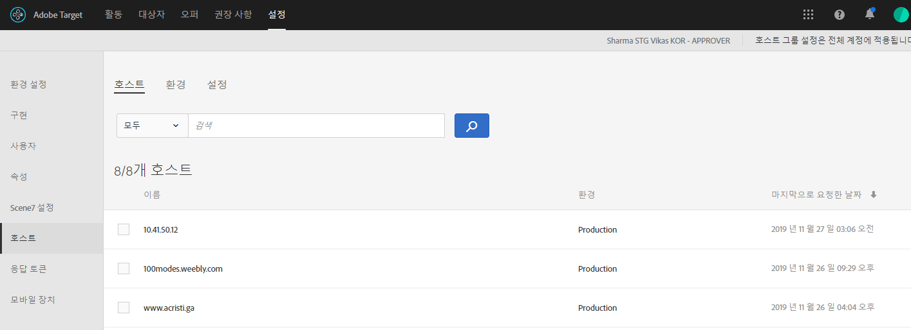

# 호스트{#hosts}

쉽게 관리하고 개별적으로 보고하려면 사이트와 사전 프로덕션 환경을 구성하십시오.

호스트 관리의 기본 목적은 비활성화 상태 컨텐츠가 실수로 웹 사이트에 나타나지 않도록 하는 것입니다. Host management also lets you separate report data by [environment](/help/administrating-target/environments.md).

호스트는 요청이 이루어진 모든 [!DNL Target] 도메인입니다. 웹 사이트에서는 일반적으로 요청을 수행하는 URL의 `location.hostname` 속성입니다 [!DNL Target] .

기본적으로, 요청을 수행하고 응답을 받을 수 있는 호스트를 제한하지 [!DNL Target] 않습니다 [!DNL Target] [!DNL Target] . 새 주최자가 요청을 하면 자동으로 작동합니다. 모르거나 예상할 수 없는 다른 도메인에서 테스트할 수도 있습니다. 이 기본 동작을 무시하려는 경우 사용할 호스트를 제한할허용 목록에 추가하다 또는 차단 목록에 추가하다를 설정할 수 있습니다 [!DNL Target].

호스트를 관리하려면 **[!UICONTROL 관리]** > **[!UICONTROL 호스트를 클릭합니다]**.

## Recognizing hosts {#concept_0D4B43E23AA9408F8B28A57ED754BF65}

호스트를 인식하고 [!UICONTROL 호스트] 목록에 추가하려면 다음 조건을 충족해야 합니다.

* At least one [!DNL Target] request must exist on the host
* 호스트의 페이지에 다음 항목이 있어야 합니다.

   * 정확한 at.js 또는 mbox.js 참조
   * 요청 또는 자동 생성된 글로벌 [!DNL Target] [!DNL Target] 요청

* The page with the [!DNL Target] request must be viewed in a browser

After the page is viewed, the host is listed in the [!UICONTROL Hosts] list, allowing you to manage it in an environment, as well as preview and launch activities and tests.

>[!NOTE]
>
>여기에는 개인 개발 서버가 모두 포함됩니다.

호스트가 [!UICONTROL 호스트] 목록에 추가되면 호스트가 인식되는지 확인하십시오.

1. 관리 **** > **[!UICONTROL 호스트를 클릭합니다]**.
1. 해당 호스트가 나열되지 않으면 브라우저를 새로 고치십시오.

   By default, a newly recognized host is placed in the [!UICONTROL Production] environment. 이러한 호스트에서는 비활성 상태 활동을 보는 것이 허용되지 않으므로 이 환경은 가장 안전한 환경입니다.

1. (조건부) 호스트를 **[!UICONTROL 개발]** , 스테이징,  아이콘( [!UICONTROL 이동]아이콘 [!UICONTROL )을]클릭합니다.

>[!NOTE]
>
>The [!UICONTROL Production] environment cannot be deleted, even if you rename it. 이 위치에서 활성 상태 최종 활동 및 테스트를 제공한다고 가정합니다. 기본 환경은 비활성 상태 캠페인을 보도록 허용하지 않습니다.

## Sort or search the Hosts list {#section_068B23C9D8224EB78BC3B7C8580251B0}

To sort the [!UICONTROL Hosts] list, click any column header ([!UICONTROL Name], [!UICONTROL Environment], or [!UICONTROL Last Requested]) to sort the list in ascending or descending order.

To search the [!UICONTROL Hosts] list, type a search term in the [!UICONTROL Search Hosts] box.

## Create allowlists that specify hosts that are authorized to send Target requests to Target. {#allowlist}

You can create an allowlist that specifies hosts (domains) that are authorized to send [!DNL Target] requests to [!DNL Target]. 요청을 생성하는 다른 모든 호스트는 주석 처리된 인증 오류 응답을 받게 됩니다. By default, any host that contains a [!DNL Target] request registers with [!DNL Target] in the [!UICONTROL Production] environment and has access to all active and approved activities. If this is not the desired approach, you can instead use the allowlist to record specific hosts that are eligible to make [!DNL Target] requests and receive [!DNL Target] content. All hosts will continue to display in the [!UICONTROL Hosts] list, and environments can still be used to group these hosts and assign different levels to each, such as whether the host can see active and/or inactive activities.

을 허용 목록에 추가하다 만들려면

1. 호스트 [!UICONTROL 목록에서 호스트] 권한 **[!UICONTROL 을 클릭합니다]**.
1. 컨텐츠 **[!UICONTROL 전달에 대해 인증된 호스트 활성화 전환을]** 활성화합니다.
1. Add the desired hosts in the **[!UICONTROL Host contains]** box, as desired.

   여러 호스트가 각각 고유한 행에 나열될 수 있습니다.

1. Add the desired hosts in the **[!UICONTROL Host does not contains]** box, as desired.

   여러 호스트가 각각 고유한 행에 나열될 수 있습니다.

1. **[!UICONTROL 저장]**&#x200B;을 클릭합니다.

If a [!DNL Target] request is made on an unauthorized host, the call will respond with `/* no display - unauthorized mbox host */`.

>[!IMPORTANT]
>
>**보안 모범 사례**:의 ubox 기능을 사용하는 경우 이허용 목록에 추가하다는 리디렉터가 탐색할 수 있는 도메인 목록도 [!DNL Target]제어합니다  . 구현의 일부로 ubox를 사용할 때 리디렉션할 도메인을 추가하는지 확인하십시오. 허용 목록에 추가하다를 지정하지 않은 경우 리디렉션 URL을 확인하고 잠재적인 악성 리디렉션에서 보호할 수 없습니다. [!DNL Adobe]
>
>허용 목록에 추가하다가 환경보다 우선합니다. 기능을 사용하기 전에 모든 호스트를 지워야 허용 목록에 추가하다 합니다. 그러면에서 허용하는 허용 목록에 추가하다 호스트만 호스트 목록에 나타납니다. 그런 후 호스트를 원하는 환경으로 이동할 수 있습니다.

다른 사이트의 도메인이 환경에 표시되는 경우가 있습니다. 도메인이 at.js 또는 mbox.js를 호출하는 경우 목록에 나타납니다. 예를 들어 웹 페이지 중 하나를 서버로 복사하면 해당 도메인이 환경에 표시됩니다. 스파이더 엔진, 언어 번역기 사이트 또는 로컬 디스크 드라이브에서 도메인을 볼 수도 있습니다.

`mboxHost`가 API 호출에서 전달되는 경우 전달된 환경에 대해 전환이 기록됩니다. If no environment is passed, the host in the call defaults to [!UICONTROL Production].

You can also create a denylist that specifies hosts (domains) than cannot send [!DNL Target] requests to [!DNL Target] by adding the desired hosts in the [!UICONTROL Host Does Not Contain] box.

>[!NOTE]
>
>인증된 호스트 목록은 [!DNL Target] 호스트 및 기본 리디렉션 호스트 모두에 사용되므로 Javascript SDK(at.js) [!DNL Adobe Target] AND ** ubox 기본 리디렉션 URL에 사용된 모든 도메인을 사용하도록 승인된 기존 도메인을 모두 추가해야 합니다. 나중에에 유사한 새 도메인허용 목록에 추가하다를 추가해야 합니다.

## Delete a host {#section_F56355BA4BC54B078A1A8179BC954632}

더 이상 필요하지 않은 호스트를 삭제할 수 있습니다.

1. From the [!UICONTROL Hosts] list, click the **[!UICONTROL Delete]** icon.
1. **[!UICONTROL 삭제]**&#x200B;를 클릭하여 삭제를 확인합니다.

>[!NOTE]
>
>호스트에 대한 요청이 들어 있는 페이지를 찾아보는 경우 호스트가 다시 [!DNL Target] 표시됩니다.

## 호스트 문제 해결 {#concept_B3D7583FA4BB480382CC7453529FE1B7}

호스트에 문제가 발생하는 경우 다음의 문제 해결 팁을 사용해 보십시오.

**호스트가 계정 목록에 표시되지 않습니다.**

* 브라우저에서 [!UICONTROL 호스트] 페이지를 새로 고치십시오.
* at.js 또는 mbox.js 참조를 포함하여 요청이 [!DNL Target] 올바른지 확인합니다.
* Try browsing to one of the [!DNL Target] requests on the host. It&#39;s possible that no [!DNL Target] request on the host was ever rendered in a browser.

**[!UICONTROL 호스트] 목록에 임의 도메인이나 알 수 없는 도메인이 표시됩니다.**

A domain appears in this list if a request to [!DNL Target] is made from the domain. 대체로 스파이더 엔진, 언어 번역기 사이트 또는 로컬 디스크 드라이브에서 도메인을 볼 수 있습니다. 나열된 도메인이 팀에서 사용하는 도메인이 아닌 경우 [!UICONTROL 삭제]를 클릭하여 제거할 수 있습니다.

**내 [!DNL Target] 요청이 /* no display - unauthorized mbox host */를 반환합니다.**

If a [!DNL Target] request is made on an unauthorized host, the request will respond with /* no display - unauthorized mbox host */.
