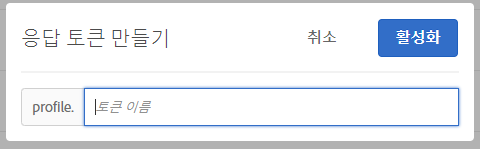

# 응답 토큰{#response-tokens}

응답 토큰을 사용하면 디버깅하거나 타사 시스템(예: Clicktale)과 통합하는 데 사용할 [!DNL Target](활동 세부 사항, 사용자 프로필 정보, 지역 정보 등)에 대한 정보를 자동으로 출력할 수 있습니다.

응답 토큰을 사용하면 활용할 변수를 선택한 다음 Target 응답의 일부로 변수를 보낼 수 있습니다. 이 작업을 수행하려면 스위치를 사용하여 변수를 활성화하면 해당 변수가 Target 응답과 함께 전송되고 이를 네트워크 호출에서 확인할 수 있습니다. 응답 토큰은 [!UICONTROL 미리 보기] 모드에서도 작동합니다.

플러그인과 응답 토큰 간의 중요한 차이는 플러그인이 전달 시 실행되는 JavaScript를 페이지에 전달하는 반면, 응답 토큰은 이벤트 수신자를 사용하여 읽고 작업할 수 있는 개체를 전달한다는 것입니다. 자세한 내용은 [at.js 사용자 지정 이벤트](/help/c-implementing-target/c-implementing-target-for-client-side-web/atjs-custom-events.md) 및 이 문서의 뒷부분에 나오는 예를 참조하십시오. 응답 토큰 접근 방식은 더 안전하며 타사 통합을 보다 쉽게 개발하고 유지 관리할 수 있도록 허용해야 합니다.

>[!NOTE]
>
>응답 토큰은 at.js 1.1 이상에서 사용할 수 있습니다.

| 사용 중인 Target 라이브러리 | 제안 작업 |
|--- |--- |
| at.js | at.js 버전 1.1 이상을 사용 중인지 확인하십시오. 최신 버전의 at.js를 다운로드하는 방법에 대해서는 [at.js](/help/c-implementing-target/c-implementing-target-for-client-side-web/how-to-deployatjs/implementing-target-without-a-tag-manager.md)를 참조하십시오. 각 at.js 버전의 새로운 기능에 대한 내용은 [at.js 버전 세부 사항](/help/c-implementing-target/c-implementing-target-for-client-side-web/target-atjs-versions.md)을 참조하십시오.<br>at.js를 사용하는 고객은 응답 토큰을 사용하고 플러그인을 사용하지 않는 것이 좋습니다. mbox.js에는 존재하지만 at.js에는 존재하지 않는 내부 메서드에 의존하는 일부 플러그인의 경우 전달되더라도 실패합니다. 자세한 내용은 [at.js 제한 사항](/help/c-implementing-target/c-implementing-target-for-client-side-web/t-mbox-download/c-target-atjs-implementation/target-atjs-limitations.md)을 참조하십시오. |
| mbox.js | mbox.js를 사용할 때 플러그인은 계속 지원되고 전달됩니다.<br>그러나 mbox.js 및 플러그인을 사용하는 고객은 at.js와 응답 토큰으로 이동하는 것이 좋습니다. mbox.js에 비해 at.js를 사용할 때의 장점에 대한 자세한 내용은 [at.js FAQ](/help/c-implementing-target/c-implementing-target-for-client-side-web/c-target-atjs-faq/target-atjs-faq.md)를 참조하십시오. 마이그레이션에 대해서는 [mbox.js에서 at.js로 마이그레이션](/help/c-implementing-target/c-implementing-target-for-client-side-web/t-mbox-download/c-target-atjs-implementation/target-migrate-atjs.md)을 참조하십시오.<br>Target Classic의 사용 중단(2017년 11월) 이후에는 고객 지원팀에 연락하여 기존 플러그인을 편집하거나 비활성화해야 할 수 있습니다. Target Classic 사용이 중단되기 전에 해당 플러그인을 검사하여 원치 않는 플러그인은 비활성화했어야 합니다.<br>Target Standard/Premium에서는 새 플러그인을 만들 수 없습니다. 대신 응답 토큰을 사용하십시오.<br>이전 SiteCatalyst 플러그인은 비활성화하여 [Adobe Target용 보고 소스로서의 Adobe Analytics](/help/c-integrating-target-with-mac/a4t/a4t.md) (A4T)로 교체해야 합니다. ttMeta 플러그인은 비활성화하고 [Adobe Experience Cloud Debugger](https://chrome.google.com/webstore/detail/adobe-experience-cloud-de/ocdmogmohccmeicdhlhhgepeaijenapj)로 교체해야 합니다. |

## 응답 토큰 사용 {#section_A9E141DDCBA84308926E68D05FD2AC62}

1. [!DNL at.js] 버전 1.1 이상을 사용 중인지 확인하십시오. 

   자세한 내용은 [at.js 다운로드](/help/c-implementing-target/c-implementing-target-for-client-side-web/how-to-deployatjs/implementing-target-without-a-tag-manager.md#concept_1E1F958F9CCC4E35AD97581EFAF659E2)를 참조하십시오.

1. [!DNL Target]에서 **[!UICONTROL 관리]** > **[!UICONTROL 응답 토큰]**&#x200B;을 클릭합니다.

   

1. `activity.id`, `option.id` 등 원하는 응답 토큰을 활성화합니다.

   기본적으로 다음 매개 변수를 사용할 수 있습니다.

   | 유형 | 매개 변수 | 참고 |
   |--- |--- |--- |
   | 내장 프로필 | `profile.activeActivities` | 방문자가 자격을 갖는 일련의 `activityIds`를 반환합니다. 사용자가 자격을 갖게 됨에 따라 증가합니다. 예를 들어 두 개의 다른 활동을 제공하는 [!DNL Target] 요청이 있는 페이지에서 두 번째 요청에는 두 개의 활동이 모두 포함됩니다. |
   |  | `profile.isFirstSession` | &quot;true&quot; 또는 &quot;false&quot;를 반환합니다. |
   |  | `profile.isNewSession` | &quot;true&quot; 또는 &quot;false&quot;를 반환합니다. |
   |  | `profile.daysSinceLastVisit` | 방문자가 마지막으로 방문한 이후 경과한 일수를 반환합니다. |
   |  | `profile.tntId` | 방문자의 tntID를 반환합니다. |
   |  | `profile.marketingCloudVisitorId` | 방문자의 Experience Cloud 방문자 ID를 반환합니다. |
   |  | `profile.thirdPartyId` | 방문자의 타사 ID를 반환합니다. |
   |  | `profile.categoryAffinity` | 방문자가 즐겨 찾는 카테고리를 반환합니다. |
   |  | `profile.categoryAffinities` | 방문자의 상위 5개 카테고리의 배열을 문자열로 반환합니다. |
   | 활동 | `activity.name`<br>`activity.id`<br>`experience.name`<br>`experience.id`<br>`option.name`<br>`option.id` | 현재 활동의 세부 사항입니다. &quot;option&quot;은 &quot;offer&quot;와 같습니다. |
   | 지역 | `geo.country`<br>`geo.state`<br>`geo.city`<br>`geo.zip`<br>`geo.dma`<br>`geo.domainName`<br>`geo.ispName`<br>`geo.connectionSpeed`<br>`geo.mobileCarrier` | 활동에서 지역 기반의 타깃팅을 사용하는 방법에 대한 자세한 내용은 [지역](/help/c-target/c-audiences/c-target-rules/geo.md)을 참조하십시오. |
   | 트래픽 할당 방법<br>(자동 Target] 및 [!UICONTROL Automated Personalization] 활동에만 적용)[!UICONTROL  | `experience.trafficAllocationId` | 방문자가 &quot;제어&quot; 트래픽에서 경험을 받은 경우 0을 반환하고 방문자가 &quot;타깃팅된&quot; 트래픽 배포로부터 경험을 받은 경우 1을 반환합니다. |
   |  | `experience.trafficAllocationType` | &quot;control&quot; 또는 &quot;targeted&quot;를 반환합니다. |

   사용자 프로필 속성 및 고객 속성도 목록에 표시됩니다.

   >[!NOTE]
   >
   >특수 문자가 있는 매개 변수는 목록에 표시되지 않습니다. 영숫자 문자 및 밑줄만 지원됩니다.

1. (조건부) 프로필 매개 변수를 응답 토큰으로 사용하지만 매개 변수가 [!DNL Target] 요청을 통해 전달되지 않아 Target UI에 로드되지 않은 경우 [!UICONTROL 응답 토큰 추가] 단추를 사용하여 UI에 프로필을 추가할 수 있습니다.

   **[!UICONTROL 응답 토큰 추가]**&#x200B;를 클릭하고 토큰 이름을 입력한 다음 **[!UICONTROL 활성화]**&#x200B;를 클릭합니다.

   

1. 활동을 만듭니다.

[at.js 사용자 지정 이벤트](/help/c-implementing-target/c-implementing-target-for-client-side-web/atjs-custom-events.md)를 사용하여 응답을 수신하고 응답 토큰을 읽습니다.[!DNL Target]

다음 코드 샘플은 [!DNL at.js] 사용자 지정 이벤트 핸들러를 HTML 페이지에 바로 추가합니다.

```html
<html> 
  <head> 
    .... 
    <script src="at.js"></script> 
    <script> 
      document.addEventListener(adobe.target.event.REQUEST_SUCCEEDED, function(e) { 
        console.log("Request succeeded", e.detail); 
      }); 
    </script> 
  <head> 
  <body> 
  ... 
  </body> 
</html>
```

다음 지침은 Adobe 다이내믹 태그 관리자(DTM)를 사용하여 [!DNL at.js] 사용자 지정 이벤트 핸들러를 추가하는 방법을 보여줍니다.

1. DTM에 로그인합니다.
1. 해당 속성으로 이동합니다.
1. Target 도구를 엽니다.

   DTM은 기본적으로 at.js를 지원하지 않으므로 코드 편집기를 사용해야 합니다.

1. 코드 편집기에서 [!DNL at.js]에 다음 코드를 추가합니다.

   ```json
   document.addEventListener(adobe.target.event.REQUEST_SUCCEEDED, function(e) { 
     console.log("Request succeeded", e.detail); 
   });
   ```

모든 항목이 하나의 파일에 있기를 바란다면 다음 코드 조각을 라이브러리 바닥글 [at.js 설정 페이지](/help/c-implementing-target/c-implementing-target-for-client-side-web/how-to-deployatjs/implementing-target-without-a-tag-manager.md#concept_2FA0456607D04F82B0539C5BF5309812)에 추가할 수 있습니다.

```json
document.addEventListener(adobe.target.event.REQUEST_SUCCEEDED, function(e) { 
  console.log("Request succeeded", e.detail); 
});
```

## 응답 토큰 FAQ {#section_3DD5F32C668246289CDF9B4CDE1F536D}

**응답 토큰을 활성화하거나 비활성화하는 데 필요한 역할은 무엇입니까?**

응답 토큰은 Target 관리자 역할이 있는 사용자만 활성화 또는 비활성화할 수 있습니다.

**at.js 1.0 이하를 실행 중이라면 어떻게 됩니까?**

응답 토큰이 표시되지만 at.js는 응답 토큰을 사용할 수 없습니다.

**사이트의 일부 페이지에서 at.js 1.1(또는 이상)을 사용하고 있지만 다른 페이지에서는 mbox.js를 사용 중이라면 어떻게 됩니까?**

응답 토큰은 [!DNL at.js] Target 응답에 전달되지만 [!DNL mbox.js] 응답에는 전달되지 않습니다.

**Target Classic 플러그인과 응답 토큰이 동시에 활성화될 수 있습니까?**

플러그인과 응답 토큰을 동시에 사용할 수는 있지만 플러그인은 향후에 더 이상 사용되지 않습니다.

**응답 토큰이 모든 응답을  [!DNL Target] 통해 제공됩니까 아니면 활동을 제공하는  [!DNL Target] 응답을 통해서만 제공됩니까?**

응답 토큰은 활동을 제공하는 [!DNL Target] 응답만 전달됩니다.

**내 Target Classic 플러그인에는 JavaScript가 포함되어 있습니다. 응답 토큰을 사용하여 해당 기능을 복제하려면 어떻게 해야 합니까?**

응답 토큰으로 마이그레이션할 때 이 유형의 JavaScript를 코드베이스 또는 태그 관리 솔루션에 보관해야 합니다. [!DNL at.js] 사용자 지정 이벤트를 사용하여 이 코드를 트리거하고 응답 토큰 값을 JavaScript 함수에 전달할 수 있습니다.

**내 프로필/고객 속성 매개 변수가 응답 토큰 목록에 표시되지 않는 이유는 무엇입니까?**

Target은 보통 15분마다 매개 변수를 새로 고칩니다. 이 새로 고치기는 사용자 작업에 따라 다르며, 응답 토큰 페이지를 볼 때만 데이터가 새로 고쳐집니다. 매개 변수가 응답 토큰 목록에 표시되지 않는다면 Target이 데이터를 아직 새로 고치지 않았기 때문일 수 있습니다.

또한 매개 변수에 영숫자가 아닌 문자나 밑줄 이외의 기호가 포함되어 있으면 매개 변수가 목록에 나타나지 않습니다. 현재 영숫자와 밑줄 문자만 지원됩니다.

**프로필 스크립트나 프로필 매개 변수를 사용하여 응답 토큰을 만든 다음 해당 프로필 스크립트 또는 매개 변수를 삭제해도 응답 토큰이 여전히 컨텐츠를 전달합니까?**

응답 토큰은 사용자 프로필에서 정보를 추출한 후에 전달합니다. 프로필 스크립트 또는 매개 변수를 삭제해도 사용자 프로필에서 해당 정보가 제거되지 않습니다. 사용자 프로필에는 여전히 프로필 스크립트에 해당하는 데이터가 있으며, 응답 토큰은 계속 컨텐츠를 전달하게 됩니다. 프로필에 해당 정보가 저장되어 있지 않은 사용자나 새 방문자의 경우, 프로필에 데이터가 없으므로 해당 토큰이 전달되지 않습니다.

Target은 토큰을 자동으로 해제하지 않습니다. 프로필 스크립트를 삭제하고 토큰을 더 이상 전달하지 않으려면 토큰을 직접 해제해야 합니다.

**프로필 스크립트의 이름을 바꾸었는데 해당 스크립트를 사용하는 토큰이 여전히 이전 이름으로 활성 상태인 이유는 무엇입니까?**

위에서 언급한 대로 응답 토큰은 사용자에 따라 저장된 프로필 정보에 적용됩니다. 프로필 스크립트의 이름을 바꾸더라도 웹 사이트를 방문한 사용자에게는 프로필에 저장된 이전 프로필 스크립트 값이 있으며 토큰은 이미 사용자 프로필에 저장된 이전 값을 계속 선택합니다. 이제 새 이름으로 컨텐츠를 전달하려면 이전 토큰을 해제하고 새 토큰을 설정해야 합니다.

**속성이 변경되었다면, 목록에서는 언제 제거됩니까?**

Target은 정기적으로 속성을 새로 고칩니다. 사용하도록 설정되지 않는 속성은 다음번에 새로 고침할 때 제거됩니다. 그러나 설정되어 있는데 제거된 속성이 있는 경우(예를 들어, 토큰으로 사용된 프로필 스크립트를 제거한 경우) 해제하기 전까지는 해당 스크립트가 속성 목록에서 제거되지 않습니다. 속성이 삭제되거나 이름이 변경되었을 때 해제된 속성만 목록에서 제거됩니다.

## at.js를 통해 Google 애널리틱스에 데이터 전송 {#section_04AA830826D94D4EBEC741B7C4F86156}

at.js를 통해 HTML 페이지에 다음 코드를 추가하여 Google 애널리틱스에 데이터를 전송할 수 있습니다.

```javascript
<script type="text/javascript"> 
  (function(i, s, o, g, r, a, m) { 
    i['GoogleAnalyticsObject'] = r; 
    i[r] = i[r] || function() { 
      (i[r].q = i[r].q || []).push(arguments) 
    }, i[r].l = 1 * new Date(); 
    a = s.createElement(o), 
      m = s.getElementsByTagName(o)[0]; 
    a.async = 1; 
    a.src = g; 
    m.parentNode.insertBefore(a, m) 
  })(window, document, 'script', 'https://www.google-analytics.com/analytics.js', 'ga'); 
  ga('create', 'Google Client Id', 'auto'); 
</script> 
 
<script type="text/javascript"> 
  document.addEventListener(adobe.target.event.REQUEST_SUCCEEDED, function(e) { 
    var tokens = e.detail.responseTokens; 
 
    if (isEmpty(tokens)) { 
      return; 
    } 
 
    var activityNames = []; 
    var experienceNames = []; 
    var uniqueTokens = distinct(tokens); 
 
    uniqueTokens.forEach(function(token) { 
      activityNames.push(token["activity.name"]); 
      experienceNames.push(token["experience.name"]); 
    }); 
 
    ga('send', 'event', { 
      eventCategory: "target", 
      eventAction: experienceNames, 
      eventLabel: activityNames 
    }); 
  }); 
 
  function isEmpty(val) { 
    return (val === undefined || val == null || val.length <= 0) ? true : false; 
  } 
 
  function key(obj) { 
     return Object.keys(obj) 
    .map(function(k) { return k + "" + obj[k]; }) 
    .join(""); 
  } 
 
  function distinct(arr) { 
    var result = arr.reduce(function(acc, e) { 
      acc[key(e)] = e; 
      return acc; 
    }, {}); 
   
    return Object.keys(result) 
    .map(function(k) { return result[k]; }); 
  } 
</script>
```

## 디버깅(ttMeta 플러그인과 유사)  {#section_DB3392B6E80749C1BFB520732EDF3BCE}

디버깅 목적의 ttMeta 플러그인과 동등한 기능은 HTML 페이지에 다음 코드를 추가하여 만들 수 있습니다.

```javascript
<script type="text/javascript" > 
  document.addEventListener(adobe.target.event.REQUEST_SUCCEEDED, function (e) { 
    window.ttMETA= typeof(window.ttMETA)!="undefined" ? window.ttMETA : []; 
 
    var tokens=e.detail.responseTokens; 
 
    if (isEmpty(tokens)) { 
      return; 
    } 
     
    var uniqueTokens = distinct(tokens); 
 
    uniqueTokens.forEach(function(token) { 
      window.ttMETA.push({ 
        'CampaignName': token["activity.name"], 
        'CampaignId' : token["activity.id"], 
        'RecipeName': token["experience.name"], 
        'RecipeId': token["experience.id"], 
        'OfferId': token["option.id"], 
        'OfferName': token["option.name"], 
        'MboxName': e.detail.mbox}); 
      console.log(ttMETA); 
    }); 
  }); 
 
  function isEmpty(val){ 
    return (val === undefined || val == null || val.length <= 0) ? true : false; 
  } 
 
  function key(obj) { 
     return Object.keys(obj) 
    .map(function(k) { return k + "" + obj[k]; }) 
    .join(""); 
  } 
 
  function distinct(arr) { 
    var result = arr.reduce(function(acc, e) { 
      acc[key(e)] = e; 
      return acc; 
    }, {}); 
   
    return Object.keys(result) 
    .map(function(k) { return result[k]; }); 
  } 
</script>
```

## 교육 비디오: 응답 토큰 및 at.js 사용자 지정 이벤트  {#section_3AA0A6C8DBD94A528337A2525E3E05D5}

다음 비디오를 시청하여 응답 토큰 및 at.js 사용자 지정 이벤트를 사용하여 Target에서 타사 시스템으로 프로필 정보를 공유하는 방법을 학습하십시오.

>[!NOTE]
>
>[!DNL Target] [!UICONTROL 관리] 메뉴 UI(이전의 [!UICONTROL 설치])가 향상된 성능을 제공하고, 새 기능을 출시할 때 필요한 유지 관리 시간을 줄이고, 제품 전반의 사용자 경험을 개선하기 위해 다시 디자인되었습니다. 다음 비디오의 정보는 일반적으로 정확하다.그러나 옵션이 약간 다른 위치에 있을 수 있습니다. 업데이트된 비디오가 곧 게시될 예정입니다.

>[!VIDEO](https://video.tv.adobe.com/v/23253/)
