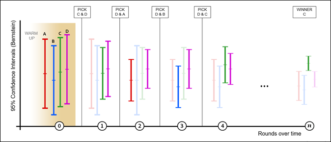

# 자동 할당 개요

자동 할당은 둘 이상의 경험에서 승자를 식별하고, 테스트가 계속 실행되고 학습하는 동안 전환을 늘리기 위해 더 많은 트래픽을 승자에게 자동으로 재할당합니다.

3단계 안내 작업 과정을 사용하여 A/B 활동을 만드는 동안 [!UICONTROL 최적의 경험에 자동 할당] 옵션을 선택할 수 있습니다.

## 과제 {#section_85D5A03637204BACA75E19646162ACFF}

표준 A/B 테스트에는 기본 비용이 있습니다. 각 경험의 성과를 측정하고 분석을 통해 가장 성과가 좋은 경험을 알아내는 데 트래픽을 사용해야 합니다. 일부 경험이 다른 경험에 비해 성과가 더 좋다는 것을 인지한 후에도 트래픽 분배가 고정적으로 유지됩니다. 또한 샘플 크기를 알아내는 것도 복잡하며, 활동의 전체 과정을 실행해야 승자에 대해 작업할 수 있습니다. 이 모든 일을 수행한 후에도 여전히 식별된 승자가 실제 승자가 아닐 가능성도 있습니다.

## 해결 방법: 자동 할당 {#section_98388996F0584E15BF3A99C57EEB7629}

자동 할당은 이러한 비용과 우승 경험을 알아내는 데 드는 오버헤드를 줄여줍니다. 자동 할당 기능에서는 모든 경험의 목표 지표 성과를 모니터링하고, 성과가 좋은 경험에는 비례하여 더 많은 새 참여자를 보냅니다. 다른 경험을 탐색하도록 충분한 트래픽이 예약되어 있습니다. 활동이 계속 실행되는 동안에도 결과에 대한 테스트의 이점, 즉 학습과 동시에 최적화가 발생한다는 것을 확인할 수 있습니다.

자동 할당은 활동을 끝까지 수행하여 승자를 완전히 판별할 때까지 기다리게 하기보다는 방문자를 성과가 우승 경험으로 점차적으로 이동시킵니다. 덜 성공적인 경험으로 보내졌을 활동 참여자가 잠재적으로 우승 경험으로 표시되므로 더 빠른 성과 향상(상승도)의 혜택을 얻을 수 있습니다.

Target의 일반 A/B 테스트에는 도전군과 통제군의 쌍별 비교만 표시됩니다. 예를 들어, 활동에 A, B, C 및 D 경험이 있고, 여기에서 A가 통제 경험이라면, 일반 Target A/B 테스트는 A와 B, A와 C, A와 D를 비교합니다.

이러한 테스트에서 Target을 비롯한 대부분의 제품에서는 학생 t 검증(t-test)을 사용하여 p 값 기반 신뢰도를 생성합니다. 그런 다음 이 신뢰도 값을 사용하여 도전군이 통제군과 충분히 다른지 판별합니다. 그러나 Target은 &quot;최상의&quot; 경험을 찾기 위해 필요한 암시적 비교(B와 C, B와 D, C와 D)를 자동으로 수행하지는 않습니다. 그 결과, 마케터는 결과를 수동으로 분석하여 &quot;최상의&quot; 경험을 결정해야 합니다.

자동 할당은 경험들 간의 모든 암시적 비교를 수행하고 &quot;true&quot;(실제) 승자를 생성합니다. 이 테스트에는 &quot;통제&quot; 경험이라는 개념이 없습니다.

자동 할당은 최상의 경험에 대한 신뢰 구간이 다른 경험과 겹치지 않을 때까지 지능적으로 새 방문자를 경험에 할당합니다. 일반적으로 이 프로세스는 긍정 오류(false positive)를 생성할 수 있지만 자동 할당에서는 반복된 평가를 보상하는 [베른슈타인 부등식](https://en.wikipedia.org/wiki/Bernstein_inequalities_(probability_theory))을 기반으로 하는 신뢰 구간을 사용합니다. 이 시점에서 진짜 승자를 가지게 됩니다. 자동 할당이 중지되면, 페이지에 도착하는 방문자에게 실질적인 시간 종속성이 없는 경우 자동 할당에서 실제 응답이 우승 경험의 실제 응답보다 1%(상대적) 적은 만큼의 경험을 반환할 확률이 95% 이상입니다.

## 자동 할당 대 A/B 또는 자동화된 개인화 사용 시점 {#section_3F73B0818A634E4AAAA60A37B502BFF9}

* 활동을 처음부터 최적화하고 가장 성과가 좋은 경험을 가능한 한 빨리 식별하려면 **자동 할당**&#x200B;을 사용하십시오. 성과가 좋은 경험을 더 자주 제공하면 전반적인 활동 성과가 높아집니다.
* 사이트를 최적화하기 전에 모든 경험의 성과를 파악하려면 표준 **[A/B 테스트](/help/c-activities/t-test-ab/test-ab.md#task_05E33EB15C4D4459B5EAFF90A94A7977)**&#x200B;를 사용하십시오. A/B 테스트에서는 사용자의 모든 경험에 대해 등급을 매길 수 있는 반면에 자동 트래픽 할당에서는 성과가 가장 높은 경험을 찾긴 하지만 낮은 경험들 간의 구별을 보장하지는 않습니다.
*  개별 프로필 속성을 기반으로 예측하는 기계 학습 모델과 같이 최상위 복잡성에 대한 최적화 알고리즘을 원하는 경우 [자동화된 개인화](/help/c-activities/t-automated-personalization/automated-personalization.md#task_8AAF837796D74CF893CA2F88BA1491C9)를 사용하십시오. 자동 트래픽 할당은 경험의 종합적인 행동을 살펴보며(표준 A/B 테스트처럼), 방문자를 구분하지는 않습니다.

## 핵심적인 이점 {#section_0913BF06F73C4794862561388BBDDFF0}

* A/B 테스트의 엄격도 유지
* 수동 A/B 테스트보다 더 빠르게 통계적으로 유의한 우승자 찾기
* 수동 A/B 테스트보다 더 높은 평균 캠페인 상승도 제공

## 용어 {#section_670F8785BA894745B43B6D4BFF953188}

다음 용어는 자동 할당에 대해 논의할 때 유용합니다.

**Multi-armed bandit:** 최적화에 대한 [multi-armed bandit](https://en.wikipedia.org/wiki/Multi-armed_bandit) 접근 방식은 탐색 학습과 해당 학습의 이용 간에 균형을 이룹니다.

## 알고리즘 작동 방식 {#section_ADB69A1C7352462D98849F2918D4FF7B}

자동 할당의 전반적인 논리에서는 누적 데이터의 측정된 성과(예: 전환율)과 신뢰 구간을 모두 통합합니다. 트래픽이 경험 간에 균일하게 분할되는 표준 A/B 테스트와는 달리, 자동 할당에서는 경험들 간의 트래픽 할당을 변경합니다.

* 방문자의 80%는 아래에 설명된 지능적인 논리를 사용하여 할당됩니다.
* 방문자의 20%는 변화하는 방문자의 행동에 적응하기 위해 모든 경험에 무작위로 지정됩니다.

multi-armed bandit 접근 방식은 잘 수행되는 경험을 이용하는 동안 일부 경험을 자유롭게 탐색할 수 있도록 합니다. 변화하는 조건에 반응하는 기능을 유지하는 동안 더 많은 신규 방문자가 성과가 더 좋은 경험에 배치됩니다. 이러한 모델은 모델이 최신 데이터에 반응하도록 한 시간에 한 번 이상 업데이트됩니다.

더 많은 방문자가 활동을 입력하면 일부 경험은 더 성공하기 시작하고 더 많은 트래픽이 성공적인 경험에 전송됩니다. 트래픽의 20%는 모든 경험을 탐색하기 위해 무작위로 계속 제공됩니다. 성과가 낮은 경험 중 하나가 더 높은 성과를 보이기 시작하면 해당 경험에 더 많은 트래픽이 할당됩니다. 또는 성과가 더 높은 활동의 성공이 줄어들면 해당 경험에 트래픽이 덜 할당됩니다. 예를 들어, 어떤 이벤트로 인해 방문자가 미디어 사이트에서 다른 정보를 검색하거나 소매 사이트의 주말 세일에서 다른 결과가 나오는 경우가 있을 수 있습니다.

다음 그림은 네 가지 경험으로 테스트하는 동안 알고리즘이 어떻게 수행될 수 있는지를 나타냅니다.

그림에서는 분명한 승자가 결정되기 전까지 각 경험에 할당된 트래픽이 활동 라이프타임의 몇 개 라운드 동안 어떻게 진행되는지를 보여줍니다.

| 라운드 | 설명 |
|--- |--- |
|  | **준비 라운드(0)**: 준비 라운드 동안 해당 활동에 있는 각 경험에 최소 1,000명의 방문자와 50개의 전환이 생길 때까지 각 경험은 동일한 트래픽 할당을 받습니다.<ul><li>경험 A=25%</li><li>경험 B=25%</li><li>경험 C=25%</li><li>경험 D=25%</li></ul>각 경험에 1,000명의 방문자와 50개의 전환이 생기면 Target은 자동 트래픽 할당을 시작합니다. 모든 할당은 라운드에서 발생하며 각 라운드에 대해 두 개의 경험이 선택됩니다. D와 C, 이 두 개의 경험만 다음 라운드로 이동합니다. 이러한 순방향 이동은 트래픽의 80%가 이 두 개의 경험에 동일하게 할당되는 반면, 다른 두 경험은 계속해서 참여는 하지만, 새 방문자들이 활동을 입력할 때 20%의 무작위 트래픽 할당의 일부만 받음을 의미합니다. 모든 할당은 매시간마다 업데이트되며(위의 x축에 라운드별로 표시됨), 각 라운드 후에는 누적 데이터가 비교됩니다. |
|  | **1라운드**: 이 라운드 동안 트래픽의 80%가 경험 C와 D에 할당됩니다(각각 40%). 트래픽의 20%는 경험 A, B, C 및 D에 무작위로 할당됩니다(각각 5%). 이 라운드 동안 경험 A는 잘 수행됩니다.<ul><li>알고리즘에서는 경험 D가 전환율이 가장 높아서(각 활동의 세로 눈금에 로 표시됨) 경험 D가 다음 라운드로 이동하도록 선택됩니다.</li><li>알고리즘에서 경험 A는 나머지 경험의 Bernstein 95% 신뢰 구간에 대한 상한이 가장 높으므로 경험 A도 순방향으로 이동하도록 선택됩니다.</li></ul>경험 D와 A가 순방향으로 이동합니다. |
|  | **2라운드**: 이 라운드 동안 트래픽의 80%가 경험 A와 D에 할당됩니다(각각 40%). 트래픽의 20%는 무작위로 할당됩니다. 이것은 A, B, C 및 D가 각각 트래픽의 5%를 받음을 의미합니다. 이 라운드 동안 경험 B는 잘 수행됩니다.<ul><li>알고리즘에서는 경험 D가 전환율이 가장 높아서(각 활동의 세로 눈금에 로 표시됨) 경험 D가 다음 라운드로 이동하도록 선택됩니다.</li><li>알고리즘에서 경험 B는 나머지 경험의 Bernstein 95% 신뢰 구간에 대한 상한이 가장 높으므로 경험 B도 순방향으로 이동하도록 선택됩니다.</li></ul>경험 D와 B가 순방향으로 이동합니다. |
|  | **3라운드**: 이 라운드 동안 트래픽의 80%가 경험 B와 D에 할당됩니다(각각 40%). 트래픽의 20%는 무작위로 할당됩니다. 이것은 A, B, C 및 D가 각각 트래픽의 5%를 받음을 의미합니다. 이 라운드에서 경험 D는 계속 잘 수행되고 경험 C가 잘 수행됩니다.<ul><li>알고리즘에서는 경험 D가 전환율이 가장 높아서(각 활동의 세로 눈금에 로 표시됨) 경험 D가 다음 라운드로 이동하도록 선택됩니다.</li><li>알고리즘에서 경험 C는 나머지 경험의 Bernstein 95% 신뢰 구간에 대한 상한이 가장 높으므로 경험 C도 순방향으로 이동하도록 선택됩니다.</li></ul>경험 D와 C가 순방향으로 이동합니다. |
|  | **4라운드**: 이 라운드 동안 트래픽의 80%가 경험 C와 D에 할당됩니다(각각 40%). 트래픽의 20%는 무작위로 할당됩니다. 이것은 A, B, C 및 D가 각각 트래픽의 5%를 받음을 의미합니다. 이 라운드 동안 경험 C는 잘 수행됩니다.<ul><li>알고리즘에서는 경험 C가 전환율이 가장 높아서(각 활동의 세로 눈금에 로 표시됨) 경험 C가 다음 라운드로 이동하도록 선택됩니다.</li><li>알고리즘에서 경험 D는 나머지 경험의 Bernstein 95% 신뢰 구간에 대한 상한이 가장 높으므로 경험 D도 순방향으로 이동하도록 선택됩니다.</li></ul>경험 C와 D가 순방향으로 이동합니다. |
|  | **라운드 n**: 활동이 진행되면서 성과가 좋은 경험이 나타나기 시작하고 우승 경험이 나올 때까지 프로세스가 계속됩니다. 전환율이 가장 높은 경험의 신뢰 구간이 다른 경험의 신뢰 구간과 겹치지 않으면 이 경험에 우승자 레이블이 지정되고 [배지가 활동의 페이지에 표시](/help/c-activities/automated-traffic-allocation/determine-winner.md)되고 활동 목록에도 표시됩니다.<ul><li>알고리즘에서는 경험 C를 분명한 승자로 선택합니다</li></ul>이 시점에서 알고리즘은 트래픽의 80%를 경험 C에 제공하지만, 트래픽의 20%는 계속해서 모든 경험(A, B, C 및 D)에 무작위로 제공됩니다. 통틀어 C는 트래픽의 85%를 받습니다. 승자의 신뢰 구간이 다시 겹치기 시작하는 있기 힘든 이벤트에서는 알고리즘이 위의 라운드 4 동작으로 되돌아갑니다. **중요**: 프로세스에서 이전에 승자를 수동으로 선택한 경우에는 잘못된 경험을 선택하기 쉬웠을 것입니다. 따라서 알고리즘이 가장 성과가 좋은 경험을 결정할 때까지 기다리는 것이 좋습니다. |

>[!NOTE]
>
>활동에 두 개의 경험만 있는 경우 [!DNL Target]이(가) 75%의 신뢰도가 있는 우승 경험을 찾을 때까지 두 경험 모두 동일한 트래픽을 얻습니다. 이때 트래픽의 2/3가 우승자에게 할당되고 1/3이 패자에게 할당됩니다. 그 후에는 경험이 95% 신뢰도에 도달하면 트래픽의 90%가 우승자에게 할당되고 10%가 패자에게 할당됩니다. 장기적으로 잘못된 긍정(즉, 일부 탐색을 유지)을 피하기 위해 &quot;손실&quot; 경험으로 전송되는 일부 트래픽을 항상 유지합니다.

[!UICONTROL 자동 할당] 활동이 활성화된 후에는 UI에서 다음 작업이 허용되지 않습니다.

* &quot;트래픽 할당&quot; 모드를 &quot;수동&quot;으로 전환
* 목표 지표 유형 변경
* &quot;고급 설정&quot; 패널에서 옵션 변경

## 자동 할당 작동 방식 보기

자세한 내용은 [자동 할당을 사용하면 수동 테스트보다 테스트 결과가 빨라지고 매출이 더 높을 수 있습니다](/help/c-activities/automated-traffic-allocation/faster-results-higher-revenue.md)

## 주의 사항 {#section_5C83F89F85C14FD181930AA420435E1D}

**자동 할당 기능은 오직 하나의 고급 지표 설정인 증가 카운트 및 사용자를 활동에 유지 설정에서만 작동합니다.**

지원되지 않는 고급 지표 설정: 증가 카운트, 사용자 해제 및 재입력 허용과 증가 카운트, 사용자 해제 및 재입력 금지

**빈번한 재방문자는 경험 전환율을 부풀릴 수 있습니다.**

경험 A를 보는 방문자가 자주 재방문하고 여러 번 전환하는 경우 경험 A의 전환율(CR)이 인위적으로 증가합니다. 이것을 방문자가 전환하지만 자주 재방문하지는 않는 경험 B와 비교하십시오. 결과적으로 A의 CR은 B의 CR보다 나은 것으로 보이므로 새 방문자가 B보다는 A에 할당될 가능성이 높습니다. 응모자마다 한 번 카운트하도록 선택하는 경우에는 B의 CR과 B의 CR이 동일할 수 있습니다.

재방문자가 무작위로 분배되는 경우 전환율에 대한 효과가 균일해질 수 있습니다. 이 효과를 줄이려면, 목표 지표의 카운트 방법을 응모자마다 한 번만 카운트하도록 변경해 보십시오.

**성과가 낮은 경험이 아니라 성과가 높은 경험들 간을 구별합니다.**

자동 할당은 성과가 좋은 경험들을 구별(및 승자 찾기)하는 데 좋습니다. 성과가 낮은 경험들은 제대로 구별하지 못할 수 있습니다.

모든 경험 간에 통계적으로 중요한 차별화를 생성하려면 수동 트래픽 할당 모드를 사용하는 것이 좋습니다.

**시간 상호 관련(또는 컨텍스트에 따라 변하는) 전환율은 할당량을 왜곡할 수 있습니다.**

모든 경험에 영향을 주기 때문에 표준 A/B 테스트 중에 무시할 수 있는 일부 요소는 자동 할당 테스트에서는 무시할 수 없습니다. 알고리즘은 관찰된 전환율에 민감합니다. 다음은 경험 성과에 불균등하게 영향을 줄 수 있는 요소들의 예입니다.

* 변화하는 컨텍스트(시간, 위치, 성별 등) 관련성이 있는 경험.

   예:

   * &quot;야, 금요일이다&quot;는 금요일에 더 높은 변환을 생성합니다.
   * &quot;월요일을 시작하세요&quot;는 월요일에 변환이 더 높습니다.
   * &quot;동부 해안 겨울에 대비하세요&quot;는 동부 해안이나 겨울이 혹독한 지역에서 더 높은 변환을 제공합니다.

A/B 테스트는 장기간에 걸친 결과를 분석하므로 위와 같은 요소들은 A/B 테스트보다는 자동 할당 테스트에서 결과를 더 왜곡할 수 있습니다.

* 메시지의 긴급성과 같은 이유로 변환에 다양한 지연이 생기는 경험.

   예를 들어, &quot;30% 세일 오늘 종료&quot;는 방문자에게 오늘 전환하라는 신호를 보내지만, &quot;최초 구매 50% 할인&quot;은 동일한 절박감을 생성하지 않습니다.

## FAQ {#section_0E72C1D72DE74F589F965D4B1763E5C3}

[!UICONTROL 자동 할당] 활동과 관련하여 작업하는 경우 다음 FAQ 및 답변을 참조하십시오.

### Target(A4T)용 분석은 자동 할당 활동을 지원합니까?

예. 자세한 내용은 *활동 만들기*&#x200B;에서 자동 할당 활동에 대한 [Target(A4T)에 대한 분석 지원](/help/c-integrating-target-with-mac/a4t/campaign-creation.md#a4t-aa)을 참조하십시오.

### 재방문자는 성과가 좋은 경험에 자동으로 재할당됩니까?

아니오. 새 방문자만 자동으로 할당됩니다. 재방문자에게는 계속 원래 경험이 표시됩니다. 이러한 기능은 A/B 테스트의 유효성을 보호합니다.

### 알고리즘에서 긍정 오류(false positive)는 어떻게 처리됩니까?

알고리즘에서는 승자 배지가 나타날 때까지 대기하는 경우 95% 신뢰도 또는 5% 긍정 오류(false positive) 비율을 보장합니다.

### 자동 할당은 언제 트래픽 할당을 시작합니까?

활동의 모든 경험에 최소 1,000명의 방문자와 50개의 전환이 생기면 알고리즘 작동이 시작됩니다.

### 알고리즘은 얼마나 적극적으로 활용됩니까?

트래픽의 80%는 자동 할당을 사용하는 데 이용되고 트래픽의 20%은 무작위로 이용됩니다. 승자가 식별되면 트래픽의 80% 전체가 승자에게 할당되는 반면, 가장 성과가 좋은 경험을 포함하여 모든 경험은 20% 중 일부 트래픽을 계속 받습니다.

### 우승 경험을 제외한 경험도 표시됩니까?

예. multi-armed bandit은 트래픽의 20% 이상을 모든 경험에서 변화하는 패턴이나 전환율을 탐색하도록 예약합니다.

### 변환 지연이 긴 활동들은 어떻게 됩니까?

최적화되는 모든 경험에 유사한 지연이 발생하는 한, 트래픽 할당 프로세스가 시작되기 전에 전환 임계값 50에 도달하는 데 시간은 더 오래 걸리겠지만 동작은 전환 주기가 더 짧은 활동과 동일합니다.

### 자동 할당은 자동화된 개인화와 어떻게 다릅니까?

자동화된 개인화에서는 각 방문자의 프로필 속성을 사용하여 최상의 경험을 결정합니다. 이러한 작업에서 해당 사용자에 맞게 활동을 최적화할 뿐만 아니라 개인화합니다.

반면에 자동 할당은, 종합 승자(가장 인기 있는 경험이지만 각 방문자에게 반드시 가장 효과적인 경험일 필요는 없음)를 생성하는 A/B 테스트입니다.

### 재방문자는 성공 지표에 대한 전환율을 부풀립니까?

현재 논리에서는 빠르게 전환하거나 더 자주 방문하는 방문자를 선호합니다. 이것은 그러한 방문자가 자신이 속해 있는 경험의 전반적인 전환율을 일시적으로 부풀릴 수 있기 때문입니다. 알고리즘은 자체적으로 자주 조정되므로 전환율의 증가는 각 스냅숏에서 증폭됩니다. 사이트에 재방문자가 많으면 이들의 전환은 이 방문자들이 속해 있는 경험에 대한 전체적인 전환율을 부풀릴 수 있습니다. 재방문자는 무작위로 분산될 가능성이 크며, 이 경우 종합적인 효과(상승도 증대)는 균일해집니다. 이 효과를 줄이려면, 성공 지표의 카운트 방법을 응모자마다 한 번만 카운트하도록 변경해 보십시오.

###  활동에서 자동 할당을 사용하여 승자를 식별하는 데 걸리는 시간을 예상할 때 샘플 크기 계산기를 사용할 수 있습니까?

기존 [샘플 크기 계산기](https://docs.adobe.com/content/target-microsite/testcalculator.html)를 사용하여 테스트 실행 시간을 예측할 수 있습니다. (두 개 이상의 오퍼나 두 개 이상의 전환 지표/가설을 테스트하는 경우에는 기존의 A/B 테스트와 마찬가지로 Bonferroni 교정을 적용합니다.) 이 계산기는 기존의 고정 수평선 A/B 테스트를 위해 설계되었으며 예상 가격만 제공합니다. 자동 할당을 사용하면 우승자가 선언되므로 자동 할당 활동에 계산기를 사용하는 것은 선택 사항이며, 테스트 결과를 보기 위해 정해진 시점을 선택할 필요가 없습니다. 제공된 값은 항상 통계적으로 유효합니다. 우리의 실험에서 우리는 다음과 같은 것을 발견했다.
* 두 개의 경험을 정확하게 테스트할 때 자동 할당은 경험 간의 성능 차이가 큰 경우 고정 대상 테스트(예: 샘플 크기 계산기에서 제시된 일정)보다 우승자를 더 빨리 발견하지만 경험 간의 성과 차이가 작을 때 우승자를 식별하기 위해 추가 시간이 필요할 수 있습니다. 이러한 경우 고정 수평선 테스트는 일반적으로 통계적으로 유의한 결과 없이 끝났을 것입니다.
* 두 개 이상의 경험을 테스트할 때, 자동 할당은 단일 경험이 다른 모든 경험을 적극 수행하지 못하는 경우 고정 대상(예: 샘플 크기 계산기가 제안하는 일정)보다 우승자를 보다 빠르게 찾습니다. 두 개 이상의 경험이 다른 경험에 대해 &quot;우승&quot;하지만 서로 가깝게 일치하면 자동 할당에 더 많은 시간이 필요할 수 있으므로 어느 것이 우수한지 판별할 수 있습니다. 이러한 경우 고정 영역 테스트는 일반적으로 &quot;우승&quot; 경험이 성과가 낮은 경험보다 뛰어나지만 어느 경험이 우수한지 식별하지 못한 것으로 결론을 내리며 끝이 납니다.

### 우승자를 결정하는 프로세스를 가속화하기 위해 자동 할당 활동에서 성과가 낮은 경험을 제거해야 합니까?

성과가 낮은 경험을 제거할 이유는 없습니다. 자동 할당 기능은 성과가 높은 경험을 보다 자주 제공하고 성과가 낮은 경험을 더 적게 제공합니다. 활동에 성과가 낮은 경험을 그대로 두면 우승자를 결정하는 속도에 큰 영향을 주지 않습니다.

방문자의 20%가 모든 경험에 무작위로 할당됩니다. 성과가 낮은 경험으로 제공되는 트래픽의 양은 최소화됩니다(20%는 경험 수로 나누기).

### 자동 할당 활동을 통해 중간에 목표 지표를 변경할 수 있습니까?{#change-metric}

활동을 진행하는 동안 목표 지표를 변경하는 것이 좋습니다. [!DNL Target] UI를 사용하는 활동 중에 목표 지표를 변경할 수는 있지만 항상 새 활동을 시작해야 합니다. 실행 후 활동에서 목표 지표를 변경하면 발생하는 결과에 대해 보증하지 않습니다.

이 권장 사항은 보고 소스로 [!DNL Target] 또는 [!DNL Analytics](A4T)을 사용하는 [!UICONTROL 자동 할당], [!UICONTROL 자동 Target] 및 [!UICONTROL Automated Personalization] 활동에 적용됩니다.

### 자동 할당 활동을 실행하는 동안 보고서 데이터 재설정 옵션을 사용할 수 있습니까?

[!UICONTROL 자동 할당] 활동에 대해 [!UICONTROL 보고서 데이터 재설정] 옵션을 사용하는 것은 권장되지 않습니다. 보이는 보고 데이터를 제거하지만 이 옵션은 [!UICONTROL 자동 할당] 모델에서 모든 교육 레코드를 제거하지 않습니다. [!UICONTROL 자동 할당] 활동에 대해 [!UICONTROL 보고서 데이터 재설정] 옵션을 사용하는 대신 새 활동을 만들고 원래 활동을 비활성화합니다. (참고:이 지침은 [!UICONTROL 자동 Target] 및 [!UICONTROL Automated Personalization] 활동에도 적용됩니다.)

### 환경에 대한 빌드 모델의 자동 할당 기능은 무엇입니까?

[!UICONTROL 자동 할당] 은 기본 환경에서만 기록된 트래픽 및 전환 행동을 기반으로 모델을 작성합니다. 기본적으로 [!UICONTROL 프로덕션]은 기본 환경이지만 Target [관리 > 환경](/help/administrating-target/environments.md)에서 변경할 수 있습니다.

히트가 다른(기본값이 아님) 환경에서 발생하는 경우 기본 환경에서 관찰된 전환 동작에 따라 트래픽이 분산됩니다. 해당 히트의 결과(전환 또는 비전환)는 보고 목적으로 기록되지만 [!UICONTROL 자동 할당] 모델에서 고려되지 않습니다.

다른 환경을 선택하면 해당 환경에 대한 트래픽 및 전환이 보고서에 표시됩니다. 보고서에 대해 선택된 기본 환경은 항상 선택된 계정 전체 기본값이 됩니다. 기본 환경은 활동별로 설정할 수 없습니다.

## 교육 비디오 {#section_893E5B36DC4A415C9B1D287F51FCCB83}

다음 비디오에는 이 문서에서 설명한 개념에 대한 자세한 정보가 포함되어 있습니다.

### 활동 워크플로우 - 타깃팅(2:14)  

다음 비디오에는 트래픽 할당 설정에 대한 정보가 포함되어 있습니다.

* 활동에 대상 지정
* 트래픽을 늘이기 또는 줄이기
* 트래픽 할당 방법 선택
* 서로 다른 경험에 트래픽 할당

>[!VIDEO](https://video.tv.adobe.com/v/17385)

### A/B 테스트 만들기(8:36) 

다음 비디오에서는 Target 3단계 안내가 있는 워크플로우를 사용하여 A/B 테스트를 작성하는 방법을 보여줍니다. 자동화된 트래픽 할당에 대해서는 4:45부터 설명합니다.

* Adobe Target에서 A/B 활동 만들기
* 수동 분할 또는 자동 트래픽 할당을 사용한 트래픽 할당

>[!VIDEO](https://video.tv.adobe.com/v/17391)
