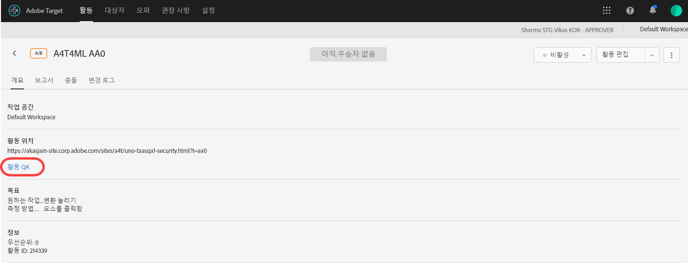
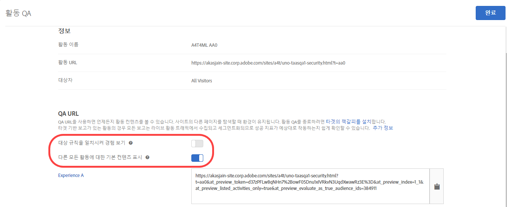

# 활동 QA {#activity-qa}

[!DNL Adobe Target]의 QA URL을 사용하여 변경되지 않는 미리 보기 링크, 선택적 고객 타깃팅 및 라이브 활동 데이터에서 세그먼트화된 QA 보고 등과 함께 종단 간 활동 QA를 손쉽게 수행할 수 있습니다.

## 개요 {#section_11B761A522A14E61978275772210A4C2}

활동 QA를 사용하면 활동을 라이브로 실행하기 전에 Target 활동을 완전히 테스트할 수 있습니다. 활동 QA 기능에는 다음과 같은 것들이 포함되어 있습니다.

* 경험 또는 활동에 수행된 업데이트에 상관없이 변경되지 않고 재생성이 필요 없는, 팀 구성원과 공유하는 링크가 있습니다. 이렇게 하면 전체 사용자 경험에서 활동을 완전히 테스트할 수 있습니다.
* 선택적으로 준수하는 대상 조건. 대상 조건을 충족하지 않고도 마케터가 타깃팅 기준을 테스트하거나 타깃팅 기준을 무시하여 경험의 모양을 QA할 수 있습니다.
* 지표가 예상대로 증가하고 있는지, 그리고 QA 보고서 데이터가 프로덕션 보고(비A4T 보고의 경우)와 별도로 유지되는지를 마케터가 확인할 수 있도록 QA 보고가 생성됩니다.
* 격리 또는 전달 기준을 충족하는 다른 라이브 활동과 함께 경험을 미리 보는 기능(페이지/Target 요청/대상).
* 전체 사용자 경험을 QA할 수 있습니다. QA 링크로 사이트에 한 번 액세스한 다음, 활동 QA 동안 전체 사이트를 탐색할 수 있습니다. 세션을 종료하거나 [QA Target 북마클릿](/help/c-activities/c-activity-qa/activity-qa-bookmark.md#concept_A8A3551A4B5342079AFEED5ECF93E879)을 사용하여 활동 QA를 강제로 해제하기 전까지는 활동 QA에 남아 있습니다. 이 기능은 특히 여러 웹 페이지에 걸친 활동이 있는 경우에 유용합니다.

   >[!NOTE]
   >
   >버전 2를 사용하는 at.js 구현의 경우 마찬가지입니다.*xor* 이상. at.js 1.*xand mbox.js 구현* 에서 이것은 방문자의 브라우저가 타사 쿠키를 차단하지 않는 경우에만 적용됩니다.

## QA URL 액세스 및 공유 {#section_1C59BAA247B247BDB125D1BE8EAD4547}

1. 활동의 [!UICONTROL 개요] 페이지(자동화된 개인화를 제외한 모든 유형)에서 **[!UICONTROL 활동 QA]** 링크를 클릭합니다.

   

1. 다음 설정을 구성합니다.

   

   * **대상 규칙을 일치시켜 경험 보기:**&#x200B;때로 대상 일치가 작동하는지 확인할 수 있습니다. 평소에는 활동의 모양과 느낌을 확인할 수 있습니다. 이 설정을 &quot;켬&quot; 위치로 전환할 경우, 테스터는 타깃팅 요구 사항을 충족해야 경험을 볼 수 있는 자격이 생깁니다. 경험 타깃팅(XT) 활동의 경우 하나의 활동 URL이 제공됩니다. 사용자에게 표시되는 경험은 타깃팅 규칙 중 하나에 대한 사용자 자격에 의해 결정됩니다.

      이 설정을 &quot;끔&quot; 위치로 전환할 경우, 링크를 클릭하면 자격 여부에 관계없이 경험이 표시됩니다. QA를 수행할 때, 대상 타깃팅을 따라야 되는지, 따르지 않아도 되는지 사이에 전환할 수 있습니다.

   * **다른 모든 활동에 대한 기본 컨텐츠 표시:** 이 옵션이 &quot;설정&quot; 위치로 전환되면 다른 모든 활동에 대한 기본 컨텐츠가 표시됩니다(예: 동일한 페이지/[!DNL Target] 요청에서 다른 모든 라이브 활동을 고려하지 않고 미리 보기가 격리되어 표시됩니다).

      이 설정을 &quot;끔&quot;으로 전환하는 경우, 다음을 고려하십시오.

      * 테스트하는 활동과 다른 라이브 활동 사이에 충돌이 있는 경우, [일반 우선순위 규칙](/help/c-activities/priority.md#concept_1780C11FEA57440499F0047DD6900E0F)이 적용됩니다. 이로 인해 QA하려는 활동이 표시되지 않을 수 있습니다.
      * 표시된 활동에 대한 지표 증가가 QA 보고 환경에서만 발생합니다.

1. **[!UICONTROL 완료]**&#x200B;를 클릭하여 변경 내용을 저장합니다.
1. 활동 링크 URL을 테스트할 조직의 구성원과 공유합니다.

   활동 링크는 만료되지 않으므로, 누군가가 활동이나 경험을 변경하는 경우 링크를 다시 보낼 필요가 없습니다. 그러나, 활동을 단순히 편집하지 않고 대상 라이브러리의 다른 대상을 적용하는 경우에는 새 링크가 생성되므로 다시 공유해야 합니다.

   각 활동 링크 URL(경험 A, 경험 B 등을 위한 URL)을 사용하면 해당 경험에서 사용자 경험을 시작할 수 있습니다. 경험에 대해 생성된 URL을 클릭한 다음, 일반적인 사이트 탐색을 진행하여 여러 페이지(여러 페이지가 있는 경우)의 경험들을 볼 수 있습니다. 경험이 여러 페이지(템플릿 테스트 또는 다중 페이지 테스트)에 걸쳐 있는 경우에도 경험당 하나의 URL만 생성됩니다. 

   활동 QA가 결합되어 있으므로 사이트를 탐색하여 다른 페이지를 볼 수 있습니다. 버전 2를 사용하는 at.js 구현의 경우 이것은 true입니다.*xor* 이상. at.js 1.*xand mbox.js 구현* 에서 이것은 방문자의 브라우저가 타사 쿠키를 차단하지 않는 경우에만 적용됩니다.

1. 활동 링크 URL에서 생성된 보고서를 보려면 활동의 **[!UICONTROL 보고서]** 페이지를 클릭하고 **[!UICONTROL 설정]** 아이콘()을 클릭한 다음, **[!UICONTROL 환경]** 드롭다운 목록에서 **[!UICONTROL QA 모드]**&#x200B;를 선택하십시오.

## 고려 사항 {#section_B256EDD7BFEC4A6DA72A8A6ABD196D78}

* [!UICONTROL 활동 QA] 링크는 자동화된 개인화(AP)를 제외한 모든 활동 유형의 [!UICONTROL 개요] 페이지에 표시됩니다. AP 활동을 위한 [미리 보기 링크](/help/c-activities/t-automated-personalization/experience-preview.md#task_586C6655A6FD4AF08F5678FC3F481EFC)를 사용할 수 있습니다.
* 계정에 저장된 활동이 너무 많으면 저장된 활동에 대한 활동 QA 미리 보기 링크가 로드되지 않을 수 있습니다. 미리 보기 링크를 다시 시도하면 작동합니다. 이 문제가 계속 발생하지 않도록 하려면 더 이상 적극적으로 사용되지 않는 저장된 활동을 보관하십시오.
* 활동 QA URL은 Analytics를 보고 소스로 사용(A4T)하는 활동에서 사용할 수 있습니다. 활동 QA를 사용하여 QA를 수행하는 동안 생성된 히트는 활동이 라이브 상태가 된 후에도 활동의 데이터가 흐르는 보고서 세트에 제공됩니다.
* 활동 QA에서는 종료 일자가 지난 보관된 활동용 콘텐츠를 표시하지 않습니다. 종료된 활동을 비활성화하는 경우 활동 QA 사용을 위해 활동을 다시 저장해야 합니다.
* Target Standard/Premium에 가져온 활동(예를 들어, Target Classic에서 가져옴)은 QA URL을 지원하지 않습니다.
* 자동 할당, 자동 타겟 및 권장 사항 활동에서 모델은 작업 QA에서 수집한 방문 횟수의 영향을 받지 않습니다.
* 활동 QA는 고정되어 있으므로 활동 QA에서 웹 사이트를 탐색한 후 일반 방문자처럼 사이트를 볼 수 있으려면 먼저 Target 세션이 만료되거나 Target에서 사용자를 활동 QA로부터 해제해야 합니다. 활동 QA를 해제하려면 [Target QA 북마클릿](/help/c-activities/c-activity-qa/activity-qa-bookmark.md#concept_A8A3551A4B5342079AFEED5ECF93E879)을 사용하십시오.

   값이 비어 있는 `at_preview_token` 매개 변수로 사이트의 페이지를 로드하여(예: `https://www.mysite.com/?at_preview_token=`) 수동으로 나올 수도 있습니다.

* 활동을 작성할 때 &quot;URL은&quot;을 지정한 경우([양식 기반 작성기의 개선](/help/c-experiences/form-experience-composer.md#task_FAC842A6535045B68B4C1AD3E657E56E) 또는 [시각적 경험 작성기의 페이지 전달 선택 사항](/help/c-experiences/c-visual-experience-composer/viztarget-options.md#reference_3BD1BEEAFA584A749ED2D08F14732E81)) 활동 QA가 URL 매개 변수를 추가하므로 QA URL이 작동하지 않습니다. 이 문제를 해결하려면 QA URL을 클릭하여 사이트로 이동하고 추가된 매개 변수를 URL에서 제거한 다음, 새 URL을 로드하십시오.
* at.js 1이 있는 경우&#x200B;*x* 또는 mbox.js, Safari 또는 타사 쿠키를 차단하는 다른 브라우저를 사용하면 활동 QA 모드가 고정되지 않습니다. 이러한 경우 탐색하는 각 URL에 미리 보기 매개 변수를 추가해야 합니다. [CNAME](/help/c-implementing-target/c-considerations-before-you-implement-target/implement-cname-support-in-target.md)을(를) 구현한 경우에도 마찬가지입니다.
* 활동에서 여러 경험 대상을 사용하는 경우(예를 들어, 동일한 활동에 포함된 미국 및 영국 사이트), QA 링크가 4개의 조합(경험 A/미국 사이트, 경험 A/영국 사이트, 경험 B/미국 사이트, 경험 B/영국 사이트)에 대해 생성되지 않습니다. 두 개의 QA 링크(경험 A와 경험 B)만 생성되고, 사용자는 페이지를 보려면 적절한 대상에 대한 자격이 있어야 합니다. 영국 QA 담당자는 미국 사이트를 볼 수 없습니다.
* 모든 `at_preview` 매개 변수와 값이 이미 URL로 인코딩되어 있습니다. 대부분의 경우 모두 예상대로 작동합니다. 하지만, 일부 고객의 로드 밸런서나 웹 서버에서는 쿼리 문자열 매개 변수를 다시 인코딩하려고 시도할 수 있습니다.

   이러한 이중 인코딩 때문에 `at_preview_token`을 디코딩하려 할 때 올바른 토큰 값이 추출되지 않고 새 미리 보기가 작동하지 않습니다.

   모든 미리 보기 매개 변수가 어떤 방식으로든 변형되지 않도록 IT 팀에 허용 목록에추가된 문의하는 것이 좋습니다.

   다음 표에는 도메인에 사용할 수 허용 목록에추가된 있는 매개 변수가 나와 있습니다.

   | 매개 변수 | 유형 | 값 | 설명 |
   |--- |--- |--- |--- |
   | `at_preview_token` | 암호화된 문자열 | 필수, 기본값 없음 | QA 모드에서 실행할 수 있는 캠페인 ID 목록이 들어 있는 암호화된 엔티티입니다. |
   | `at_preview_index` | 문자열 | Empty | 매개 변수의 형식은 `<campaignIndex>` 또는 `<campaignIndex>_< experienceIndex>` 입니다.두 색인이 모두 1로 시작합니다. |
   | `at_preview_listed_activities_only` | 부울(true/false) | 기본값: false | &quot;true&quot;면 `at_preview_index` 매개 변수에 지정된 모든 캠페인이 처리됩니다. &quot;false&quot;이면 페이지의 모든 캠페인이 미리 보기 토큰에 지정되지 않았더라도 처리됩니다. |
   | `at_preview_evaluate_as_true_audience_ids` | 문자열 | 비어 있음 | 항상(타깃팅 및 보고 수준) [!DNL Target] 요청 범위에서 &quot;true&quot;로 평가되어야 하는 segmentId-s 목록(&quot;_&quot;). |
   | `_AT_Debug` | 문자열 | 창 또는 콘솔 | 콘솔 로깅 또는 새 창입니다. |
   | `adobe_mc_ref` |  |  | 기본 페이지의 참조 URL을 새 페이지에 전달합니다. `AppMeasurement.js` 버전 2.1 이상에서 사용하는 경우 [!DNL Adobe Analytics]는 이 매개 변수값을 새 페이지의 참조 URL로 사용합니다. |
   | `adobe_mc_sdid` |  |  | Analytics for Target(A4T)이 기본 페이지의 Target 요청을 새 페이지의 Analytics 요청과 함께 &quot;결합&quot;하도록 기본 페이지의 SDID([!DNL Supplemental Data Id])와 [!DNL Experience Cloud Org Id]를 새 페이지에 전달합니다. |

* Target QA 모드 UI는 여러 페이지 활동에 경험의 첫 번째 URL만 표시합니다. 경험 테스트를 만들고 URL1에서 URL2로 이동한다고 가정합니다. 그러나 URL2로 이동하려는 경우 URL1에 대해 제공된 모든 URL 매개 변수를 복사하여 URL1에 표시된 대로 &quot;?&quot;를 지정한 후 URL2에 적용합니다.
