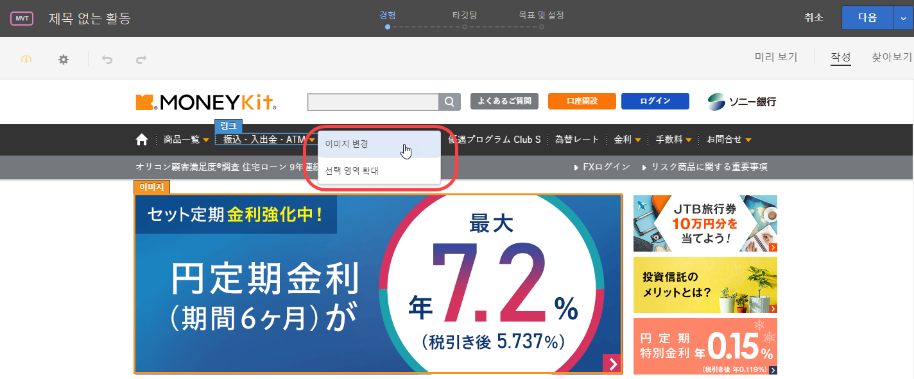
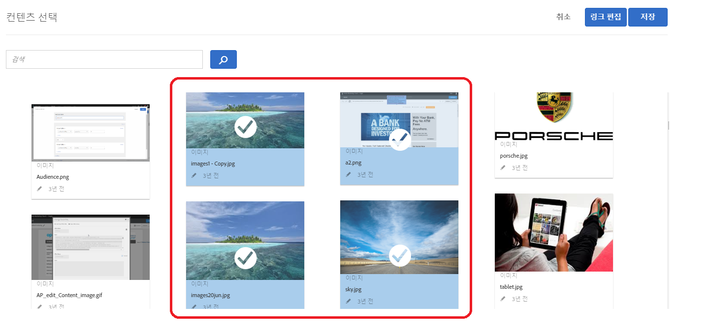
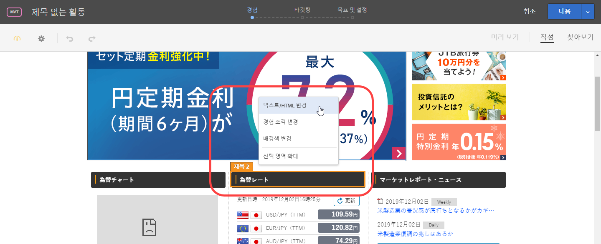
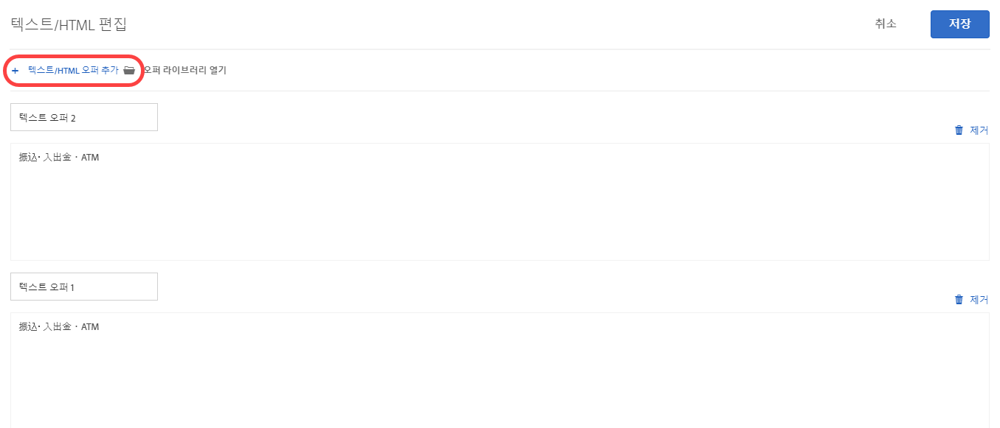

# 조합 만들기{#create-combinations}

시각적 경험 작성기를 사용하여 테스트에 포함할 오퍼를 만듭니다.

>[!NOTE]
>
>원래 선택한 요소 외에 상위 요소를 선택할 페이지에서 개체를 선택할 때 **[!UICONTROL 선택 요소 확장]**을 클릭할 수 있습니다. 상위 요소를 선택하면 이 요소의 모든 하위 요소가 자동으로 선택됩니다. 선택 요소를 여러 번 확장할 수 있습니다.

시각적 경험 작성기를 사용하면 오퍼, 오퍼 이름, 위치 이름을 편집할 수 있습니다. 변경을 수행한 위치를 보여주는 오버레이가 표시됩니다.

## 이미지 오퍼 {#section_A48333211DB149ED926AE467D0032914}

하나의 위치에서 여러 개의 이미지 오퍼를 테스트하여 가장 성공적인 이미지를 파악합니다.

1. 페이지에서 이미지를 클릭한 다음 **[!UICONTROL 이미지 변경을 선택합니다]**.

   

1. 테스트에 포함할 모든 이미지를 선택하고 **[!UICONTROL 추가]**를 클릭합니다.

   

각 이미지가 해당 위치에서 별도의 경험이 됩니다.

## HTML 오퍼 {#section_DF016101AFA9412C9B99862C23DE77B1}

하나의 위치에서 여러 개의 텍스트/HTML 오퍼를 테스트하여 가장 성공적인 오퍼를 파악합니다.

1. 페이지에서 텍스트/HTML 오퍼를 클릭한 다음 **[!UICONTROL 텍스트/HTML 변경]**을 클릭합니다.

   

1. **[!UICONTROL 텍스트/HTML 오퍼 추가]**를 클릭하고 오퍼의 이름을 지정한 다음 텍스트/HTML 오퍼의 코드를 입력하거나 붙여넣습니다.

   

   >[!NOTE]
   >
   >Internet Explorer 10에서는 HTML5 입력 자리 표시자를 지원하지 않습니다. 따라서 IE10을 사용하는 경우 컨텐츠를 입력하는 [텍스트] 필드에 &quot;컨텐츠 추가&quot; 자리 표시자 텍스트가 남아 있습니다.

   포함하려는 모든 추가적인 텍스트/HTML 오퍼에 이 작업을 반복합니다.

1. **[!UICONTROL 저장을 클릭합니다]**.

각 텍스트/HTML 오퍼가 해당 위치에서 별도의 경험이 됩니다.

## 우수 사례 {#section_2E98C23D2F1A460FA732A31799CE6291}

* 테스트에 필요한 수보다 많은 위치를 포함하지 마십시오. 테스트에 포함하는 각 경험으로 인해 허용되는 결과를 얻는 데 필요한 트래픽 및 시간이 대폭 늘어납니다. 예를 들어, 페이지 요소에 오퍼가 3개씩 포함되어 있으면 총 9개의 조합을 만들 수 있습니다(3x3). 3개 요소 중 2개 요소에는 3개의 오퍼가 포함될 수 있으며 1개 요소에는 2개의 오퍼가 포함될 수 있으므로 총 18개의 옵션이 제공됩니다(3x3x2). 이 수치는 요소 및 오퍼가 추가될 때마다 현저히 증가합니다.
* 이제 다변량 테스트를 작성할 때, 경고 수신을 확인한 후 분석에 오프라인 보고를 사용해야 한다면, 10% 이상의 경험을 테스트에서 제외할 수 있습니다.
* 미리 보기 기능을 활용하여 불필요한 컨텐츠 조합을 방지할 수 있습니다. 예를 들어, 동일한 항목 또는 서비스에서 다른 할인을 제공하는 2개의 이미지가 있는 경우 두 이미지가 동일한 페이지에 표시되면 부적절하므로 혼란을 일으킬 수 있습니다.
* 트래픽 견적 도구를 사용하여 페이지에 수신되는 트래픽 양에 맞게 테스트를 디자인할 수 있습니다. 트래픽 견적을 사용할 때 테스트 구성에 녹색 표시등이 나타나야 원하는 결과를 얻을 수 있습니다.
* 테스트할 요소가 3개 이상 있어야 합니다. 요소 수가 더 적은 경우 일련의 A/B 테스트.
* 각 요소의 대체 요소가 서로 완전히 다른 것이 좋습니다.
* 필수 사항은 아니지만, 각 요소에 동일한 개수의 대체 항목을 사용하는 것이 좋습니다.

