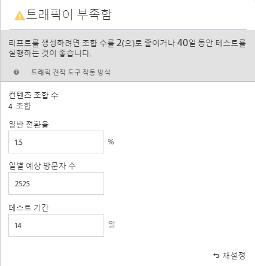
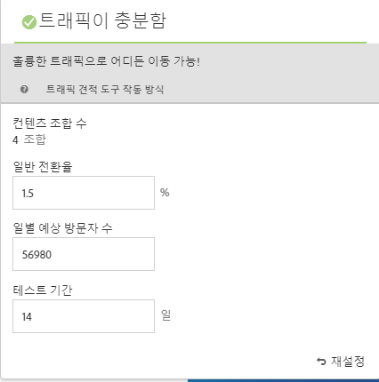

# 다변량 테스트 만들기{#create-a-multivariate-test}

[!DNL Adobe Target]의 [!UICONTROL VEC(시각적 경험 작성기)]를 사용하면 Target을 사용할 수 있는 페이지에 대한 테스트 권한을 쉽게 만들고 [!DNL Target] 내에서 해당 페이지의 부분을 쉽게 수정할 수 있습니다.

[!DNL Target] 포인트-클릭 편집기를 사용하면 원하는 위치를 선택하고 여러 오퍼를 추가할 수 있습니다.

다음 [!UICONTROL MVT(다변량 테스트)]는 페이지 우선 보고서를 사용합니다. 즉, 테스트가 해당 페이지에 대해 디자인한 경험을 사용하여 특정 URL에서 실행됩니다.

1. **[!UICONTROL 활동 만들기]** > **[!UICONTROL 다변수 테스트]**&#x200B;를 클릭합니다.

   

   >[!NOTE]
   >
   >사용 가능한 활동 유형은 Target 계정에 따라 다릅니다. 일부 활동 유형은 목록에 표시되지 않을 수 있습니다. 예를 들어 [!UICONTROL 자동화된 개인화]는 [Target Premium](/help/c-intro/intro.md#premium) 기능입니다.
   >
   >[!DNL Target]에서 사용 가능한 다양한 활동 유형과 그 차이점에 대한 자세한 내용은 [활동](/help/c-activities/activities.md#concept_D317A95A1AB54674BA7AB65C7985BA03)을 참조하십시오. 필요한 활동 유형 세트를 결정하는 데 도움이 되는 [타겟 활동 유형](/help/c-activities/target-activities-guide.md)을 참조하십시오.

1. 필요한 경우 **[!UICONTROL 시각적(기본값)]**&#x200B;을 선택합니다.

   

   >[!NOTE]
   >
   >문제가 있는 경우 VEC에 대한 문제 해결 정보가 필요하면 [시각적 경험 작성기 문제 해결](/help/c-experiences/c-visual-experience-composer/r-troubleshoot-composer/troubleshoot-composer.md)을 참조하십시오.
   >
   >이전 그림에서 [!UICONTROL 작업 공간 선택] 선택 사항은 [Target Premium](/help/c-intro/intro.md) 기능입니다. 이 선택 사항이 표시되지 않는 경우 조직에 Target Standard 라이센스가 있는 것입니다.

1. (조건부) Target Premium 고객인 경우 [작업 공간을 선택](/help/administrating-target/c-user-management/property-channel/property-channel.md)합니다.

1. 테스트할 페이지의 [URL을 지정](/help/c-activities/c-multivariate-testing/t-create-multivariate-test/url.md#concept_C12E4A85FF3B4E518E3110F6CF1AF9C0)하고 **[!UICONTROL 다음]**&#x200B;을 클릭합니다.

   >[!NOTE]
   >
   >시작 부분에 HTTP 또는 HTTPS를 포함하는 전체 URL을 사용합니다.

   브라우저에서 혼합 콘텐츠를 사용하도록 허용할지 묻는 메시지가 표시되면 메시지의 지침을 따르십시오. 브라우저를 혼합 콘텐츠에 대해 활성화한 후 1단계부터 다시 시작하십시오.

   시각적 경험 작성기가 열립니다.

1. 활동의 이름을 입력합니다.

   

   활동 이름은 다음 문자로 시작할 수 없습니다.

   | 문자 | 설명 |
   |--- |--- |
   | `=` | 다음과 같음 |
   | `+` | 플러스 |
   | `-` | 빼기 |
   | `@` | 로그인 |

1. [각 위치에 오퍼를 만듭니다](/help/c-activities/c-multivariate-testing/t-create-multivariate-test/add-offers.md#concept_DCE6B45C30F7419B8EC17AFDEE8D8AA6).

   

   다음과 같은 종류의 오퍼를 추가할 수 있습니다.

   * HTML
   * 이미지
   * 텍스트

1. 다음 **[!UICONTROL 미리 보기]**&#x200B;를 클릭하여 [환경을 미리 봅니다](/help/c-activities/c-multivariate-testing/t-create-multivariate-test/preview-experiences.md).

   

   각 경험을 보고, 테스트에 포함하지 않으려는 경험을 제외할 수 있습니다. 경험을 한 개 이상의 제외하려면 원하는 확인란을 선택한 다음 **[!UICONTROL 제외]**&#x200B;를 클릭합니다.

   

1. [트래픽 견적 도구를 사용하여](/help/c-activities/c-multivariate-testing/t-create-multivariate-test/traffic-estimator.md#task_71AA6922AFD447EA8C5E610A78ABA714) 테스트 계획의 가능성을 테스트합니다.

   

   다음 그림은 활동에 트래픽이 충분하지 않음을 나타냅니다.

   

   다음 그림은 활동에 트래픽이 충분하지 않음을 나타냅니다.

   

1. 이 **[!UICONTROL 다음]**&#x200B;을 클릭하여 [!UICONTROL 타깃팅] 페이지로 이동합니다.

1. 활동을 시작할 자격 있는 방문자의 대상 및 비율을 선택합니다.

   

   예를 들어 항목 수를 모든 방문자의 50% 또는 &quot;캘리포니아&quot; 대상의 45%로 제한할 수 있습니다.

   >[!NOTE]
   >
   >기존 대상을 선택할 수 있을 뿐만 아니라, 새 대상을 만들지 않고 여러 대상을 결합하여 임시로 결합한 대상을 만들 수도 있습니다. 자세한 내용은 [여러 대상 결합](/help/c-target/combining-multiple-audiences.md#concept_A7386F1EA4394BD2AB72399C225981E5)을 참조하십시오.

1. [테스트 요약을 검토하고](/help/c-activities/c-multivariate-testing/t-create-multivariate-test/test-summary.md#reference_971AB225963A4DC18EEB5B0E20F0A4A7) 원하는 대로 변경한 후, **[!UICONTROL 다음]**&#x200B;을 클릭합니다.

1. [테스트에 대한 목표 및 설정을 지정](/help/c-activities/c-multivariate-testing/t-create-multivariate-test/goals-and-settings.md#reference_B25389FD6F3A4989801E740364B089CC)합니다.

1. **[!UICONTROL 저장 후 닫기]**&#x200B;를 클릭하여 활동을 만듭니다.

## 교육 비디오:다변량 테스트 만들기(9:25) 

다음 비디오에서는 Target 3단계 안내가 있는 워크플로우를 사용하여 다변량 테스트를 계획하고 작성하는 방법을 보여줍니다.

* 다변량 테스트 정의 및 디자인
* 다변량 테스트 만들기

>[!VIDEO](https://video.tv.adobe.com/v/17395)
