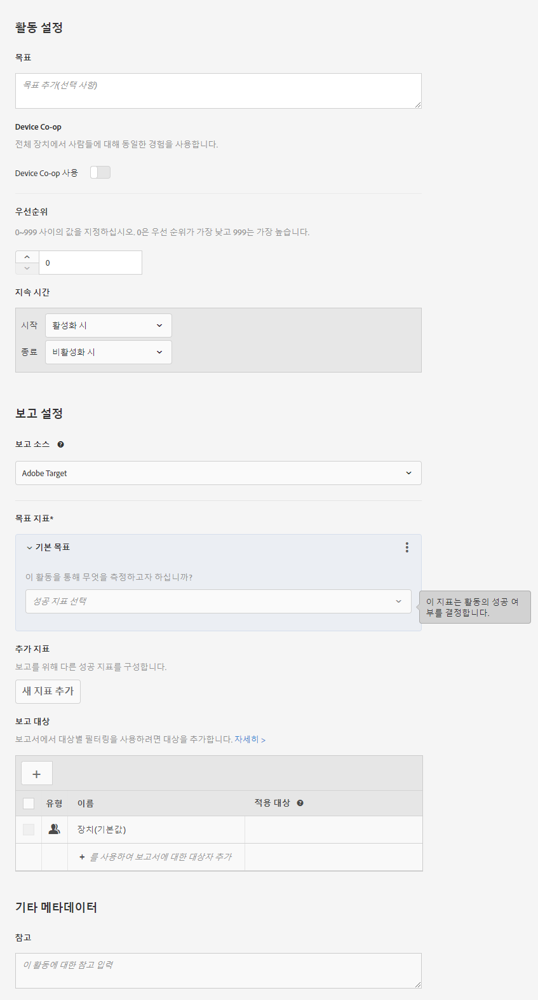

# 목표 및 설정{#goals-and-settings}

목표 및 설정 페이지에서 테스트 목표에 대한 정보를 입력할 수 있습니다.

* 활동 설정
* 보고 설정
* 기타 메타데이터

사용 가능한 설정은 Target 또는 Analytics를 데이터 소스로 사용하는지에 따라 다릅니다.

## 활동 설정 {#section_DCBDC354261F420EBD4B43EA34947BAC}

다음 설정을 사용할 수 있습니다.

### 목표

추가 목표를 입력합니다. 목표는 본인 및 팀 구성원이 캠페인을 식별하는 데 도움이 되는 정보가 될 수 있습니다.

### 우선순위

설정에 따라 우선순위의 UI 및 옵션이 달라집니다. 낮음, 중간 또는 높음의 레거시 설정을 사용하거나 0에서 999까지 세분화된 우선순위를 사용할 수 있습니다.

대상이 같은 동일한 위치에 여러 개의 활동이 지정되는 경우 우선순위가 사용됩니다. 위치에 둘 이상의 활동이 지정되는 경우 우선순위가 가장 높은 활동이 표시됩니다.

If this option is not enabled in S[!UICONTROL Administration] > [!UICONTROL Reporting] (the default), specify a priority: Low, Medium, or High.

To enable fine-grained priorities, click [!UICONTROL Administration] > [!UICONTROL Reporting], then toggle the Enable Fine-Grained Priorities option to the &quot;On&quot; position.

이 옵션이 활성화되면 0에서 999 사이의 값을 지정하십시오.

* 0 = 낮음
* 999 = 높음

이전 버전의 Target Standard/Premium에서 만든 활동의 경우, 낮음 우선순위는 0으로, 중간은 5로, 높음은 10으로 전환됩니다. 필요에 따라 이러한 값을 조정할 수 있습니다.

>[!NOTE]
>
>세분화된 우선순위를 사용한 후에 이 선택 사항을 비활성화하려면 먼저 모든 우선순위를 0, 5, 10으로 다시 설정해야 합니다.

### 지속 시간

활동은 승인될 때 시작되거나 특정 날짜 및 시간을 설정하여 시작할 수 있습니다. 이와 마찬가지로, 활동은 비활성화될 때 종료되거나 날짜 및 시간을 설정하여 종료할 수 있습니다. 시간 선택기는 24시간 형식을 사용하며 00:00은 자정을 나타냅니다. 해당 시간대는 브라우저에 구성된 시간대로 설정됩니다. 다른 시간대를 사용하려면 브라우저를 다른 시간대로 설정하고 브라우저를 다시 시작하십시오.

## 보고 설정 {#section_13119392051044FBA6387D9B3B1C43CF}

다음 설정을 사용할 수 있습니다.

### 보고 솔루션

데이터를 Adobe Target 또는 Adobe Analytics에서 수집할지 지정합니다. 보고 솔루션 간의 차이점과 각 솔루션의 이점에 대해 자세히 알아보려면 [Adobe Analytics를 Target의 보고 소스로 사용](/help/c-integrating-target-with-mac/a4t/a4t.md)을 참조하십시오.

Target의 보고 소스로 Analytics를 선택하는 경우 Target 활동 데이터를 수신할 Analytics 보고서 세트를 선택합니다. 이렇게 하려면 먼저 사용자 계정이 연결된 Analytics 회사 중에서 선택한 다음 활동에 대한 보고서 세트를 선택합니다. Adobe Target에 연결하기 위해 제공된 보고서 세트만 선택할 수 있습니다. 예상하는 보고서 세트가 표시되지 않으면 먼저 Adobe Experience Cloud에서 로그아웃했다가 다시 로그인한 후 다시 시도하십시오. 보고서 세트가 목록에 여전히 표시되지 않으면 고객 지원 센터에 문의하십시오.

A4T(Analytics for Target)를 위해서는 결과를 올바르게 보고하기 위한 추적 서버가 필요합니다. 기본 추적 서버가 추적 서버 필드에 표시됩니다. 둘 이상의 추적 서버를 사용하는 경우 이 필드에 올바른 추적 서버가 포함되어 있는지 확인해야 합니다. 각 유형의 대상 규칙을 구성하는 방법에 대한 자세한 내용은 [Analytics 추적 서버 사용](/help/c-integrating-target-with-mac/a4t/analytics-tracking-server.md#task_72077BA7E93C4A65A715A18F32228823)을 참조하십시오.

계정 설정에 보고 솔루션이 지정되어 있으면 지정된 솔루션이 사용되며 이 설정은 표시되지 않습니다.

>[!NOTE]
>
>보고서 일관성을 유지하기 위해 활동이 활성 상태가 되면 보고 소스를 변경할 수 없습니다.

### 목표

목표를 달성하려면 방문자가 수행한 동작을 선택합니다. 예를 들어, 전환 지표를 선택한 다음 목표가 성공적으로 달성되는 시기를 결정하는 매개 변수를 설정합니다.

>[!NOTE]
>
>보고 솔루션을 Analytics로 설정하면 사용 가능한 목표 지표는 전환뿐입니다. Analytics 지표를 목표로 선택할 수 없습니다.

성공 지표를 선택하면 선택기가 표시됩니다. 이 선택기를 사용하여 성공 지표의 자세한 정보를 선택합니다.

전환 예상 값 필드가 활성화되어 있으면(페이지 점수 지표에는 사용할 수 없음) 목표 값이 표시되지만 기타 지표의 값은 표시되지 않습니다. 이 값을 통해 Target이 예상 매출액 상승도를 계산할 수 있습니다. 이 필드는 선택 사항이지만, 이 필드의 값이 없으면 비매출액 지표의 증분 수익을 계산할 수 없습니다. 모든 매출액 지표(방문자당 매출액, 평균 주문 가격, 총 판매 수, 주문 수)의 경우 방문자당 매출액이 예상 매출액으로 사용됩니다. 데이터 유형은 통화입니다.

활동 목표에 도달한 후에는 우선순위가 높은 활동에 방문자가 적격한 경우를 제외하고 방문자에게 활동 콘텐츠가 계속 표시됩니다. 해당 방문자가 목표에 다시 도달하면 다른 전환으로 카운트됩니다. 이 동작은 방문자에게 테스트가 다시 표시되면 방문자를 새로 카운트하는 Target Classic의 기본 동작과는 다릅니다.

### 추가 지표

추가 성공 지표를 만듭니다.

보고 솔루션이 Analytics로 설정되어 있으면 이 설정을 사용할 수 없습니다. 이 경우, Analytics 보고서 세트에 정의된 지표가 적용됩니다.

보고 대상

### 기본적으로 보고서에는 자격을 갖춘 모든 방문자의 결과가 표시됩니다. 보고서 대상을 추가하여 특정 대상에 대한 정보만 표시할 수 있습니다.

## 고급 설정 {#section_E2FE441AFB324E498793ABB025ED9974}

고급 설정은 다변량 테스트 목표 지표에서 사용할 수 있습니다.

>[!NOTE]
>
>Adobe Analytics를 보고 소스로 사용하는 경우 설정은 Analytics 서버에서 관리됩니다. 고급 설정 옵션은 사용할 수 없습니다.

### 이 지표가 증가되기 위해 도달해야 할 성공 지표는 무엇입니까?

사용자가 이전에 다른 성공 지표에 도달한 경우에만 해당 성공 지표에 도달할 때 카운트되도록 하려면 이 옵션을 사용합니다. 예를 들어, 방문자가 전환하기 전에 해당 오퍼를 클릭하거나 특정 페이지에 도달한 경우에만 테스트 전환이 유효할 수 있습니다.

여러 지표에 대한 종속성과 유연성을 제공하여 카운트를 늘리기 위해 지표에 도달해야 할지 또는 도달하지 않아야 할지를 선택할 수 있습니다.

두 성공 지표(또는 여러 개의 성공 지표)를 정의해야 상호 종속성을 만들 수 있습니다.

종속성 추가 옵션을 사용하면 다른 성공 지표에 도달했거나 도달하지 않은 경우 성공 지표를 늘릴 수 있습니다.

종속성을 추가하려면 다음을 수행하십시오.

1. 추가 지표를 추가한 후 **[!UICONTROL 고급 설정을 클릭합니다]**.
2. 종속성 추가 옵션을 클릭합니다:

   

3. 왼쪽 창에서 오른쪽 창으로 원하는 지표를 드래그해 놓은 다음 **[!UICONTROL 도달]**&#x200B;을 클릭하여 도달 및 도달 못 함 간에 설정을 전환합니다 .

   

종속성을 추가한 후 편집하거나 제거할 수 있습니다.

### 사용자가 이 목표 지표에 도달한 후에 어떤 상황이 진행됩니까?

사용자가 목표 지표에 도달한 다음에 진행되는 상황을 지정할 수 있는 세 가지 옵션이 있습니다.

* 카운트가 증가되는 방식을 지정하려면 증분 카운트 및 사용자를 활동에 유지를 선택합니다.
* 사용자가 활동에 다시 입장하면 표시되는 경험을 지정하려면 증분 카운트, 사용자 해제 및 재입력 허용을 선택합니다.
* 활동 콘텐츠 대신 사용자에게 표시되는 콘텐츠를 지정하려면 증분 카운트, 재입력에서 사용자 및 막대 해제를 선택합니다.

고급 설정에 대한 자세한 내용은 [성공 지표](/help/c-activities/r-success-metrics/success-metrics.md#reference_D011575C85DA48E989A244593D9B9924)를 참조하십시오.

## 기타 메타데이터 {#section_2E8917BEFB954480A4206B9E9E917F80}

다음 설정을 사용할 수 있습니다.

### 참고

본인 또는 다른 팀 구성원이 쉽게 사용할 수 있도록 본인의 활동에 대한 정보를 입력합니다. 노트 창의 크기는 조정할 수 있습니다.

## 교육 비디오

다음 비디오에는 이 문서에서 설명한 개념에 대한 자세한 정보가 포함되어 있습니다.

### 활동 설정(3:02) 

이 비디오에는 활동 설정에 대한 정보가 포함되어 있습니다.

* 활동의 목표 입력
* 활동의 우선순위 수준 설정
* 활동 시작 및 종료 시간 예약
* 보고서 필터를 작성하기 위해 보고 대상 추가
* 활동에 대한 메모 입력

>[!VIDEO](https://video.tv.adobe.com/v/17381)

### 다변수 테스트 만들기(9:25) 

다음 비디오에서는 Target 3단계 안내가 있는 워크플로우를 사용하여 다변량 테스트를 작성하는 방법을 보여줍니다. 목표 및 설정은 7시 00분부터 논의됩니다.

* 다변량 테스트 정의 및 디자인
* 다변량 테스트 만들기

>[!VIDEO](https://video.tv.adobe.com/v/17395)