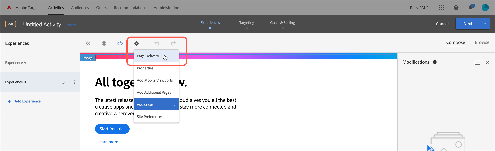

# 콘텐츠 전달 문제 해결

페이지에 예상되는 콘텐츠가 표시되지 않으면 몇 가지 단계를 진행하여 콘텐츠 제공을 디버깅할 수 있습니다.

* 활동 또는 캠페인 코드를 주의깊게 확인합니다. 입력 또는 기타 오류로 인해 예상 콘텐츠가 표시되지 않을 수 있습니다.
* mboxTrace 또는 mboxDebug를 사용하여 [!DNL Target] 요청 문제를 해결합니다.
* [!DNL Target] 요청의 문제를 해결하려면 mboxDebug와 거의 동일한 정보를 제공하고 사용하기 쉬운 도구인 Adobe Experience Cloud Debugger를 사용하십시오.

mboxDebug는 Target 요청이 실행되고 있고 쿠키가 설정되고 있는지 확인하도록 페이지에서 [!DNL Target]을 설정하는 경우에 특히 유용합니다. 그러나 콘텐츠 전달을 디버깅할 때 유용한 세부 정보로 이동하지는 않습니다. 사용자 활동이 페이지에 나타나지 않거나 원치 않는 콘텐츠가 나타나면 mboxTrace를 사용하여 페이지를 자세히 검사하고 디버깅하십시오.

## 디버깅 도구에 사용할 인증 토큰 검색 {#section_BED130298E794D1FA229DB7C3358BA54}

mboxTrace 및 mboxDebug는 캠페인 데이터 및 프로필 데이터를 외부 당사자에게 노출할 수 있으므로 인증 토큰이 필요합니다. 인증 토큰은 [!DNL Target] UI에서 검색할 수 있습니다. 토큰은 6시간 동안 유효합니다.

인증 토큰을 생성하려면 다음 사용자 권한 중 하나가 있어야 합니다.

* 최소 [!UICONTROL 편집자] 권한(또는 [!UICONTROL 승인자])

   . [!DNL Target Standard] 고객에 대한 자세한 내용은 사용자에서 [역할 및 권한 지정](/help/administrating-target/c-user-management/c-user-management/user-management.md#roles-permissions)을 *참조하십시오*. [!DNL Target Premium] 고객에 대한 자세한 내용은 [기업 권한 구성](/help/administrating-target/c-user-management/property-channel/properties-overview.md)을 참조하십시오.

* 작업 영역/제품 프로필 수준에서 관리자 역할

   작업 영역은 [!DNL Target Premium] 고객만 사용할 수 있습니다. 자세한 내용은 [기업 권한 구성](/help/administrating-target/c-user-management/property-channel/properties-overview.md)을 참조하십시오.

* [!DNL Adobe Target] 제품 수준의 관리자 권한(Sysadmin 권한)

인증 토큰을 검색하려면 다음을 수행하십시오.

1. **[!UICONTROL 관리]** > **[!UICONTROL 구현]**&#x200B;을 클릭합니다.
1. 디버거 도구 섹션에서 **[!UICONTROL 새 인증 토큰 생성]**&#x200B;을 클릭합니다.

   

1. 생성된 토큰을 URL에 매개 변수로 추가하여 고급 디버깅 도구 중 하나를 활성화합니다.

   

## mboxTrace {#section_256FCF7C14BB435BA2C68049EF0BA99E}

mboxTrace를 사용하여 [!DNL Target] 응답에 첨부된 추적 정보를 수신할 수 있습니다. 추적 정보는 [!DNL Target] 호출의 결과(예: 대화 또는 노출) 및 이 특정 결과가 발생한 이유를 확인하는 데 도움이 되는 추가 데이터(예: 캠페인에서 해당 선택 영역이 포함되는 사용 가능한 분기 세트)를 반영합니다. 이 정보를 사용하여 콘텐츠 전달을 디버깅하십시오.

다음 매개 변수를 사용할 수 있습니다.

| mboxTrace 옵션 | 결과 |
|--- |--- |
| `?mboxTrace=console` | 콘솔 로그에 개체로 출력합니다. at.js의 경우 mbox.js의 경우처럼 새 브라우저 창을 팝업하거나 콘솔에 출력하지 않고, 네트워크 요청을 조사한 후 Preview(Chrome) 또는 Response(Firefox)에서 확인해야 합니다. |
| `?mboxTrace=json` | 콘솔 로그에 리터럴 JSON 문자열로 출력합니다. |
| `?mboxTrace=window` | 팝업 창에 JSON 문자열로 출력합니다. |
| `?mboxTrace=disable` | 추적 세션 모드를 해제합니다. |

**mboxTrace 호출 예**

`https://www.mysite.com/page.html?mboxTrace=window&authorization=f543abf-0111-4061-9619-d41d665c59a6`

출력에는 콘텐츠에 대한 자세한 정보가 표시됩니다. mboxTrace는 캠페인이나 활동 및 프로필에 대한 세부 정보를 표시합니다. 또한 실행 전에 프로필 스냅숏과 실행 후 변경된 사항에 대한 스냅숏도 제공합니다. 그뿐 아니라 각 위치에 대해 평가된 캠페인 또는 활동도 표시합니다.

일부 정보에는 일치하거나 일치하지 않는 세그먼트 및 타겟 ID가 포함됩니다.

* **SegmentId**: 재사용 가능한 세그먼트 라이브러리 또는 특정 캠페인에 대해 생성된 익명 세그먼트의 세그먼트 ID입니다.
* **TargetId**: 타겟 표현식 라이브러리 또는 캠페인의 세그먼트에 대한 익명 타겟의 타겟 ID입니다.
* **Unmatched**: 요청이 이 호출에서 해당 세그먼트 또는 타겟에 자격을 부여하지 않았습니다.
* **Matched**: 요청이 지정된 세그먼트 또는 타겟에 자격을 부여했습니다.

**권장 사항 페이지에서 mboxTrace 사용**: 권장 사항이 있는 페이지에 mboxTrace를 쿼리 매개 변수로 추가하면 페이지의 권장 사항 디자인이 mboxTrace 세부 정보 창으로 바뀝니다. 이 창에는 다음을 비롯하여 권장 사항에 대한 자세한 정보가 표시됩니다.

* 반환된 권장 사항 및 요청된 권장 사항
* 사용된 키 및 권장 사항을 생성하는지 여부
* 조건에 따라 생성된 권장 사항 및 백업 권장 사항
* 조건 구성
* 적용되는 제외 및 포함
* 컬렉션 규칙

쿼리 매개 변수에 `=console`, `=json` 또는 `=window` 는 포함할 필요가 없습니다. mboxTrace 세부 정보를 다 지정했으면 `=disable`을 추가하고 **[!UICONTROL Enter]** 키를 눌러 일반 표시 모드로 돌아갑니다.

사이트의 일반적인 기능 및 모양은 mboxTrace의 영향을 받지 않습니다. 방문자는 일반 권장 사항 디자인을 봅니다.

## mboxDebug {#mboxdebug}

mboxDebug를 사용하려면 URL 끝에 mboxDebug 매개 변수를 추가합니다. 다음 표에서는 [!DNL Target] 응답과 관련 있는 URL 매개 변수에 대한 정보를 보여 줍니다.

>[!NOTE]
>
>일부 mboxDebug 매개 변수는 인증이 있거나 없는 상태로 사용할 수 있습니다.

| URL 매개 변수 | 목적 |
|--- |--- |
| `mboxDebug=1` | 디버거 이 매개 변수를 Target 요청이 정의된 URL에 추가하면 중요한 디버깅 세부 정보가 있는 팝업 창이 열립니다. 쿠키 정보, PCid 및 세션 ID 값이 작성되고 모든 URL이 표시됩니다. Target 요청 URL을 클릭하여 해당 [!DNL Target] 요청에 대한 응답을 표시합니다. 자세한 내용은 [mbox_debug.pdf](/help/assets/mbox_debug.pdf)에서 볼 수 있습니다. |
| `mboxDebug=x-cookie` | 쿠키 수정 |
| `mboxDisable=1` | 페이지에서 mbox 비활성화 |
| `mboxDebug=x-profile` | 프로필 세트 보기 |
| `mboxDebug=x-time` | 각 [!DNL Target] 요청에 대한 응답 표시 |
| `mboxOverride.browserIp=<Insert IP address>` | 지리 기반의 타기팅 테스트 이 URL 매개 변수로 지리 기반의 타기팅을 테스트합니다. IP 주소를 이 속성의 값으로 입력하면 Test&amp;Target의 지리 기반의 타기팅은 캠페인에 설정된 지리 기반의 타기팅 또는 세그먼테이션 세트에 대해 해당 IP 주소가 일치하는지 평가합니다. |

>[!NOTE]
>
>URL 조각이 쿼리 문자열 매개 변수 뒤에 있는지 확인합니다. 첫 번째 `#` 이후의 모든 항목은 조각 식별자이며 디버깅 매개 변수가 올바르게 작동하지 않게 합니다.

## Adobe Experience Cloud Debugger {#section_A2798ED3A431409690A4BE08A1BFCF17}

Adobe Experience Cloud Debugger를 사용하면 쉽고 빠르게 대상 구현을 이해할 수 있습니다. 라이브러리 구성을 빠르게 보고, 요청을 검토하여 사용자 지정 매개 변수가 올바르게 전달되고 있는지 확인한 다음, 콘솔 로깅을 켜고, Target 요청을 모두 비활성화할 수 있습니다. Experience Cloud를 인증하면 강력한 MboxTrace 도구를 사용하여 활동 및 대상 자격과 방문자 프로필을 검사할 수 있습니다.

자세한 내용은 아래 교육 비디오를 참조하십시오.

자세한 내용은 [Adobe Experience Cloud Debugger를 사용하여 at.js 디버그](/help/c-implementing-target/c-implementing-target-for-client-side-web/c-target-debugging-atjs/target-debugging-atjs.md)를 참조하십시오.

## 최상위 판매자가 권장 사항에 나타나지 않습니다. {#section_3920C857270A406C80BE6CBAC8221ECD}

*`SiteCatalyst: purchase`* 호출은 구매 알고리즘 트래픽 데이터에 사용할 수 없습니다. 대신 *`orderConfirmPage`* 호출을 사용합니다.

## 활동 우선 순위 확인 {#section_3D0DD07240F0465BAF655D0804100AED}

[!DNL Target Standard/Premium] 으로 만들어진 양식 기반 활동은 [!DNL Target Classic] UI에서 만들어지고 우선 순위가 같고 동일한 [!DNL Target] 요청을 사용하는 활동과 충돌할 수 있습니다.

## 사용자 지정 코드가 Internet Explorer 8에서 예상한 결과를 생성하지 않습니다. {#section_FAC3651F19144D12A37A3E4F14C06945}

Target에서는 더 이상 IE 8을 지원하지 않습니다.

## Target 쿠키가 설정되지 않습니다. {#section_77AFEB541C0B495EB67E29A4475DF960}

사이트에 [!DNL us.domain.com]과 같은 하위 도메인이 있지만 [!DNL domain.com] ([!DNL us.domain.com]이 아님)에 Target 쿠키 세트가 필요한 경우 `cookieDomain` 설정을 무시해야 합니다. 자세한 내용은 [targetGlobalSettings()](/help/c-implementing-target/c-implementing-target-for-client-side-web/targetgobalsettings.md)를 참조하십시오.

## 요소가 Adobe Experience Manager 개인화에도 속하면 Target 콘텐츠가 깜박이거나 표시되지 않습니다. {#section_9E1DABEB75AB431FB9F09887E6DD07D3}

DOM 요소가 Adobe Experience Manager(AEM) 개인화 타기팅 및 Target 활동의 일부인 경우 Target 콘텐츠가 깜박이거나 표시되지 않을 수 있습니다.

이 상황을 해결하려면 Target이 실행 중인 페이지에서 AEM 개인화를 비활성화하면 됩니다.

## 잘못된 URL로 인해 리디렉션 및 원격 오퍼가 전달에 실패했습니다. {#section_7D09043B687F43B39DAEDF17D00375AC}

리디렉션 또는 원격 오퍼가 잘못된 URL을 사용하는 경우 배달되지 않을 수 있습니다.

리디렉션 오퍼의 경우 [!DNL Target] 응답이 `/* invalid redirect offer URL */`을 포함할 수 있습니다.

또는

원격 오퍼의 경우 [!DNL Target] 응답이 `/* invalid remote offer URL */`을 포함할 수 있습니다.

브라우저에서 또는 mboxTrace를 사용하여 [!DNL Target] 응답을 확인할 수 있습니다. 올바른 URL에 대한 자세한 내용은 [https://tools.ietf.org/html/std66](https://tools.ietf.org/html/std66)을 참조하십시오.

## [!DNL Target] 요청이 내 사이트에서 실행되지 않습니다.

잘못된 doctype을 사용하는 경우 at.js에서 Target 요청을 실행하지 않습니다. at. s에는 HTML5 doctype이 필요합니다.

## [!DNL Target] 활동이 쿼리 문자열 매 개변수가 있는 URL을 올바르게 처리하는지 확인합니다. {#query-strings}

[!UICONTROL 활동 URL]은 방문자에게 활동 자격을 부여하고 활동 경험을 사용자에게 렌더링하는 페이지를 결정합니다. 활동을 만드는 동안 메시지가 표시되면 전체 URL을 입력해도 해당 사이트 페이지(특히 쿼리 문자열 매개 변수가 포함된 URL)에 콘텐츠가 항상 전달되는 것은 아닙니다.

기본적으로 [!UICONTROL 시각적 경험 작성기](VEC)는 [시각적 경험 작성기 설정](/help/administrating-target/visual-experience-composer-set-up.md)에 지정된 페이지를 엽니다. 활동을 만드는 동안 다른 페이지를 지정할 수도 있습니다.

VEC가 열린 후에 다른 페이지를 표시하려면 **[!UICONTROL 구성 (톱니바퀴아이콘)]**&#x200B;을 클릭하고 > select **[!UICONTROL 페이지 전달]**&#x200B;을 선택한 다음 > [!UICONTROL 활동 URL] 필드에 원하는 URL을 지정합니다.

하지만 URL에 쿼리 문자열 매개 변수가 포함되어 있으면 어떻게 됩니까? 작동하고 개인화된 콘텐츠를 표시합니까? 이 시나리오에서는 타기팅된 대상에 관계없이 기본 URL 외에 템플릿 규칙을 포함하여 쿼리 매개 변수를 정의할 수 있습니다.

다음 옵션을 사용하여 추가 템플릿 규칙을 포함할 수 있습니다.

### 옵션 1: URL을 복제하고 “포함” 옵션을 사용하여 템플릿 규칙에 URL을 유지합니다.

이 옵션을 사용하면 이 URL이 활동에 적합하지만, 기본 URL이 포함된 URL에 대한 추가 레코드가 있는 보고 데이터에 영향을 줄 수 있는 특별한 경우가 첨부되어 있다는 점에 유의하십시오.

이 시나리오에서 URL은 `https://shopping.mycart.com?type=Summers%20Offers`이고 추가 템플릿 규칙은 OR 연산자로 구분된 동일한 URL을 “포함”합니다.

### 옵션 2: 쿼리 문자열만으로 URL “포함” 조건을 제한합니다.

이 옵션에서는 앞의 옵션에서 설명한 특별한 경우가 적용되지만, 여기에서는 조건부 설정이 쿼리 문자열로만 제한됩니다.

이 시나리오에서 URL은 `https://shopping.mycart.com?type=Summers%20Offers`이고 추가 템플릿 규칙은 OR 연산자로 구분된 쿼리 문자열만 “포함”합니다.

### 옵션 3: 전체 URL을 타기팅하는 대신 URL의 특정 부분을 활용합니다.

이 시나리오에서 URL은 `https://shopping.mycart.com?type=Summers%20Offers`이고 추가 템플릿 규칙은 [!UICONTROL 유형] > [!UICONTROL 은(대소문자 구분)] > type=Summers%20Offers(OR 연산자로 구분)인 [!UICONTROL 쿼리]를 지정합니다.

## 교육 비디오

다음 비디오에는 이 문서에서 설명한 개념에 대한 자세한 정보가 포함되어 있습니다.

### 확장 추가 

>[!VIDEO](https://video.tv.adobe.com/v/23114t2/)

### 기본 Adobe 타겟 디버깅 

>[!VIDEO](https://video.tv.adobe.com/v/23115t2/)

### Mbox 추적 

>[!VIDEO](https://video.tv.adobe.com/v/23113t2/)
