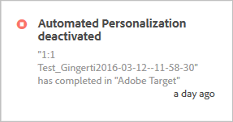

# 활동 알림{#activity-notifications}을 참조하십시오.

Target은 Adobe Pulse를 사용하여 다른 Adobe Experience Cloud 솔루션과 알림을 교환할 수 있습니다. Target은 활동이 활성화 및 비활성화될 때 모든 활동 유형에 대한 두 종류의 알림을 보냅니다.

[!DNL Target]의 알림은 모든 솔루션에서 [!DNL Target Standard/Premium]의 [!DNL Experience Cloud] 제품 컨텍스트가 있는 사용자에게 표시될 수 있습니다.

For information about setting up Notifications, see [Notifications](https://marketing.adobe.com/resources/help/en_US/mcloud/notifications.html) in the [!DNL Adobe Experience Cloud] documentation.

활동 작성 워크플로우 내를 제외하고 [!DNL Target]의 어디에서든 알림에 액세스합니다. 알림 위젯을 표시하거나 숨기려면 페이지 헤더에서 종 아이콘을 클릭하십시오.

[!DNL Target]에서는 모든 활동 유형에 대해 두 종류의 알림을 보냅니다.

* 활동이 라이브 상태가 되고 오퍼 전달이 시작될 때:

   예:

   

* 활동이 비활성화되고 오퍼 전달이 중단될 때:

   예:

   

예약된 활동이 시작 날짜에 도달했을 때와 종료 날짜에 도달하여 끝날 때도 유사한 알림이 표시됩니다.

모든 [!DNL Target] 알림은 승인되었거나 비활성화된 활동의 이름을 표시하며, 쉽게 식별할 수 있도록 &quot;Adobe Target&quot;이라는 단어를 포함합니다.

단일 활동이 동일한 유형의 여러 알림을 보내는 경우에는 단일 카드로 결합되고 이 카드에 알림 개수가 표시됩니다. 예:

개별 알림의 세부 사항을 보려면 알림 카드를 클릭하십시오.

예를 들어, 위에 표시된 카드를 클릭하면 다음과 같이 세 개의 알림이 표시됩니다.

## 제한 {#section_B466EB20B2554CE7B1915374B39F4322}

* 알림은 활동을 승인, 비활성화 또는 가져온 사람은 알려주지 않습니다.
* MVT 알림은 [!DNL Target Classic]에서 A/B 캠페인으로 동기화되므로 &quot;A/B 테스트&quot;로 표시됩니다.

