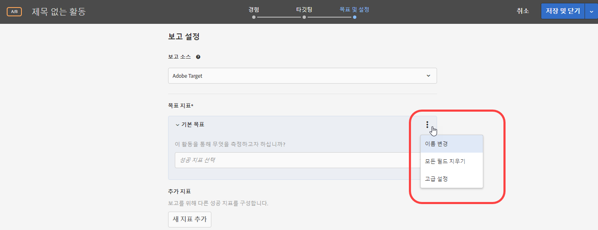
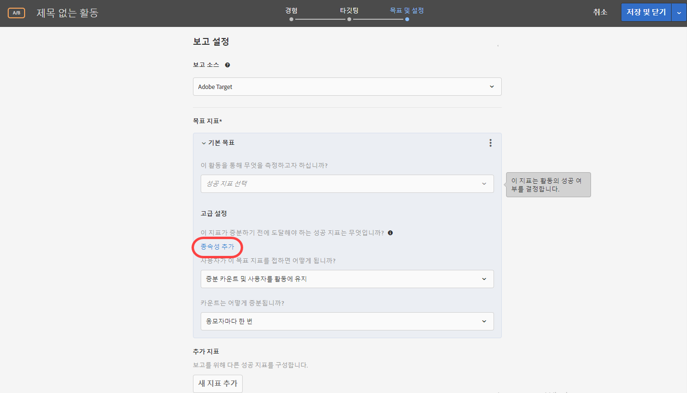

# 성공 지표{#success-metrics}

Target Standard에서 성공 지표는 보고 및 추적용으로 미리 구성되어 있습니다.

테스트 생성을 간소화한다는 [!DNL Target Standard] 목표를 유지하면서, [!DNL Target Classic]에서 수동으로 수행하던 일부 구성이 유지됩니다. 예를 들어, 성공 지표는 최적 옵션으로 미리 구성됩니다.

기본적으로 전환 이벤트는 [!DNL Target Standard]에서 &quot;한 번 카운트 및 활동에 참여자로 유지&quot;로 설정됩니다. 전환은 한 번만 카운트되고 반복 전환은 카운트되지 않으며, 방문자에게는 항상 테스트 컨텐츠가 표시됩니다.

&quot;증분 카운트 및 사용자를 활동에 유지&quot;로 설정된 수입 지표는 동일한 방문자가 수행한 첫 번째 주문에 대해서만 주문 세부 사항을 기록합니다. 모든 후속 주문은 전환 카운트를 증가시키지만 RPV/AOV/매출에는 매출을 추가하지 않으며 [주문 세부 사항] 보고서에 포함되지 않습니다.

다음과 같은 성공 지표를 사용할 수 있습니다.

| 성공 지표 | 측정 방법 | 정의 |
|--- |--- |--- |
| 변환 | 전환 기반 | 전환은 방문자가 사용자가 정의한 작업(단추 클릭, 페이지 보기, 설문 조사 완료 또는 구매)을 사이트에서 수행하는 경우를 나타냅니다. 전환은 방문자당 한 번 또는 방문자가 전환을 완료할 때마다 카운트될 수 있습니다. |
| 수입 | 전환 기반 | 방문에서 생성된 수익입니다. 다음 매출 지표 중에서 선택할 수 있습니다.<ul><li>RPV(방문자당 매출)</li><li>AOV(평균 주문 가격)</li><li>총 판매 수</li></ul> |
| 페이지 보기 횟수 | 참여 기반 | 각 고유한 방문은 전환으로 간주됩니다. |
| 사이트에서 보낸 시간 | 참여 기반 | 방문자가 캠페인의 첫 표시 mbox를 본 시점부터 세션에서 mbox가 있는 최종 페이지가 로드될 때까지 활동에서 보낸 시간(초)입니다. |
| 사용자 지정 점수 지정 | 참여 기반 | 방문자가 활동의 첫 번째 디스플레이 mbox를 처음 본 시점부터 시작하여 사이트에서 방문된 페이지에 지정된 값에 따라 집계되는 점수입니다. |

참여 기반 지표는 전환 기반 및 수입 기반 지표와 달리, 방문자가 해당 세션에 대한 수를 늘리기 위해 각 방문 활동의 대상 사용자여야 합니다. 연관된 지표는 적격 재확인 이후 증가하기 시작하고, 각 방문자의 세션 종료 시 중지됩니다. 세션은 활동이 없는 경우 30분 후에 종료됩니다. 따라서 테스트 중에는 결과가 바로 표시되지 않지만 해당 세션의 모든 결과는 세션이 종료되기 전 몇 분 이내에 사용 가능합니다.

사용자 지정 성공 지표를 만들 수도 있습니다.

성공 지표를 선택한 후에 방문자가 목표를 달성하기 위해 수행한 작업을 선택합니다. 예를 들어 전환 지표를 선택하거나, 방문자당 한 번만 카운트되도록 설정한 다음, 방문자가 특정 페이지(또는 페이지 집합)를 볼 때 성공인지, 특정 mbox를 볼 때 성공인지, 특정 링크를 클릭할 때 성공인지를 설정합니다.

전환 예상값 필드가 활성화되어 있으면(페이지 점수 지표에는 사용할 수 없음) 목표값이 표시되지만 기타 지표의 값은 표시되지 않습니다. 이 값을 통해 [!DNL Target]이 예상 매출액 상승도를 계산할 수 있습니다. 이 필드는 선택 사항이지만, 이 필드의 값이 없으면 비매출액 지표의 증분 수익을 계산할 수 없습니다. 모든 매출액 지표(방문자당 매출액, 평균 주문 가격, 총 판매 수, 주문 수)의 경우 방문자당 매출액이 예상 매출액으로 사용됩니다. 데이터 유형은 통화입니다. 자세한 내용은 [매출 상승도 평가](../../administrating-target/r-target-account-preferences/estimating-lift-in-revenue.md#concept_32F875D8F91349CE86AF391F65BEAEEE)를 참조하십시오.

활동에 대해 선택한 성공 지표는 활동에 대한 보고서를 볼 때 보고서 설정에서 사용할 수 있습니다.

사용자 지정 점수 및 방문자당 매출과 같은 일부 지표는 주문 총계 및 주문 ID와 같은 정보를 전달하는 사용자 지정된 구현이 필요합니다.

## 고급 설정 {#section_7CE95A2FA8F5438E936C365A6D43BC5B}

고급 설정을 사용하여 성공을 측정하는 방법을 관리할 수 있습니다. 옵션에는 노출당 지표 카운트 또는 방문자당 한 번 카운트, 활동에 사용자를 유지할지 또는 제거할지를 선택하는 옵션이 포함됩니다.

>[!NOTE]
>
>[!DNL Adobe Analytics]를 보고 소스로 사용하는 경우 설정은 [!DNL Analytics] 서버에서 관리됩니다. 고급 설정 옵션은 사용할 수 없습니다.

고급 설정을 사용하여 종속적 성공 지표를 만들고, 방문자가 먼저 다른 지표에 도달하는 경우에만 지표를 1씩 증분할 수도 있습니다.

예를 들어, 방문자가 전환하기 전에 해당 오퍼를 클릭하거나 특정 페이지에 도달한 경우에만 테스트 전환이 유효할 수 있습니다.

종속적 성공 지표는 A/B 테스트, 자동화된 개인화, 경험 타깃팅 및 다변량 테스트 활동에서 지원됩니다. 권장 사항 활동은 현재 종속적 성공 지표를 지원하지 않습니다.

>[!NOTE]
>
>종속적 성공 지표는 다음과 같은 경우에 전환되지 않습니다.

* metric1이 metric2에 종속되고 metric2가 metric1에 종속되는 순환 종속성을 만드는 경우 두 지표 모두 전환될 수 없습니다.
* 자동화된 개인화 활동은 전환 지표에 도달할 때 사용자를 해제하고 활동을 다시 시작하므로, 전환 지표에 종속되는 모든 지표가 전환되지 않습니다.

고급 설정을 사용하여 사용자가 목표 지표에 도달한 후에 발생하는 결과를 결정합니다. 다음 표에는 사용 가능한 옵션이 나와 있습니다.

| 사용자가 이 목표 지표에 접한 이후 | 옵션 |
|--- |--- |
| 증분 카운트 및 사용자를 활동에 유지 | 카운트가 증분되는 방식 지정:<ul><li>응모자마다 한 번(기본값)</li><li>노출 시마다, 페이지 새로 고침 제외</li><li>노출 시마다</li></ul> |
| 증분 카운트, 사용자 해제 및 재입력 허용 | 방문자가 활동을 다시 입력하는 경우 방문자에게 표시되는 경험을 선택합니다.<ul><li>동일 경험(기본값)</li><li>임의 경험</li><li>확인되지 않은 경험</li></ul> |
| 증분 카운트, 사용자 해제 및 재입력 금지 | 활동 컨텐츠 대신 사용자에게 표시되는 컨텐츠를 결정합니다.<ul><li>동일 경험, 추적 없음(기본값)</li><li>기본 컨텐츠 또는 기타 활동 컨텐츠</li></ul> |

## 교육 비디오: 활동 지표

이 비디오는 활동 지표를 사용하는 방법을 보여 줍니다.

* &quot;목표&quot; 지표 이해
* 변환, 수입 및 참여 지표 이해 및 빌드
* 클릭 추적 지표 빌드

>[!VIDEO](https://video.tv.adobe.com/v/17380)