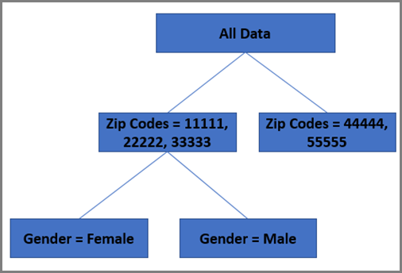

#  Random Forest 알고리즘

자동화된 개인화와 자동 타겟 모두에서 사용되는 Target의 주 개인화 알고리즘은 Random Forest입니다. Random Forest와 같은 Ensemble 방식에서는 Constituent 학습 알고리즘에서 얻을 수 있는 것보다 더 나은 예측 성과를 얻기 위해 여러 학습 알고리즘을 사용합니다. 자동화된 개인화의 Random Forest 알고리즘은 학습 시 다수의 의사 결정 트리를 만들어 운용되는 분류 또는 회귀 방법입니다.

통계를 생각하는 경우 결과를 예측하는 데 사용되는 단일 회귀 모델을 떠올릴 수도 있습니다. 최신 데이터 과학 연구에서는 동일한 데이터 세트에서 여러 모델이 만든 다음, 지능적으로 결합하는 &quot;Ensemble 방식&quot;이 하나의 모델만을 기반으로 한 예측하는 것보다 개선된 결과를 내놓는다고 말합니다.

Random Forest 알고리즘은 자동화된 개인화와 자동 타겟 활동에서 사용되는 주요 기본 개인화 알고리즘입니다. Random Forest에서는 단일 트리로만 예측할 때보다 더 나은 예측에 도달하기 위해 수백 개의 의사 결정 트리를 함께 결합합니다.

## 의사 결정 계통이란 무엇입니까?{#section_7F5865D8064447F4856FED426243FDAC}

의사 결정 트리의 목표는 시스템이 학습할 수 있는 모든 이용 가능한 방문 데이터를 분석한 다음, 각 그룹 내의 방문들이 목표 지표와 관련하여 가능한 한 서로 비슷하도록 해당 데이터를 그룹화하는 것입니다. 하지만, 그룹 간에는 목표 지표(예: 전환율)와 관련하여 방문이 최대한 달라야 합니다. 의사 결정 트리는 이 목표를 극대화하기 위해 의사 결정 트리의 교육 세트에 있는 다양한 변수들을 살펴보고 MECE(Mutually-Exclusive-Collectively-Exhaustive: 상호배제와 전체포괄) 방식으로 데이터를 그룹(또는 &quot;리프&quot;)으로 분할하는 방법을 결정합니다.

간단한 예로, 다음과 같이 두 개의 입력 변수만 있다고 가정합니다.

* 성별(두 개의 가능한 값, 남성 또는 여성)
* 우편 번호(현재의 작은 데이터 집합에는 5개의 잠재적 값인 11111, 22222, 33333, 44444 또는 55555가 있음)

목표 지표가 전환이면 트리는 먼저 두 개의 변수 중 방문 데이터의 전환율에서 가장 크게 변한 크기의 원인이 되는 변수를 판별합니다.

우편 번호가 자동으로 예측 된다고 가정할 때, 이 변수는 트리의 첫 번째 &quot;분기&quot;를 형성합니다. 그러면 의사 결정 트리는 각 분할 내 레코드의 전환율은 가능한 한 같고, 분할 간의 전환율은 가능한 한 다르게 하는 등의 방식으로, 방문 데이터를 분할하는 방법을 결정합니다. 현재 예에서는 11111, 22222, 33333이 하나의 분할이고 44444와 55555가 두 번째 분할이라고 가정합니다.

이 작업으로 의사 결정 트리의 첫 번째 계층이 생성됩니다.

의사 결정 트리는 &quot;가장 예측 가능한 변수란 무엇입니까?&quot;라는 질문을 합니다. 이 예에는 두 개의 변수만 있으므로 여기에서 답변은 명확하게 성별입니다. 이제 트리는 유사한 연습을 완료하여 *각 분기 내에서* 데이터를 분할할 것입니다. 먼저 11111, 22222 및 33333 분기에 대해 생각해 보겠습니다. 이 우편 번호들에서 남성과 여성 간에 전환 차이가 있다면 두 개의 리프(남성 및 여성)가 있을 것이고 이 분기는 완료됩니다. 다른 분기 44444와 55555에서는 여성과 남성이 전환하는 방식 간에 통계적 차이가 없다고 가정하겠습니다. 이 경우 첫 번째 분기는 최종 분할이 됩니다.

따라서 아래의 트리가 만들어집니다.

## 의사 결정 나무는 무작위 포리스트에서 어떻게 사용됩니까?{#section_536C105EF9F540C096D60450CAC6F627}

의사 결정 트리는 강력한 통계 도구일 수 있습니다. 그러나 몇 가지 단점이 있습니다. 가장 큰 단점은 이 트리가 데이터를 &quot;과잉 맞춤&quot;(over-fit)하여 개별 트리가 초기 트리를 만드는 데 사용되지 않은 미래 데이터는 제대로 예측하지 못할 수 있다는 것입니다. 이 문제를 통계적 학습에서는 [편향-분산 트레이드오프](https://en.wikipedia.org/wiki/Bias%E2%80%93variance_tradeoff)(bias-variance tradeoff)라고 합니다. Random Forest는 이러한 과잉 맞춤 문제를 극복하는 데 도움이 됩니다. 가장 높은 수준에서 Random Forest는 개별 트리보다 더 나은 모델을 만들어내기 위해 함께 &quot;투표&quot;하고, 동일한 데이터 세트에서 약간 다르게 만들어지는 의사 결정 트리들의 컬렉션입니다. Forest가 약간씩 다른 의사 결정 트리들로 구성되도록 트리는 속성들의 하위 집합을 무작위로 선택할 뿐만 아니라 교체 사항이 있는 방문 횟수 레코드의 하위 집합을 무작위로 선택하여 만들어집니다(bagging이라고도 함). 이 방법에서 Random Forest에서 만들어진 트리들은 약간씩 다르게 변형됩니다. 이 통제된 크기의 차이를 포함하는 것은 알고리즘의 예측 정확도를 향상시키는 데 도움이 됩니다.

## Target의 개인화 알고리즘은 무작위 포리스트를 어떻게 사용합니까?{#section_32FB53CAD8DF40FB9C0F1217FBDBB691}

**모델을 만드는 방법**

다음 다이어그램은 자동 타겟이나 자동화된 개인화 활동을 위한 모델을 만드는 방법을 요약한 것입니다.

1. 경험/오퍼를 무작위로 제공하는 동안 Target에서 방문자에 대한 데이터를 수집합니다.
1. Target이 대량의 중요한 데이터를 수집한 후 특징 엔지니어링을 수행합니다.
1. Target이 각 경험/오퍼에 대한 Random Forest 모델을 만듭니다.
1. 모델이 임계값 품질 점수를 충족하는지 Target이 확인합니다.
1. Target이 모델을 프로덕션으로 푸시하여 미래 트래픽을 개인화합니다.

Target에서는 사용자가 제공하는 사용자 지정 데이터뿐만 아니라 자동으로 수집되는 데이터도 사용하여 개인화 알고리즘을 만듭니다. 이러한 모델은 방문자에게 표시할 최고의 경험이나 오퍼를 예측합니다. 일반적으로 경험(자동 타겟 활동의 경우)이나 오퍼(자동화된 개인화 활동의 경우)당 하나의 모델이 만들어집니다. 그런 다음Target은 가장 높은 예측 성공 지표(예: 전환율)를 생성하는 경험 또는 오퍼를 표시하도록 선택합니다. 이러한 모델은 예측에 사용하기 전에 무작위로 제공되는 방문에 대해 학습을 받아야 합니다. 그 결과, 활동이 처음 시작될 때 개인화 알고리즘이 준비되기 전까지는 개인화된 그룹에 있는 해당 방문자에게도 다른 경험이나 오퍼가 표시됩니다.

활동에 사용하기 전에 각 모델이 방문자의 행동을 잘 예측하도록 하려면 각 모델의 유효성을 검사해야 합니다. 모델의 유효성은 AUC(곡선 아래 영역)에 따라 검사됩니다. 유효성 검사가 필요하므로 모델이 개인화된 경험을 제공하기 시작하는 정확한 시간은 데이터의 세부 사항에 따라 달라집니다. 실제로 트래픽 계획 용도로 제공하려는 경우, 각 모델이 유효해지기까지는 최소 전환 개수를 사용할 때보다 많은 시간이 소요됩니다.

경험 또는 오퍼용으로 모델이 유효하게 되면 경험/오퍼 이름의 왼쪽에 있는 시계 아이콘이 녹색 확인란으로 바뀝니다. 두 개 이상의 경험/오퍼용으로 유효한 모델이 있으면 일부 방문이 개인화되기 시작합니다.

**특징 변환 **

데이터가 개인화 알고리즘을 통과하기 전에, 개인화 모델에서 사용할 수 있도록 학습 레코드에서 수집된 데이터를 사전 준비하는 것으로 생각할 수 있는 특징 변환이 수행됩니다.

특징 변환은 속성 유형에 따라 다릅니다. 주로 두 가지 유형의 속성(또는 때로 데이터 과학자들이 설명할 때에는 &quot;특징&quot;)이 있습니다.

* **카테고리적 유형:**&#x200B;카테고리적 특징은 카운트할 수 없지만 다양한 그룹으로 분류할 수 있으며 국가, 성별 또는 우편 번호와 같은 특징일 수 있습니다.
* **숫자 유형:**&#x200B;나이, 수입 등과 같은 숫자 특징은 측정하거나 카운트할 수 있습니다.

카테고리 특징의 경우 모든 가능한 특징 세트가 유지 관리되고, 변환을 사용하여 데이터 크기를 줄일 수 있습니다. 숫자 특징의 경우 크기를 다시 조절하면 특징들이 전반적으로 비슷해집니다.

**다무장 강도와의 균형 잡힌 학습 vs. 개인화**

Target에 트래픽을 개인화하기 위해 개인화 모델을 빌드한 후에는 내 활동의 향후 방문자를 유지할지 또는 일부를 놓치고 트래픽을 개인화할지 정해야 합니다. 즉, 현재 모델을 기반으로 하여 모든 트래픽을 개인화할 것인지 또는 임의의 오퍼를 임의로 제공하여 새로운 방문자로부터 데이터를 계속 수집할 것인지 정해야 합니다. 대부분의 트래픽을 개인화하면서도 개인화 알고리즘이 방문자의 새로운 트렌드에 대해 항상 학습하도록 할 수 있습니다.

multi-arm bandit은 목표를 달성할 수 있도록 Target이 지원하는 방식입니다. multi-arm bandit 방식을 사용하면 모델이 항상 약간의 트래픽을 &quot;사용&quot;하여 활동 학습 과정 전체에서 계속 학습하고 이전에 학습한 트렌드의 과도한 이용을 방지하게 됩니다.

데이터 과학 세계에서 multi-armed bandit(MAB) 문제는 각각의 보상 확률을 알 수 없는 one-armed bandit 컬렉션이 주어지는 탐험(탐색)-활용 딜레마의 전형적인 예입니다. 핵심 아이디어는 성공 확률이 가장 높은 arm을 실행하여 획득된 총 보상이 극대화되도록 하는 전략을 개발하는 것입니다. Multi-armed bandit은 온라인 모델이 만들어진 후 온라인 점수를 평가할 때 시스템에서 사용됩니다. 이 방식은 탐색 중 온라인 학습에 도움이 됩니다. 현재 multi-armed 알고리즘은 엡실론(ε) 탐욕 알고리즘입니다. 이 알고리즘에서는 확률 1-ε을 사용하여 최선의 arm을 선택합니다. 또한 확률 ε을 사용하여 다른 arm을 임의로 선택합니다.
