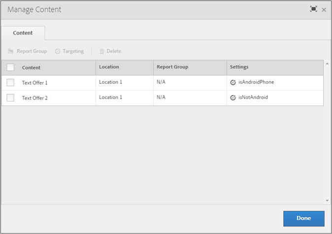

#  자동화된 개인화 오퍼 타깃팅{#target-automated-personalization-offers}

자동화된 개인화 활동에서는 오퍼에 대해 특정 대상을 지정할 수 있습니다.

이 기능을 사용하면 특정 방문자가 볼 수 있는 오퍼의 수가 줄어듭니다. 예를 들면 3개의 오퍼가 있는 AP(자동화된 개인화) 활동을 고려합니다. 오퍼 1에는 대상 A로만 노출을 제한하는 타깃팅 규칙이 있습니다. 두 방문자가 이 AP 활동을 확인했습니다.

|  | 방문자 1 | 방문자 2 |
|--- |--- |--- |
| 대상 자격 | 대상 A | 대상 B |
| 오퍼 1 Target 개인화 모델 점수 | 90 | 90 |
| 오퍼 2 Target 개인화 모델 점수 | 50 | 70 |
| 오퍼 3 Target 개인화 모델 점수 | 80 | 60 |

이 시나리오에서 방문자 1에게는 해당 방문자의 최고 점수 점수인 오퍼 1이 표시됩니다(방문자 1이 대상 A의 일부로 자격을 얻으므로). 그러나 방문자 2는 대상 A의 일부가 아니므로 최고 점수가 오퍼 1에 대한 것이더라도 오퍼 2가 표시됩니다. 이 예제에서는 비즈니스 요구에 맞게 타깃팅 규칙을 사용해야 하는 이유를 보여 줍니다. 이러한 규칙을 추가하면 Target 개인화 모델의 효율성이 줄어들 수 있습니다.

## 타깃팅 규칙 설정

1. 타깃팅하려는 오퍼가 포함된 자동화된 개인화 활동을 생성합니다.
1. 시각적 경험 작성기에서 활동에 대한 오퍼를 설정한 후에 **[!UICONTROL 컨텐츠]**를 클릭합니다.

   컨텐츠 관리 대화 상자가 열립니다.

   

   >[!NOTE]
   >
   >50개의 위치 및 위치당 최대 250개의 오퍼를 설정할 수 있습니다.

1. **[!UICONTROL 컨텐츠]** 열에서 오퍼를 선택한 다음 **[!UICONTROL 타깃팅]**을 클릭하고 해당 오퍼를 표시하기 위해 자격을 부여할 대상을 선택합니다.

   선택한 대상에게만 해당 오퍼가 제공됩니다.

   >[!NOTE]
   >
   >기존 대상을 선택할 수 있을 뿐만 아니라, 새 대상을 만들지 않고 여러 대상을 결합하여 임시로 결합한 대상을 만들 수도 있습니다. 자세한 내용은 [여러 대상 결합](../../c-target/combining-multiple-audiences.md#concept_A7386F1EA4394BD2AB72399C225981E5)을 참조하십시오.

1. **[!UICONTROL 완료를 클릭합니다]**.
