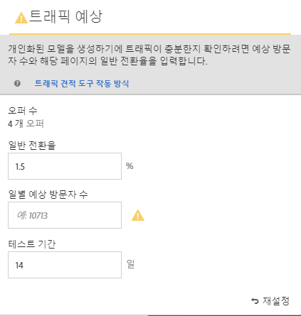
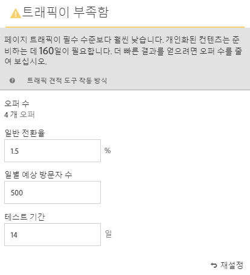
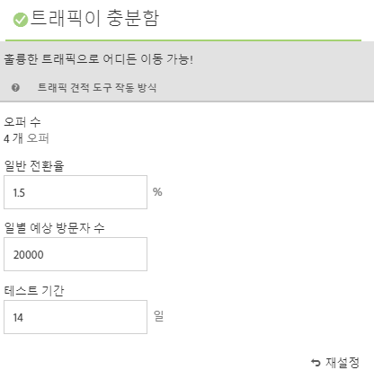

#  성공에 필요한 트래픽 예측{#estimate-the-traffic-required-for-success}

[!UICONTROL 트래픽 견적 도구]에서는 [!DNL Adobe Target] 활동이 성공하기에 충분한 트래픽이 있는지 여부를 알 수 있는 피드백을 제공합니다.

[!UICONTROL Automated Personalization] 활동에서는 여러 오퍼 조합을 사용하기 때문에 의미 있는 결과를 제공하는 데 필요한 트래픽의 양을 파악하는 것이 중요합니다. [!UICONTROL 트래픽 견적 도구]에서는 페이지 및 테스트되는 경험의 수에 대한 통계를 사용하여 트래픽 양과 활동을 성공적으로 수행하는 데 필요한 테스트 기간을 예상합니다.

[!UICONTROL 트래픽 견적 도구]는 예상 페이지 노출 수와 페이지에 대한 일반적인 전환율을 비교하여 개인화된 모델을 생성하는 데 충분한 트래픽이 있는지 확인합니다. 이상적으로는 활동이 성공하려면 올바른 샘플 크기를 사용되어 개인화된 콘텐츠가 활동 지속 기간의 50% 또는 14일 중에서 더 짧은 기간 안에 준비될 수 있어야 합니다. 이렇게 하면 개인화된 콘텐츠를 획득하고 전달할 콘텐츠를 학습하기 위한 충분한 시간이 보장됩니다.

개인화 알고리즘이 빌드될 때까지 [!DNL Target]은(는) 경험을 임의로 제공합니다. 각 오퍼 옆에 있는 확인 표시 아이콘은 해당 오퍼에 대한 모델이 준비가 완료되었고 [!DNL Target]이(가) 개인화된 컨텐츠를 제공할 수 있는 시기를 보여줍니다. 상승도는 모델이 준비된 후에만 예측되므로 시각적 표시를 통해 적절한 기대 수준을 설정할 수 있습니다. [!UICONTROL Visual Experience Composer](VEC)의 [!UICONTROL 트래픽 견적 도구]를 사용하여 모델이 준비되는 시기를 가이드라인으로 만듭니다.

## 트래픽 견적 도구 사용

1. [!UICONTROL Visual Experience Composer]에서 **[!UICONTROL 트래픽]**&#x200B;을 클릭합니다.

   

   [!UICONTROL 트래픽 견적 도구]가 열립니다. **[!UICONTROL 트래픽]**[!UICONTROL 을 다시 클릭하여 트래픽 견적 도구를 숨길 수 있습니다].

   

1. 일반적인 전환율(또는 이 활동에서 예상하는 전환율), 일별 예상 활동 노출 수 및 테스트 지속 기간을 제공합니다.

   * **오퍼 수**:제외에 따라 활동의 일부로 만들어지는 경험의 수를 기반으로 자동으로 계산됩니다.
   * **일반적인 전환율**:전환율은 분석 시스템의 예측 또는 과거 데이터를 기반으로 백분율로 표시됩니다.
   * **예상 일별 방문 수**:타깃팅 기준을 기반으로 활동을 볼 수 있는 방문자의 일별 방문 수입니다. 분석 데이터를 기준으로 생성될 수 있습니다. 이 숫자는 고유한 방문자 수가 아니라 방문 수여야 합니다.
   * **테스트 기간**: 활동을 실행할 일수입니다.

   [!UICONTROL 트래픽 예측]r은 이러한 통계를 사용하여 성공적인 테스트를 실행하는 데 필요한 조정을 확인합니다.

   [!UICONTROL 트래픽 견적 도구]의 맨 위에 입력한 값이 계산되고 결과가 표시됩니다.

   

   숫자를 변경하면 예측값이 변경됩니다. 예를 들어, 많은 수의 조합을 테스트하고 있고 전환율과 임프레션이 너무 낮은 경우, [!UICONTROL 트래픽 견적 도구]는 테스트를 성공적으로 실행해야 하는 시간을 보여줍니다. 또는 트래픽이 낮은 경우, [!UICONTROL 트래픽 견적 도구]는 원하는 일 수의 테스트를 실행할 수 있도록 낮은 수의 오퍼 조합을 제안할 수 있습니다.

   충분한 트래픽이 없는 경우 다음 중 한 가지 또는 모든 작업을 수행할 수 있습니다.

   * 하나의 경험 변형에서 여러 개의 오퍼 변경 내용이 있는 경험을 만들려면 [!UICONTROL Automated Personalization] 대신 [자동 Target](/help/c-activities/auto-target/auto-target-to-optimize.md) 활동을 사용하는 것이 좋습니다.
   * [!UICONTROL Automated Personalization] 활동 내에서 오퍼 조합 수를 줄입니다.
   * 활동의 지속 기간을 늘립니다.

   [!UICONTROL 트래픽 견적 도구]에서 충분한 트래픽이 있다고 말할 때까지 번호를 조정한 다음 그에 따라 테스트를 디자인합니다.

   

   트래픽이 충분하면 [!UICONTROL 트래픽] 아이콘에 녹색 검사가 표시됩니다. 충분하지 않은 경우 아이콘은 빨간색 경고 레이블을 표시합니다.

## 트래픽 견적 도구에 대한 FAQ

[!UICONTROL 트래픽 견적 도구]에서 작업할 때 다음 FAQ를 고려하십시오.

### AP 활동에 충분한 트래픽이 있는 경우 [!DNL Target]이(가) 맞춤형 모델을 구축하지 않는 이유는 무엇입니까?

특정 상황에서 트래픽이 너무 커서 맞춤형 모델이 빌드될 수 있지만 트래픽은 [!DNL Target]에 개인화된 모델과 임의 간에 의미 있는 차이가 없음을 알려줄 수 있습니다. 모델이 [!DNL Target]에 내장되어 테스트되었지만 모델이 임의보다 훨씬 나지는 않으므로 배포되지 않습니다.

모델이 임의보다 우수하지 않은 가능한 이유는 오퍼가 서로 크게 다르지 않기 때문일 수 있습니다. 이 경우 메시지가 유사한 경우 오퍼를 시각적으로 더 다르게 만들거나 메시지 자체를 변경해 볼 수 있습니다.
