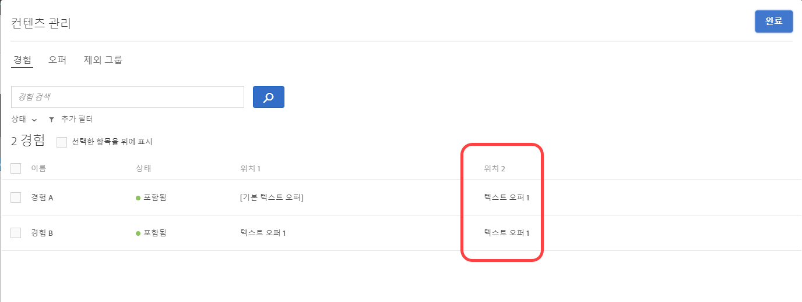
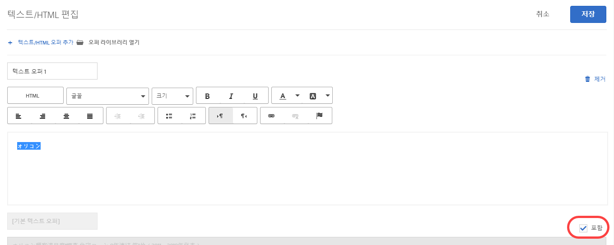
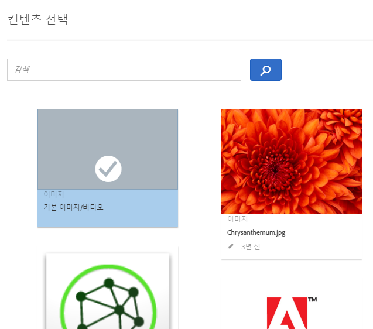

#  예외 관리{#manage-exclusions}

AP(자동화된 개인화) 활동에서 제외 그룹을 만들고, 중복 오퍼를 제외하고, 특정 경험을 제외하고, 기본 콘텐츠를 제외하여 제외를 관리합니다.

## 제외 그룹 만들기 {#task_AAAA6C7239A84F7696C8492F04B575A2}

자동화된 개인화(AP) 활동에서 제외 그룹을 만들어 지정된 오퍼가 있는 경험이 자동으로 제외되도록 합니다.

제외 그룹은 양립할 수 없는 오퍼가 서로 다른 위치의 동일한 경험에서 제공되지 않도록 하는 좋은 방법입니다. 예를 들어, 두 오퍼가 있다고 가정하십시오. 하나는 모든 상품을 20% 할인하는 것이고 다른 하나는 15% 할인하는 것으로 가정합니다. 이러한 두 오퍼를 동일한 경험에서 방문자에게 제공하고 싶지는 않을 것입니다. 이 두 오퍼를 제외 그룹에 추가한다면 그런 일이 발생하지 않도록 할 수 있습니다.

AP 활동에서 특정 오퍼를 볼 수 있는 대상을 제한할 수도 있습니다. 자세한 내용은 [자동화된 개인화 오퍼 타깃팅](/help/c-activities/t-automated-personalization/ap-target-offers.md)을 참조하십시오.

**제외 그룹을 만들려면 다음을 수행하십시오.**

1. [AP 활동을 작성하거나 편집](/help/c-activities/t-automated-personalization/create-ap-activity.md)할 때 헤더 막대에서 **[!UICONTROL 콘텐츠 관리]**&#x200B;를 클릭합니다.

   

1. [!UICONTROL 콘텐츠 관리] 대화 상자에서 **[!UICONTROL 제외 그룹]**&#x200B;을 클릭합니다.

   

   이전에 만든 제외 그룹이 있다면 목록에 표시됩니다. 아직 제외 그룹을 만들지 않은 경우에는 만들라는 메시지가 표시됩니다.

1. **[!UICONTROL 제외 그룹 만들기]**&#x200B;를 클릭합니다.

   

1. (필수) 제외 그룹에 수사적 이름을 지정합니다.

   수사적 이름을 사용하면 그룹의 목적을 빠르게 찾고 이해할 수 있습니다.

1. 제외 그룹에 추가하고 싶은 오퍼를 찾아 선택합니다.

   제외 그룹의 동일한 위치에서 여러 개의 오퍼를 선택할 수 있습니다.

1. **[!UICONTROL 저장]**&#x200B;을 클릭합니다.

제외 그룹의 오퍼는 앞으로 동일한 경험에서 자동으로 제외됩니다.

## 중복 오퍼 제외 {#concept_4EF78013F80E48EFA024AE0274C9F037}

[!UICONTROL 자동화된 개인화] 활동의 다른 위치에서 사용될 때 오퍼 라이브러리의 오퍼가 복제하지 않도록 합니다.

예를 들어, 12개의 오퍼가 있는 페이지에 6개의 위치가 있는 활동이 있을 수 있습니다. 활동에서 하나 이상의 위치에 동일한 오퍼를 배치할 수 있습니다. 이 기능은 중복 오퍼들이 동일한 활동 내의 다른 위치에서 동시에 표시되지 않도록 합니다.

**[!UICONTROL 구성]** > **[!UICONTROL 중복 오퍼]**&#x200B;를 클릭한 다음, **[!UICONTROL 중복 허용]** 또는 **[!UICONTROL 중복 허용 안 함]**&#x200B;을 클릭합니다.

## 특정 경험 제외 {#task_C17D36EF58AF4908B17A3D84CA6DE85A}

자동화된 개인화 활동에서 특정 오퍼 조합을 제외하려면 특정 경험을 제외하십시오.

함께 작동하지 않는 특정 조합이 있거나, 활동에 대한 트래픽 요구 사항을 줄이기 위해 테스트하는 경험의 수를 제한할 수 있습니다.

1. [AP 활동을 작성하거나 편집](/help/c-activities/t-automated-personalization/create-ap-activity.md)할 때 헤더 막대에서 **콘텐츠 관리**&#x200B;를 클릭합니다.

   

   [!UICONTROL 경험] 목록에는 모든 콘텐츠 및 위치 선택 사항들의 순열에서 생성된 각 경험이 표시됩니다.

1. 원하는 대로 환경을 제외합니다.

   원하는 경험을 마우스로 가리키고 제외 아이콘을 클릭하여 특정 경험을 제외할 수 있습니다.

   

   또는 관련 경험에 대한 확인란을 선택한 다음, 대화 상자의 오른쪽 맨 위에 있는 **[!UICONTROL 제외]** 아이콘을 클릭하여 경험을 묶음으로 제외/포함할 수 있습니다. 하나 이상의 경험을 선택하면 [!UICONTROL 제외] 아이콘이 표시됩니다.

   

   [!UICONTROL 상태] 드롭다운 목록을 클릭하여 제외되었거나 포함된 활동만 표시하도록 이 목록 보기를 필터링할 수 있습니다.

   이제 활동에서 경험이 제외되고 해당 [!UICONTROL 상태]가 [!UICONTROL 제외됨]으로 표시됩니다.

   

## 기본 콘텐츠 제외 {#task_DCB4528989DF4C05A3A4729E5891D18F}

일부 경우에는 기본 콘텐츠를 자동화된 개인화 활동의 일부로 포함시키지 않을 수 있습니다. 이 설정에 액세스하는 방법은 제외 그룹 만들기와 다릅니다. 이 방법을 사용하여 AP 활동의 일부로 위치에 하나의 오퍼(기본 콘텐츠가 아님)만 사용할 수 있습니다.

기본 콘텐츠를 제외하는 것은 사용자가 AP 활동으로 테스트하는 오퍼에 맞게 나머지 페이지의 모양과 느낌을 변경할 수 있는 좋은 방법입니다. 예를 들어, 테스트 중인 오퍼의 색상 팔레트를 일치시키려는 경우 페이지의 배경색을 변경하고 기본 배경색을 제외할 수 있습니다.

**시각적 경험 작성기(VEC)를 사용하여 기본 콘텐츠를 제외하려면 다음을 수행하십시오.**

1. While [creating or editing an AP activity](/help/c-activities/t-automated-personalization/create-ap-activity.md), select the content you want to replace and click to access **[!UICONTROL Change Text/HTML]**, **[!UICONTROL Change Image]**, or **[!UICONTROL Change Background Color]**.
1. 대화 상자에서 새 콘텐츠를 작성하고 기본 콘텐츠의 오른쪽에 있는 **포함**&#x200B;을 선택 취소합니다(또는 콘텐츠 선택 화면에서 기본 이미지/비디오를 선택 취소합니다.).

   [!UICONTROL 포함] 확인란은 콘텐츠/오퍼 유형에 따라 약간 다른 위치에 표시됩니다.

   Text/HTML 콘텐츠의 경우:

   

   이미지/비디오 콘텐츠의 경우:

   

   배경 색상의 경우:

   

1. **[!UICONTROL 저장]**&#x200B;을 클릭합니다.

   [!UICONTROL 콘텐츠 관리]에서 지정한 오퍼에서 생성된 경험을 확인할 수 있습니다. 제외된 기본 오퍼를 사용하여 [!UICONTROL 콘텐츠 관리]에 생성된 경험은 없습니다.

   

**양식 기반 경험 작성기를 사용하여 기본 콘텐츠를 제외하려면 다음을 수행하십시오.**

1. AP 활동을 작성하거나 편집할 때 **[!UICONTROL 콘텐츠]**&#x200B;에서 **[!UICONTROL 텍스트/HTML 변경]** 또는 이미지 오퍼 변경&#x200B;**[!UICONTROL 을 클릭합니다]**.
1. 대화 상자에서 새 콘텐츠를 작성하고 기본 콘텐츠의 오른쪽에 있는 **[!UICONTROL 포함]**&#x200B;을 선택 취소합니다(또는 콘텐츠 선택 화면에서 기본 이미지/비디오를 선택 취소합니다.).

   포함 확인란은 콘텐츠/오퍼 유형에 따라 약간 다른 위치에 표시됩니다.

   Text/HTML 콘텐츠의 경우:

   

   이미지/비디오 콘텐츠의 경우:

   

1. **[!UICONTROL 저장]**&#x200B;을 클릭합니다.

   [!UICONTROL 콘텐츠 관리]에서 지정한 오퍼에서 생성된 경험을 확인할 수 있습니다. 제외된 기본 오퍼를 사용하여 [!UICONTROL 콘텐츠 관리]에 생성된 경험은 없습니다.

   
