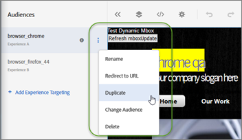

# 경험 만들기 {#create-experience}

경험 작성기가 페이지에서 경험을 편집하기 위한 시각적 인터페이스를 제공합니다.

경험에 대한 자세한 내용은 [경험](../../../c-experiences/experiences.md#concept_A2E10F6AFB3D4AEAB6951EE14688848D)을 참조하십시오.

1. **[!UICONTROL 경험 추가]**를 클릭합니다.

   >[!NOTE]
   >
   >경험을 대상으로 타깃팅하는 경우 경험을 추가하기 전에 먼저 대상을 선택해야 합니다. 사용자에게 대상을 선택하라는 메시지가 표시됩니다.

1. 활동 URL을 입력하라는 메시지가 표시되면 입력합니다. 전체 URL(`https://` 포함)을 입력한 다음 **[!UICONTROL 계속]**을 클릭합니다.

   경험 작성기([경험](../../../c-experiences/experiences.md#concept_1D011219034B492BB03C08B3BB80E3F0) 참조)에서 계정 기본 설정에 지정한 페이지가 열립니다. 다른 페이지를 표시하려면 지구본 아이콘을 클릭하고 경험 작성기의 URL 선택 상자에 URL을 입력한 후 **[!UICONTROL 계속]**을 클릭합니다. Target Standard JavaScript 코드가 포함되지 않은 사이트 URL을 입력하면 페이지 요소를 선택할 수 없습니다.

   기본적으로, 시각적 경험 작성기에서는 회전 배너 등과 같은 JavaScript가 포함된 요소를 변경할 수 없습니다. 시각적 경험 작성기에서 이러한 요소를 변경하려면 JavaScript를 비활성화할 수 있습니다.

   >[!NOTE]
   >
   >페이지를 변경한 후에 하나 이상의 경험에 대해 이 URL을 변경하면 해당 경험은 새 페이지를 사용하여 재설정되고 수행한 변경 사항은 손실됩니다.

1. 변경할 요소를 선택하고 원하는 대로 변경합니다.

   페이지의 요소 위에 마우스를 가져가면 요소가 강조 표시됩니다. 강조 표시된 요소는 경험 작성기를 사용하여 변경할 수 있습니다.

   Target Classic(이전의 Test&amp;Target)을 사용하여 페이지에서 mbox를 만든 경우 해당 mbox가 mbox 이름을 나타내는 요소로 표시되며, 다른 요소와 같이 수정할 수 있습니다.

   표시된 페이지의 요소에서 수행하여 경험을 변경할 수 있는 작업 목록은 [시각적 경험 작성기 선택 사항](/help/c-experiences/c-visual-experience-composer/viztarget-options.md)을 참조하십시오.

   >[!NOTE]
   >
   >기본 페이지 이외의 소스에서 가져온 이미지(예: akamai.net에 호스팅되고 dell.com에 전달된 이미지)를 전달하는 경우 해당 이미지가 흐름 다이어그램에 표시된 페이지의 썸네일에 표시되지 않습니다.

1. 경험 디자인을 마치면 확인 표시 단추를 클릭합니다.

   활동 다이어그램이 표시됩니다.

   

   경험에 도메인 간 컨텐츠가 포함되어 있는 경우 썸네일이 정확하지 않을 수 있으며 아이콘으로 바뀝니다.
1. 원하는 대로 추가 경험을 만듭니다.

   >[!NOTE]
   >
   >대상/경험 쌍을 원하는 순서로 배열하기 위한 XT 활동을 만들거나 편집하면서 대상/경험 쌍을 드래그 앤 드롭할 수 있습니다. 방문자는 하향식으로 경험에 대해 평가됩니다.

   

   경험 타깃팅에서는 순서를 중요한 것으로 간주합니다. 방문자가 첫 번째 대상/경험 쌍에 속하는 경우 첫 번째 경험이 전달됩니다.

   예를 들어, XT 활동을 만드는 동안 순서가 중요하다는 것을 인식하지 못한다고 가정해보겠습니다. 경험 B 또는 C에 적격이라고 생각했던 방문자가 경험 A에 적격이라는 사실을 테스트 중에 알게 될 수 있습니다. 이것은 대상이 상호 배타적이지 않으며 적절한 순서로 정렬되지 않았기 때문일 수 있습니다(예: 경험 A = 미국, 경험 B = 샌프란시스코, 경험 C = 캘리포니아). 이 시나리오에서 미국의 모든 사용자는 샌프란시스코나 캘리포니아의 다른 지역에 있더라도 경험 A에 적격입니다. 전체 활동을 다시 만들지 않고, 가장 제한적인 것부터 덜 제한적인 순서로(샌프란시스코 &gt; 캘리포니아 &gt; 미국) 대상/경험 쌍을 재정렬할 수 있습니다.

## 경험 이름 변경, 편집 또는 삭제

A/B 테스트 또는 경험 타깃팅(XT) 활동에서 경험에 대한 [편집](3개의 수직 줄임표) 아이콘을 클릭하고 필요에 따라 다음 선택 사항 중에서 선택할 수 있습니다.

* 이름 변경
* 편집
* 삭제

이 단계를 완료하면 **[!UICONTROL 계속]을 클릭하십시오.**

## 경험 복제

경험 타깃팅(XT) 활동에서 경험을 복사할 수 있으므로 경험을 처음부터 다시 작성하지 않고도 약간의 컨텐츠를 변경할 수 있습니다.

**[!UICONTROL 경험]** 페이지(3단계 안내식 워크플로우의 첫 번째 단계)에서 세 개의 수직 줄임표 &gt; **[!UICONTROL 중복]**을 클릭하십시오.

## 교육 비디오: 시각적 경험 작성기 사용

이 비디오에서는 시각적 경험 작성기 선택 사항 사용에 대한 정보를 제공합니다.

* 페이지 컨텐츠 변경
* 페이지 레이아웃 변경

>[!VIDEO](https://video.tv.adobe.com/v/17399)