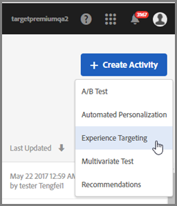
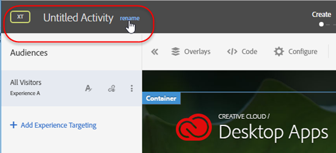

# 경험 타깃팅 활동 만들기{#create-an-experience-targeting-activity}

Target을 사용할 수 있는 페이지에서 경험 타깃팅 활동을 만들고 Target 내에서 해당 페이지의 부분을 수정하려면 시각적 경험 작성기를 사용하십시오.

1. [!UICONTROL 활동] 목록에서 **[!UICONTROL 활동 만들기]** &gt; **[!UICONTROL 경험 타깃팅]**을 클릭합니다.

   

   >[!NOTE]
   >
   >사용 가능한 활동 유형은 Target 계정에 따라 다릅니다. 일부 활동 유형은 목록에 표시되지 않을 수 있습니다.

   활동 유형에 대한 내용은 [활동](../../../c-activities/activities.md#concept_D317A95A1AB54674BA7AB65C7985BA03).
1. [활동 URL](../../../c-activities/t-experience-target/t-xt-create/xt-activity-url.md#concept_D28549AAA0A14E3BB5F05F32BE8ABC90)을 입력한 다음, **[!UICONTROL 다음]**을 클릭합니다.

   

   계정이 기본 URL로 구성된 경우 기본적으로 해당 URL이 표시됩니다. 기본값에서 다른 URL로 변경할 수 있습니다.

   문제가 있는 경우 VEC에 대한 문제 해결 정보가 필요하면 [시각적 경험 작성기 문제 해결](../../../c-experiences/c-visual-experience-composer/r-troubleshoot-composer/troubleshoot-composer.md#reference_77743144F10143A3A89D56E116D296E4)을 참조하십시오.

   양식 기반 경험 작성기를 사용하려면 해당 옵션을 선택합니다. [양식 기반 경험 작성기](https://marketing.adobe.com/resources/help/en_US/target/target/t_form_experience_composer.html)를 참조하십시오.

   시각적 경험 작성기가 열리고 URL에 지정된 페이지가 표시됩니다.
1. 제공된 공간에 활동의 이름을 입력합니다.

   

   다음 문자는 활동 이름에서 허용되지 않습니다.

   | 문자 | 설명 |
   |--- |--- |
   | `/` | 슬래시 |
   | `?` | 물음표 |
   | `#` | 숫자 기호 |
   | `:` | 콜론 |
   | `=` | 다음과 같음 |
   | `+` | 플러스 |
   | `-` | 빼기 |
   | `@` | 로그인 |

1. [페이지의 요소를 변경하여](../../../c-activities/t-experience-target/t-xt-create/xt-add-experience.md#task_454646F2895242D3B92DC395A0CE1A00) 새 경험을 만듭니다.

   경험 작성기([경험](../../../c-experiences/experiences.md#concept_1D011219034B492BB03C08B3BB80E3F0) 참조)에서 계정 기본 설정에 지정한 페이지가 열립니다. 다른 페이지를 표시하려면 지구본 아이콘을 클릭하고 경험 작성기의 URL 선택 상자에 URL을 입력한 후 **[!UICONTROL 계속]**을 클릭합니다. Target Standard JavaScript 코드가 포함되지 않은 사이트 URL을 입력하면 페이지 요소를 선택할 수 없습니다.

   기본적으로, 시각적 경험 작성기에서는 회전 배너 등과 같은 JavaScript가 포함된 요소를 변경할 수 없습니다. 시각적 경험 작성기에서 이러한 요소를 변경하려면 JavaScript를 비활성화할 수 있습니다.

   >[!NOTE]
   >
   >페이지를 변경한 후에 하나 이상의 경험에 대해 이 URL을 변경하면 해당 경험은 새 페이지를 사용하여 재설정되고 수행한 변경 사항은 손실됩니다.

   페이지의 요소 위에 마우스를 가져가면 요소가 강조 표시됩니다. 강조 표시된 요소는 경험 작성기를 사용하여 변경할 수 있습니다.

   Target Classic(이전의 Test&amp;Target)을 사용하여 페이지에서 mbox를 만든 경우 해당 mbox가 mbox 이름을 나타내는 요소로 표시되며, 다른 요소와 같이 수정할 수 있습니다.

   >[!NOTE]
   >
   >기본 페이지 이외의 소스에서 가져온 이미지(예: akamai.net에 호스팅되고 dell.com에 전달된 이미지)를 전달하는 경우 해당 이미지가 흐름 다이어그램에 표시된 페이지의 썸네일에 표시되지 않습니다.

1. **[!UICONTROL 다음]**을 클릭합니다.

   흐름 다이어그램이 열립니다.

   

   흐름 다이어그램은 활동의 대상을 선택하고, 경험을 설정하는 단계를 안내합니다.
1. 대상 위로 마우스를 가져간 후 표시되는 **[!UICONTROL 편집]** 아이콘(3개의 수직 줄임표)을 클릭하고, **[!UICONTROL 대상 변경]**을 클릭한 다음, 활동의 첫 번째 경험에 대한 대상을 선택합니다.

   

   대상 라이브러리가 나타납니다. 대상 라이브러리에는 Target의 일부로 사전에 만들어진 공통 대상을 포함하여 이전에 정의한 대상들이 포함되어 있습니다. 라이브러리에서 대상을 선택하거나 [새 대상을 만들 수 있습니다](../../../c-target/c-audiences/audiences.md#concept_65BE870D290E412D8BBF557EEA67C271). 모든 참여자에게 동일한 경험을 표시하려면 모든 방문자를 선택합니다.

   >[!NOTE]
   >
   >기존 대상을 선택할 수 있을 뿐만 아니라, 새 대상을 만들지 않고 여러 대상을 결합하여 임시로 결합한 대상을 만들 수도 있습니다. 자세한 내용은 [여러 대상 결합](../../../c-target/combining-multiple-audiences.md#concept_A7386F1EA4394BD2AB72399C225981E5)을 참조하십시오.

   고객을 만들 때 위치(mbox)를 선택하고 해당 위치에 대한 매개 변수를 지정할 수 있습니다. [사용자 지정 매개 변수]에서 mbox를 선택한 다음, 원하는 매개 변수를 지정합니다.

   >[!NOTE]
   >
   >대상 목록을 연 상태에서 가져온 대상이 10분 이상 오래되면 배경에서 자동으로 대상을 가져옵니다.

   표시되는 [!UICONTROL 편집] 아이콘(3개의 수직 줄임표)을 클릭하고 [!UICONTROL 대상 제거]를 클릭하여 기존 대상을 제거할 수 있습니다.
1. **[!UICONTROL 경험 타깃팅 추가]**를 클릭합니다.

   >[!NOTE]
   >
   >경험을 대상으로 타깃팅하는 경우 경험을 추가하기 전에 먼저 대상을 선택해야 합니다. 사용자에게 대상을 선택하라는 메시지가 표시됩니다.

1. (선택 사항) **[!UICONTROL 추가]**를 클릭하고 타깃팅된 추가 경험을 설정합니다.

   

   이 단계를 완료하면 **[!UICONTROL 계속]을 클릭하십시오.**
1. 활동에 대한 [목표 및 설정](../../../c-activities/t-experience-target/t-xt-create/xt-goals-and-settings.md#reference_B25389FD6F3A4989801E740364B089CC)을 지정합니다.

   

1. **[!UICONTROL 저장 및 닫기를 클릭합니다]**.
