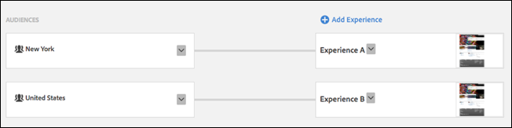

# 경험 타깃팅에서 경험 전환{#switching-experiences-in-experience-targeting}

프로필이 발전함에 따라 방문자가 XT(경험 타깃팅) 활동에서 경험 간을 전환하는 방법에 대한 정보입니다.

>[!NOTE]
>
>**2017년 9월 21일**
>
>9월 21일 자 릴리스부터 Target에서 사용자가 XT(경험 타깃팅) 활동에서 경험에 배치되는 방식이 변경됩니다(Target Classic의 랜딩 페이지 캠페인). Target Standard/Premium 및 Target Classic의 모든 새 활동 및 기존 활동에 대해, 사용자는 계속해서 경험 컨텐츠를 볼 수 있고 보고서에서 계산되려면 모든 노출에서 경험 타깃팅 규칙을 충족해야 합니다. 이전에는 사용자가 더 이상 경험에 대한 자격이 없으면 자격이 있는 마지막 경험의 컨텐츠만 계속 볼 수 있고 보고서에서 계산될 수 있었습니다.
>
>이러한 변경은 모든 기존 활동 및 릴리스 후에 작성된 새 활동에 대해 자동으로 릴리스의 일부로 적용됩니다. 이전 방법(9월 21일 이전)이 필요한 경우, 사용자가 향후 해당 대상에 계속 속하기 위해 한 번만 조건을 충족하면 되도록 프로필 스크립트를 통해 대상을 작성할 수 있습니다. 그런 다음 활동의 각 경험에 해당 대상을 사용합니다.

경험 타깃팅을 사용하면 프로필이 발전함에 따라 방문자가 보게 되는 경험을 제어할 수 있습니다. 다음 목록은 방문자 프로필이 발전할 수 있는 시나리오 중 일부에 불과합니다. 사용자가 다른 컨텐츠를 제공할 수도 있습니다.

| 시나리오 | 세부 사항 |
|--- |--- |
| 지리적 위치 | 방문자가 출장 또는 여가를 위해 여행 중인 경우 다른 지리적 위치에서 웹 사이트 또는 모바일 앱을 볼 수 있습니다. |
| 고객 상태 | 방문자는 계정을 생성하거나 제품을 구매하기 전에 잠재고객으로 간주될 수 있습니다. |
| 카테고리 관심도 | Target의 [카테고리 관련성](/help/c-target/c-visitor-profile/category-affinity.md) 기능은 사용자가 방문하는 카테고리를 자동으로 캡처한 다음 타깃팅 목적으로 카테고리에 대한 사용자의 관련성을 계산합니다. 예를 들어, 웹 사이트에서 특정 주제에 대한 여러 문서를 열람한 방문자에게는 해당 주제와 관련된 컨텐츠가 제공될 수 있습니다. |
| 요일 | 주말이 다가오면 영화, 음식점 또는 기타 형태의 엔터테인먼트에 대한 컨텐츠를 방문자에게 보여주려고 할 수 있습니다. |

[!DNL Target]에서 이러한 기능을 활용하려면 XT 활동을 사용할 때 다음 정보를 이해하는 것이 중요합니다.

* **우선순위는 경험 순서에 따라 하향식으로 제어됩니다.**방문자가 둘 이상의 대상에 대해 자격이 있는 경우 우선순위가 더 높은 경험의 컨텐츠가 수신됩니다.
* **방문자에게 우선순위가 더 높은 경험의 대상에 대해 자격이 부여되면 XT 활동에서 경험이 바뀝니다.**

   예를 들어, 다음 활동 설정에서 방문자는 미국에서 여러분의 웹 사이트에 액세스한 다음, 독일로 여행을 가서 두 번째로 해당 웹 사이트를 방문했습니다. 첫 번째 방문 동안 이 방문자에게는 경험 A(미국)의 자격이 부여되었습니다. 독일에서 해당 웹 사이트를 열람한 후에 이 방문자는 경험 B(독일)로 전환되었습니다.

   

* **또한 현재 대상에 대한 방문자의 자격이 중지되고 우선순위가 더 낮은 경험에 대한 자격이 부여되기 시작하므로 경험이 바뀝니다.**
* **현재 경험에 대한 방문자 자격이 중지되고 다른 경험에 대한 자격도 받지 못하면 기본 컨텐츠가 표시됩니다.**

   예를 들어, 다음 활동 설정에서 방문자는 미국에서 여러분의 웹 사이트에 액세스한 다음, 프랑스로 여행을 가서 두 번째로 해당 웹 사이트를 방문했습니다. 첫 번째 방문 동안 이 방문자에게는 경험 A(미국)의 자격이 부여되었습니다. 프랑스에서 해당 웹 사이트를 열람한 후에도 방문자는 원래 경험에 유지됩니다.

   

* **&quot;모든 방문자&quot;를 대상으로 하는 경험은 다른 경험에 속한 적이 없는 모든 방문자를 &quot;찾기 위한&quot; 경험 타깃팅 활동의 마지막 경험으로 사용될 수 있습니다. &quot;모든 방문자&quot;를 대상으로 하는 경험이 순서상으로 마지막이 아니면 이 경험보다 낮은 다른 타깃팅된 경험이 평가됩니다.**

   예를 들어, 다음 활동 설정에서 방문자는 미국에서 여러분의 웹 사이트에 액세스한 다음, 독일로 여행을 가서 두 번째로 해당 웹 사이트를 방문했습니다. 첫 번째 방문 동안 이 방문자에게는 경험 A(미국)의 자격이 부여되었습니다. 이 방문자는 독일에서 웹 사이트를 열람한 후에 경험 A(미국)에 유지됩니다.

   

   이를 원치 않을 경우 다음 예와 같이 타깃팅된 대상의 역으로 명시적으로 정의된 새 대상을 만들 수 있습니다.

   

* **단일 경험 XT 활동을 사용할 경우, 방문자는 해당 경험에 속하게 만든 대상에 대한 자격이 중단될 경우에도 해당 경험에 유지됩니다.**

   이를 원치 않을 경우, 역대상(예: &quot;미국&quot;에 상대되는 &quot;미국 아님&quot;)으로 타깃팅된 다른 경험을 만들 수 있습니다. 다른 옵션으로는 아래와 같이 100% 트래픽이 할당되는 원하는 대상으로 타깃팅된 A/B 활동을 만들 수 있습니다.

   

* **경험의 우선순위는 Target UI에 표시되는 순서대로(하향식) 정의됩니다.**

   방문자가 둘 이상의 대상에 대해 자격이 있을 수 있는 시나리오를 염두에 두는 것이 중요합니다. 예를 들어, 하나는 &quot;미국&quot;을 대상으로 하고, 다른 하나는 &quot;뉴욕&quot;을 대상으로 하는 두 가지 경험이 있는 경우 뉴욕에 있는 방문자는 두 대상에 대한 자격을 모두 가질 수 있습니다. 따라서 Target UI에서 &quot;미국&quot; 경험보다 먼저 &quot;뉴욕&quot; 경험이 정의되어 있는지 확인해야 합니다. 이렇게 하면 다음 예와 같이 더 많이 타깃팅된 &quot;뉴욕&quot; 경험의 우선순위가 더 높습니다.

   

