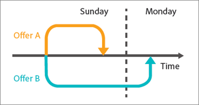

# Ten common A/B testing pitfalls and how to avoid them{#nine-common-a-b-testing-pitfalls-and-how-to-avoid-them}

A/B 테스트는 대부분의 디지털 마케팅 최적화 프로그램의 중추를 형성하며 마케터가 최적화 및 타깃팅된 경험을 방문자와 고객에게 제공하는 데 도움이 됩니다. 이 섹션에서는 A/B 테스트를 수행할 때 기업이 가장 중요하게 생각하는 위험 요소 중 10가지를 간략하게 설명합니다. 또한 여기에는 회사가 테스트 노력을 통해 더 많은 ROI를 달성하고 보고된 A/B 테스트 결과를 더욱 신뢰할 수 있도록 이러한 위험을 방지하는 방법도 포함되어 있습니다.

## Pitfall 1: Ignoring the effects of the significance level {#section_55F5577A13C6470BA1417C2B735C6B1D}

테스트에서 두 오퍼 간에 전환율 차이가 사실상 없는데 상당한 전환율 차이를 보고할 가능성은 얼마입니까? 테스트의 *유의 수준*&#x200B;은 이러한 가능성을 결정하는 데 도움이 됩니다. 이러한 잘못된 결과를 종종 긍정 오류(false positive)라고 하며, 통계에서는 제1종 과오(사실 true인 null 가설을 잘못 거부하는 경우)라고 합니다.

A/B 테스트의 유의 수준을 지정하는 것은 한 경험이 다른 경험보다 사실은 더 낫지 않은데 더 나은 것으로 받아들이는 것(제1종 과오 또는 &quot;긍정 오류(false positive)&quot;)과 경험 간에 진정한 차이가 있는데 통계적 차이가 없는 것으로 표시(제2종 과오 또는 &quot;부정 오류(false negative)&quot;)하는 것에 대한 허용 오차 간에 트레이드오프를 수행하는 것입니다. *신뢰 수준*&#x200B;은 테스트가 실행되기 전에 결정됩니다.

테스트가 완료된 후에 결정되는 *신뢰 구간*&#x200B;은 테스트의 샘플 크기, 유의 수준, 모집단 표준 편차, 이렇게 세 가지 주요 요소의 영향을 받습니다. 테스트를 설계하기 전에 마케터가 유의 수준을 선택했고, 모집단 표준 편차는 영향을 받을 수 없기 때문에 유일한 &quot;통제 가능&quot; 요소는 샘플 크기입니다. 마음에 드는 신뢰 구간에 필요한 샘플 크기와 해당 샘플 크기에 도달하는 데 걸리는 시간은 마케터가 테스트 설계 중에 결정해야 하는 중요한 사항입니다.

또 다른 직접적인 관련 용어인 *신뢰 수준*&#x200B;은 오히려 반만 차 있는 접근 방식을 사용합니다. 신뢰 수준은 유의 수준처럼 긍정 오류(false positive)를 얻게 될 가능성을 기술하기 보다는 테스트가 해당 실수를 초래하지 않을 가능성을 나타냅니다.

신뢰 수준과 유의 수준은 다음의 이유로 직접 관련되어 있습니다.

100% - 신뢰 수준 = 유의 수준

A/B 테스트에서 마케터는 종종 95%의 신뢰 수준을 사용합니다. 확실히, 위의 등식을 기반으로 하면 이것은 5%의 유의 수준에 해당합니다. 95% 신뢰 수준으로 테스트한다는 것은 실제로 오퍼 간에 차이가 없는 경우에도 통계적으로 중요한 상승도를 감지할 확률이 5% 있다는 것을 의미합니다.

아래 그래프에서 보듯이, 테스트를 많이 실행할수록 하나 이상의 테스트가 긍정 오류(false positive)를 내놓을 가능성은 커집니다. 예를 들어, 95% 신뢰 수준을 사용하여 10회의 테스트를 실행하는 경우 하나 이상의 긍정 오류(false positive)를 감지할 확률은 약 40%가 있습니다(실제 상승도가 없다고 할 때, Pr(하나 이상의 긍정 오류) = 1 - Pr(긍정 오류 없음) = 1 - 0.95^10 = 40%).

마케팅 조직에서 95%는 보통 긍정 오류(false positive)와 부정 오류(false negative)의 위험 간의 합리적인 균형점으로 여겨집니다.

그러나 다음의 테스트 후 세그멘테이션과 여러 오퍼 테스트, 이 두 상황을 보면 테스트 결과에 대한 유의 수준과 그 영향에 매우 주의를 기울여야 합니다.

* **테스트 후 세그멘테이션:**&#x200B;마케터는 종종 A/B 테스트가 완료된 후 방문자 세그먼트를 기반으로 테스트 결과를 세밀하게 분석합니다. 일반적인 세그먼트에는 브라우저 유형, 장치 유형, 지역, 하루 중 시각, 신규 방문자와 재방문자가 포함됩니다. 테스트 후 세그멘테이션이라고 하는 이 사례에서는 방문자 세그먼트에 대한 뛰어난 통찰력을 제공합니다. 결국 마케터는 이러한 통찰력을 사용하여 더 잘 타깃팅되고, 더 관련성이 높은 차별화된 컨텐츠를 만들 수 있습니다.

   전환율에 실제 차이가 없는 경우 세그먼트를 테스트할 때마다 긍정 오류(false positive)의 확률은 유의 수준과 같습니다. 앞서 언급한 바와 같이 테스트를 많이 실행할수록 해당 테스트 중에 하나 이상의 긍정 오류(false positive)가 발생할 가능성은 커집니다. 본질적으로, 테스트 후 세그먼트 각각은 별도의 테스트를 나타냅니다. 평균 5%의 유의 수준을 사용하면 20개의 테스트 후 세그먼트를 볼 때마다 하나의 긍정 오류(false positive)의 위험에 빠지게 됩니다. 위의 차트는 이러한 가능성이 어떻게 증가하는지를 보여줍니다.

   앞서 언급한 바와 같이 테스트를 많이 실행할수록 해당 테스트 중에 하나 이상의 긍정 오류(false positive)가 발생할 가능성은 커집니다. 본질적으로, 테스트 후 세그먼트 각각은 긍정 오류(false positive)의 가능성이 증가하는 별도의 테스트를 나타냅니다. 이러한 증가는 세그먼트 간에 연관성이 있을 경우 훨씬 더 중요할 수 있습니다.

   테스트 후 세그멘테이션을 간단히 수행하지 않아야 합니까? 아니요, 테스트 후 세그먼트는 중요합니다. 대신 테스트 후 세그멘테이션에 발생하는 이러한 누적 긍정 오류(false positive) 문제가 발생하지 않도록 하려면 테스트 후 세그먼트를 식별한 후 새 테스트에서 테스트해 보십시오. 또는 다음에 설명된 Bonferroni 보정을 적용할 수도 있습니다.

* **여러 오퍼 테스트:**&#x200B;마케터는 빈번하게 세 개 이상의 오퍼(또는 경험)를 비교하여 테스트합니다. 그래서 A/B/n 테스트라고 하는 A/B 테스트 솔루션이 표시되는 것입니다. 여기서 n은 동시에 테스트하는 오퍼의 수입니다.

   위에서 설명했듯이 테스트하는 *각* 오퍼에 유의 수준과 동일한 긍정 오류(false positive) 비율이 있는 점에 유의해야 합니다. 단일 테스트 환경 내에서 몇 개의 오퍼를 서로 비교하여 테스트하면 여러 테스트를 효과적으로 실행하게 됩니다. 예를 들어, A/B/C/D/E 테스트에서 5개의 오퍼를 비교하는 경우 통제와 B, 통제와 C, 통제와 D, 통제와 E, 이렇게 4가지 비교를 효과적으로 만듭니다. 신뢰 수준이 95%일 때 긍정 오류(false positive)의 확률은 5%가 아니라 실제로 18.5%가 됩니다. 2

   전체 신뢰 수준을 95%로 유지하고 이 문제가 발생하지 않도록 하려면 Bonferroni 보정으로 알려진 방법을 적용하십시오. 이 보정을 사용하여, 95% 신뢰 수준을 달성하는 데 필요한 유의 수준을 제시하는 비교 개수로 유의 수준을 나눕니다.

   위 예제에 Bonferroni 보정을 적용하면 5%/4 = 1.25% 유의 수준을 사용하게 되는데, 이것은 개별 테스트에 대한 98.75%(100% - 1.25% = 98.75%) 신뢰 수준에 해당합니다. 이러한 조정은 설명된 예제에서와 같이 네 개의 테스트가 있는 경우 95%의 유효 신뢰 수준을 유지합니다.

## Pitfall 2: Declaring winners of multiple offer tests with no statistically significant difference {#section_FA83977C71DB4F69B3D438AF850EF3B6}

여러 오퍼를 사용하는 테스트에서, 마케터는 종종 승자와 차점자 간에 통계적으로 유의미한 차이가 없더라도 상승도가 가장 높은 오퍼를 테스트 승자로 선언합니다. 대안 오퍼 간의 차이가 대안 오퍼와 통제 오퍼 간의 차이보다 작을 때 이러한 상황이 발생합니다. 아래 그림은 95% 상승도 신뢰 구간을 나타내는 검정색 오차 막대로 이러한 개념을 보여줍니다. 통제 오퍼에 상대적인 각 오퍼에 대한 실제 상승도는 신뢰 구간(오차 막대로 표시된 범위) 내에 포함될 가능성이 95%입니다.

오퍼 A와 오퍼 B의 상승도는 테스트 중에 가장 높게 관찰되었고, C의 신뢰 구간이 A나 B의 신뢰 구간과 겹치지도 않으므로 향후 테스트에서 오퍼 C가 해당 오퍼들의 성과를 능가할 가능성은 별로 없습니다. 그러나 오퍼 A의 상승도가 테스트 중에 가장 높게 관찰되었더라도, 오퍼 B는 신뢰 구간이 겹치므로 향후 테스트에서 성과가 더 나을 가능성이 상당히 있습니다.

여기서 시사하는 바는 오퍼 A와 오퍼 B 모두 테스트의 승자로 간주되어야 한다는 것입니다.

일반적으로 대안 오퍼들의 정확한 상대적 성과를 식별할 수 있을 만큼 충분히 오랫동안 테스트를 실행할 수 없으며, 종종 대안 오퍼들 간의 성과 차이는 전환율에 영향을 주기에는 너무 작습니다. 이런 경우에는 이 결과를 동점으로 해석하고 전략이나 페이지의 다른 요소와의 연관성과 같은 다른 고려 사항을 이용하여 구현할 오퍼를 결정할 수 있습니다. 여러 테스트를 수행할 때에는 승자가 둘 이상일 수 있다는 사실에 열려 있어야 하며 일부 경우 이러한 자세는 웹 사이트 개발과 관련하여 취할 수 있는 방향입니다.

전환율이 가장 높은 오퍼를 식별하고 싶은 경우 모든 오퍼를 다른 모든 오퍼와 각각 비교하게 됩니다. 위의 예에서 n = 5개 오퍼이고, n(n-1)/2 비교를 하거나 5*(5-1)/2 = 10 비교를 해야 할 경우, Bonferroni 보정을 사용하려면 테스트의 유의 수준이 5%/10 = 0.5%이어야 하며 이는 99.5%의 신뢰 수준에 해당합니다. 그러나 이와 같은 높은 신뢰 수준을 얻으려면 너무 오랫동안 테스트를 실행해야 합니다.

## Pitfall 3: Ignoring the effects of statistical power {#section_0D517079B7D547CCAA75F80981CBE12A}

통계적 검정력은 테스트에서 오퍼 간의 실제 전환율 차이를 감지할 확률입니다. 무작위라서 또는 통계학자가 &quot;확률론적&quot;이라고 부르는 전환 이벤트의 성질로 인해, 테스트는 장기간 실행에서 두 오퍼 간의 실제 전환율 차이가 있는 경우에도 통계적으로 유의미한 차이를 보이지 않을 수 있습니다. 이런 것을 불운 또는 우연이라고 할 것입니다. 전환율에서 실제 차이를 감지하지 못하는 것을 부정 오류(false negative) 또는 제2종 과오라고 합니다.

테스트의 검정력을 판별하는 두 가지 주요 요소가 있습니다. 첫 번째가 샘플 크기, 즉 테스트에 포함된 방문자 수입니다. 두 번째는 테스트에서 감지하려는 전환율 차이의 규모입니다. 이는 다소 직관적일 수 있겠지만, 큰 전환율 차를 감지하는 것에만 관심이 있는 경우 테스트에서 그렇게 큰 차이를 감지할 확률이 훨씬 더 높습니다. 거실에 코끼리가 있는 것을 감지하는 것과 휴지 심을 통해 보는 파리를 비교하는 것과 같습니다. 그러한 면에서, 감지하려는 차이가 작을수록 샘플 크기가 커지고, 따라서 큰 샘플 크기를 얻기 위해 필요한 시간도 늘어납니다.

오늘날의 마케터는 많은 테스트의 검정력을 악화시키고 있습니다. 다시 말해, 너무 작은 샘플 크기를 사용합니다. 즉, 전환율에 실제로 상당한 차이가 존재해도 실제 긍정(true positive)을 감지할 가능성이 낮습니다. 사실, 악화된 검정력을 가진 테스트를 계속 실행하는 경우, 긍정 오류(false positive) 수가 실제 긍정(true positive)의 수에 필적하거나 더 우세할 수도 있습니다. 이렇게 되면 종종 사이트에 대한 중립적 변경 사항이 구현(시간 낭비)되거나 전환율을 줄이는 변경 사항이 발생합니다.

테스트의 검정력이 악화되는 것을 방지하려면 검정력이 좋은 테스트를 위한 일반 표준에 95%의 신뢰 수준과 통계적인 80%의 통계적 검정력 포함을 고려하십시오. 이러한 테스트는 긍정 오류(false positive)를 방지할 확률 95%, 부정 오류(false negative)를 방지할 확률 80%를 제공합니다.

## 4단계:단측 테스트 사용 {#section_8BB136D1DD6341FA9772F4C31E9AA37C}

편측 검정에서는 특정 유의 수준에서 승자가 나오도록 오퍼 간 전환율 차가 적게 관찰되어야 합니다. 이 테스트는 승자가 양측 검정을 사용할 때보다 더 일찍, 그리도 더 자주 나올 수 있기 때문에 더 매력적으로 보입니다. 하지만 당연히 편측 검정에는 비용이 듭니다.

편측 검정에서는 오퍼 B가 오퍼 A보다 나은지 테스트합니다. 테스트의 방향은 테스트가 시작되기 전 또는 통계학적으로 말해서 &quot;선험적&quot;으로 결정해야 합니다. 다시 말해서, B가 A보다 더 나은지 테스트할지, 아니면 A가 B보다 더 나은지 테스트할지를 테스트를 시작하기 *전에* 결정해야 합니다. 하지만, A/B 테스트의 결과를 보고 B가 A보다 낫다는 것을 확인한 *다음*, 편측 검정을 수행하여 해당 차이가 통계적으로 유의미한지 확인하기로 결정한다면, 통계학적 테스트의 가정을 위배하는 것입니다. 테스트의 가정을 위배한다는 것은 신뢰 구간을 신뢰할 수 없고 테스트에 예상보다 높은 긍정 오류(false positive) 비율이 있음을 의미합니다.

이미 마음을 결정한 판사의 재판에 오퍼를 회부하는 것처럼 편측 검정을 볼 수도 있습니다. 편측 검정에서는, 각 경험에 승자와 동일하게 증명할 기회를 제공하지 않고 가장 성과가 좋은 오퍼가 무엇이 될지를 이미 결정한 것입니다. 편측 검정은 하나의 오퍼가 다른 오퍼들보다 낫고 그 반대는 아닌 경우인지 여부에만 관심이 있는, 드문 상황에서만 사용해야 합니다. 편측 검정의 문제를 방지하려면 [!DNL Adobe Target]처럼 항상 양측 검정을 사용하는 A/B 테스트 솔루션을 사용하십시오.

## Pitfall 5:테스트 모니터링 {#section_EA42F8D5967B439284D863C46706A1BA}

마케터는 테스트가 유의미한 결과를 판별하기 전까지 A/B 테스트를 빈번히 모니터링합니다. 그렇다면, 통계적 중요도를 획득했는데 왜 테스트합니까?

안타깝게도 이것은 그렇게 간단하지 않습니다. 문제를 일으키려고 싶진 않지만, 결과를 모니터링하는 것이 테스트의 유효한 통계적 중요도에 부정적인 영향을 주는 것으로 나타났습니다. 실제로 긍정 오류(false positive)의 가능성이 크게 증가하고 신뢰 구간이 신뢰할 수 없게 됩니다.

이것은 혼란스러워 보일 수 있습니다. 마치 테스트 중간에 결과를 보고 얘기하는 것 같아서, 결과의 통계적 중요도를 상실할 수 있습니다. 정확히 그런 것은 아닙니다. 다음 예에서 이유를 알 수 있습니다.

전환율이 모두 10%인 두 개의 오퍼에 대한 10,000개의 전환 이벤트를 시뮬레이션한다고 가정하겠습니다. 전환율이 동일하므로 두 오퍼를 서로 비교하여 테스트하면 전환 상승도 차이가 감지되지 않아야 합니다. 95% 신뢰 구간을 사용할 때, 10,000번의 관찰을 모두 수집한 후에 평가하면 예상된 5% 긍정 오류(false positive) 비율이 테스트 결과로 나옵니다. 따라서 이러한 테스트 100개를 실행하면 평균 5개의 긍정 오류(false positive)를 얻게 됩니다(실제로는, 두 오퍼 간에 전환율 차이가 없으므로 이 예에서 모든 긍정(positive)은 거짓(false)입니다.). 그러나 테스트하는 동안 테스트를 10번 평가하면(1,000번의 관찰마다) 긍정 오류(false positive) 비율이 최대 16%까지 증가합니다. 테스트 모니터링에서는 긍정 오류(false positive)의 위험이 3배가 넘었습니다. 어떻게 이럴 수 있을까요?

이 문제가 발생하는 이유를 이해하려면 유의미한 결과가 감지될 때와 감지되지 않을 때 취해지는 서로 다른 조치를 고찰해야 합니다. 통계적으로 유의미한 결과가 감지되면 테스트가 중지되고 승자가 선언됩니다. 그러나 결과가 통계적으로 유의미하지 않으면 테스트를 계속 진행하게 되고, 이러한 상황은 긍정적인 결과를 매우 편애하는 것이므로, 테스트의 유효한 유의 수준이 왜곡됩니다.

이 문제를 방지하려면 테스트를 시작하기 전에 테스트를 지속할 시간을 적절히 결정해야 합니다. 테스트 중에 테스트 결과를 살펴보고 테스트를 올바르게 구현했는지 확인할 수 있어도, 필요한 방문자 수에 도달하기 전에 결론을 내리거나 테스트를 중지하지 마십시오. 다시 말해, 훔쳐보지 마십시오.

## Pitfall 6:테스트 중간에 중지 {#section_DF01A97275E44CA5859D825E0DE2F49F}

오퍼들 중 하나의 성과가 테스트의 처음 몇 일 내에 다른 오퍼보다 훨씬 더 낫거나 훨씬 나쁘면 테스트를 중지하려는 마음이 생길 수 있습니다. 그러나 관찰 수가 낮으면 낮은 방문자 수에 대해 전환율 평균을 내므로 뜻밖에 양수 상승도나 음수 상승도가 관찰될 가능성이 높습니다. 테스트가 더 많은 데이터 포인트를 수집함에 따라, 전환율이 해당하는 실제 장기간 값에 수렴합니다.

아래 그림은 동일한 장기간 전환율이 있는 5개의 오퍼를 보여줍니다. 처음 2,000명의 방문자에 대한 오퍼 B의 전환율은 부정확했고 예상 전환율이 실제 장기간 전환율로 돌아오기까지는 시간이 오래 걸립니다.

이러한 현상은 &quot;평균으로의 회귀&quot;로 알려져 있는데, 테스트 초기 몇 일 동안 성과가 좋은 오퍼가 장기간 실행에서 이 수준의 성과를 유지하지 못할 경우 이러한 현상은 실망으로 이어질 수 있습니다. 또한 테스트 초기에 단지 우연으로 성과가 부족하여 좋은 오퍼가 구현되지 않은 경우에는 매출에 손실이 생길 수도 있습니다.

테스트를 모니터링할 때의 위험과 마찬가지로, 이러한 문제를 방지하는 가장 좋은 방법은 테스트를 실행하기 전에 충분한 방문자 수를 결정한 다음 이 수의 방문자가 오퍼에 노출될 때까지 테스트를 실행하는 것입니다.

## Pitfall 7:테스트 기간 동안 트래픽 할당 변경 {#allocation}

데이터가 정규화될 때까지 테스트 결과를 왜곡할 수 있으므로 테스트 기간 동안 트래픽 할당 비율을 변경하지 않는 것이 좋습니다.
예를 들어 트래픽의 80%가 경험 A(제어)에 할당되고 트래픽의 20%가 경험 B에 할당되는 A/B 테스트 활동이 있다고 가정합니다.테스트 기간 동안 각 경험에 대한 할당을 50%로 변경합니다. 며칠 후 트래픽 할당을 경험 B로 100%로 변경합니다.

이 시나리오에서 사용자는 경험에 어떻게 할당됩니까?

경험 B에 대해 할당 분할을 100%로 수동으로 변경하는 경우, 원래 경험 A(제어)에 할당된 방문자는 처음에 할당된 경험(경험 A)에 남아 있습니다. 트래픽 할당의 변화는 신규 참여자에게만 영향을 줍니다.

비율을 변경하거나 각 경험의 방문자 흐름에 큰 영향을 주려는 경우, 새 활동을 만들거나 활동을 복사한 다음 트래픽 할당 비율을 편집하는 것이 좋습니다.

테스트 기간 동안 서로 다른 경험에 대한 백분율을 변경하는 경우 특히 많은 구매자가 방문자를 반환하는 경우 데이터가 표준화되려면 며칠이 걸립니다.
또 다른 예로, A/B 테스트의 트래픽 할당이 50/50으로 분할된 다음 분할을 80/20으로 변경하는 경우 변경 후 처음 며칠 동안 결과가 기울어진 것처럼 보일 수 있습니다. 평균 전환 시간이 높은 경우 구매를 하는 데 몇 시간 또는 며칠이 걸리기 때문에, 이러한 지연된 전환은 보고서에 영향을 줄 수 있습니다. 따라서, 숫자가 50%에서 80%로 증가했고 평균 전환 시간은 2일입니다. 오늘날 인구의 80%가 경험으로 들어가고 있지만 50%의 방문자만 테스트 첫날 전환하고 있습니다. 따라서 전환율이 하락한 것처럼 보이지만 이 전환 시 방문자의 80%가 이틀 동안 걸리는 후 다시 표준화됩니다.

## Pitfall 8: Not considering novelty effects {#section_90F0D24C40294A8F801B1A6D6DEF9003}

테스트를 실행할 시간을 충분히 갖지 않을 경우 다른 예기치 않은 일들이 발생할 수 있습니다. 이번 문제는 통계 문제가 아니라 단순히 변화에 대한 방문자의 반응입니다. 웹 사이트에서 잘 구축된 부분을 변경하는 경우, 처음에는 일반적인 워크플로우 변경 사항으로 인해 재방문자가 새로운 오퍼에 원활하게 반응하지 못할 수 있습니다. 이렇게 되면 일시적으로 재방문자가 그러한 변화에 익숙해지기 전까지는 우수한 새 오퍼의 성과가 낮을 수 있습니다. 이것은 우수한 오퍼가 제공하는 장기 이익을 고려하면 작은 요금을 지불하는 것일 수 있습니다.

새로운 오퍼의 낮은 성과가 진기성 효과인지 아니면 오퍼가 실제로 열등한지를 판별하려면 방문자를 신규 방문자와 재방문자로 분류하고 전환율을 비교하면 됩니다. 단순히 진기성 효과라면 새 오퍼는 신규 방문자에 대한 성과가 높을 것입니다. 결국, 재방문자가 새로운 변경 사항에 익숙해지면 재방문자에 대해서도 이 오퍼가 높은 성과를 보일 것입니다.

진기성 효과는 반대로 작동할 수도 있습니다. 변경 사항은 새로운 것을 도입하게 되므로 방문자들이 변경 사항에 긍정적으로 반응하는 경우가 많습니다. 얼마 후 새로운 컨텐츠가 방문자에게 진부해지거나 덜 흥미롭게 되면 전환율이 떨어집니다. 이 효과는 구별하기가 더 어렵지만 전환율의 변화를 주의 깊게 모니터링하는 것이 이를 감지하는 데 중요합니다.

## Pitfall 9: Not considering differences in the consideration period {#section_B166731B5BEE4E578816E351ECDEA992}

고려 기간은 A/B 테스트 솔루션이 방문자에게 오퍼를 제공할 때부터 방문자가 전환할 때까지의 기간입니다. 이 기간은 고려 기간에 영향을 주는 오퍼에 중요할 수 있습니다. 예를 들어 &quot;시간 제한 오퍼-이번 주 일요일까지 구매&quot;와 같이 최종 기한을 시사하는 오퍼가 있습니다.

이와 같은 오퍼는 방문자가 더 빨리 전환하게 하며, 오퍼가 만료되는 즉시 테스트가 중지되는 경우 더 선호됩니다(대안 오퍼에 더 긴 최종 기한이 있거나 최종 기한이 없어서 고려 기간이 더 길기 때문). 대안 오퍼는 테스트 종료 후의 기간에 전환이 생기겠지만, 최종 기한의 끝날 때 테스트를 중지하면 더 이상의 전환이 테스트 전환율에 카운트되지 않습니다.

아래 그림은 두 명의 서로 다른 방문자가 일요일 오후에 동시에 볼 수 있는 두 개의 오퍼를 보여줍니다. 오퍼 A의 고려 기간은 짧고 방문자는 그 날 나중에 전환합니다. 그러나 오퍼 B의 고려 기간은 더 길고, 오퍼 B를 본 방문자는 잠시 오퍼에 대해 생각하고 결국 월요일 아침에 전환을 끝냅니다. 테스트를 일요일 밤에 중지하는 경우, 오퍼 A와 연결된 전환은 오퍼 A의 전환 지표에 카운트되는 반면, 오퍼 B와 연결된 전환은 오퍼 B의 전환 지표에 카운트되지 않습니다. 이렇게 되면 오퍼 B가 매우 불리한 입장에 있게 됩니다.

이러한 위험을 방지하려면 테스트 오퍼에 노출된 방문자가 테스트에 대한 새 항목이 중지된 후 전환할 수 있는 시간을 갖도록 하십시오. 이 단계를 통해 오퍼를 공정하게 비교할 수 있습니다.

## Pitfall 10: Using metrics that do not reflect business objectives {#section_F0CD6DC7993B4A6F9BEEBB31CD1D9BEE}

마케터는 상위 유입경로에서 클릭스루 비율(CTR)과 같이 트래픽이 높고 분산이 낮은 전환 지표를 사용하여 적절한 수의 테스트 전환에 보다 신속하게 도달하고 싶은 유혹을 느낄 수 있습니다. 그러나, CTR이 획득하려는 비즈니스 목표에 적절한 대용물인지 여부를 신중히 고려해 보십시오. CTR이 더 높은 오퍼는 매출이 쉽게 저하될 수 있습니다. 이런 일은 오퍼가 구매 성향이 낮은 방문자를 끌거나 할인 오퍼와 같이 오퍼 자체가 낮은 매출로 이어질 때 일어날 수 있습니다.

아래의 스키 오퍼를 생각해 보십시오. 이 오퍼는 사이클링 오퍼보다 훨씬 높은 CTR을 생성하지만, 방문자가 사이클링 오퍼를 따를 때 평균적으로 훨씬 더 많은 비용을 지출하므로 주어진 방문자의 앞에 사이클링 오퍼를 놓을 때의 예상 매출이 더 높습니다. 따라서 CTR을 지표로 사용하는 A/B 테스트는 기초적인 비즈니스 목표인 매출을 극대화하지 않는 오퍼를 선택하게 됩니다.

이런 문제를 방지하려면 비즈니스 지표를 주의 깊게 모니터링하여 오퍼의 비즈니스 영향을 파악하거나, 가능한 경우 비즈니스 목표에 더 가까운 지표를 사용하면 더욱 좋습니다.

## Conclusion: Success with A/B testing by recognizing and stepping around the pitfalls {#section_54D33248163A481EBD4421A786FE2B15}

일반적인 A/B 테스트 위험에 대한 학습을 마치면서 이제 언제, 어디서 이러한 위험에 빠질 수 있는지를 파악할 수 있기를 바랍니다. 또한 종종 수학 학위가 있는 사람들의 영역처럼 느껴지는 A/B 테스트에 관련된 몇 가지 통계와 확률 개념을 잘 이해하는 데 도움이 되었기를 바랍니다.

아래 절차에서는 이러한 위험을 방지하고 A/B 테스트에서 더 나은 결과를 달성하는 것에 집중하는 데 도움이 됩니다.

* 적절한 비즈니스 목표에 따라 테스트에 적합한 지표를 신중히 고려합니다.
* 테스트 시작 전에 신뢰 수준을 결정하고 테스트 종료 후 결과를 평가할 때 이 한계점을 지킵니다.
* 테스트를 시작하기 전에 샘플 크기(방문자 수)를 계산합니다.
* 테스트를 중지하려면 먼저 계산된 샘플 크기에 도달할 때까지 기다립니다.
* 테스트 후 세그멘테이션을 수행하거나 둘 이상의 대안 오퍼를 평가할 때 Bonferroni 보정과 같은 방법을 사용하여 신뢰 수준을 조정합니다.

