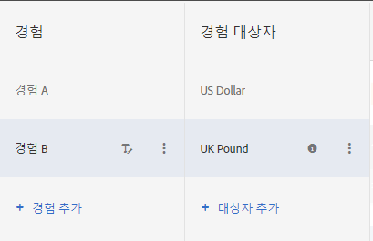

# A/B 테스트의 여러 경험 대상{#multiple-experience-versions-in-an-a-b-test}

A/B 활동에서 동일한 경험의 버전들을 서로 다른 대상에 타깃팅할 수 있습니다. 시각적 경험 작성기 또는 양식 기반 경험 작성기에서는 한 경험에 대해 여러 대상을 설정할 수 있습니다.

사용자는 프로필이 변경될 경우 경험 대상 간을 전환할 수 있습니다. 활동의 라이프타임 동안 동일한 경험이 지속되지는 않습니다.

예를 들어 사이트의 여러 페이지 또는 제품 간에 일관된 디자인이 사용되며 여러 대상(예: 다른 브라우저 언어를 사용하는 방문자)에 대해 동일한 경험을 사용하려는 경우 경험의 여러 버전을 설정할 수 있습니다. 영어 및 일본어 사용자에게 텍스트가 방문자의 언어로 제공된다는 점만 제외하고 동일한 경험을 제공할 수 있습니다. 언어와 관계없이 경험에 대한 데이터가 수집되므로 보고서는 버전이 아닌 경험의 성과를 보여 줍니다.

경험 버전을 설정하는 기능이 없으면 각 언어에 대해 서로 다른 테스트를 설정한 다음(이 예제 참조), 결과를 수동으로 집계하여 두 언어를 모두 사용하는 단일 경험의 성과를 이해해봅니다. 이 경우 덜 정확한 결과가 생성됩니다. 일부 테스트의 경우, 방문자가 무작위로 선정되는 방식 때문에 이러한 계산이 유용하지 않을 수도 있습니다.

여러 다른 버전의 경험을 만들면 수동 계산 및 가정 필요 없이 좀 더 정확한 정보를 얻을 수 있습니다.

**시나리오**

두 개의 경험, 즉 지리 기반의 타깃팅 배너와 일반 배너를 테스트하려고 합니다. 각 지역의 배너는 달라야 하지만 전반적인 테스트는 지리 기반의 타깃팅이 일반 콘텐츠를 표시하는 것보다 더 나은지를 결정하는 것입니다. 각 위치에 대해 별도의 경험을 설정하는 경우, 일반 배너에 대해 측정 시 지리 기반의 타깃팅이 성공 목표를 충족하는 데 도움이 되는지보다는 실제로 각 지역이 다른 지역에 비해 어떤 성과를 보이는지를 측정하게 됩니다.

이 경우 필요한 것은 지역별 경험 버전이므로 지리 기반이 아닌 통제군에 대해 지리 기반의 타깃팅 경험을 테스트할 수 있습니다.

1. [평소대로 A/B 활동을 만듭니다.](/help/c-activities/t-test-ab/t-test-create-ab/test-create-ab.md)

   여러 버전이 있는 경험을 구성할 때는 다음 단계에 표시된 것처럼 각 버전의 대상을 선택합니다.

1. Select the experience, then click **[!UICONTROL Configure]** > **[!UICONTROL Audiences]** > **[!UICONTROL Multiple Audiences]**.

   

1. **[!UICONTROL 대상 추가]**&#x200B;를 클릭한 후 타깃팅할 첫 번째 대상을 선택합니다. 각 대상에 대해 이 작업을 반복합니다.

   

   대상이 아직 존재하지 않는 경우 [대상 만들기](/help/c-target/c-audiences/create-audience.md#task_E18BD77A9A8F4ED0AC50569F94556558)를 클릭하고 설정합니다.

   방문자가 둘 이상의 대상에 적격인 경우, 모든 대상을 위한 콘텐츠가 반환되고 목록의 마지막 콘텐츠가 페이지에서 실제로 렌더링됩니다.

1. 활동을 계속 설정합니다.

**우수 사례**

* 상호 배타적인 대상을 선택합니다. 활동이 VEC에서 만들어진 경우, 방문자가 둘 이상의 대상과 일치하면 각 대상을 위한 콘텐츠가 반환되고, 마지막에 나열된 대상의 콘텐츠가 페이지에서 표시됩니다.
* 다이어그램에 정의된 활동 진입 대상은 AND 조건을 사용하여 경험 대상과 결합됩니다. 활동을 시작하려면 방문자가 활동 대상과 경험 대상 중 하나에 대해 적격이어야 합니다.
* 보고서에 대해 세그먼트와 동일한 대상을 추가합니다. 이렇게 하면 높은 수준의 경험 A 및 B에서 테스트 결과를 확인하고, &quot;브라우저 언어 jp_JP&quot;에 대해서만 더 낮은 수준의 경험 A 및 B에서 테스트 결과를 확인하는 데 도움이 됩니다. 이 방식은 Analytics 기반 보고서가 아닌 Target 기반 보고서에서 작동합니다.

