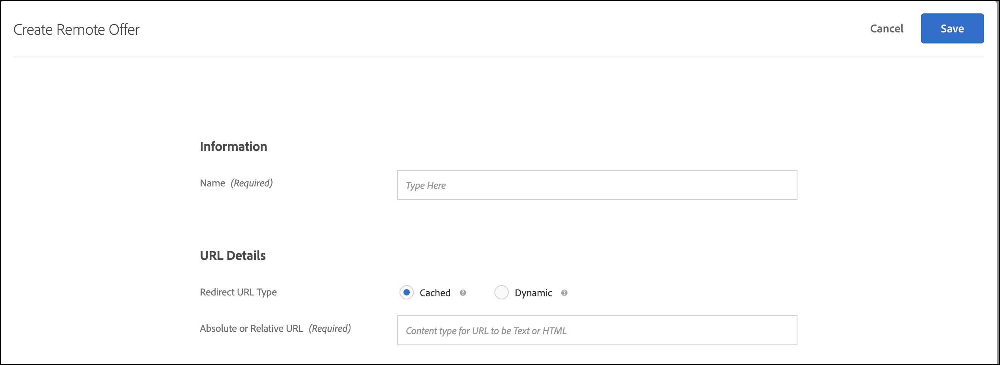
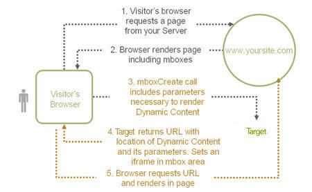

# 원격 오퍼 만들기{#create-remote-offers}

Target에서 참조하고 Target을 통해 사용자의 웹 사이트에 전달할 Target 외부의 컨텐츠를 호스팅하려면 원격 오퍼를 사용하십시오. 이 콘텐츠는 편의성이나 보안상의 이유로 콘텐츠 관리 시스템이나 다른 시스템에 있을 수 있습니다.

>[!NOTE]
>
>원격 오퍼는 양식 기반 작성기에서만 만들 수 있습니다. Content will be injected in the [!DNL Target] request locations, so these are most likely not appropriate for a global [!DNL Target] request.
>
>[!DNL Target Classic]에는 유사한 기능으로, [!UICONTROL 사이트의 오퍼] 및 [!UICONTROL Test&amp;Target 외부의 오퍼]가 포함되어 있었습니다.

원격 오퍼의 예는 다음과 같습니다.

* 크로스셀의 여러 버전
* 동적 장바구니 메시지
* 양식
* 계산기
* 이자율 업데이트

**원격 오퍼를 만들려면 다음을 수행하십시오.**

1. **[!UICONTROL 오퍼]**&#x200B;를 클릭한 다음, **[!UICONTROL 코드 오퍼]** 탭을 선택합니다.
1. **[!UICONTROL 만들기]** > **[!UICONTROL 원격 오퍼]**&#x200B;를 클릭합니다.

   

1. 오퍼에 대해 수사적 이름을 지정합니다.

   수사적 이름을 사용하면 사용자와 다른 사람이 [!UICONTROL 자산] 라이브러리에서 오퍼를 빨리 찾을 수 있습니다.

1. 원격 오퍼에 사용할 원격 URL을 지정합니다.

   | 옵션 | 설명 |
   |--- |--- |
   | 캐시됨 | 캐시된 원격 오퍼의 컨텐츠는 Target에서 제공됩니다. 두 시간마다 [!DNL Target]에서는 원격 URL에서 컨텐츠를 가져온 다음, Target 내부에 컨텐츠를 저장합니다. 방문자가 원격 오퍼를 포함하는 경험이 있는 사이트를 로드하면 Target에 의해 오퍼가 제공됩니다. Target에 로그인한 사람은 컨텐츠를 변경할 수 없으므로 캐시된 원격 오퍼는 향상된 보안을 제공합니다. 컨텐츠를 변경하기 위해서는 누군가가 컨텐츠 관리 시스템이나 다른 시스템에 로그인하여 컨텐츠를 변경해야 합니다. 캐시된 원격 오퍼에 대한 절대 또는 상대 URL을 지정할 수 있습니다. |
   | 동적 | 다이내믹 원격 오퍼는 Target이 아니라 컨텐츠 관리 시스템이나 다른 시스템에서 제공됩니다. 방문자가 원격 오퍼를 포함하는 경험이 있는 사이트를 로드할 때마다 Target에서 컨텐츠를 주기적으로 캐시한 다음 전달하는 것을 원치 않을 수도 있습니다. 대신 컨텐츠를 호스팅하는 시스템을 호출하고 다시 표시된 오퍼가 각 사용자에 대해 동적이거나 달라지도록 특정 정보를 전달할 수 있습니다. 예를 들어, 사용자가 다이내믹 원격 오퍼가 있는 경험이 포함된 신용 카드 웹 사이트에 로그인하는 경우, 사용자 계정 정보를 얻기 위해 URL에 매개 변수를 전달할 수 있습니다. 그러면 웹 사이트에서는 계좌 잔고와 같은 사용자별 정보를 제공할 수 있습니다. 매개 변수 [!UICONTROL 추가를] 클릭하여 하나 이상의 [!DNL Target] 요청이나 요청 매개 변수를 추가합니다. |

1. **[!UICONTROL 저장]**&#x200B;을 클릭합니다.

## 원격 오퍼 사용 우수 사례 {#section_7718512D08E14121B6F6B8C38134F4BC}

활동에서 원격 오퍼를 사용하는 우수 사례:

* If your offer resides in the same domain as the [!DNL Target] requests, using the [!UICONTROL Cached] option lets you use relative URLs in describing your offer location.

   이 경우 스테이징 서버에서 프로덕션으로 활동을 이동할 때 URL을 수동으로 변경하지 않아도 자동으로 컨텐츠에 액세스할 수 있습니다.

* 서버에서 동적으로 생성된 데이터가 테스트에 포함되는 경우 [!UICONTROL 동적] 선택 사항을 선택하는 것이 좋습니다.
* 기존 원격 오퍼 컨텐츠의 모양만 테스트하려는 경우, [!UICONTROL 시각적 경험 작성기]를 사용하여 컨텐츠 관리 시스템에서 반환되는 컨텐츠의 모양과 느낌을 변경하십시오.
* 특정 사례에 가장 적합한 오퍼를 선택하려면 원격 오퍼 선택 표를 사용하십시오. 의문 사항이 있는 경우 계정 담당자에게 문의하십시오.

## 다이내믹 원격 오퍼 작동 방식 {#concept_CC2A969420B34364A9FA78C1CE251818}

다이내믹 원격 오퍼에서는 다이내믹 페이지 기술을 사용하여 값을 오퍼에 전달합니다.

페이지를 렌더링한 후 오퍼가 실행됩니다. 보이지 않는 프레임이 데이터를 수집하고 프레임에서 복사한 다음 전달된 값을 로드하여 페이지에 삽입합니다.

## 원격 오퍼 선택 표 {#reference_B23BEDD29DDD47709A7651AFD27E776B}

원격 오퍼 선택 표는 선택할 원격 오퍼의 유형([!UICONTROL 캐시됨] 또는 [!UICONTROL 동적])을 결정하는 데 도움이 됩니다.

| 기능 | 캐시됨 | 동적 |
|--- |--- |--- |
| 방문자가 요청할 때마다 업데이트 | 아니오 | 예 |
| 컨텐츠 업데이트 | 2시간마다 캐시됨 | 각 요청 시 즉시 업데이트됨 |
| 로드 시간 | 고속 | 요청 처리로 인해 더 느림 |
| 페이지에서 JavaScript를 볼 수 있음 | 예 | 아니요, 하지만 URL을 통해 전달할 수 있음 |
| 오퍼에 JavaScript가 포함될 수 있음 | 예 | 예 |
| 오퍼 URL | 절대 또는 상대 | 상대 |
| 요청 컴퓨터 | Adobe 서버 | 방문자 쿠키가 저장되어 있는 방문자 컴퓨터 |