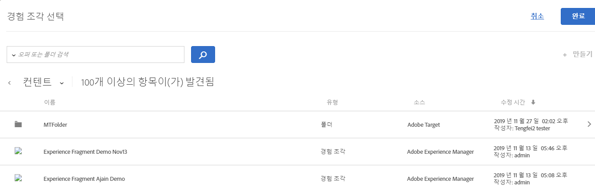

# AEM 경험 구성요소

최적화 또는 개인화를 지원하기 위해 [!DNL Target] 활동의 [!DNL Adobe Experience Manager] (AEM)에서 작성된 경험 구성요소 사용에 관해 설명합니다.

>[!NOTE]
>
>이 기능을 사용하려면 [!DNL Adobe Experience Manager]([!DNL AEM]) 고객이어야 합니다. 자세한 내용은 아래의 [요구 사항](/help/c-experiences/c-manage-content/aem-experience-fragments.md#section_AE6F0971E1574B3AA324003599B96E5A)을 참조하십시오.

## 개요 {#section_95A91830530F493B81C5C9CDB9B783EA}

[!DNL Target] 활동의 [!DNL AEM]에서 만든 경험 조각을 사용하면 [!DNL AEM]의 편의성과 기능을 [!DNL Target]의 강력한 AI(Automated Intelligence) 및 기계 학습(ML) 기능을 결합하여 경험을 다양한 규모로 테스트 및 개인화할 수 있습니다.

[!DNL AEM] 모든 콘텐츠 및 자산을 중앙 위치에 가져와서 개인화 전략을 실행합니다. [!DNL AEM] 코드를 작성하지 않고도 한 위치에서 데스크톱, 태블릿 및 모바일 장치의 콘텐츠를 쉽게 만들 수 있습니다. 모든 장치를 위해 페이지를 만들 필요가 없습니다. [!DNL AEM] 콘텐츠를 사용하여 각 경험을 자동으로 조정합니다.

[!DNL Target] 을 사용하면 행동, 컨텍스트 및 오프라인 변수를 통합하는 규칙 기반 기계 학습 접근 방식과 AI 기반 기계 학습 접근 방식을 조합하여 규모에 맞게 개인화된 경험을 제공할 수 있습니다. [!DNL Target] 을 사용하면 [A/B 테스트](/help/c-activities/t-test-ab/test-ab.md) 및 [다변량](/help/c-activities/c-multivariate-testing/multivariate-testing.md) (MVT) 활동을 쉽게 설정 및 실행하여 최상의 오퍼, 컨텐츠 및 경험을 결정할 수 있습니다.

경험 조각은 컨텐츠/경험 작성자 및 관리자를 [!DNL Target]을 사용하여 비즈니스 결과를 이끄는 최적화 및 개인화 전문가에게 연결하기 위한 매우 큰 단계를 나타냅니다.

## 요구 사항 {#section_AE6F0971E1574B3AA324003599B96E5A}

[!DNL Target] 내에서 경험 조각 기능을 프로비저닝해야 합니다. 또한 해당 서비스 팩과 함께 [!DNL AEM] 6.3 또는 [!DNL AEM] 6.4 이상을 사용해야 합니다. 계정 담당자는 사용자가 이 기능을 사용하기 위한 요구 사항을 충족하는지 확인할 수 있습니다.

* [!DNL Adobe Experience Manager] 6.4 이상
* [!DNL Adobe Experience Manager] 6.3 SP2 이상
* [!DNL Adobe Target Standard] 또는 계정 [!DNL Adobe Target Premium] 을 사용할 수 있습니다.
* 통합을 활성화하고 인증 세부 정보를 제공하려면 [Adobe Target 고객 지원 센터](/help/cmp-resources-and-contact-information.md#reference_ACA3391A00EF467B87930A450050077C)에 문의하십시오.

## [!DNL AEM]에서 경험 조각 만들기 및 구성 {#section_745C8EFE29F547A2958FDBF61A5ADF7B}

[!DNL Target]에서 [!DNL AEM] 경험 구성요소를 사용하려면 다음 단계를 수행해야 합니다.

### 1단계: [!DNL AEM]을 [!DNL Target]과 통합

자세한 내용은 다음 문서를 참조하십시오.

* **Adobe I/O**:  [관리 사용 안내서](https://experienceleague.adobe.com/docs/experience-manager-65/administering/integration/integration-ims-adobe-io.html) 에서 Adobe I/0 _을 사용하여 Adobe Target과_ 통합합니다.
* **[!DNL AEM]6.3**:  [Adobe Analytics 및 ](https://experienceleague.adobe.com/docs/experience-manager-release-information/aem-release-updates/previous-updates/aem-previous-versions.html) Adobe Experience Manager 6.3  _설명서 Adobe_  선택.
* **[!DNL AEM]6.4**:  [Adobe Analytics 및 ](https://experienceleague.adobe.com/docs/experience-manager-release-information/aem-release-updates/previous-updates/aem-previous-versions.html) Adobe Experience Manager 6.4  _설명서 Adobe_  선택.
* **[!DNL AEM]6.5**:  [Adobe Analytics 및 ](https://experienceleague.adobe.com/docs/experience-manager-65/administering/integration/opt-in.html?lang=en) Adobe Experience Manager 6.5  *설명서 Adobe*  선택.

### 2단계: 경험 구성요소 만들기

경험 조각은 [!DNL AEM]에 만들어집니다. 자세한 내용은 다음 문서를 참조하십시오.

* **[!DNL AEM]6.3**:   Adobe Experience Manager 6.3  **  설명서의 경험 조각.
* **[!DNL AEM]6.4**:   Adobe Experience Manager 6.4 **  설명서에서 경험 조각을 참조하십시오.
* **[!DNL AEM]6.5**:   Adobe Experience Manager 6.5  *설명서의 경험* 조각.

### 3단계: 경험 조각을 [!DNL Target]과 공유하도록 [!DNL AEM] 구성

1. [!DNL AEM] 내에서 원하는 경험 구성요소 또는 상위 폴더를 선택한 다음 **[!UICONTROL 속성]**&#x200B;을 클릭합니다.
2. **[!UICONTROL 클라우드 서비스]** 탭을 클릭한 다음, **[!UICONTROL 클라우드 서비스 구성]** 드롭다운 목록에서 **[!UICONTROL Adobe Target]**&#x200B;을 선택합니다.

   >[!NOTE]
   >
   >이전 단계에서는 조직의 누군가가 [!DNL Adobe Target] 구성을 작성했다고 가정합니다.

3. **[!UICONTROL 저장 및 닫기]**&#x200B;를 클릭합니다.

### 4단계: 경험 조각을 게시하고 [!DNL Target](으)로 내보냅니다.

[!DNL AEM] 버전에 따라 단계별 지침이 필요하면 다음 링크를 참조하십시오.

* **[!DNL AEM]6.3**:   Adobe Experience Manager 6.3  *설명서에서 타깃팅으로 경험 조각* 내보내기.
* **[!DNL AEM]6.4**:   Adobe Experience Manager 6.4  *설명서에서 타깃팅으로 경험 조각* 내보내기.
* **[!DNL AEM]6.5**:   Adobe Experience Manager 6.5  *설명서에서 Target으로 경험 조각* 내보내기.

## [!DNL Target] 활동에서 경험 구성요소 사용 {#section_17CE4BE6B2B74CCEBAE0C68DEB84ABB9}

앞의 작업을 수행하면 경험 조각이 [!DNL Target]의 [!UICONTROL 오퍼] 페이지에 표시됩니다.

>[!NOTE]
>
>[!DNL Target] 현재 는 10분마다 가져올 경험 구성요소를 찾습니다. 가져온 경험 구성요소는 10분 이내에 [!DNL Target]에서 사용할 수 있어야 하지만 이 시간은 향후 단축될 것입니다.

>[!IMPORTANT]
>
>경험 구성요소는 현재 [!DNL Target]에 HTML 오퍼로 가져왔습니다. 경험 조각 &quot;기본&quot; 버전은 [!DNL AEM]에 남아 있습니다. [!DNL Target]에서 경험 조각을 편집할 수 없습니다.

마우스로 목록의 경험 구성요소를 가리킨 다음, [!UICONTROL 보기] 아이콘 을 클릭하여 해당 공개 오퍼 게재 URL 및 해당 [!DNL AEM] 경로를 포함하여 경험 조각에 대한 추가 정보를 볼 수 있습니다.

[시각적 경험 작성기](/help/c-experiences/c-visual-experience-composer/visual-experience-composer.md) (VEC) 또는 [양식 기반 경험 작성기](/help/c-experiences/form-experience-composer.md)를 사용하여 [!DNL Target] 활동에서 경험 조각을 사용할 수 있습니다.

>[!NOTE]
>
>[!DNL Target] AI 및 ML 기능을 완전히 활용하려면 A/B 테스트를 작성하는 동안 [자동 할당](/help/c-activities/automated-traffic-allocation/automated-traffic-allocation.md#concept_A1407678796B4C569E94CBA8A9F7F5D4) 또는 [자동 할당](/help/c-activities/automated-traffic-allocation/automated-traffic-allocation.md)을 선택할 수 있습니다.

**VEC를 사용하여 경험 조각을 사용하려면**

1. [!DNL Target]시각적 경험 작성기](/help/c-experiences/experiences.md#concept_A2E10F6AFB3D4AEAB6951EE14688848D)에서 경험을 만들거나 편집하는 동안 [!DNL AEM] 컨텐츠를 삽입할 페이지의 위치를 클릭한 다음 원하는 옵션을 선택하여 [!UICONTROL 경험 조각 선택] 목록을 표시합니다.[

   * [!UICONTROL 다음 항목 전에 삽입]
   * [!UICONTROL 다음 항목 뒤에 삽입]
   * [!UICONTROL 경험 구성요소로 교체]

   [!UICONTROL 경험 조각] 목록에는 이제 [!DNL Target] 내에서 기본적으로 사용할 수 있는 [!DNL AEM]에서 만들어진 모든 콘텐츠가 표시됩니다.

   >[!NOTE]
   >
   >[!UICONTROL 경험 구성요소로 교체] 선택 사항은 이미지에 사용할 수 없습니다. 이미지에 이 선택 사항을 사용하려면 원하는 이미지가 들어 있는 컨테이너 요소를 클릭하십시오.

   

1. 원하는 경험 조각을 선택한 다음 **[!UICONTROL 완료]**&#x200B;를 클릭합니다.
1. 활동 구성을 완료합니다.

   다양한 활동 유형의 구성에 대한 자세한 내용은 다음 항목을 참조하십시오.

   * **A/B 테스트:** [A/B 테스트 만들기](/help/c-activities/t-test-ab/t-test-create-ab/test-create-ab.md)
   * **자동 할당:** [자동 할당](/help/c-activities/automated-traffic-allocation/automated-traffic-allocation.md#concept_A1407678796B4C569E94CBA8A9F7F5D4)
   * **자동 Target:** [자동 Target](/help/c-activities/auto-target/auto-target-to-optimize.md)
   * **AP(자동화된 개인화):**[자동화된 개인화 활동 작성](/help/c-activities/t-automated-personalization/create-ap-activity.md#task_8AAF837796D74CF893CA2F88BA1491C9)
   * **경험 타깃팅(XT):** [경험 타깃팅 활동 만들기](/help/c-activities/t-experience-target/t-xt-create/xt-create.md#task_D6B3429AC31549E1A70EDF04B3DDC765)
   * **다변량 테스트(MVT):** [다변량 테스트 만들기](/help/c-activities/c-multivariate-testing/t-create-multivariate-test/create-multivariate-test.md#task_BF870FA60A8245AB8F0B775BE32EA710)
   * **권장 사항:** [권장 사항 활동 만들기](/help/c-recommendations/t-create-recs-activity/create-recs-activity.md#task_6874328773C64C44A73F0A130AD3F96F)

**양식 기반 경험 작성기를 사용하여 경험 조각을 사용하려면:**

1. [!DNL Target]양식 기반 경험 작성기](/help/c-experiences/form-experience-composer.md#task_FAC842A6535045B68B4C1AD3E657E56E)에서 경험을 만들거나 편집하는 동안 [!DNL AEM] 컨텐츠를 삽입할 페이지에서 위치를 선택한 다음 **[!UICONTROL 경험 조각 변경]**&#x200B;을 선택하여 [!UICONTROL 경험 조각 선택] 목록을 표시합니다.[

   

   [!UICONTROL 경험 조각] 목록에는 이제 [!DNL Target] 내에서 기본적으로 사용할 수 있는 [!DNL AEM]에서 만들어진 모든 콘텐츠가 표시됩니다.

1. 원하는 경험 조각을 선택하고 **[!UICONTROL 저장을 클릭합니다]**.
1. 활동 구성을 완료합니다.

## 고려 사항 {#considerations}

* [!DNL Target] 현재 는 10분마다 가져올 경험 구성요소를 찾습니다. 가져온 경험 구성요소는 10분 이내에 [!DNL Target]에서 사용할 수 있어야 하지만 이 시간은 향후 단축될 것입니다.
* 경험 구성요소는 현재 [!DNL Target]에 HTML 오퍼로 가져왔습니다. 경험 조각 &quot;기본&quot; 버전은 [!DNL AEM]에 남아 있습니다. [!DNL Target]에서 경험 조각을 편집할 수 없습니다.
* JSON 오퍼를 경험 조각으로 [!DNL Target]에 가져올 수 있습니다. 그러나 이러한 오퍼는 HTML 오퍼로 가져옵니다. JSON 오퍼(경험 조각)는 현재 [!DNL Target] UI에서 완전히 지원되지 않습니다.
* Adobe IO를 사용하여 경험 조각을 만들 수 없습니다. 위에서 설명한 대로 AEM을 사용하여 경험 조각을 만들어야 합니다.

## 교육 비디오: Adobe Target 에서 AEM 경험 구성요소 사용 {#section_C0EDC54063464F41A182492D2045BC64}

다음 비디오에서는 경험 조각을 설정하고 사용하는 방법을 보여 줍니다.

>[!VIDEO](https://video.tv.adobe.com/v/22383)

>[!NOTE]
>
>4:54에 설명된 [!DNL AEM] 딥 링크 기능이 제거되었습니다.

자세한 내용은 *AEM Sites 비디오 및 Tutorials* 페이지에서 [Adobe Target에 경험 조각 사용](https://experienceleague.adobe.com/docs/experience-manager-learn/sites/personalization/experience-fragment-target-offer-feature-video-use.html)을 참조하십시오.
