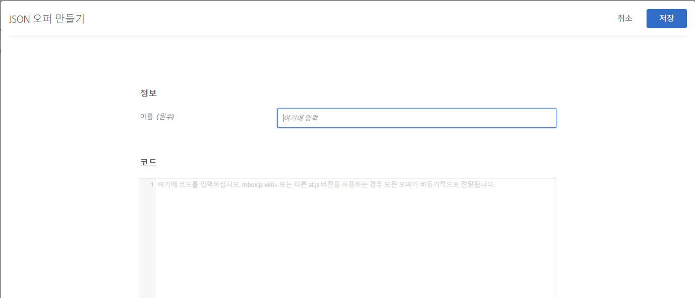
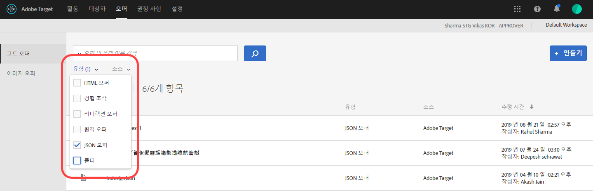

# JSON 오퍼 만들기{#create-json-offers}

[!UICONTROL 양식 기반 경험 작성기]에서 사용할 JSON 오퍼를 [!DNL Adobe Target]의 [!UICONTROL 오퍼 라이브러리]에서 만듭니다.

JSON 오퍼는 SPA 프레임워크이나 서버 측 통합에서 소비할 JSON 형식의 오퍼를 전송하는 데 Target의 의사 결정이 있어야 하는 사용 사례를 가능하게 하는 양식 기반 활동에서 사용할 수 있습니다.

JSON 오퍼를 사용하여 작업할 때에는 다음 정보를 고려하십시오.

* JSON 오퍼는 현재 AB 및 XT 활동에만 사용할 수 있습니다.
* JSON 오퍼는 양식 기반 활동에서만 사용할 수 있습니다.
* JSON 오퍼는 서버측 API, Mobile SDK 또는 NodeJS SDK를 사용할 때 바로 검색할 수 있습니다.
* 브라우저에서 JSON 오퍼는 at.js 1.2.3(또는 이상)을 통해서&quot;만&quot;,  [getOffer()](/help/c-implementing-target/c-implementing-target-for-client-side-web/adobe-target-getoffer.md)를 사용(`setJson` 작업을 사용하여 작업을 필터링함으로써)하여 검색할 수 있습니다.
* JSON 오퍼는 문자열이 아닌 기본 JSON 개체로 제공됩니다. 이러한 개체의 소비자는 개체를 문자열로 처리하고 JSON 개체로 변환하도록 더 이상 요구받지 않습니다.
* JSON 오퍼는 비시각적 오퍼이므로 다른 오퍼(예: HTML 오퍼)와는 대조적으로 자동으로 적용되지 않습니다. 개발자는 코드를 작성해야 [getOffer()](/help/c-implementing-target/c-implementing-target-for-client-side-web/adobe-target-getoffer.md).
* mbox.js를 사용하는 경우 JSON 오퍼가 지원되지 않습니다.

## JSON 오퍼 만들기 {#section_BB9C72D59DEA4EFB97A906AE7569AD7A}

1. **[!UICONTROL 오퍼]**&#x200B;를 클릭한 다음, **[!UICONTROL 코드 오퍼]** 탭을 선택합니다.
1. **[!UICONTROL 만들기]** > **[!UICONTROL JSON 오퍼]**&#x200B;를 클릭합니다.

   

1. 오퍼 이름을 입력합니다.
1. **[!UICONTROL 코드]** 상자에 JSON 코드를 입력하거나 붙여 넣습니다.
1. **[!UICONTROL 저장]**&#x200B;을 클릭합니다.

## 예 {#section_A54F7BB2B55D4B7ABCD5002E0C72D8C9}

JSON은 양식 기반 경험 작성기를 사용하여 만든 활동에서만 지원됩니다. 현재 JSON 오퍼를 사용할 수 있는 유일한 방법은 직접적인 API 호출을 통하는 것입니다.

다음은 한 예입니다.

```json
adobe.target.getOffer({ 
  mbox: "some-mbox", 
  success: function(actions) { 
    console.log('Success', actions); 
  }, 
  error: function(status, error) { 
    console.log('Error', status, error); 
  } 
});
```

성공 콜백에 전달된 작업은 개체의 배열입니다. 다음 컨텐츠가 있는 단일 JSON 오퍼가 있다고 가정하면,

```json
{ 
  "demo": {"a": 1, "b": 2} 
}
```

작업 배열의 구조는 다음과 같습니다.

```json
[ 
 { 
   action: "setJson", 
   content: [{ 
     "demo": {"a": 1, "b": 2} 
   }] 
 }  
]
```

JSON 오퍼를 추출하려면 작업을 반복하고 `setJson` 작업을 통해 해당 작업을 찾은 다음, 컨텐츠 배열을 반복합니다.

## 사용 사례 {#section_85B07907B51A43239C8E3498EF58B1E5}

다음 JSON 오퍼가 웹 페이지에 전달된다고 가정하겠습니다.

```json
{ 
    "_id": "5a65d24d8fafc966921e9169", 
    "index": 0, 
    "guid": "7c006504-c6f7-468d-a46f-f72531ea454c", 
    "isActive": true, 
    "balance": "$2,075.06", 
    "picture": "https://placehold.it/32x32", 
    "tags": [ 
      "esse", 
      "commodo", 
      "excepteur", 
    ], 
    "friends": [ 
      { 
        "id": 0, 
        "name": "Carla Lyons" 
      }, 
      { 
        "id": 1, 
        "name": "Ollie Mooney" 
      }, 
    ], 
    "greeting": "Hello, Stephenson Fernandez! You have 4 unread messages.", 
    "favoriteFruit": "strawberry" 
} 
  
```

다음 코드는 &quot;인사말&quot; 속성에 액세스하는 방법을 보여줍니다.

```json
adobe.target.getOffer({   
  "mbox": "name_of_mbox", 
  "params": {}, 
  "success": function(offer) {           
        console.log(offer[0].content[0].greeting); 
  },   
  "error": function(status, error) {           
      console.log('Error', status, error); 
  } 
});
```

## JSON 오퍼 유형별 오퍼 필터링 {#section_52533555BCE6420C8A95EB4EB8907BDE}

**[!UICONTROL 유형]** 드롭다운 목록을 클릭한 다음, **[!UICONTROL JSON 확인란을 선택하여 오퍼 라이브러리를 JSON 오퍼 유형별로 필터링할 수 있습니다.]**



