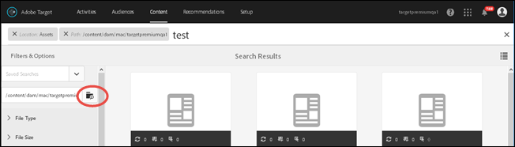

# 컨텐츠 검색 및 스마트 컬렉션 만들기{#search-content-and-create-smart-collections}

키워드로 자산을 검색하고, 검색 결과를 사용하여 자동으로 업데이트되는 스마트 컬렉션이라는 검색 폴더를 저장하십시오.

이 섹션에는 다음 정보가 포함됩니다.

* [키워드로 자산 검색](/help/c-experiences/c-manage-content/filter-and-search-content.md#section_2465A71BC95942588F586B1EC8B9E5DB)
* [스마트 컬렉션 저장](/help/c-experiences/c-manage-content/filter-and-search-content.md#section_5C95159543B5405EB8C8E47B518DF4AB)

## 키워드로 자산 검색 {#section_2465A71BC95942588F586B1EC8B9E5DB}

1. **[!UICONTROL 오퍼]** > **[!UICONTROL 이미지 오퍼]**&#x200B;를 클릭하여 [!UICONTROL 자산 라이브러리]에 액세스합니다.

   오른쪽 위 모서리에 있는 [!UICONTROL 카드 보기] 아이콘을 클릭하여 자산을 카드 보기 형식으로 표시할 수 있습니다.

   또는

   오른쪽 위 모서리에 있는 [!UICONTROL 목록 보기] 아이콘을 클릭하여 자산을 목록 보기 형식으로 표시할 수 있습니다.

1. 왼쪽 위 모서리에 있는 **[!UICONTROL 컨텐츠 전용]** 아이콘을 클릭하여 검색 상자를 표시합니다.

   

1. 검색 상자에 찾으려는 자산의 키워드를 입력한 다음 Enter 키를 누릅니다.

## 스마트 컬렉션 저장 {#section_5C95159543B5405EB8C8E47B518DF4AB}

스마트 컬렉션이라는 저장된 검색을 만들어 유사한 검색을 수행할 때 시간을 절약할 수 있습니다. 저장된 검색은 검색 결과를 사용하여 자동으로 업데이트되는 스마트 컬렉션을 생성합니다.

1. **[!UICONTROL 오퍼]** > **[!UICONTROL 이미지 오퍼]**&#x200B;를 클릭하여 [!UICONTROL 자산 라이브러리]에 액세스합니다.

   

1. 왼쪽 위 모서리에 있는 **[!UICONTROL 컨텐츠 전용]** 아이콘을 클릭하여 왼쪽 레일에 있는 [!UICONTROL 필터 및 옵션] 패널을 표시합니다.
1. **[!UICONTROL 찾아보기]** 아이콘을 클릭하여 [!UICONTROL 경로 선택] 대화 상자를 표시합니다.

   

1. 스마트 컬렉션의 기반으로 사용할 폴더로 이동하여 선택한 다음, **[!UICONTROL 확인]** 아이콘을 클릭합니다.

   

1. (선택 사항) 필터 범위를 좁히려면 파일 유형 및 크기와 같은 다양한 선택 사항 중에서 선택합니다.
1. **[!UICONTROL 필터 및 옵션]** 패널 아래에 있는 [!UICONTROL 스마트 컬렉션]을 클릭하여 저장 선택 사항을 표시합니다.

   

1. 스마트 컬렉션 이름을 지정하고, **[!UICONTROL 계정에 있는 모든 사용자가 이 스마트 컬렉션에 액세스할 수 있도록 하려는 경우]**&#x200B;공용[!DNL Target] 확인란을 선택한 다음, **[!UICONTROL 저장]**&#x200B;을 클릭합니다.

   나중에 사용할 수 있도록 저장된 검색 목록에 스마트 컬렉션이 추가됩니다.

   

[!UICONTROL 저장한 검색 결과] 드롭다운 목록에서 선택하여 연 다음, [!UICONTROL 스마트 컬렉션 편집]을 클릭하여 저장된 스마트 컬렉션을 편집할 수 있습니다.
