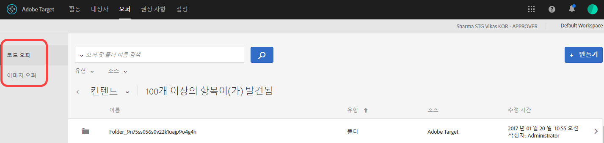
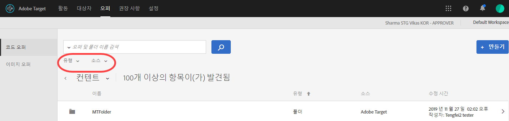
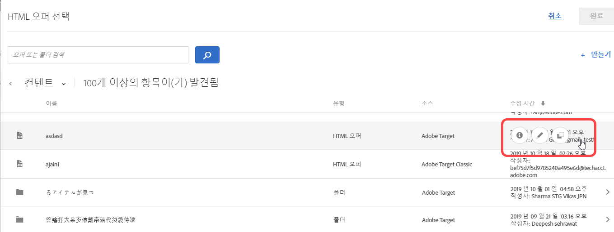
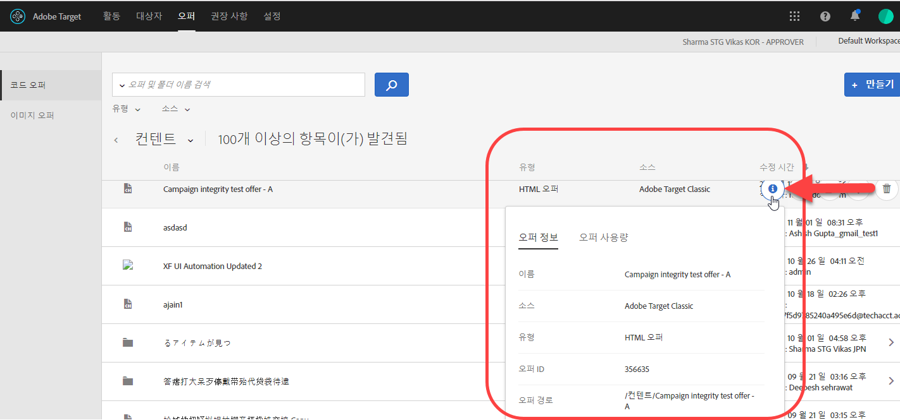
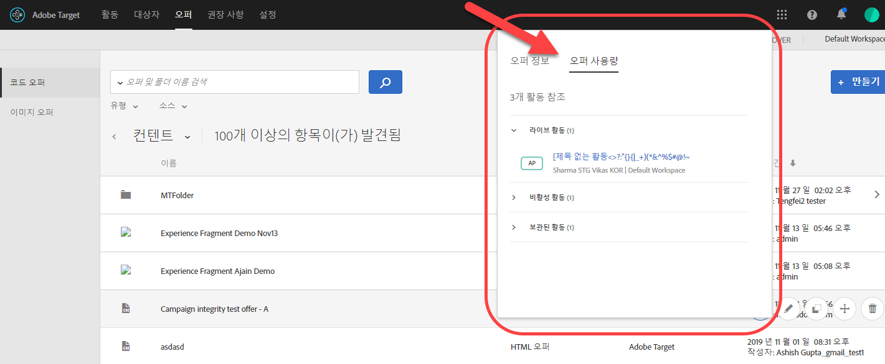
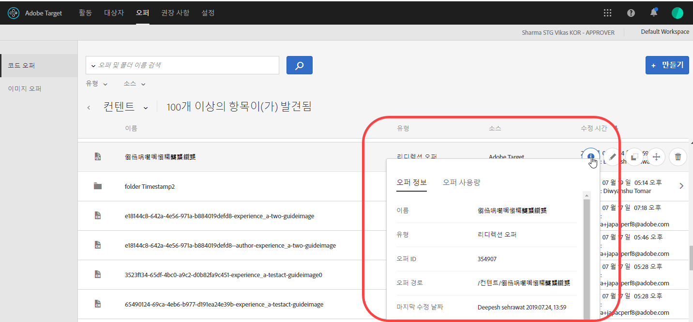
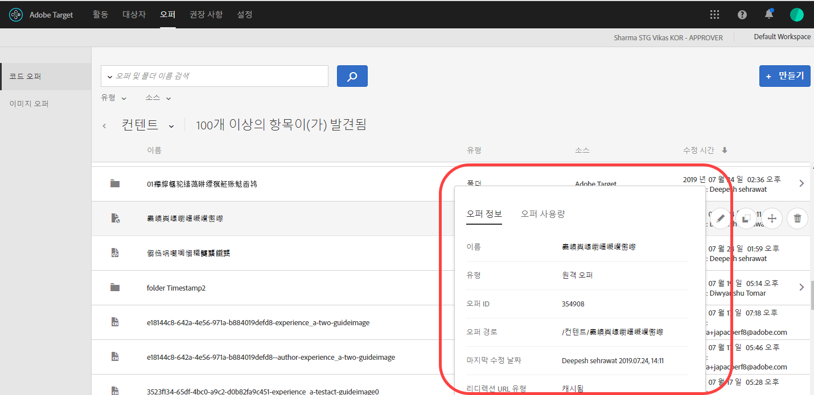

# 오퍼{#offers}

코드 오퍼 및 이미지 오퍼 컨텐츠를 관리하려면 오퍼 라이브러리를 사용하십시오.

>[!NOTE]
>
>2017년 1월 릴리스에서는 [!DNL Target Classic], [!DNL Adobe Experience Manager] (AEM), [!DNL Adobe Mobile Services] (AMS) 및 API를 통해 만들어진 오퍼가 [!DNL Target Standard/Premium] 사용자 인터페이스에 표시됩니다. 이 방법을 사용하여 지난 2년 동안(2015년 1월 이후) 업데이트된 오퍼가 표시됩니다. 초기 동기화는 조직에 있는 사용자가 처음 [!UICONTROL 오퍼] 페이지를 열 때 수행됩니다. 초기 동기화 시간은 데이터 양에 따라 다릅니다. 초기 동기화가 완료되면 데이터가 점점 더 많이 동기화됩니다. 이 릴리스 이전에 코드와 이미지가 동일한 폴더에 있었다면 [!DNL Target]에서 이 코드와 이미지를 두 개의 중복 폴더로 분할합니다. 업데이트 날짜 및 시간은 폴더를 마이그레이션한 시간을 나타내며 원래 폴더를 만든 날짜는 반영하지 않습니다.

라이브러리를 열려면 **[!UICONTROL 오퍼]**&#x200B;를 클릭하십시오. 이 라이브러리에는 [!DNL Target Standard/Premium], [!DNL Target Classic], [!DNL Adobe Experience Manager] (AEM), [!DNL Adobe Mobile Services] (AMS) 및 API를 통해 설정한 오퍼가 있습니다. [!DNL Target Classic] 또는 기타 솔루션에서 만든 오퍼는 [!DNL Target Standard/Premium]에서 편집할 수 있습니다.

[!UICONTROL 오퍼] 페이지의 오른쪽에는 유형별로 오퍼를 볼 수 있는 두 개의 탭, 코드 오퍼와 이미지 오퍼가 있습니다.

유형(HTML 오퍼, 리디렉션 오퍼, 원격 오퍼 또는 폴더)과 소스(Adobe Target, Adobe Target Classic, Adobe Experience Manager, Adobe Mobile Services 또는 API)별로 오퍼를 필터링할 수 있습니다.

원하는 항목을 마우스로 가리킨 다음, [편집] 또는 [복사] 아이콘을 클릭하여 폴더나 오퍼를 편집하거나 복사할 수 있습니다.

## 오퍼 정의 보기 {#section_6B059DD121434E6292CAB393507D010E}

오퍼를 열지 않고도 오퍼 라이브러리의 팝업 카드에서 오퍼 정의 세부 사항을 볼 수 있습니다.

예를 들어 컨텐츠 목록의 오퍼를 마우스로 가리킨 다음, 정보 아이콘을 클릭하여 HTML 오퍼에 대한 다음의 오퍼 정의 카드에 액세스합니다.

다음 정보를 사용할 수 있습니다.

* 이름
* 소스
* 유형
* 오퍼 ID
* 오퍼 경로
* 마지막 수정 날짜

각 오퍼의 정의 팝업 카드에서 코드 오퍼를 참조하는 활동을 보려면 [!UICONTROL 오퍼 사용량] 탭을 클릭하십시오. 이 기능은 이미지 오퍼에는 적용되지 않습니다. 오퍼를 편집할 때 이 방법으로 다른 활동에 영향을 주는 일을 피할 수 있습니다. 정보에는 라이브 활동 및 비활성 활동이 포함됩니다.

다음 오퍼 정의 카드는 리디렉션 오퍼용입니다.

다음 정보를 사용할 수 있습니다.

* 이름
* 소스
* 유형
* 오퍼 ID
* 오퍼 경로
* 마지막 수정 날짜
* 리디렉션 URL
* 모든 URL 매개 변수 포함(켜기 또는 끄기)
* mbox 세션 ID 전달(켜기 또는 끄기)

다음 오퍼 정의 카드는 원격 오퍼용입니다.

다음 정보를 사용할 수 있습니다.

* 이름
* 소스
* 유형
* 오퍼 ID
* 오퍼 경로
* 마지막 수정 날짜
* 리디렉션 URL 유형
* 절대 또는 상대 URL

## 교육 비디오: 콘텐츠 저장소  

다음 비디오에는 오퍼 관리에 대한 정보가 포함되어 있습니다.

* [Experience Cloud 자산 라이브러리](https://experienceleague.adobe.com/docs/core-services/interface/assets/creative-cloud.html)와 Target 컨텐츠 라이브러리 간 연결
* 사용자 지정 HTML 오퍼
* 시각적 경험 작성기의 사용자 지정 HTML 오퍼

>[!VIDEO](https://video.tv.adobe.com/v/17387)