# 수정 사항{#modifications}

페이지 수정 사항을 보고 추가로 수정(CSS 선택기, 순Mbox 및 사용자 지정 코드)할 수 있는 수정 사항 페이지에 대한 정보입니다.

수정 사항 페이지에는 VEC(시각적 경험 작성기)에서 수행한 페이지의 모든 변경 사항이 표시되며, 페이지의 각 요소를 클릭하고 [작업을 선택하여 추가로 변경할 수 있습니다](/help/c-experiences/c-visual-experience-composer/viztarget-options.md#reference_3BD1BEEAFA584A749ED2D08F14732E81). 각 변경 사항은 [!UICONTROL 수정 사항] 목록에서 별도의 작업 또는 요소로 표시됩니다. CSS 선택기, Mbox 및 사용자 지정 코드 수정 유형을 포함하여 수정 사항을 추가할 수도 있습니다.

## 수정 사항 개요 {#section_EE27E7572AA74397BBDED563B2B3D509}

[!UICONTROL 수정 사항] 페이지에는 VEC에서 페이지에 수행한 모든 변경 사항이 표시됩니다. 각 변경 사항은 [!UICONTROL 수정 사항] 목록에서 별도의 작업 또는 요소로 표시됩니다. 

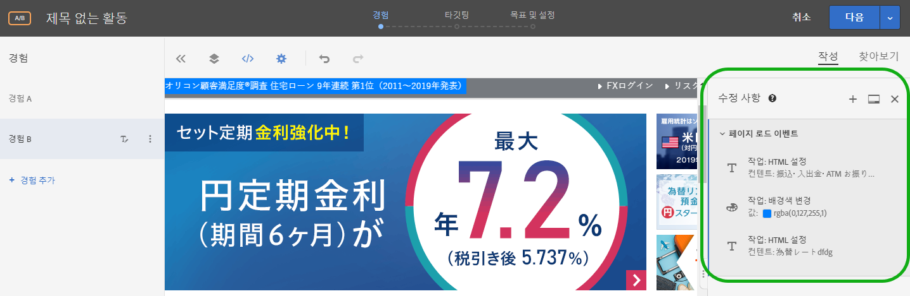

수정 사항 페이지에서 VEC를 사용하여 컨텐츠 전달 방법을 구성할 때 Target에서 선택한 선택기를 약간 변경합니다. 컨텐츠나 HTML 속성을 변경할 수 있습니다. 또한 코드를 편집하여 mbox 내의 HTML 오퍼에 해당하는 어떤 것을 생성할 수도 있습니다.

수정 사항 페이지에서 다음을 수행할 수 있습니다.

* 시각적 작성기에서 수행된 작업 보기.

   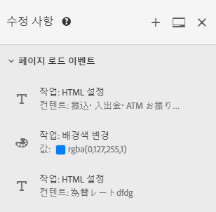

* 기존 작업 편집. 원하는 수정 사항을 마우스로 가리킨 다음, **[!UICONTROL 편집]** 아이콘을 클릭합니다.

   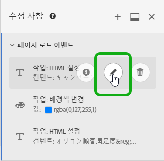

   변경 작업을 수행합니다.

   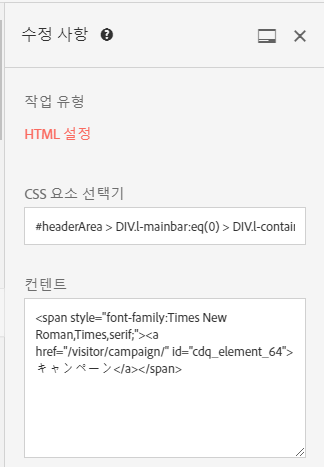

* 기존 작업 삭제. 원하는 수정 사항을 마우스로 가리킨 다음, **[!UICONTROL 삭제]** 아이콘을 클릭합니다.

   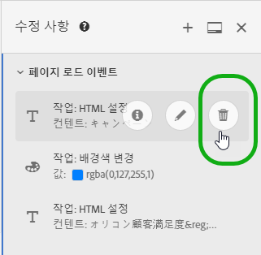

* 새 수정 사항을 추가합니다. **[!UICONTROL 수정 사항 추가]** 또는 + 아이콘을 클릭한 다음 아래에 설명된 대로 변경 사항을 지정합니다.

   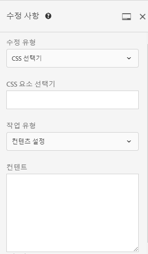

   한 개의 수정 사항이 작성되면 Target에는 패널 하단에 수정 사항 추가 단추 대신 수정 사항 패널 상단에 + 아이콘을 표시됩니다.

* 수정 사항 패널을 Target UI의 측면에 세로로 또는 맨 아래에 가로로 고정합니다. [!UICONTROL 고정] 아이콘을 클릭하여 두 설정 간에 전환합니다.

   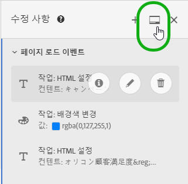

   다음 그림은 화면 맨 아래에 고정된 수정 사항 패널을 보여 줍니다.

   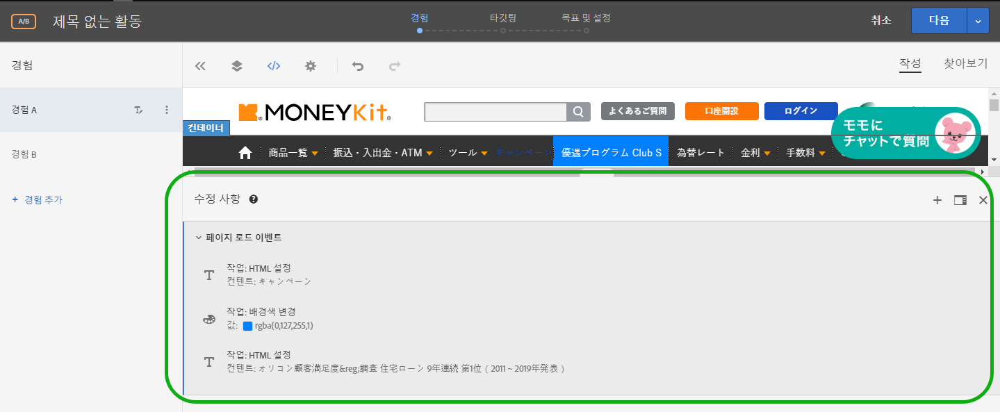

## 수정 사항 추가 {#section_C7ABCD5731A048CB8F90EDC31A32EDF9}

1. 선택한 경험에 대한 [!UICONTROL 수정 사항] 페이지를 표시하려면 VEC에서 **[!UICONTROL 수정 사항]** &lt;/> 아이콘을 클릭합니다.

   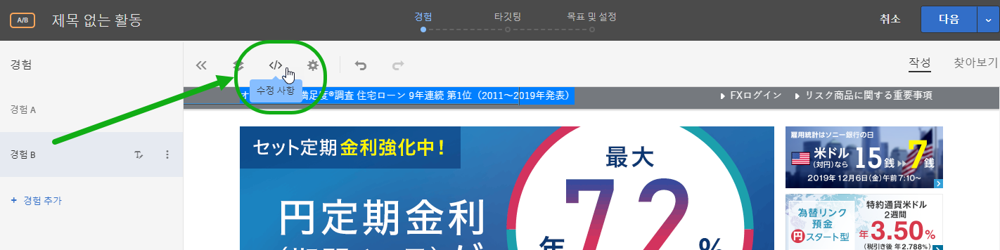

   >[!NOTE]
   >
   >양식 기반 경험 작성기에서 수정 사항 패널을 열려면 HTML 오퍼를 작성하거나 편집하십시오. 자세한 내용은 [양식 기반 경험 작성기](/help/c-experiences/form-experience-composer.md#task_FAC842A6535045B68B4C1AD3E657E56E)를 참조하십시오.

   [!UICONTROL 수정 사항] 페이지가 열리고 왼쪽의 시각적 모드와 오른쪽의 수정 사항 패널 사이에 화면이 분할됩니다. [!UICONTROL 고정] 아이콘을 클릭하여 수정 사항 패널을 Target UI의 측면에 세로로 또는 하단에 가로로 고정할 수 있습니다. 다음 그림에 있는 경험 A에는 이전 수정 사항이 없습니다.

   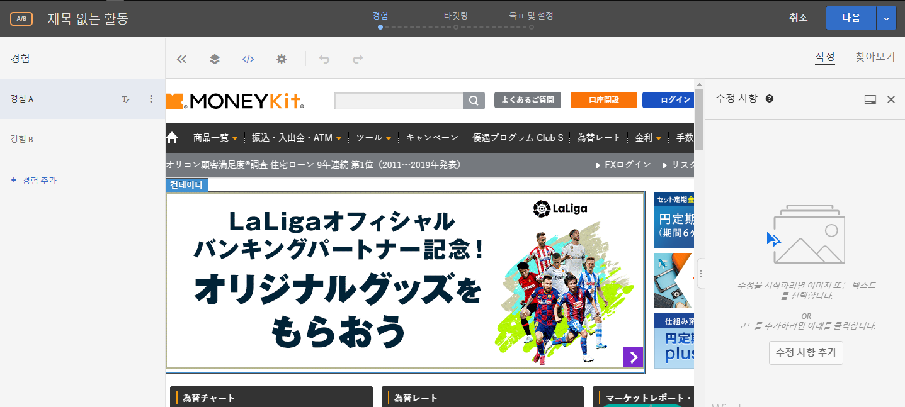

   경험 B에는 오른쪽의 [!UICONTROL 수정 사항] 패널에 이전 수정 사항이 표시됩니다.

   

1. 수정 사항을 추가하려면 다음을 수행하십시오.

   * 경험에 대한 이전 수정 사항이 작성되지 않은 경우 오른쪽의 **[!UICONTROL 수정 사항]** 패널 하단에 있는 [!UICONTROL 수정 사항 추가] 단추를 클릭하십시오.
   * 경험에 대한 이전 수정 사항이 있는 경우 오른쪽의 [!UICONTROL 수정 사항] 패널 상단에 있는 + 아이콘을 클릭하십시오.

   수정 패널에 표시되는 정보는 다음과 같습니다.

   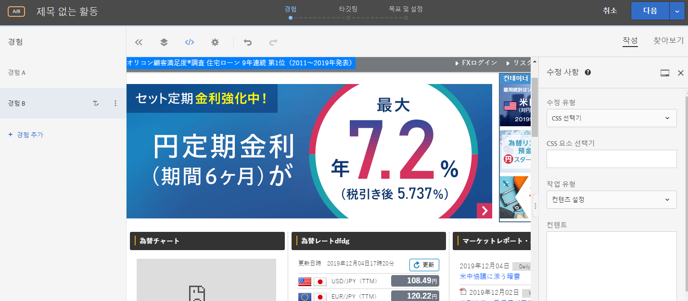

1. **[!UICONTROL 수정 유형]** 드롭다운 목록에서 원하는 유형을 선택합니다.

   | 수정 유형 | 세부 사항 |
   |--- |--- |
   | CSS 선택기 | CSS 요소 선택기 상자에서 수정할 CSS 요소를 지정하고, 작업 유형(컨텐츠 설정 또는 속성 설정)을 선택한 다음 필수 정보와 원하는 컨텐츠를 입력합니다. |
   | Mbox | Mbox 이름 및 원하는 컨텐츠를 지정합니다. |
   | 사용자 지정 코드 | 원하는 대로 [!UICONTROL `<HEAD>` 섹션에 코드 추가] 확인란을 선택하거나 선택 취소한 다음 사용자 지정 코드를 추가합니다.<br>[!UICONTROL `<HEAD>` 섹션에 코드 추가]를 선택한 경우 사용자 지정 코드가 `<head>` 섹션에 추가되며, 본문 또는 페이지 로드 이벤트를 기다리지 않고 실행됩니다. `<script>` 및 `<style>` 요소만 추가합니다. `<div>` 태그 및 기타 요소를 추가하면 나머지 `<head>` 요소가 `<body>`에 들어갈 수 있습니다. mbox.js 버전 60 이상 또는 at.js의 어떤 버전이든 사용하는 경우 모든 오퍼는 비동기적으로 전달됩니다.<br>[!UICONTROL `<HEAD>` 섹션에 코드 추가]를 선택 취소한 경우 `<body>` 태그 바로 다음에 사용자 지정 코드가 바로 실행됩니다. DOM 구조를 유지하려면 단일 `<div>`에 있는 모든 코드를 줄바꿈하십시오. mbox.js 버전 60 이상 또는 at.js의 어떤 버전이든 사용하는 경우 모든 오퍼는 비동기적으로 전달됩니다.<br>**참고**: 스크립트는 비동기적으로 실행됩니다. 이것은 예를 들어 `document.write`이나 유사한 스크립트 메서드를 사용할 수 없음을 의미합니다.<br>사용자 지정 코드에서는 VEC, 양식 기반 경험 작성기 및 HTML 오퍼 편집기 내에서 새로운 작업을 보고 편집하고 추가할 수 있는 비시각적 인터페이스를 사용할 수 있습니다. 이 패널에서는 경험의 코드를 볼 수 있으므로 더 복잡한 경험을 빌드하고 기존 경험을 미세 조정하고 문제를 해결하는 데 도움이 됩니다.<br>사용자 지정 코드는 HTML, JavaScript 및 CSS에 익숙한 고급 사용자를 위한 것입니다. 코드 보기는 변경 사항을 수정하거나 미세 조정하거나 선택기 문제를 해결하는 데 도움이 될 수 있습니다. 새로운 사용자 지정 코드 및 작업을 추가하는 데 사용할 수도 있습니다. 사용자 지정 코드를 두 개 이상 추가하고, 선택적으로 각 사용자 지정 코드에 이름을 지정할 수 있습니다.<br>**참고**: 사용자 지정 코드는 현재 A/B 및 경험 타깃팅(XT) 활동에만 사용할 수 있습니다. 사용자 지정 코드는 오버레이에 사용할 수 없으며, 리디렉션이 적용되는 경우에도 사용할 수 없습니다.<br>사용자 지정 코드는 다음과 같이 사용하는 경우 지원합니다.<ul><li>페이지의 맨 위에서 실행할 사용자 지정 JavaScript, HTML 또는 CSS 추가</li><li>수정 후에 VEC로 생성된 코드를 보거나 편집</li><li>선택기에 대한 HTML 컨텐츠 설정(CSS 선택기만 해당)</li><li>HTML 요소에 속성 설정</li><li>지역 mbox에서 전달할 오퍼 컨텐츠 추가</li><li>DOM Ready 시 교체, jQuery 사용</li><li>DOM Ready 시 교체, jquery 없음(Internet Explorer 8을 지원하지 않음)</li><li>&quot;elementOnLoad&quot; 플러그인을 통해 DOM 폴링으로 교체</li><li>사용자 지정 리디렉션</li></ul>사용자 지정 코드는 다음을 제공합니다.<ul><li>유용성 개선을 위한 라인 번호.</li><li>HTML 오퍼에 잘못된 구문을 방지하는 데 도움이 되는 구문 강조 표시.</li><li>여러 사용자 지정 코드를 작성하고 각각에 대한 선택적 이름을 제공하는 기능입니다. 여러 사용자 지정 코드를 만들면 이후에 디버깅이 쉬워집니다. 예를 들어 여러 수정을 수행하기 위해 단일 사용자 지정 코드를 만드는 대신, 설명이 포함된 이름을 사용하여 각 수정 사항에 대한 별도의 사용자 지정 코드를 만들 수 있습니다. 별도의 사용자 지정 코드를 사용하면 더 많은 모듈을 수정하고 관리할 수 있습니다. 활동에서 여러 사용자 지정 코드 실행은 코드가 작성된 순서대로 실행되는 것은 아닙니다.</li></ul>수정 사항 패널은 시각적 모드와 코드 모드 사이의 화면을 분할합니다. 두 모드는 동기화된 채 유지됩니다. 시각적으로 수행된 모든 수정 사항에는 해당하는 행이 코드 보기에 있습니다. 마찬가지로 코드 보기에서 수행된 모든 변경 사항은 시각적 경험에 표시됩니다. 코드 보기에서 행을 클릭하면 표시 모드 페이지에서 해당 요소가 선택됩니다.<br>사용자 지정 코드는 HTML, 스크립트 및 스타일을 지원합니다. 모든 유효한 HTML 코드나 스크립트는 추가하거나 편집할 수 있습니다. |

1. 필요에 따라 수정 사항을 추가하십시오.

## 사용자 지정 코드 사용 사례 {#section_26CB3360097D400FB02E20AE5FDBA352}

**[!UICONTROL 사용자 지정 코드]** 패널에는 페이지 로드 시작 시 실행되는 코드가 있습니다.

`<head>` 태그에서 JavaScript 코드를 실행할 수 있습니다. 코드 실행은 `<body>` 태그가 DOM에 생길 때까지 기다리지 않습니다.

이어지는 시각적 작업을 위한 선택기는 이 탭에 추가된 HTML 요소에 따라 다릅니다.

사용자 지정 코드 패널은 일반적으로 페이지의 맨 위에 JavaScript나 CSS를 추가하는 데 사용됩니다.

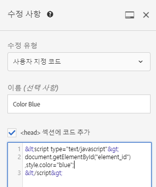

다음 작업을 수행하려면 **[!UICONTROL 사용자 지정 코드]** 탭을 사용하십시오.

* 외부 JavaScript 파일에 JavaScript 인라인 또는 링크 사용

   예를 들어, 요소의 색상을 변경하려는 경우 다음과 같습니다.

   ```
   <script type="text/javascript"> 
   document.getElementById("element_id").style.color = "blue"; 
   </script> 
   ```

* 외부 스타일 시트에 스타일 인라인 또는 링크 구성

   예를 들어, 오버레이 요소를 위한 클래스를 정의하려는 경우 다음과 같습니다.

   ```
   <style> 
   .overlay 
   { position: absolute; top:0; left: 0; right: 0; bottom: 0; background: red; } 
   </style> 
   ```

* HTML 코드 조각을 추가하여 새 요소 정의

   예를 들어, 위에 정의된 CSS 클래스를 사용하는 오버레이 `<div>`를 작성하려면 다음 HTML 코드 조각을 사용하십시오.

   ```
   <div class="overlay"></div>
   ```

* DOM Ready 시 교체, jQuery 사용

   ```
   <style>#default_content {visibility:hidden;}</style> 
   <script> 
   jQuery( document ).ready(function() { 
       jQuery("#default_content").html( "<span style='color:red'>Hello <strong>Again</strong></span>" ); 
       jQuery("#default_content").css("visibility","visible"); 
   }); 
   </script> 
   ```

* DOM Ready 시 교체, jQuery 없음(Internet Explorer 8을 지원하지 않음)

   ```
   <style>#default_content {visibility:hidden;}</style> 
   <script> 
   document.addEventListener("DOMContentLoaded", function(event) {  
       document.getElementById("default_content").innerHTML = "<span style='color:red'>Hello <strong>Again</strong></span>"; 
       document.getElementById("default_content").style.visibility="visible"; 
   }); 
   </script> 
   ```

* `elementOnLoad` 플러그인을 통해 DOM 폴링으로 교체

   이 작업의 장점은 교체가 DOM Ready보다 일찍 발생한다는 것입니다. 플러그인은 사전 숨기기 및 표시를 처리하며, 요소에 ID가 필요합니다.

   ```
   <style>#default_content {visibility:hidden;}</style> 
   <script> 
   /*elementOnLoad DOM Swizzling v3 ==>Mbox.js Extra Javascript*/window.elementOnLoad=function(e,l){var m=document.getElementById(e);if(m){setTimeout(function(){l(m);setTimeout(function(){m.style.visibility='visible';m.style.display='block'},20)},20)}else{setTimeout(function(){elementOnLoad(e,l)},20)}},addEvent=function(a){var d=document,w=window,wa=w.addEventListener,da=d.addEventListener,e='load',o='on'+e;if(wa){wa(e,a,false)}else if(da){da(e,a,false)}else if(d.attachEvent){w.attachEvent(o,a)}};addEvent(function(){setTimeout("elementOnLoad=function(){}",500)}); 
   elementOnLoad('default_content',function(e){ 
       e.innerHTML = "<span style='color:red'>Hello <strong>Again</strong></span>"; 
   }); 
   </script> 
   ```

* 기존 매개 변수, `s_tnt` 매개 변수(Analytics에 대한 이전 통합용), 레퍼러 매개 변수 및 mbox 세션을 전달하는 사용자 지정 리디렉션

   ```
   <style type="text/css">body{display:none!important;}</style> 
   <script type="text/javascript"> 
    var qs='';window.location.search?qs=window.location.search+'&':qs='?'; 
    window.location.replace('//www.mywebsite.com/'+qs+'s_tnt=${campaign.id}:${campaign.recipe.id}:${campaign.recipe.trafficType}&s_tntref='+encodeURIComponent(document.referrer)+'&mboxSession='+mboxFactoryDefault.getSessionId().getId()+''+window.location.hash+''); 
   </script> 
   ```

* 사용자 지정 코드에서 사용할 Adobe Target 경험 템플릿을 추가하십시오. Target 경험 템플릿은 공통된 마케터 사용 사례를 실행하는 데 사용할 구성 가능한 입력으로 사전 코딩된 샘플입니다. 이러한 경험 템플릿은 VEC 또는 양식 기반 경험 작성기를 통해 공통 사용 사례를 실행할 시작점으로 개발자 및 마케터에게 무료로 제공됩니다. 사용 사례에는 Lightbox, 회전 메뉴, 카운트다운 등이 포함됩니다.

   자세한 내용은 [경험 템플릿](/help/c-experiences/c-visual-experience-composer/c-vec-code-editor/experience-templates.md#concept_109BBD7EABC04DD39E6B7B1687786652)을 참조하십시오.

## 사용자 지정 코드 우수 사례 {#section_10DFFD9FB92A43C1BB444A45E0272B28}

**항상 하나의 요소에 사용자 지정 코드를 래핑합니다.**

예:

```
<div id="custom-code"> 
// My Code goes here 
</div>
```

수정 사항이 필요한 경우 이 컨테이너 내부에서 변경하십시오.

사용자 지정 코드가 더 이상 필요하지 않으면 이 컨테이너를 비워 두십시오. 그러나 제거하지는 마십시오. 이렇게 하면 다른 경험 수정 사항이 영향을 받지 않습니다.

**코드 편집기에서 만든 페이지에 대한 수정 사항에 요소 ID &quot;CDQID&quot;를 사용하지 마십시오.**

Target은 &quot;CDQID&quot; 값을 사용하는 새 요소 ID를 Target으로 수정한 페이지의 요소에 적용합니다. 이 ID는 Target에 의해 적용되므로 코드 편집기에서 추가 수정 사항이나 조정 사항에 사용해서는 안 됩니다.

**사용자 지정 코드 스크립트에서 document.write 작업을 수행하지 마십시오.**

스크립트는 비동기적으로 실행됩니다. 이로 인해 `document.write` 작업이 종종 페이지의 잘못된 위치에 나타납니다. 사용자 지정 코드에서 생성된 스크립트에는 `document.write`를 사용하지 않는 것이 좋습니다.

**요소를 만든 다음 수정하는 경우 원래 요소를 삭제하지 마십시오.**

각 변경 사항은 수정 사항 패널에 새 요소를 만듭니다. 두 번째 작업은 요소 1을 수정하므로, 요소 1을 삭제하면 해당 작업에서는 더 이상 수정할 사항이 없게 되며, 따라서 변경이 더 이상 작동하지 않습니다. 자세한 내용은 아래의 &quot;문제 해결&quot;을 참조하십시오.

**동일한 URL을 타깃팅하는 두 활동에 사용자 지정 코드 기능을 사용할 경우 주의하십시오.**

동일한 URL을 타깃팅하는 두 활동에 사용자 지정 코드 기능을 사용할 경우 JavaScript는 두 활동 모두의 페이지에 주입됩니다. Target은 전달된 컨텐츠의 순서를 자동으로 결정합니다. 코드가 배치에 종속되지 않는지 확인하십시오. 코드에 충돌이 없도록 하는 것은 여러분에게 달려 있습니다.

## 문제 해결 사용자 지정 코드 {#section_6C965CBC31C348D7AA5B57B63DAB9E7F}

**페이지의 구조적 변경 사항으로 인해 작업을 적용할 수 없다는 경고가 수신되었습니다. 어떤 의미입니까?**

이 메시지는 활동이 마지막으로 저장된 이후 페이지의 구조가 변경되었음을 나타냅니다.

찾아보기 모드를 사용하여 누락된 선택기에 도달할 수 있습니다. 경고 메시지에 표시된 대로 컨텐츠가 기대한 것처럼 보이도록 하려면 각 경험을 삭제하고 다시 만드는 것이 좋습니다.


***요소를 삭제할 때 &quot;이 작업을 삭제하면 후속 작업에 영향을 줄 수 있습니다&quot;라는 경고가 표시됩니다. 어떤 의미입니까?***

예를 들어, 다음 두 작업을 수행한 경우,

* 요소 1에 클래스 추가
* 요소 1에 대한 HTML 편집

각 변경 사항은 수정 사항 패널에 새 요소를 만듭니다. 두 번째 작업은 요소 1을 수정하므로, 요소 1을 삭제하면 두 번째 작업에서는 더 이상 수정할 사항이 없게 되며, 따라서 변경이 더 이상 작동하지 않습니다.

다시 말해, 텍스트가 있는 요소를 추가하면, 다른 텍스트로 해당 요소를 편집하는 별도의 작업에서 수정 사항 패널에 두 작업이 모두 별도의 요소로 표시됩니다. 요소를 편집한 경우 편집된 텍스트를 포함하고 여러분이 만든 원본을 수정하는 새 요소가 만들어진 것입니다. 만약 원래 요소를 삭제하면 편집된 텍스트는 편집된 요소를 찾을 수 없으며 표시되지 않습니다. 두 번째 요소는 요소 목록에는 남아 있지만, 변경되는 요소가 더 이상 존재하지 않으므로 이 요소는 페이지에 영향을 주지 않습니다.

***스크립트에서 `document.write`을 사용하여 만든 요소가 기대한 위치에 표시되지 않습니다.***

스크립트는 비동기적으로 실행됩니다. 이로 인해 `document.write` 작업이 종종 페이지의 잘못된 위치에 나타납니다. 따라서 사용자 지정 코드에서 작성된 스크립트에서는 `document.write`를 사용하지 않는 것이 좋습니다.

***사용자 지정 코드에서 내 JavaScript에 오류가 표시됩니다.***

유효한 JavaScript가 아닌 모든 인라인 JavaScript는 사용자 지정 코드에 오류를 표시합니다.

***사용자 지정 코드에서 변경을 실행 취소할 수 없습니다.***

현재 수정 사항 패널 및 사용자 지정 코드에서 편집 및 삭제 작업에 대해 실행 취소가 지원되지 않습니다. 이 작업 중 하나를 실행 취소하면 VEC에 있는 경험이 사용자 지정 코드에 표시되는 실제 작업과 다르게 나타날 수 있습니다. 그러나 사용자 지정 코드에서의 작업은 올바른 상태이며 전달에는 영향을 주지 않습니다. 이것은 UI 문제입니다. 경험을 새로 고치려면 경험을 저장하고 다시 열거나, 다음 단계로 이동했다가 돌아오십시오. 이러한 작업 중 하나는 경험을 다시 로드하므로 예상대로 표시되며, 수정 사항 패널의 작업과 일치합니다.

**사용자 지정 코드가 Internet Explorer 8에서 예상한 결과를 생성하지 않습니다.**

Target은 더 이상 IE8을 지원하지 않습니다.
