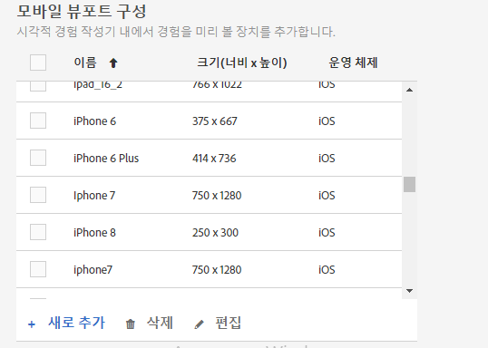
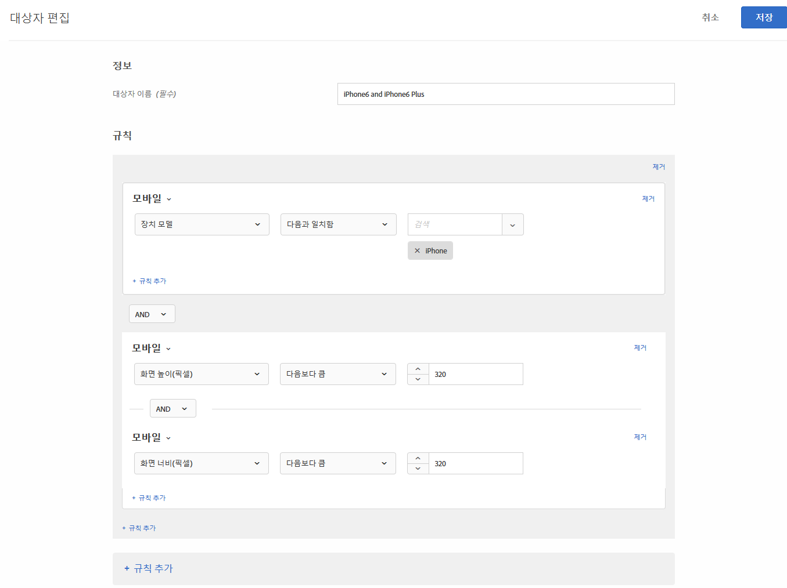

# 반응형 경험을 위한 모바일 보기 포트

모바일 뷰포트를 통해 다양한 크기의 화면에서 [!DNL Adobe Target] 활동이 어떻게 표시되는지 미리 볼 수 있습니다.

모바일 뷰어 미리 보기 기능은 다양한 장치, 창 또는 화면 크기에서 제대로 렌더링되는 응답형 사이트를 위해 설계되었습니다. 반응형 사이트는 데스크톱, 랩톱, 태블릿 또는 휴대폰 등 모든 화면 크기에 맞게 자동으로 조정되고 조정됩니다.

>[!NOTE]
>
> * 사이트가 응답하고 데스크톱 페이지에 있는 것과 동일한 요소가 다른 구성으로 모바일 페이지에서 사용되는 경우 모바일 뷰포트를 사용하십시오. `m.mysite.com`과 같은 별도의 구조가 있는 별도의 모바일 사이트가 있는 경우 대신 [여러 페이지 활동](/help/c-experiences/c-visual-experience-composer/multipage-activity.md#concept_277E096063E14813AC5D8EDFA1D2ED48)을 사용하십시오.
   >
   >
* 리디렉션 오퍼 오버레이와 겹칠 경우에는 모바일 뷰포트를 사용할 수 없습니다.

뷰포트는 화면의 웹 페이지에 의해 채워진 사각형의 크기로 정의됩니다. 브라우저 창의 크기에서 스크롤바와 도구 모음을 뺀 크기입니다. 브라우저는 &quot;CSS 픽셀&quot;을 사용합니다. Retina 화면을 사용하는 장치와 같이 많은 장치의 경우, 뷰포트는 광고된 장치 해상도보다 작습니다.

다음은 인기 있는 일부 장치의 뷰포트와 해상도입니다. [!DNL Target]에서 뷰포트 크기를 사용해야 합니다. 다양한 웹 사이트가 많이 사용되는 장치에 대한 뷰포트 크기 목록을 제공합니다. 예를 들어 [https://viewportsizer.com/devices/](https://viewportsizer.com/devices/)을 참조하거나 장치 제조업체의 웹 사이트를 참조하십시오.

| 장치 | 뷰포트 크기 | 장치 해상도 |
|---|---|---|
| iPhone SE | 375w x 667h | 750w x 1334h |
| iPhone 11 Pro Max | 414w x 896h | 1242w x 2688h |
| iPhone 11 Xs Max | 414w x 896h | 1242w x 2688h |
| iPhone11 | 414w x 896h | 828w x 1792h |
| iPhone 11 Xr | 414w x 896h | 828w x 1792h |
| iPhone 11 Pro | 375w x 812h | 1125w x 2436h |
| iPhone 11 X | 375w x 812h | 1125w x 2436h |
| iPhone 11 Xs | 375w x 812h | 1125w x 2436h |
| iPhone X | 375w x 812h | 1125w x 2436h |
| iPhone 8 Plus | 414w x 736h | 1080w x 1920h |
| iPhone8 | 375w x 667h | 750w x 1334h |
| iPhone 7 Plus | 414w x 736h | 1080w x 1920h |
| iPhone7 | 375w x 667h | 750w x 1334h |
| iPhone6s 플러스 | 414w x 736h | 1080w x 1920h |
| iPhone6s | 375w x 667h | 750w x 1334h |
| iPhone 6 Plus | 414w x 736h | 1080w x 1920h |
| iPhone6 | 375w x 667h | 750w x 1334h |
| iPad Pro | 1024w x 1366h | 2048w x 2732h |
| iPad Third &amp; Fourth Generation | 768w x 1024h | 1536w x 2048h |
| iPad Air 1 및 2 | 768w x 1024h | 1536w x 2048h |
| iPad Mini | 768w x 1024h | 768w x 1024h |
| iPad Mini 2 및 3 | 768w x 1024h | 1536w x 2048h |
| Nexus 6P | 411w x 731h | 1440w x 2560h |
| Nexus 5X | 411w x 731h | 1080w x 1920h |
| Google Pixel | 411w x 731h | 1080w x 1920h |
| Google Pixel XL | 411w x 731h | 1440w x 2560h |
| Google Pixel 2 | 411w x 731h | 1080w x 1920h |
| Google Pixel 2 XL | 411w x 823h | 1440w x 2880h |
| Samsung Galaxy Note 5 | 480w x 853h | 1440w x 2560h |
| LG G5 | 480w x 853h | 1440w x 2560h |
| One Plus 3 | 480w x 853h | 1080w x 1920h |
| Samsung Galaxy S9 | 360w x 740h | 1440w x 2960h |
| Samsung Galaxy S9+ | 360w x 740h | 1440w x 2960h |
| Samsung Galaxy S8 | 360w x 740h | 1440w x 2960h |
| Samsung Galaxy S8+ | 360w x 740h | 1440w x 2960h |
| Samsung Galaxy S7 | 360w x 640h | 1440w x 2560h |
| Samsung Galaxy S7 Edge | 360w x 640h | 1440w x 2560h |
| Nexus 7 (2013) | 600w x 960h | 1200w x 1920h |
| Nexus 9 | 768w x 1024h | 1536w x 2048h |
| Samsung Galaxy Tab 10 | 800w x 1280h | 800w x 1280h |
| Chromebook Pixel | 1280w x 850h | 2560w x 1700h |

특정 장치의 사용자에게 활동을 전달하려면 활동 다이어그램에서 해당 장치에 적합한 대상을 선택하십시오. 모바일 웹 작성기를 사용하여 해당 장치용 활동의 페이지를 편집하십시오. 전체 디지털 경험에서 활동을 실행하고 모든 장치에서 적절히 표시되는지 확인하려면 타깃팅을 적용하지 말고 모바일 뷰포트를 사용하여 각 화면 크기에서 활동을 미리 보십시오.

응답형 사이트가 있는 경우 일반적으로 사이트는 특정 화면 크기의 장치에서 액세스하면 다른 보기에서 열리도록 디자인되어 있습니다. 새 보기를 트리거하는 이러한 화면 크기는 CSS 중단점으로 알려져 있습니다. CSS 중단점은 방문자에게 최적의 레이아웃을 표시하기 위해 웹 사이트 컨텐츠가 장치 폭에 따라 응답하는 지점입니다. CSS 중단점을 [미디어 쿼리](https://developer.mozilla.org/en-US/docs/Web/CSS/Media_Queries/Using_media_queries)라고도 합니다.

CSS 중단점을 [!DNL Target]에 저장하면 정의한 각 뷰에 대한 경험을 미리 볼 수 있습니다. 이러한 각 경험은 [!DNL Target] 인터페이스의 모바일 뷰포트에 표시됩니다. 디스플레이 상단에 있는 해당 뷰포트를 클릭하여 각 화면 크기에 대한 보기를 여십시오.

사이트가 응답하지 않는 경우에도 활동이 특정 장치에 타깃팅되어 있으면 모바일 웹 작성기를 사용하여 여전히 사이트를 볼 수 있습니다.

>[!IMPORTANT]
>
>모바일 뷰포트 내에서 경험을 편집할 수는 있지만 이러한 변경 사항은 작업 중인 뷰포트뿐만 아니라 모든 뷰포트 및 장치에 적용됩니다. 마찬가지로, 일반 데스크톱 보기에서 경험을 편집하면 페이지가 데스크톱 보기뿐만 아니라 모든 화면 크기용으로 변경됩니다. 현재 뷰포트별 페이지 변경 사항은 지원되지 않습니다.

## 모바일 뷰포트 구성 {#task_B4B161499DC0470584ED922A4D20FCAB}

경험을 만들 때 사용 가능하게 할 모바일 뷰포트를 구성하십시오.

1. **[!UICONTROL 관리]** > **[!UICONTROL 시각적 경험 작성기]**&#x200B;를 클릭합니다.
1. 새 모바일 뷰포트를 추가하려면 **[!UICONTROL 모바일 뷰포트 구성]** 섹션에서 **[!UICONTROL 추가]**&#x200B;를 클릭합니다.

   

   기존 모바일 뷰포트의 구성을 변경하려면 해당 뷰포트를 선택한 다음 [!UICONTROL 편집](연필) 아이콘을 클릭합니다.

1. 모바일 뷰포트의 이름을 입력합니다.

   모바일 뷰포트에 쉽게 인식할 수 있는 수사적 이름을 지정합니다. 이름은 최대 36자까지 사용할 수 있습니다.

1. 모바일 장치의 너비 및 높이를 모두 입력하여 화면 크기를 지정합니다.

   너비는 150~968픽셀 사이일 수 있습니다. 높이는 150~1280픽셀 사이일 수 있습니다.

1. (선택 사항) 장치의 운영 체제를 선택합니다.

   옵션:

   * Android
   * iOS
   * Windows
   * Symbian
   * Blackberry

   [Enhanced Experience Composer](/help/c-experiences/experiences.md#section_34265986611B4AB8A0E4D6ACC25EF91D)를 사용하고 운영 체제를 선택하면 페이지를 볼 때 [!DNL Target]는 해당 장치를 에뮬레이션합니다. 예를 들어 Android에 대한 모양과 느낌이 반응형 사이트의 iOS와 다른 경우 [!DNL Target]은 해당 비헤이비어를 모방합니다.

1. **[!UICONTROL 저장]**&#x200B;을 클릭합니다.

>[!NOTE]
>
>사용 중인 모바일 뷰포트를 삭제하려고 하면 다음 메시지가 표시됩니다.&quot;이 뷰포트는 현재 하나 이상의 활동과 연결되어 있습니다. 삭제하기 전에 해당 활동에서 뷰포트를 제거해야 합니다.&quot;

## 반응형 경험 {#task_D6332438B5EE48CCA8AF199270F1CAEF} 만들기

모바일 뷰포트를 [!DNL Target] 활동에 추가하여 모바일 화면에 대한 반응형 경험을 만듭니다.

1. [원하는 활동](/help/c-activities/activities.md)을 만듭니다.
1. 시각적 경험 작성기에서 **[!UICONTROL 설정]** 톱니바퀴 아이콘을 클릭하고 **[!UICONTROL 모바일 뷰포트 추가]**&#x200B;를 선택합니다.

   

1. **[!UICONTROL 장치]** 아이콘을 클릭한 다음, 모바일 뷰포트가 필요한 각 장치를 활성화합니다.

   

   모바일 뷰포트는 너비가 가장 좁은 것부터 가장 넓은 순으로 표시됩니다.

1. 원하는 대로 모바일 뷰포트를 편집합니다.

   경험에 대한 모든 변경 사항(예를 들어, 제목의 텍스트를 변경하는 경우)은 모든 장치의 경험에 적용됩니다.

   뷰포트의 이름 위로 마우스를 가져가 뷰포트의 크기를 볼 수 있습니다.

   

1. 원하는 경우 원하는 방향 아이콘을 클릭하여 세로 모드와 가로 모드 간을 전환합니다.

   

## 사용 사례:Target 2 iPhone 버전 {#task_CC3144BF5BA54034996E1D3DB0BC1A35}

이 사용 사례는 2개의 iPhone 버전에 대한 경험을 구성하는 방법을 보여줍니다.iPhone 6 및 iPhone 6 Plus.

1. **[!UICONTROL 관리]** > **[!UICONTROL 시각적 경험 작성기]**&#x200B;를 클릭합니다.
1. **[!UICONTROL 모바일 뷰포트 구성]** 섹션에서 iPhone 6 및 iPhone 6 plus용 모바일 뷰포트를 만듭니다.

   각 뷰포트에 다음 설정을 사용합니다.

   | 이름 | 너비 | 높이 | 운영 체제 |
   |---|---|---|---|
   | iPhone6 | 375 | 667 | iOS |
   | iPhone 6 Plus | 414 | 736 | iOS |

   

1. 타깃팅할 경험으로 활동을 만듭니다.
1. iPhone 6 또는 iPhone 6 Plus에서 사이트에 액세스하는 방문자를 타깃팅하려는 경험을 선택합니다.
1. 타겟을 선택할 때 **[!UICONTROL 대상 만들기]**&#x200B;를 클릭한 다음, 아래 그림과 같이 대상을 구성합니다.

   

   휴대폰은 가로로 회전할 수 있으므로 높이와 너비를 둘 다 320보다 크게 지정하면 iPhone 장치 모델과 결합할 때 6 및 6 Plus만 충족할 수 있는 조건이 동시에 생성됩니다.
1. **[!UICONTROL 저장]**&#x200B;을 클릭합니다.
1. 평소대로 활동을 계속 설정합니다.

## 교육 비디오

다음 비디오에는 이 문서에서 설명한 개념에 대한 자세한 정보가 포함되어 있습니다.

### 시각적 경험 작성기(2/2)(7:29)  

다음 데모 비디오에는 시각적 경험 작성기에서 모바일 뷰포트로 작업하는 방법에 대한 정보가 포함되어 있습니다.

* 경험 이름 변경 및 경험 복제
* 리디렉션 경험 만들기
* 활동을 단일 URL 또는 URL 그룹에 타깃팅
* 다중 페이지 활동 만들기
* 응답형 웹 사이트용 경험 미리 보기 및 빌드
* 오버레이를 사용하여 요소 유형을 강조 표시

>[!VIDEO](https://video.tv.adobe.com/v/17401)

### Adobe Target 의 계정 환경 설정

이 비디오에는 비디오의 4:40부터 모바일 뷰어 설정에 대한 정보가 포함되어 있습니다.

>[!VIDEO](https://video.tv.adobe.com/v/17379)