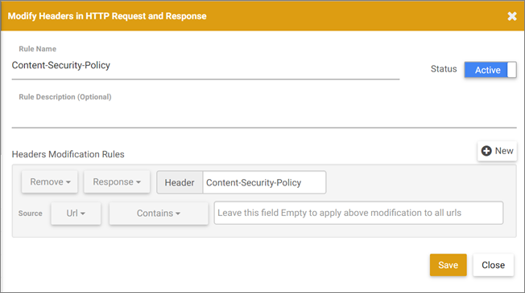

# 시각적 경험 작성기 및 고급 경험 작성기 관련 문제 해결

특정 조건에서 [!DNL Adobe Target] VEC(Visual Experience Composer) 및 EEC(Enhanced Experience Composer)에서 디스플레이 문제와 기타 문제가 발생하는 경우가 있습니다.

## 최근 발표된 Google Chrome SameSite 쿠키 실행 정책은 VEC 및 EEC에 어떤 영향을 줍니까?{#samesite}

최신 변경 사항(2020년 8월)을 통해 Chrome 80+ 브라우저 버전을 사용하는 모든 사용자:

* *VEC(VEC Helper 확장 설치 및 활성화 여부)를 사이트의 암호로 보호된 페이지에서 사용할 수 없게 됩니다.* 이것은 사이트 로그인 쿠키가 제3자 쿠키로 간주되며 로그인 요청과 함께 전송되지 않기 때문입니다. 유일한 예외는 고객 사이트 로그인 쿠키에 이미 SameSite 매개 변수가 &quot;none&quot;으로 설정된 경우입니다.
* 활동을 편집하는 동안 *은(는) [!DNL Target] 라이브러리를 다운로드할 수 없습니다(아직 사이트에 있지 않은 경우).* 이는 다운로드 호출이 고객 도메인에서 안전한 Adobe 도메인으로 수행되고 인증되지 않은 것으로 거부되기 때문입니다.
* `adobemc.com domain`의 쿠키에 대해 SameSite 특성을 설정할 수 없기 때문에 EEC는 모든 사용자에 대해 *이(가)* 함수가 아닙니다. 이 속성이 없으면 브라우저가 이러한 쿠키를 거부하여 EEC가 실패합니다.

Adobe에서 업데이트된 VEC Helper 확장을 Google Chrome Store에 제출했습니다. 이 확장은 필요한 경우 쿠키 속성을 덮어써서 `SameSite="none"` 속성을 설정합니다. [업데이트된 익스텐션은 ](https://chrome.google.com/webstore/detail/adobe-target-vec-helper/ggjpideecfnbipkacplkhhaflkdjagak?hl=en)에서 찾을 수 있습니다. VEC 도우미 확장 설치 및 사용에 대한 자세한 내용은 [Visual Experience Composer 도우미 확장](/help/c-experiences/c-visual-experience-composer/r-troubleshoot-composer/vec-helper-browser-extension.md)을 참조하십시오.

사이트 쿠키를 자신의 이름으로 지정해야 합니다. [!UICONTROL 쿠키] 슬라이더를 설정 위치로 전환한 다음 이름과 쿠키 도메인별로 쿠키를 지정합니다. 쿠키 이름은 &quot;mbox&quot;이고 쿠키 도메인은 mbox를 제공하는 도메인의 두 번째 및 최상위 수준입니다. 회사 도메인에서 제공되기 때문에 쿠키는 자사 쿠키입니다. 예: `mycompany.com`. 자세한 내용은 *Experience Cloud 인터페이스 사용자 안내서*&#x200B;의 [Adobe Target 쿠키](https://experienceleague.adobe.com/docs/core-services/interface/ec-cookies/cookies-target.html)를 참조하십시오.

### 대체 요소 및 해결 방법

다음 옵션 중 하나를 사용하여 VEC와 EEC가 예상대로 계속 작동하도록 하십시오.

* 업데이트된 [VEC 도우미 확장](https://chrome.google.com/webstore/detail/adobe-target-vec-helper/ggjpideecfnbipkacplkhhaflkdjagak?hl=en)을 다운로드하여 사용합니다.
* Mozilla Firefox 브라우저를 사용합니다. Firefox는 아직 이 정책을 시행하지 않습니다.
* Chrome을 계속 사용하지만 `chrome://flags/#same-site-by-default-cookies` 플래그를 &quot;Disabled&quot;로 설정합니다.

   >[!NOTE]
   >
   >쿠키에 이미 서버에서 &quot;Lax&quot; 또는 &quot;Strict&quot;로 설정된 SameSite 특성이 있는 경우 이 값은 *a1/>이(가) 충분하지 않습니다.*

## [!DNL Target]은(는) 다중 수준 iframe을 지원합니까?

Target은 여러 수준의 iframe를 지원하지 않습니다. 웹 사이트가 하위 iframe이 있는 iframe을 로드하는 경우 타겟 라이브러리(at.js 및 mbox.js)는 상위 iframe과만 상호 작용합니다. 타겟 라이브러리는 하위 iframe과 상호 작용하지 않습니다.

해결 방법으로, 하위 iframe의 URL을 사용하여 경험에 페이지를 추가할 수 있습니다.

## 페이지를 편집하려고 할 때 페이지 대신 회전기가 표시됩니다. (VEC 및 EEC) {#section_313001039F79446DB28C70D932AF5F58}

이 문제는 URL에 # 문자가 포함된 경우에 발생할 수 있습니다. 이 문제를 해결하려면 시각적 경험 작성기에서 찾아보기 모드로 전환했다가 다시 작성 모드로 전환하십시오. 회전자가 사라지고 페이지가 로드됩니다.

## CSP(Content Security Policy) 헤더가 내 웹 사이트의 [!DNL Target] 라이브러리를 차단합니다. (VEC 및 EEC) {#section_89A30C7A213D43BFA0822E66B482B803}

웹 사이트의 CSP 헤더가 Target 라이브러리를 차단할 경우, 웹 사이트가 로드되더라도 편집할 수 없으면 Target 라이브러리가 차단되지 않았는지 확인하십시오.

>[!NOTE]
>
>다음 정보 외에 Google Chrome용 [Adobe Target VEC Helper 브라우저 확장 프로그램](/help/c-experiences/c-visual-experience-composer/r-troubleshoot-composer/vec-helper-browser-extension.md)을 사용할 수 있습니다.

해결 방법으로, 다음과 같이 CSP 헤더를 제거하도록 Requestly 규칙을 구성할 수 있습니다.

리소스가 VEC 내에서 로드되지 않도록 하는 모든 헤더에 대해 유사한 Requestly 규칙을 구성할 수 있습니다.

Requestly의 경우 헤더를 제거해야 할 때마다 다음 중 하나를 수행해야 합니다.

* 해당 URL에 대해서만 헤더가 제거되도록 VEC에서 열려고 하는 URL에 대한 URL 규칙을 추가하십시오.
* VEC에서 편집할 때 규칙을 활성화하고 VEC를 사용하지 않을 때 규칙을 비활성화하십시오.

## VEC 또는 EEC가 손상된 것으로 나타나거나 저장된 활동을 다시 편집할 때 초기화되지 않습니다. (VEC 및 EEC) {#section_5AC3BA8F8FBB451EA814F298D0645E54}

경험을 정의한 후에 시각적 경험 작성기 외부에서 웹 사이트가 변경될 경우, 재편집을 위해 활동을 열 때 이전에 작업이 수행된 선택기를 찾을 수 없습니다. 페이지가 손상된 것처럼 보이고 경고는 표시되지 않습니다.

## VEC 또는 EEC가 회전 배너와 자바스크립트를 포함하는 기타 콘텐츠를 표시하지 않습니다. (VEC 및 EEC) {#section_8B5BE6EB050B42D6A14A054724C41330}

기본적으로 시각적 경험 작성기는 자바스크립트 요소를 차단합니다. 시각적 경험 작성기 설정에서 자바스크립트를 비활성화하면 이러한 요소를 사용할 수 있습니다. 사이트가 설정되는 방식에 따라, 일부 항목은 계속 잘못 표시되거나 사용 불가능한 상태로 남아 있을 수 있습니다.

## 호스팅된 내 target.js 파일이 후속 페이지 다시 로드 시 로드되지 않습니다. (VEC 및 EEC) {#section_87F6418C2CD142A7B4D1E7037935F81F}

이 문제는 고객의 mbox.js 버전이 57 이전일 때(예: 버전 56 또는 이전 버전) 발생합니다.

모든 VEC 사용자는 [최신 mbox.js 버전](/help/c-implementing-target/c-implementing-target-for-client-side-web/t-mbox-download/mboxjs-change-log.md#reference_DBB5EDB79EC44E558F9E08D4774A0F7A)으로 업그레이드하거나 버전 57 이상으로 업그레이드하는 것이 좋습니다. [at.js로 전환하는 것](/help/c-implementing-target/c-implementing-target-for-client-side-web/t-mbox-download/c-target-atjs-implementation/target-atjs-implementation.md#concept_8AC8D169E02944B1A547A0CAD97EAC17)도 고려해 보십시오.

## 페이지에서 한 요소를 변경하면 여러 요소가 변경됩니다. (VEC 및 EEC) {#section_309188ACF34942989BE473F63C5710AF}

페이지의 여러 요소에 동일한 DOM 요소 ID를 사용하는 경우, 해당 요소 중 하나를 변경하면 해당 ID를 사용하는 모든 요소가 변경됩니다. 이러한 문제가 발생하지 않도록 하려면 각 페이지에서 ID를 한 번만 사용해야 합니다. 이것이 표준 HTML 우수 사례입니다. 자세한 내용은 [페이지 수정 시나리오](/help/c-experiences/c-visual-experience-composer/r-troubleshoot-composer/vec-scenarios.md#concept_A458A95F65B4401588016683FB1694DB)를 참조하십시오.

## iFrame 버스팅 사이트에 대한 경험을 편집할 수 없습니다. (VEC 및 EEC) {#section_9FE266B964314F2EB75604B4D7047200}

이 문제는 고급 경험 작성기를 통해 해결될 수 있습니다. **[!UICONTROL 관리]** > **[!UICONTROL Visual Experience Composer]**&#x200B;를 클릭한 다음 향상된 경험 작성기를 사용할 수 있는 확인란을 선택합니다. 향상된 경험 작성기는 Adobe가 관리하는 프록시를 사용하여 편집할 페이지를 로드합니다. 이렇게 하면 iFrame 버스팅 사이트를 편집할 수 있고, Adobe Target 코드를 아직 추가하지 않은 사이트 및 페이지도 편집할 수 있습니다. 코드가 추가될 때까지 활동은 사이트로 전달되지 않습니다. 일부 사이트는 고급 경험 작성기를 통해 로드되지 않을 수 있습니다. 이 경우 이 옵션을 선택 취소하고 iFrame을 통해 시각적 경험 작성기를 로드할 수 있습니다. []

>[!NOTE]
>
>로컬로 호스팅된 페이지 또는 네트워크 외부에서 액세스할 수 없는 페이지는 Adobe 프록시 서버에서 액세스할 수 없으며 EEC에서 열 수 없습니다. 이러한 페이지에는 스테이징 URL, UAT(사용자 승인 테스트) URL 또는 로컬로 호스팅된 페이지가 포함될 수 있습니다.

## mbox/타겟 구현이 아직 수행되지 않은 페이지에 대한 테스트를 설정하고 싶습니다. (VEC 및 EEC) {#section_DE63BCCB5B124E10A71FA579B582A80A}

위의 &quot;iFrame 버스팅 사이트에 대한 경험을 편집할 수 없음&quot;을 참조하십시오.

## 텍스트/HTML 편집 또는 텍스트/HTML 변경에서 사용한 굵게 및 기울임체 텍스트 스타일이 내 페이지에 표시되지 않습니다. 이러한 스타일 변경 사항을 적용한 후에 텍스트가 사라지는 경우도 있습니다. (VEC 및 EEC) {#section_7A71D6DF41084C58B34C18701E8774E5}

A/B 또는 경험 타깃팅 활동의 경우 시각적 경험 작성기의 **[!UICONTROL 텍스트/HTML 편집]**&#x200B;에서, 자동화된 개인화 또는 다변량 테스트 활동의 경우 **[!UICONTROL 텍스트/HTML 변경]**&#x200B;을 사용하여 텍스트를 굵게 또는 기울임체로 설정하는 경우 시각적 경험 작성기에서 페이지에 해당 스타일이 적용되지 않거나 텍스트가 사라질 수 있습니다. 이것은 서식 있는 텍스트 편집기가 이러한 스타일을 적용하는 방식이 웹 사이트 마크업을 방해할 수 있기 때문입니다.

이 문제가 표시되면 다음을 수행합니다.

1. 서식 있는 텍스트 편집기에서 **[!UICONTROL HTML]** 단추를 클릭하여 소스 편집 모드에 들어갑니다.
1. 스타일 텍스트 요소를 찾습니다.

   * 굵게 텍스트의 경우 `<strong>` 요소를 `<b>`로 변경하십시오.

   * 기울임체 텍스트의 경우 `<em>` 요소를 `<i>`로 변경하십시오.

## 자동화된 개인화 활동의 경우, VEC 또는 EEC에서 이미지 대체 기능이 손상된 것으로 나타납니다. (VEC 및 EEC) {#section_88AABFDFE6A3420299B0D508B12A3994}

이미지 오퍼를 위치에 추가하면 VEC 또는 EEC에서 원래 이미지 공간의 전체 차원이 사용됩니다. 전달 시에는 이미지가 확장되지 않으며 원래 그대로 표시되므로 전달에는 영향을 주지 않습니다.
