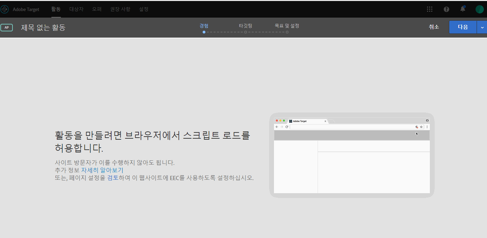

# 브라우저에서 혼합 컨텐츠 사용{#enabling-mixed-content-in-your-browser}

일부 브라우저의 경우 보안 컨텐츠가 비보안 컨텐츠와 혼합된 경우 페이지 표시를 차단합니다.

## 브라우저에서 혼합 컨텐츠 사용 {#concept_46D022D50280468C9EF6D5DF6EFC911C}

일부 브라우저의 경우 보안 컨텐츠가 비보안 컨텐츠와 혼합된 경우 페이지 표시를 차단합니다.

시각적 경험 작성기(VEC)에서 혼합(보안 및 비보안) 컨텐츠를 포함하는 페이지를 열려고 시도하는 경우, HTTP 사이트나 혼합 호출(HTTPS와 HTTP)이 있는 사이트를 열 수 있도록 브라우저에서 차단 기능을 비활성화하는 방법을 보여주는 메시지가 표시됩니다.

이전에는 혼합 컨텐츠가 허용되지 않는 경우 활동을 작성할 때 3단계 안내가 있는 워크플로우의 1단계에서 일부 작업을 수행할 수 있었습니다. 이제 Target이 1단계에서의 작업을 차단합니다. 이 메시지가 표시되면 계속하기 전에 혼합 컨텐츠를 사용할 수 있도록 설정해야 합니다.

브라우저의 보안 설정이 혼합 컨텐츠나 비보안(HTTP) 컨텐츠가 보안(HTTPS) 페이지나 프레임(예: VEC)으로 로드되는 것을 차단할 수 있습니다. 브라우저의 보안 설정을 비활성화하지 않으려면 HTTPS 웹 사이트가 있어야 합니다.

웹 사이트가 비보안(HTTP) 도메인에서 실행 중인 경우에는 VEC이 활성 상태 혼합 컨텐츠를 로드하는 것을 허용해야 합니다.

>[!NOTE]
>
>혼합 컨텐츠 허용은 여러분의 라이브 웹 사이트에는 영향을 주지 않고 VEC에만 영향을 줍니다.

자세한 내용은 *Mozilla Developer Network*(MDN) 웹 사이트의 [Mixed Content](https://developer.mozilla.org/en-US/docs/Web/Security/Mixed_content)(혼합 컨텐츠)를 참조하십시오.

## Firefox에서 혼합 컨텐츠 활성화 {#task_5448763B8DC941FD80F84041AEF0A14D}

기본적으로 Firebox에서는 보안 및 비보안 컨텐츠를 혼합하는 페이지를 차단합니다. 이 설정을 [!DNL Target]을 사용하도록 영구적으로 변경하는 것이 좋습니다.

<!-- 

target/t_mixed_content_firefox.xml

 -->

1. Firefox에서 주소 표시줄에 `about:config`를 입력합니다.
1.  Firefox에서 표시되는 경고 메시지를 확인합니다. 
1. 검색 막대에서 `block_active`을 입력합니다.
1. ` **[!UICONTROL security.mixed_content.block_active_content]**`를 두 번 클릭합니다.

   값이 &quot;True&quot;에서 &quot;False&quot;로 변경됩니다. 값이 &quot;False&quot;를 표시하면 끝난 것입니다.  이 설정을 변경한 후에는 컴퓨터를 다시 시작하는 것이 좋습니다.

## Internet Explorer에서 혼합 컨텐츠 활성화 {#task_59E7D13C04DF486C92CD78D0C63DDDE8}

기본적으로 Internet Explorer에서는 보안 및 비보안 컨텐츠를 혼합하는 페이지를 차단합니다. 이 설정을 Target Standard를 사용하도록 영구적으로 변경하는 것이 좋습니다.

<!-- 

target/t_mixed_content_ie.xml

 -->

1. Internet Explorer에서 설정 아이콘 &gt; **[!UICONTROL 인터넷 옵션]**을 클릭합니다.
1. [!UICONTROL 보안] 탭을 엽니다.
1. **[!UICONTROL 인터넷]**을 선택한 후 **[!UICONTROL 사용자 지정 수준]**을 클릭합니다.
1. **[!UICONTROL 기타]**를 선택합니다.
1. [!UICONTROL 기타]에서 **[!UICONTROL 혼합 컨텐츠 표시]**를 활성화합니다.
1. **[!UICONTROL 확인]** &gt; **[!UICONTROL 예]** &gt;**[!UICONTROL 적용]**을 클릭합니다.

이 설정을 변경한 후에는 컴퓨터를 다시 시작하는 것이 좋습니다.

## Chrome에서 혼합 컨텐츠 활성화 {#task_FF297A08F66E47A588C14FD67C037B3A}

보안 연결을 통해 사이트를 방문하는 경우 Google Chrome은 웹 페이지의 컨텐츠가 안전하게 전송되었는지 확인합니다.

<!-- 

target/t_mixed_content_chrome.xml

 -->

Google Chrome 도움말에서 [이 페이지에 안전하지 않은 콘텐츠가 있음](https://support.google.com/chrome/answer/1342714?hl=en)을 참조하십시오.
