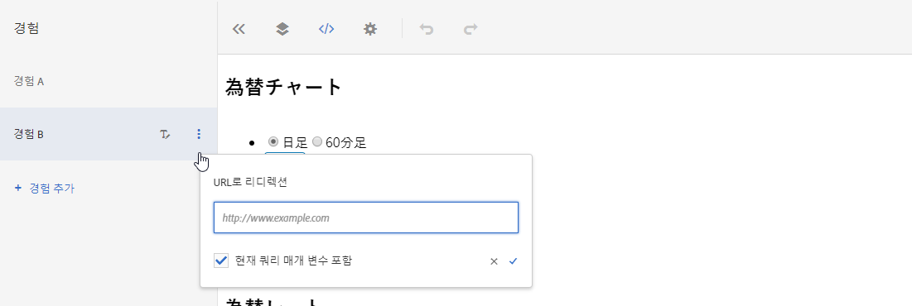

# URL로 리디렉션{#redirect-to-a-url}

컨텐츠를 동일한 페이지에 표시하지 않고 방문자를 다른 페이지로 보내려면 이 선택 사항을 사용하십시오.

한 페이지 내의 컨텐츠 일부만 변경하는 대신, 완전히 다른 두 페이지를 테스트할 수 있습니다. 이 경우 A/B 테스트는 페이지 A와 페이지 B를 비교합니다. 하나는 기본 페이지 A를 가리키고 다른 페이지 B로 리디렉션되는 두 개의 경험이 있는 A/B 테스트 캠페인을 설정합니다. 경험에 대한 문자 레이블을 클릭하면 표시되는 경험 작업 메뉴에서 **[!UICONTROL URL로 리디렉션]**&#x200B;을 선택하고 페이지 B의 URL을 지정합니다. 오퍼는 방문자를 다른 페이지로 리디렉션하도록 구성됩니다.

리디렉션 오퍼는 JavaScript 코드를 실행하여 브라우저를 리디렉션합니다. `window.location.replace();`메서드를 사용하므로 방문자를 리디렉션하는 페이지는 브라우저 기록에 저장되지 않습니다. 방문자는 여전히 브라우저에서 뒤로 단추를 사용할 수 있습니다.

리디렉션 오퍼에는 다음과 같은 몇 가지 제한 사항이 있습니다.

* A4T를 사용하는 활동의 리디렉션 오퍼에 대해서는 구현이 특정 최소 요구 사항을 충족해야 합니다. 또한 사용자가 알아야 하는 중요한 정보도 있습니다. 자세한 내용은 [리디렉션 오퍼 - A4T FAQ](/help/c-integrating-target-with-mac/a4t/r-a4t-faq/a4t-faq-redirect-offers.md#concept_21BF213F10E1414A9DCD4A98AF207905)를 참조하십시오.
* 양식 기반 경험 작성기를 사용하는 경우, 리디렉션 오퍼는 페이지의 일부인 mbox에서 사용하지 않아야 합니다. 리디렉션 오퍼는 HTML `<head>`의 일부인 스크립트 태그에서만 사용해야 합니다. 글로벌 mbox에 대해 항상 자동 만들기를 사용하고 리디렉션 오퍼를 설정하는 것이 좋습니다.

>[!NOTE]
>
>랜딩 페이지의 레퍼러 값을 전달하려면 리디렉션 오퍼보다는 HTML 오퍼를 사용하는 것이 좋습니다.

리디렉션 오퍼를 만들려면:

1. 경험을 만듭니다.
1. 마우스를 경험으로 가져간 후 URL로 리디렉션 아이콘()을 클릭합니다.

   

1. URL을 입력합니다.
1. 원할 경우 현재 쿼리 매개 변수를 포함하는 옵션을 선택합니다.

   이 옵션을 선택하면 방문자 URL에서 ? 다음에 나오는 모든 항목이 리디렉션 시 리디렉션 URL에 추가됩니다.

   이 옵션은 기본적으로 선택되어 있습니다.
1. (선택 사항) 추가 규칙을 만듭니다.

   추가 규칙은 다음 중 하나를 기반으로 할 수 있습니다.

   * URL
   * 도메인
   * 경로
   * 해시(#) 조각
   * 쿼리
   * mbox 매개 변수
   추가 규칙은 AND 또는 OR을 사용하여 활동 URL에 결합할 수 있습니다. 추가하는 모든 규칙은 AND를 사용하여 서로 평가됩니다.
