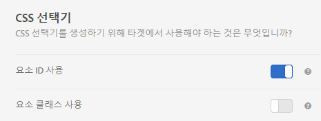

# 시각적 경험 작성기에 사용된 요소 선택기

요소 선택기는 하나 이상의 요소를 식별할 수 있는 CSS 표현입니다.

MDN(Mozilla Developer Network)의 [Selectors](https://developer.mozilla.org/en-US/docs/Web/Guide/CSS/Getting_started/Selectors) 문서에서 CSS 선택기에 대한 기본 정보를 찾을 수 있습니다.

계정 환경 설정에서 요소 클래스나 요소 ID를 사용하지 여부를 설정할 수 있습니다. **[!UICONTROL 관리 > Visual Experience Composer]**&#x200B;를 클릭한 다음 원하는 CSS 선택기를 선택합니다.



>[!NOTE]
>
>요소 클래스는 A/B 테스트, 자동화된 개인화 및 다변량 테스트 활동에서 선택기로 사용할 수 있습니다.

CSS 선택기를 사용할 시점과 고유한 ID를 사용할 시점에 대해서는 [시각적 경험 작성기 우수 사례 및 제한 사항](/help/c-experiences/c-visual-experience-composer/experience-composer-best-practices.md#concept_E284B3F704C04406B174D9050A2528A6)을 참조하십시오.

## Adobe Target에서 요소용 선택기를 생성하는 방법 {#section_D89D954BCBFB486CA081BE183776A475}

Target에서는 단순 알고리즘을 사용하여 선택기를 만듭니다. 다음은 생성 논리에 대한 간략한 설명입니다.

1. 요소에 `id="container"`와 같은 ID가 있다면 요소용 선택기는 `#container`입니다.

   예:

   ```html
   <div class="wrapper">
     <div id="container"> <!-- Selector is computed for this element -->
       <ul class="navigation">
         <li class="item active"> Home </li>
         <li class="item"> Men </li>
         <li class="item"> Women </li>
         <li class="item"> Kids </li>
       </ul>
     </div>
   </div>
   ```

1. 요소에 클래스 속성이 포함된 경우, Target은 요소에 있는 임의의 클래스 중 첫 번째 클래스를 활용하려고 시도합니다.

   Target은 `<HTML>` 요소나 ID가 있는 요소를 찾을 때까지 상위 요소를 구문 분석하려고 합니다. 요소에 ID가 있고 선택기가 그 아래에 있는 하위에서 계산될 때마다 이 요소의 ID가 선택기에 기여합니다.

   예:

   ```html
   <div class="wrapper">
     <div id="container"> <!-- id is present here. It contributes to selector -->
       <ul class="navigation">
         <li class="item active"> Home </li> <!-- Selector is computed for this element -->
         <li class="item"> Men </li>
         <li class="item"> Women </li>
         <li class="item"> Kids </li>
       </ul>
     </div>
   </div>
   ```

   이 예에서,

   선택기: `#container` > `ul.navigation:eq(0)` > `li.item:eq(0)` (&quot; > &quot;는 바로 아래 하위를 가리킵니다.)

   `eq`는 &quot;tagName=UL&quot;이 있는 요소가 있고 첫 번째 클래스가 `navigation`임을 인덱스에 알려줍니다. 따라서 `index`는 0입니다. 자세한 내용은 MDN의 [선택기](https://developer.mozilla.org/en-US/docs/Web/Guide/CSS/Getting_started/Selectors) 문서를 참조하십시오.

1. 요소에 클래스가 없는 경우, Target은 요소에 `tagName`을 사용하고 `<HTML>` 요소나 ID가 있는 요소가 발견될 때까지 상위 요소를 트래버스합니다.

   예:

   ```html
   <div class="wrapper">
     <div id="container"> <!-- id is present here. It contributes to selector -->
       <ul class="navigation">
         <li> Home </li>
         <li> Men </li>
         <li class="active"> Women </li>
         <li> Kids </li><!-- Selector is computed for this element -->
       </ul>
     </div>
   </div>
   ```

   선택기: `#container` > `ul.navigation(0)` > `li:nth-of-type(4)`

   [CSS Tricks 웹 페이지의 nth-of-type](https://css-tricks.com/almanac/selectors/n/nth-of-type/)에 대해 자세히 알 수 있습니다.

위 프로세스에서는

* CSS 선택기가 DOM에서 요소를 고유하게 식별하는 한 이 CSS 선택기를 사용할 수 있습니다.
* 위의 접근 방식은 Target에서 사용하는 접근 방식입니다. Target은 이 접근 방식을 사용하도록 지시하지 않습니다. 포인트 #1이 true인 경우 선택기를 추가할 수 있습니다.
* 선택기에서 속성을 사용할 수 있습니다. 이 문서는 클래스 이름만 예제로 사용합니다.

