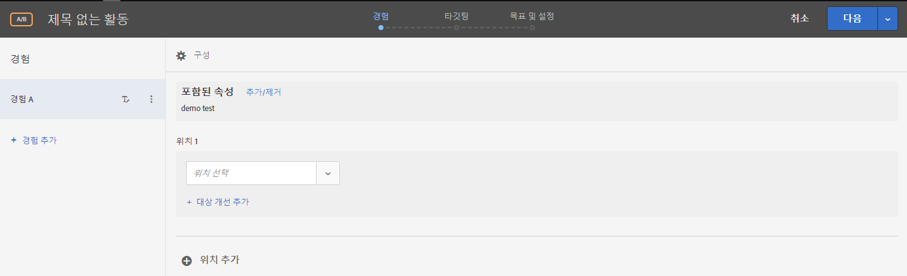
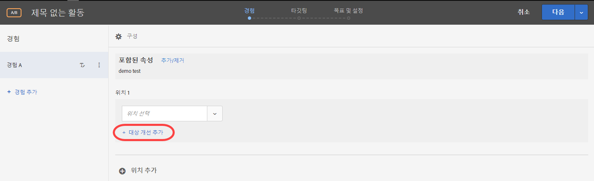
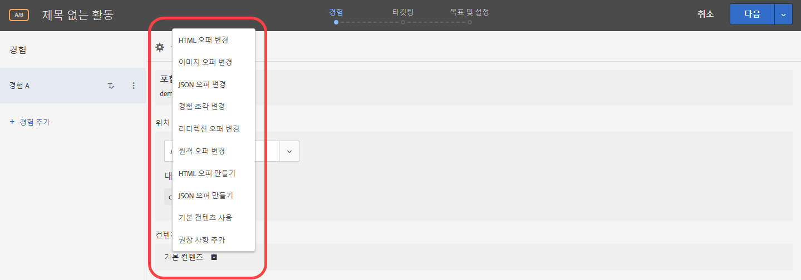
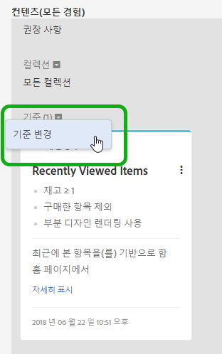
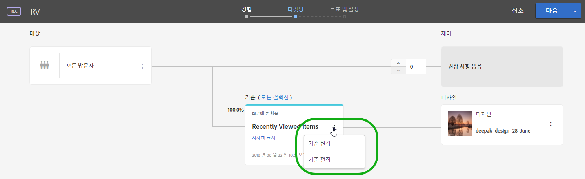

# 양식 기반 경험 작성기{#form-based-experience-composer}

[!DNL Adobe Target] [!UICONTROL 양식 기반 경험 작성기]는 시각적 경험 작성기를 사용할 수 없거나 실용적이지 않은 경우 A/B 테스트, 경험 타깃팅, Automated Personalization 및 Recommendations 활동에 사용할 경험을 만드는 데 유용한 비시각적 경험과 오퍼 만들기 인터페이스입니다. 예를 들어 양식 기반 작성기를 사용하여 이메일, 키오스크 및 음성 도우미에 게재할 경험과 오퍼를 만들 수 있습니다.

권장 사항 활동을 만드는 경우에는 경험이 없습니다. 기준 및 디자인을 선택합니다. 여러 기준 또는 디자인을 선택하는 경우, Target은 자동으로 경험을 생성합니다.

1. **[!UICONTROL 활동 만들기]**&#x200B;를 클릭한 후 만들려는 활동 유형을 선택합니다.

   양식 기반 경험 작성기는 A/B 테스트, 경험 타깃팅, 자동화된 개인화 및 권장 사항 활동에 사용할 수 있습니다.
1. [!UICONTROL 활동 만들기] 대화 상자에서 **[!UICONTROL 양식 기반 경험 작성기]**&#x200B;를 선택합니다.

1. (조건부) 작업 영역과 속성을 선택합니다.

1. **[!UICONTROL 다음]**&#x200B;을 클릭합니다.

   양식 기반 경험 작성기가 열립니다.

   

   권장 사항 활동을 만드는 경우에는 화면이 달라집니다. 권장 사항 활동에는 경험이 포함되지 않습니다.
1. &quot;[!UICONTROL 제목이 없는 활동]&quot;을 클릭하여 활동의 이름을 지정합니다.
1. 위치를 선택합니다.

   [!UICONTROL 위치 선택] 상자를 클릭하면 사용 가능한 위치 목록이 나타납니다. 해당 위치 중 하나를 선택합니다. target.js를 통해 전달된 글로벌 위치를 선택하려면 &quot;target-global-mbox&quot;를 선택합니다.

   여기에 나열되지 않은 위치를 입력할 수도 있습니다. 이 방식은 mbox가 페이지에서 아직 만들어졌거나 열람되지 않은 경우에 유용할 수 있습니다. 위치의 이름을 입력합니다. 아직 없는 위치를 입력할 때는 주의하십시오. 철자 또는 대소문자가 mbox 호출이 수행될 때의 철자 및 대소문자와 일치하지 않으면 활동이 전달되지 않습니다. 수동으로 입력한 위치는 사용 가능한 위치 목록에 저장됩니다. 다음에 수동으로 입력한 위치를 선택하려고 하면 해당 활동에 대한 [!UICONTROL 위치 선택] 드롭다운 목록에서 사용할 수 있습니다.

   >[!NOTE]
   >
   >활동을 만드는 동안 수동으로 입력한 위치를 만들면 새 위치가 자동으로 만들어지지 않습니다. 위치 이름은 활동 컨텍스트에만 저장됩니다. 이 위치는 컨텐츠 전달 호출이 있을 때 만들어집니다. 만드는 위치 다음에 다른 활동에서, 대상자 만들기 등에 사용할 수 있게 됩니다. 을 클릭합니다.

1. **[!UICONTROL 대상 개선 추가]**&#x200B;를 클릭한 다음, 이 활동에 대해 하나 이상의 [대상](/help/c-target/target.md#concept_A782F8481A5041EBA75103CB26376522)을 선택합니다.

   

   양식 기반 경험 작성기에서 세분화가 전체 대상 기능으로 대체되었습니다. 기존 활동에 대한 세분화 내용은 [활동 전용 대상](/help/c-target/creating-activity-only-audience.md#concept_A6BADCF530ED4AE1852E677FEBE68483)으로 마이그레이션되었습니다.
1. 해당 위치에 표시할 콘텐츠 유형을 선택합니다.

   

1. 선택한 콘텐츠 유형에 대해 콘텐츠를 지정합니다.

   **HTML 오퍼 변경:** HTML 오퍼를 선택합니다.

   **이미지 오퍼 변경:** Target의 콘텐츠 라이브러리에 저장된 이미지를 선택합니다.

   이미지에 대한 링크(클릭스루, 대상, 랜딩 등)를 추가할 수도 있습니다.

   1. [!UICONTROL 이미지 오퍼 변경]을 클릭합니다.
   1. 원하는 이미지를 선택한 다음, [!UICONTROL 링크 편집]을 클릭합니다.
   1. 사이트에서 원하는 URL 또는 페이지를 지정하고 [!UICONTROL 업데이트]을 클릭합니다.

   **JSON 오퍼 변경:** JSON 오퍼를 선택합니다.

   **경험 구성요소 변경:** 경험 구성요소를 선택합니다.

   **리디렉션 오퍼 변경:** 리디렉션 오퍼를 선택합니다. 자세한 내용은 [리디렉션 오퍼 만들기](/help/c-experiences/c-manage-content/offer-redirect.md)를 참조하십시오.

   **원격 오퍼 변경:** 원격 오퍼를 선택합니다. 자세한 내용은 [원격 오퍼 만들기](/help/c-experiences/c-manage-content/about-remote-offers.md)를 참조하십시오.

   **HTML 오퍼 만들기:**

   1. [!UICONTROL 오퍼]를 클릭한 다음, [!UICONTROL 코드 오퍼] 탭을 선택합니다.
   1. [!UICONTROL 만들기] > [!UICONTROL HTML 오퍼]를 클릭합니다.
   1. 오퍼 이름을 입력합니다.
   1. 코드 상자에 HTML 코드를 입력하거나 붙여넣습니다.
   1. [!UICONTROL 저장]을 클릭합니다.

   **JSON 오퍼 만들기:**

   1. [!UICONTROL 오퍼]를 클릭한 다음, [!UICONTROL 코드 오퍼] 탭을 선택합니다.
   1. [!UICONTROL 만들기] > [!UICONTROL JSON 오퍼]를 클릭합니다.
   1. 오퍼 이름을 입력합니다.
   1. 코드 상자에 JSON 코드를 입력하거나 붙여 넣습니다.
   1. [!UICONTROL 저장]을 클릭합니다.

   권장 사항 활동의 경우, 콘텐츠 드롭다운에 권장 사항 추가 옵션이 제공됩니다. **[!UICONTROL 추천 추가]**&#x200B;를 클릭한 후 페이지 유형을 선택합니다. 그런 다음, 인터페이스에 정의된 일반적인 단계를 수행하여 [권장 사항 활동을 만듭니다](/help/c-recommendations/t-create-recs-activity/create-recs-activity.md).

   양식 기반 경험 작성기에서 권장 사항 기준을 선택하는 동안 선택한 기준 카드에 직접 연결되는 링크가 있으므로 기준을 빠르고 쉽게 편집할 수 있습니다.

   

   Target 3단계 안내 워크플로우의 타깃팅 페이지에서 다음을 수행합니다.

   

1. (선택 사항, AB 활동, Automated Personalization 및 경험 타깃팅의 경우) 추가 위치에 대해 이 프로세스를 반복하려면 **[!UICONTROL 위치 추가]**&#x200B;를 클릭하고 위치와 컨텐츠를 구성합니다.
1. **[!UICONTROL 다음]**&#x200B;을 클릭한 다음 활동 유형에 대해 평소대로 활동 생성 단계를 완료합니다.

* [A/B 테스트 만들기](/help/c-activities/t-test-ab/t-test-create-ab/test-create-ab.md)
* [경험 타깃팅 활동 만들기](/help/c-activities/t-experience-target/t-xt-create/xt-create.md#task_D6B3429AC31549E1A70EDF04B3DDC765)
* [권장 사항 활동 만들기](/help/c-recommendations/t-create-recs-activity/create-recs-activity.md#task_6874328773C64C44A73F0A130AD3F96F)

## 교육 비디오: 양식 기반 작성기  

다음 비디오에서는 양식 기반 작성기 데모를 제공합니다.

* 양식 기반 경험 작성기를 사용하여 활동 만들기
* 언제 양식 기반 경험 작성기를 사용하고 언제 시각적 경험 작성기를 사용할지 이해
* 개선을 통해 위치 타깃팅

>[!VIDEO](https://video.tv.adobe.com/v/17390)