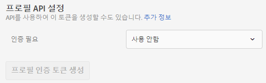
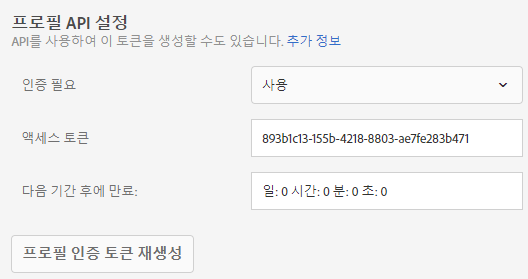

# 프로필 API 설정

Adobe Target API를 통해 일괄 업데이트를 위한 인증을 활성화 또는 비활성화하고 프로필 인증 토큰을 생성합니다.

[!DNL Adobe Target] 개별 사용자에 대해 프로필을 만들고 유지 관리합니다. This profile is stored on the [!DNL Target] edge cluster and is updated in real time after every visit; however, you can update a profile individually or in bulk via API.

추가 보안을 위해 벌크 업데이트 API 호출 시 요청의 헤더에서 전달할 올바른 액세스 토큰을 요구할 수 있습니다.

**Target UI를 사용하여 인증을 요구하고 액세스 토큰을 생성하려면 다음을 수행하십시오.**

1. 관리 **** > **[!UICONTROL 구현을 클릭합니다]**.
1. 프로필 **[!UICONTROL API]** 아래의 **[!UICONTROL 인증 필요]** 슬라이드를 활성화되거나 비활성화된 위치로 전환합니다.

   

1. (Conditional) If you enabled authentication requirements, click **[!UICONTROL Generate New Profile Authentication Token]**.

   

   토큰은 [!UICONTROL 다음 기간 후에 만료] 상자에 나열된 시간에 따라 만료됩니다.

   인증 토큰을 생성하려면 다음 사용자 권한 중 하나가 있어야 합니다.

   * 적어도 [!UICONTROL 편집기] 권한(또는 [!UICONTROL 승인자])

      고객에 대한 자세한 내용은 [!DNL Target Standard] 사용자 [에서 역할 및 권한](/help/administrating-target/c-user-management/c-user-management/user-management.md#roles-permissions) 지정을 *참조하십시오*. 고객에 대한 자세한 내용은 [!DNL Target Premium] 엔터프라이즈 권한 [구성을 참조하십시오](/help/administrating-target/c-user-management/property-channel/properties-overview.md).

   * 작업 공간/제품 프로필 수준에서 관리자 역할

      작업 영역은 [!DNL Target Premium] 고객에게만 제공됩니다. For more information, see [Configure enterprise permissions](/help/administrating-target/c-user-management/property-channel/properties-overview.md).

   * 제품 수준의 관리자 권한( [!DNL Adobe Target] 시스템 관리자 권한)
   >[!NOTE]
   >
   >API를 통해 프로필 인증 토큰을 생성할 수도 있습니다. 자세한 내용은 [Adobe Target 개발자 웹 사이트](https://developers.adobetarget.com/)에서 [프로필](https://developers.adobetarget.com/api/#profiles)을 참조하십시오.

1. 토큰을 복사하고 &quot;Authorization&quot; : &quot;Bearer &quot; 형식으로 요청 헤더에 포함합니다.

Click [!UICONTROL Generate New Profile Authentication Token] to regenerate the token as needed.

>[!IMPORTANT]
>
>이 토큰을 재설정하면 현재 토큰을 사용하는 API 호출이 실패하게 됩니다. 따라서 이 토큰을 재설정한 경우 이 토큰을 사용하는 모든 스크립트나 앱을 업데이트해야 합니다.
