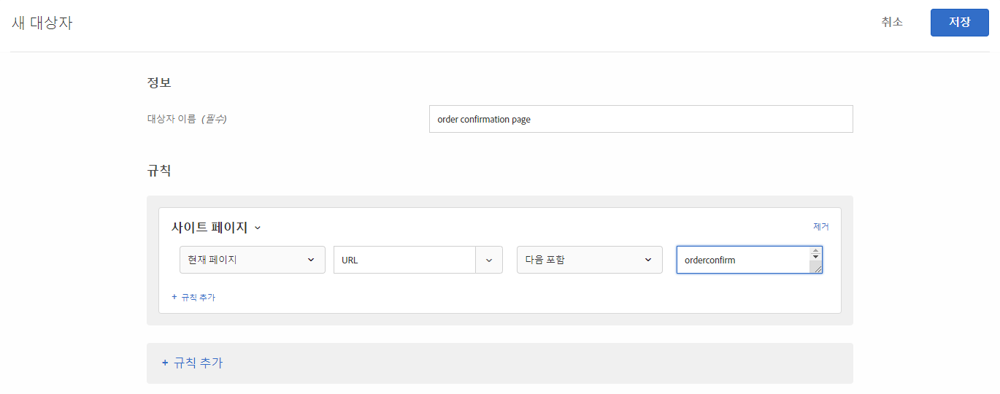
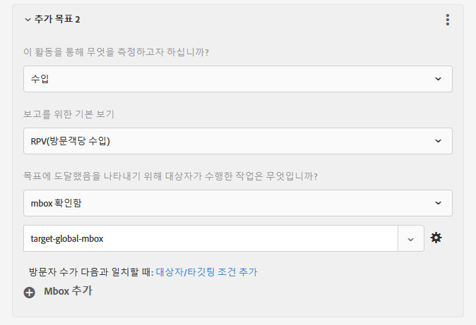

# 글로벌 mbox 자주 묻는 질문{#global-mbox-frequently-asked-questions}

글로벌 mbox에 대한 FAQ (자주 묻는 질문) 목록입니다.

## Target 계정이 여러 도메인에 걸쳐 설정된 경우 둘 이상의 글로벌 mbox를 가질 수 있습니까? {#section_B7252BA6C3BB4EF4AE9E53F47FD58ABD}

계정에서는 하나의 글로벌 mbox만 지원됩니다.

활동에 URL 규칙을 추가하여 활동이 실행되는 위치를 제한할 수 있습니다. 자세한 내용은 [유사한 페이지에 동일한 경험 포함](../../../c-experiences/c-visual-experience-composer/temtest.md#task_2539D51A18044F82B0D9895636546781).

[또한 Targetpageparams](/help/c-implementing-target/c-implementing-target-for-client-side-web/targetpageparams.md) 를 사용하여 페이지에 매개 변수를 전달한 다음 VEC ( [!UICONTROL Visual Experience Composer] ) 의 &quot;URL 구성&quot; 섹션에서 해당 매개 변수를 선택하거나 양식 기반 Experience Composer에서 매개 변수를 &quot;refine&quot; 로 추가할 수도 있습니다.

## Target 글로벌 mbox에 대한 수입 데이터를 전달하려면 어떻게 합니까? {#section_17AEA933BADA4D169CCEDF5833C41306}

target-global-mbox에 대한 수입 및 주문 정보를 수집하려면 &quot;mbox 매개 변수&quot;를 Target으로 보내야 합니다. 이 매개 변수는 Target에 추가 정보를 보내는 데 사용되는 이름/값 쌍입니다. Target은 수입 데이터를 채우기 위해 이 매개 변수(예약된 이름)를 자동으로 검색합니다.

`orderConfirmPage`의 경우 `orderTotal`, `orderId` 및 `productPurchasedId`를 전달해야 합니다. 자세한 내용은 [주문 확인 mbox 만들기 - mbox.js](../../../c-implementing-target/c-implementing-target-for-client-side-web/t-mbox-download/orderconfirm-create.md#task_0036D5F6C062442788BB55E872816D82)를 참조하십시오.

이러한 동일한 매개 변수는 `targetPageParams()`()를 통해 target-global-mbox로 전송해야 합니다. 자세한 내용은 [글로벌 Mbox에 매개 변수 전달](../../../c-implementing-target/c-implementing-target-for-client-side-web/t-mbox-download/c-understanding-global-mbox/pass-parameters-to-global-mbox.md#concept_33362A04146C4E3C8E7089B65F38B5E5)을 참조하십시오.

또한 아래와 같이 주문 확인 페이지가 표시되었을 때 Target이 target-global-mbox에 대한 전환만 카운트하도록 전환 조각에 타깃팅을 추가할 수도 있습니다.

위 그림의 [사이트 페이지] 섹션에는 [현재 페이지], [URL], [포함], [orderconfirm]이 포함되어 있습니다.

위 그림의 선택 사항에는 다음 설정이 포함됩니다.

* **이 활동을 통해 무엇을 측정하고자 하십니까:**수입
* **보고를 위한 기본 보기:** RPV(방문객당 수입)
* **목표에 도달했음을 나타내기 위해 대상이 수행한 작업은 무엇입니까?** mbox 확인함, target-global-mbox