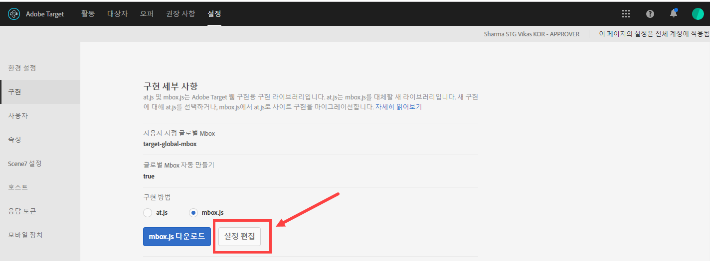
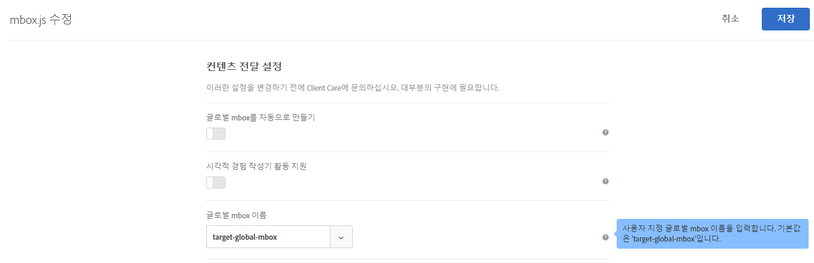
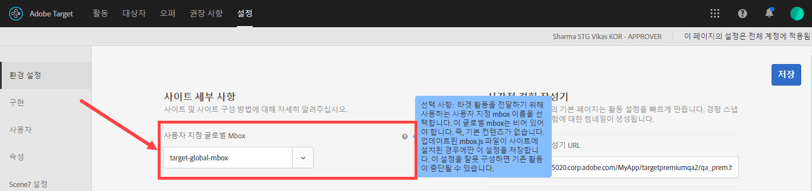

# 글로벌 mbox 사용자 지정{#customize-a-global-mbox}

at.js 및 mbox.js 둘 다에 대해 글로벌 mbox를 사용자 지정하는 데 도움이 되는 정보입니다.

1. mbox.js를 편집합니다.

   **[!UICONTROL Target]** &gt; **[!UICONTROL 설정]** &gt; **[!UICONTROL 구현]**&#x200B;으로 이동합니다.

   * mbox.js의 경우 **[!UICONTROL mbox.js 설정 편집을 클릭합니다]**.
   * [!DNL at.js]의 경우 구현 방법 아래에서 **[!UICONTROL at.js]**&#x200B;를 선택한 후 **[!UICONTROL mbox.js 설정 편집]**&#x200B;을 클릭합니다.
   

1. [!DNL mbox.js] 또는 [!DNL at.js]를 편집합니다.

   **[!UICONTROL 글로벌 mbox를 자동으로 만들기]**&#x200B;를 비활성화한 후 [!DNL Target Standard/Premium]에서 활동을 전달하는 데 사용할 사용자 지정 글로벌 mbox의 이름을 추가합니다. 이 사용자 지정 mbox도 클릭 추적에 사용됩니다.

   

   완료되면 **[!UICONTROL 저장]을 클릭합니다.**
1. 사이트에서 [!DNL mbox.js] 또는 [!DNL at.js] 라이브러리를 구현합니다.

* mbox.js에 대해서는 [mbox.js 구현](../../../../c-implementing-target/c-implementing-target-for-client-side-web/t-mbox-download/mbox-download.md#task_4EAE26BB84FD4E1D858F411AEDF4B420)을 참조하십시오.
* at.js에 대해서는 [at.js 구현](../../../../c-implementing-target/c-implementing-target-for-client-side-web/t-mbox-download/c-target-atjs-implementation/target-atjs-implementation.md#concept_8AC8D169E02944B1A547A0CAD97EAC17)을 참조하십시오.

1. 전환 시간을 릴리스에 맞춰 지정합니다.

   [!DNL Target Standard/Premium] Standard/Premium에서 진행될 모든 활동에 대해 글로벌 mbox 사용을 시작할 준비가 되면 이 단계를 계속 진행할 수 있습니다.

   위의 2단계에서 사용되는 이름과 일치하도록 사용자 지정 글로벌 mbox의 이름을 업데이트합니다.

   

   >[!IMPORTANT]
   >
   >저장하면 계정 동기화에 있는 모든 활동이 이 mbox와 동기화됩니다. 이 mbox가 사용자의 사이트에 없는 경우 모든 활동이 더 이상 작동하지 않습니다.

   **[!UICONTROL 저장을 클릭합니다]**.
