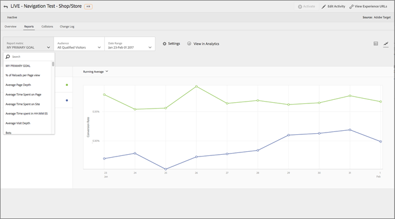
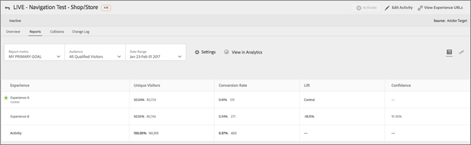

# Adobe Target용 보고 소스로서의 Adobe Analytics(A4T){#adobe-analytics-as-the-reporting-source-for-adobe-target-a-t}

[!DNL Adobe Analytics for Target] (A4T)는 전환 지표 및 대상 세그먼트를 기반으로 활동을 만들 수 있는 크로스 솔루션 [!DNL Analytics] 통합입니다. The A4T integration lets you use [!DNL Analytics] reports to examine your results. If you use [!DNL Analytics] as the reporting source for an activity, all reporting and segmentation for that activity is based on [!DNL Analytics] data collection.

## A4T 개요 {#section_92B66069210C40DBA937790E8CC596CF}

The [!DNL Analytics for Target] integration between [!DNL Analytics] and [!DNL Target] provides powerful analysis and timesaving tools for your optimization program.

The three primary benefits of using [!DNL Analytics] data in [!DNL Target] are:

* Marketers can dynamically apply [!DNL Analytics] success metrics or reporting segments to [!DNL Target] activity reports at any time. 활동을 실행하기 전에 모든 항목을 지정할 필요는 없습니다.
* 단일 데이터 소스는 두 개의 개별 시스템에서 데이터를 수집할 때 발생하는 분산을 제거합니다.
* Your existing [!DNL Analytics] implementation collects all required data. 보고서에 사용할 데이터를 수집할 목적으로 페이지에 mbox를 구현할 필요가 없습니다. Although, it is still recommended that you implement an order confirmation mbox for [Automated Personalization](/help/c-activities/t-automated-personalization/automated-personalization.md) (AP) activities.

>[!IMPORTANT]
>
>A4T를 사용하려면 먼저 계정을 통합용으로 공급하도록 요청해야 합니다. [이 양식](https://www.adobe.com/go/audiences_kr)을 사용하여 제공을 요청합니다.
>
>The integration that enables [!DNL Analytics] as the data source for [!DNL Target] (A4T) represents the next generation of the Test&amp;Target to SiteCatalyst plug-in. 이 플러그인은 더 이상 사용되지 않지만 이미 사용 중인 경우에는 계속 지원됩니다.

If you use [!DNL Analytics] as the reporting source for an activity, all reporting and segmentation for that activity is based on [!DNL Analytics].

All [!DNL Analytics] metrics, including calculated metrics, are available in [!DNL Target] and the [!UICONTROL Target Activities] report in [!DNL Analytics]. Likewise, any segment available in [!DNL Analytics] can be applied to both solutions. You can apply the metric or audience to the report in [!DNL Target] after the activity has started, or even after the activity has completed.

Every metric is included, including any customer or calculated metrics that are built-in in [!DNL Analytics].

분류 기간 후에 데이터는 웹 사이트에서 수집되고 약 1시간 후에 보고서에 표시됩니다. 보고서에 있는 모든 지표, 세그먼트, 값은 활동을 설정할 때 선택한 보고서 세트에서 가져옵니다.

A4T를 사용하려면 다음 사항을 염두에 두십시오.

* 보고 소스 [!DNL Analytics] 로 사용하려면 사용자와 사용자 회사 [!DNL Target]모두 액세스 [!DNL Analytics] 및 액세스 권한을 가지고 있어야 합니다 [!DNL Target]. [솔루션이 필요할 경우 계정 담당자에게 문의하십시오.](/help/cmp-resources-and-contact-information.md#concept_34A1CA16F2244D42930BB77846A5ABBB)
* 보고 소스는 각 활동에 대해 설정됩니다. [!DNL Target] 을 사용하여 데이터를 계속 수집하며, 데이터를 계속 사용할 수 있습니다. 단, [!DNL Target] 데이터를 통해 수집된 데이터를 기반으로 하는 활동을 선호할 경우 사용할 수 [!DNL Target]있습니다.
* 두 보고 소스 중 하나를 사용해야 합니다. 두 소스 모두에서 한 활동에 대한 데이터를 수집할 수 없습니다.
* When using A4T, all success metrics available to your activities are [!DNL Analytics] metrics. 그러나 목표 지표는 mbox 호출을 기반으로 할 수 있습니다. For example, you can use Target&#39;s out-of-the-box click-tracking capabilities with A4T instead of having to implement [!DNL Analytics] click-tracking code.
* When viewing reporting of an A4T activity in the [!DNL Target] UI, you are viewing [!DNL Analytics] data. For example, if you use the [!UICONTROL Visitor] metric in [!DNL Target], you are using the [!DNL Analytics] [!UICONTROL Visitor] metric, not the [!DNL Target] [!UICONTROL Visitors] metric, which is now called [!UICONTROL Entrants]. This difference is especially important for basic traffic metrics ([!UICONTROL Visitors], [!UICONTROL Visits], [!UICONTROL Page Views]) and conversion metrics.
* Any existing [!DNL Target] activities continue to use [!DNL Target] data collection and are not affected by enabling A4T.
* Only one mbox-based metric is allowed when using [!DNL Analytics] as the reporting source.
* A server-to-server call from [!DNL Target] to [!DNL Analytics] sends activity and experience information to [!DNL Analytics]. This integration does not result in additional server calls for either [!DNL Target] or [!DNL Analytics].

   경우에 따라 분류 호출 [!DNL Target] 이 [!DNL Analytics] 실패할 수 있으며 활동은 데이터를 표시하지 않습니다 [!DNL Analytics]. 이러한 경우 Analytics 및 [Target 통합 문제 해결(A4T)을 참조하십시오](/help/c-integrating-target-with-mac/a4t/c-a4t-troubleshooting/a4t-troubleshooting.md). 클라이언트 [지원 팀에](/help/cmp-resources-and-contact-information.md#concept_34A1CA16F2244D42930BB77846A5ABBB) 문의할 수도 있습니다.

## Supported activity types {#section_F487896214BF4803AF78C552EF1669AA}

The following table shows you which activity types support [!DNL Analytics] as the reporting source in [!DNL Target] (A4T):

| 활동 유형 | A4T와 호환 가능 | 해당하는 경우 메모 |
|--- |--- |--- |
| 수동 트래픽 분할을 사용하는 A/B 활동 | 예 |  |
| 자동 할당을 사용하는 A/B 활동 | 예 | 자동 [할당 및 자동 Target 활동에 대한 Target(A4T) 지원을 참조하십시오](/help/c-integrating-target-with-mac/a4t/campaign-creation.md#a4t-aa). |
| 자동 타겟을 사용하는 A/B 활동 | 예 | 자동 [할당 및 자동 Target 활동에 대한 Target(A4T) 지원을 참조하십시오](/help/c-integrating-target-with-mac/a4t/campaign-creation.md#a4t-aa). |
| 경험 타깃팅(XT) | 예 |  |
| 다변량 테스트(MVT) | 예 | Requires mbox-based goal metric goal to get the [!UICONTROL Element Contribution] report.  The [!UICONTROL Element Contribution] report does not currently support [!DNL Analytics] metrics. |
| 자동화된 개인화(AP) 활동 | 아니오 |  |
| 권장 사항 활동 | 예 |  |
| 모바일 앱 | 예 | Mobile Services SDK 버전 4.13.1 이상에서 지원됩니다.  자세한 내용은 [Mobile Services 설명서](https://docs.adobe.com/content/help/en/mobile-services/using/home.html)를 참조하십시오. |
| 이메일 | 아니오 |  |
| 서버 측 배달 API | 예 | 자세한 내용은 [서버 측: Target 구현](/help/c-implementing-target/c-api-and-sdk-overview/api-and-sdk-overview.md)을 참조하십시오. |
| NodeJS SDK | 예 | 자세한 내용은 [서버 측: Target 구현](/help/c-implementing-target/c-api-and-sdk-overview/api-and-sdk-overview.md)을 참조하십시오. |
| AEM 6.1(또는 이하) 클라우드 서비스 통합 | 아니오 |  |
| AEM 6.2(또는 이상 버전) 클라우드 서비스 통합 | 예 | For more information, see [Integrating with Adobe Target](https://helpx.adobe.com/experience-manager/6-2/sites/administering/using/target.html) in the [!DNL Adobe Experience Manager] 6.2 documentation. |
| 리디렉션 오퍼를 사용하는 모든 활동 | 예 | A4T에서 리디렉션 오퍼를 사용하기 위한 보다 엄격한 최소 요구 사항이 있습니다. 자세한 내용은 [리디렉션 오퍼 - A4T FAQ](/help/c-integrating-target-with-mac/a4t/r-a4t-faq/a4t-faq-redirect-offers.md)를 참조하십시오. |
| Node.JS | 예 |  |

Because all activity types do not yet support A4T, it is recommended that you keep or implement important conversion mboxes, such as the `orderConfirmPage` mbox.

## Examples of A4T reports {#section_F0A43A1CB2F04E8282B909E4D7034361}

To view A4T reports in [!DNL Target], click **[!UICONTROL Activities]**, click the desired activity from the list that uses [!DNL Analytics] as its reporting source, then click the **[!UICONTROL Reports]** tab.

>[!NOTE]
>
>[!UICONTROL 활동] 페이지의 맨 위에 있는 [!UICONTROL 보고서 소스] 드롭다운 목록을 사용하여 [!DNL Analytics]를 보고 소스로 사용하는 활동만 표시할 수 있습니다.

You can toggle between the [!UICONTROL Table View] and [!UICONTROL Graph View] of the report by clicking the appropriate icon at the top right side of the report.

다음 그림은 사용 가능한 [!UICONTROL  목표 지표를 표시하는 ]보고서 지표[!UICONTROL  드롭다운 목록과 함께 A4T 보고서의 ]그래프 보기[!DNL Analytics]를 보여줍니다.

다음 그림은 사용 가능한  대상을 표시하는 [!UICONTROL 대상] 드롭다운 목록과 함께 A4T 보고서의 [!DNL Analytics]그래프 보기를 보여줍니다.

다음 그림은 A4T 보고서의 [!UICONTROL 표 보기]를 보여줍니다.

[!DNL Analytics]이 아니라 [!DNL Target]에서 보고서를 보려면 보고서 맨 위의 **** Analytics에서 보기를 클릭하십시오.

## Analytics &amp; Target: 분석 우수 사례 자습서 {#section_3438E6E77A464424B717A4FD333B84B2}

Open the [Analytics &amp; Target: Best Practices for Analysis](https://spark.adobe.com/page/Lo3Spm4oBOvwF/) tutorial, provided by [!DNL Adobe Experience League].

## 교육 비디오:

다음 비디오에는 이 주제에서 설명한 개념에 대한 자세한 내용이 포함되어 있습니다.

### Target용 분석(A4T)(4:32) 

This video explains how to use [!DNL Analytics] as a reporting source in [!DNL Target] to drive the analysis of your optimization program.

* A4T가 무엇이며, 왜 사용해야 하는지에 대해 설명합니다.
* A4T의 작동 방식에 대해 설명합니다.
* A4T를 사용하기 위해 필요한 전제 조건을 이해합니다.

>[!VIDEO](https://video.tv.adobe.com/v/17384)

### Analytics/Target 통합(A4T)(40:33) 

이 비디오는 Adobe 고객 지원 팀에서 진행한 이니셔티브인 &quot;[운영시간](/help/cmp-resources-and-contact-information.md#concept_58EA30379D3B48C4848BA2A8C464A5B7)&quot; 기록입니다.

* 통합이 작동하도록 설정하고 작동하는지 확인하는 방법
* 통합 작동 방식
* Analytics에서 사용할 이상적인 보고서에 대해 알아보기
* A4T와 관련된 일반적인 질문에 대한 답변

[분석/Target 통합(A4T) 업무 시간](https://helpx.adobe.com/customer-care-office-hours/target/analytics-target-A4T-integration.html)