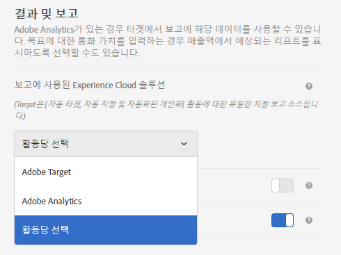

# 활동 설정 - A4T FAQ

이 주제에는 활동 설정에 대해 자주 묻는 질문과 [!DNL Target](A4T)의 보고 소스로 [!DNL Analytics]을(를) 사용하는 질문에 대한 답변이 포함되어 있습니다.

## 어느 활동 유형이 보고 소스로서 Analytics(A4T)를 지원합니까?{#section_5E4F58CD25A5424E869E6FE0803968EF}

전체 목록이 필요하면 [Adobe Target용 보고 소스로서의 Adobe Analytics(A4T)](/help/c-integrating-target-with-mac/a4t/a4t.md#concept_7540C8C04259434AB6EE33B09F47A1DE)에서 &quot;지원되는 활동 유형&quot;을 참조하십시오.

## 목표 지표를 구성하는 동안 고급 설정에 액세스할 수 없는 이유는 무엇입니까?

[!DNL Analytics]을 보고 소스(A4T)로 사용하는 활동의 경우 목표 지표는 항상 &quot;[!UICONTROL 증분 카운트 및 사용자를 활동 ]&quot; 및 &quot;[!UICONTROL 모든 노출 시]&quot; 설정을 사용합니다. 이 값은 *구성할 수 없습니다.*

자세한 내용은 &quot;내 목표 지표를 구성하는 동안 고급 설정 옵션에 액세스할 수 없는 이유는 무엇입니까?&quot;를 참조하십시오. in [지표 정의 - A4T FAQ](/help/c-integrating-target-with-mac/a4t/r-a4t-faq/a4t-faq-metric-definition.md)에 있습니다.

## 방금 활동을 만들었습니다. 수신되는 데이터가 표시되지 않는 이유는 무엇입니까? {#section_9F8092BE4225442896F926540292F221}

활동이 만들어지면 [!DNL Target]은(는) 분류 파일을 [!DNL Analytics]에 보냅니다. [!DNL Analytics]은(는) 데이터를 캡처하고 처리하지만 분류 파일이 업데이트될 때까지 보고서에 표시되지 않습니다. 데이터가 표시되려면 24시간이 걸릴 수 있습니다. 48시간 후에도 데이터가 표시되지 않으면 [Client Care에 문의](/help/cmp-resources-and-contact-information.md#reference_ACA3391A00EF467B87930A450050077C)하십시오. 또는 활동을 실행할 시기를 알고 있는 경우 며칠 전에 활동을 미리 만들면 활동이 저장될 때 분류가 전송됩니다. 이렇게 하면 활동이 실행될 때 데이터가 보고서에 표시됩니다. 데이터를 [!DNL Analytics]에서 처리하는 데 45-90분이 소요됩니다.

## 새 활동을 만들 때 Analytics를 보고 소스로 선택할 수 없는 이유는 무엇입니까? {#section_9F4F69C3085F4C2480AF439127EB27CD}

[!UICONTROL 관리]에서 [!UICONTROL 보고 설정] 옵션을 변경할 수 있습니다.

1. [!DNL Target]에서 **[!UICONTROL 관리]**&#x200B;를 클릭합니다.
1. **[!UICONTROL 보고에 사용된 Experience Cloud 솔루션]** 드롭다운 목록에서 **[!UICONTROL 활동당 선택]**&#x200B;을 클릭합니다.

**[!UICONTROL 보고 소스]** 드롭다운 목록이 **[!UICONTROL 목표 및 설정 화면에서 활성화되어 활동을 만들고 편집할 수 있습니다.]**

항상 보고 소스로 [!DNL Analytics]을 사용하려면 [!UICONTROL 관리]의 드롭다운 목록에서 **[!UICONTROL Adobe Analytics]**&#x200B;을 선택합니다.

## 방문자가 A4T를 사용하는 자동 Target 활동에서 서로 다른 방문에서 타깃팅된 경험과 제어된 경험 간을 전환할 수 있습니까?

방문 간 방문자에 대해 visitorId가 변경되지 않는다고 가정할 때 다음 사항이 적용됩니다.

트래픽 할당 비율이 중간 활동으로 조정되면 방문자가 타깃팅된 경험과 제어 경험 간에 이동할 수 있습니다.

백분율이 중간 활동에서 조정되지 않으면 컨트롤을 처음 보는 방문자가 항상 제어하도록 전송됩니다. 타깃팅된 경험으로 전송된 방문자는 항상 타깃팅된 경험으로 전송됩니다.

* 머신 러닝 모델이 다른 경험이 새로운 방문과 관련이 있다고 판단하면 트래픽의 타깃팅된 &quot;버킷&quot;에 참여한 후 방문자를 방문에서 다른 경험으로 보낼 수 있습니다.
* 경험 할당은 방문자의 visitorId의 결정적 의사 임의 해시를 기반으로 하므로 트래픽의 &quot;버킷&quot; 컨트롤에 할당되면 방문자는 항상 동일한 경험을 보게 됩니다.
