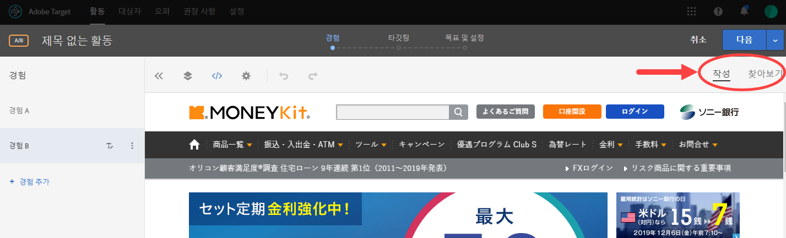
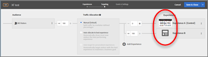

# Target 최적화 및 개인화 FAQ{#target-optimization-and-personalization-faq}

Adobe Target의 기능 사용에 대한 자주 묻는 질문과 자세한 정보로 연결되는 링크 목록입니다.

## 일반 정보 {#section_CE5713B5AAC341C9A75586C107797FA3}

**다른 고객이 더 나은 결과를 위해 Adobe Target을 어떻게 활용하는지를 알려면 어떻게 해야 합니까?**

다음은 [고객 성공 사례](https://www.adobe.com/in/marketing-cloud/target/resources.html#x)의 일부에 불과합니다. 여러분과 같은 고객이 어떻게 Target을 활용하여 최적화 및 개인화를 향상시킴으로써 비즈니스 목표를 달성하는지 확인하십시오.

이러한 사례 연구 일부에서는 Adobe Target Premium의 기능을 활용했습니다.

**최신 Target 기능은 어디에서 확인할 수 있습니까?**

최신 릴리스에 대한 세부 내용을 확인하려면 [릴리스 노트](/help/r-release-notes/release-notes.md#reference_8FE40B43A5A34DDF8F26A53D55EE036A)를 참조하십시오. 모든 [이전 릴리스](/help/r-release-notes/release-notes-for-previous-releases.md)에 대한 정보도 온라인으로 이용할 수 있습니다.

**Adobe에서는 Target에 대한 답변과 추가 정보를 찾을 수 있는 커뮤니티/포럼을 운영하고 있습니까?**

[ Target 커뮤니티 포럼](/help/cmp-resources-and-contact-information.md#concept_9C203A8AED054DFFA9A504811DB6BA42)을 확인하십시오. 여기서는 고객에게 도움을 드리며, 보다 중요한 점은 여러분과 같은 Adobe Target 실무 담당자들이 서로에게 도움을 줄 수 있다는 것입니다. 결과적으로 커뮤니티 및 포럼의 성공은 해당 구성원들의 적극적인 참여에 달려 있습니다. 커뮤니티에 참여하고 질문에 대한 답변을 찾고 답변을 제공해주시기 바랍니다.

**Target에서는 어떤 브라우저를 지원합니까?**

자세한 내용은 [지원되는 브라우저](/help/c-implementing-target/c-considerations-before-you-implement-target/supported-browsers.md#reference_01B4BF99E7D545A7998773202A2F6100) 표를 참조하십시오. Target Standard/Premium Experience Cloud 인터페이스 지원과 데스크톱/장치에 대한 최종 사용자 브라우저 지원의 두 가지 측면이 제공됩니다.

## Target JavaScript 라이브러리(at.js 및 mbox.js) {#section_C2AC78DFDAD84981A8C84DF20893E340}

**at.js 또는 mbox.js 중에서 어떻게 구현된 JavaScript 파일을 사용해야 합니까?**

at.js는 최신의 가장 뛰어난 JavaScript 라이브러리입니다. mbox.js는 이전 버전입니다. 두 라이브러리 간의 차이점을 이해하려면 [at.js의 이점](/help/c-implementing-target/c-implementing-target-for-client-side-web/t-mbox-download/c-target-atjs-implementation/target-atjs-implementation.md#benefits)을 참조하십시오. 신규 고객은 모두 at.js를 사용해야 합니다.

기존의 모든 mbox.js 고객은 at.js로 마이그레이션해야 합니다. 전환을 수행하기 전에 [mbox.js에서 at.js로 마이그레이션](/help/c-implementing-target/c-implementing-target-for-client-side-web/t-mbox-download/c-target-atjs-implementation/target-migrate-atjs.md#task_DE55DCE9AC2F49728395665DE1B1E6EA)에 포함된 단계에 대해 자세히 알아보십시오.

## 활동 {#section_CB95B3BF9934445DB98E8A7E22FC2CF6}

**제어 경험을 사용하는 동안 가장 성과가 좋은 경험과 성과가 나쁜 경험을 찾기 위해 통계적으로 엄격한 활동을 수행할 수 있습니까?**

최상의 결과를 얻으려면 [A/B 테스트](/help/c-activities/t-test-ab/test-ab.md#task_05E33EB15C4D4459B5EAFF90A94A7977)(수동 타깃팅 선택 사항)와 [샘플 크기 계산기](/help/c-activities/t-test-ab/sample-size-determination.md#section_286EB6E671184239BB1552F0387DAEB5)를 함께 사용하십시오.

**활동을 중지할 시기를 어떻게 알 수 있습니까?**

활동을 조기에 중지하면 잘못된 결론에 도달할 수 있습니다. [공통된 문제를 파악하고 이러한 문제를 피하기 위한 조치를 수행하십시오](/help/c-activities/t-test-ab/common-ab-testing-pitfalls.md#section_DF01A97275E44CA5859D825E0DE2F49F). [A/B 테스트를 얼마 동안 실행해야 합니까?](/help/c-activities/t-test-ab/sample-size-determination.md)를 참조하십시오.

**시간 범위가 짧은 경우 활동을 어떻게 수행할 수 있습니까?**

**테스트할 때 목표를 최적화할 수 있습니까?**

[보고서를 사용하여 우승 경험을 결정](/help/c-activities/automated-traffic-allocation/determine-winner.md#concept_5741A89ED7224E1285A3BC34B2CCD0F9)하십시오.

**개인화 수준을 활동의 필수 부분으로 사용하여 활동을 수행할 수 있습니까?**

[자동 Target](/help/c-activities/auto-target/auto-target-to-optimize.md) 옵션을 확인하십시오.

**내 요구에 가장 잘 맞는 활동 유형을 어떻게 알 수 있습니까?**

Adobe Target에서 제공한 각 선택 사항이 적용되는 사례를 알려면 [Target 활동 안내서](/help/c-activities/target-activities-guide.md#concept_D974B0918EB74B3B8CB07ACD32BF37A1)를 읽어보십시오.

[권장 사항 활동](/help/c-recommendations/recommendations.md#concept_7556C8A4543942F2A77B13A29339C0C0)도 고려해 보십시오.

**내 페이지에서의 성공에 기여하는 요소 조합과 각 요소가 도움이 되는 정도를 파악하려면 어떻게 해야 합니까?**

요소 기여도 분석으로 [완전 요인 다변량(MVT) 활동](/help/c-activities/c-multivariate-testing/multivariate-testing.md#concept_628695CDC71B449B8DCC2F5654C11499)을 확인하여 본인의 요구를 충족하는지 알아보십시오.

트래픽 요구는 MVT 활동에 따라 증가합니다.

**구조가 다른 여러 페이지에 걸쳐 있는 활동을 실행할 수 있습니까?**

**다른 위치(예: 체크아웃 단계)에 있는 오퍼를 적용할 수 있습니까?**

경험에서 여러 페이지를 사용할 수 있는 [다중 페이지 활동 기능](/help/c-experiences/c-visual-experience-composer/multipage-activity.md#concept_277E096063E14813AC5D8EDFA1D2ED48)을 사용해보십시오.

**일단 목표(기본 또는 2차)에 도달하면 사용자가 해당 활동에 다시 들어오지 않고, 대신 다른 활동이 진행되는 것을 보는지 확인하려면 어떻게 해야 합니까?**

모든 목표에 사용할 수 있는 [고급 설정](/help/c-activities/t-test-ab/t-test-create-ab/ab-goals-and-settings.md#section_E2FE441AFB324E498793ABB025ED9974) 옵션을 사용하면 쉽게 알 수 있습니다. 사용자가 목표에 도달한 후 수행되어야 하는 동작과 카운트가 증분되는 방식을 결정할 수 있는 옵션이 제공됩니다.

따라서 이 경우 &quot;증분 카운트, 재입력에서 사용자 및 막대 해제&quot;와 &quot;기본/기타 활동 콘텐츠&quot;를 함께 선택하여 목표에 도달할 수 있습니다. 다른 옵션도 확인하십시오.

**활동에 여러 목표를 생성했습니다. 목표 체인을 보고 및 분석 목적을 위한 단계로 만들 수 있습니까?**

**예를 들어, 특정 단계에 대한 숫자를 추적할 수 있도록 사용자가 목표 A에 도달했을 때 목표 B를 고려하려고 합니다.**

Target에는 지표 종속성 기능을 통해 이를 수행할 수 있는 강력한 방법이 있습니다. [다른 성공 지표에 대한 종속성을 추가](/help/c-activities/r-success-metrics/success-metrics.md#section_7CE95A2FA8F5438E936C365A6D43BC5B)하면 됩니다. 여러 가지 방법으로 지표를 결합하는 기능과 &quot;도달&quot; 및 &quot;도달 못 함&quot;과 같은 옵션을 사용하여 원하는 모든 조합을 만들 수 있습니다.

**목표를 달성하기 위해 활동을 설정하는 방법을 명확히 알려면 어떻게 해야 합니까?**

이 문제는 [목표](/help/c-activities/t-test-ab/t-test-create-ab/ab-goals-and-settings.md#reference_B25389FD6F3A4989801E740364B089CC)와 관련이 있습니다.

먼저 최적화할 대상을 알아야 합니다. 수입입니까, 변환입니까 아니면 참여입니까? 이러한 각 옵션은 목표 섹션에서 사용할 수 있습니다. 또한 이러한 각 옵션에 대해 사용자가 목표에 도달했음을 인증하기 위해 사이트에서 수행하는 작업을 추가로 정의할 수 있습니다.

이 작업은 안내가 있는 3파트 워크플로우 중 3단계에 해당하는 기본 목표 설정을 통해 수행할 수 있습니다. 더 나은 보고 작업에 도움이 될 수 있는 추가 목표를 추가할 수도 있습니다.

**고정된 시간에 활동을 시작 및 종료하도록 예약할 수 있습니까?**

시작 및 종료 날짜를 지정하여 3파트 활동 워크플로우 중 ](/help/c-activities/t-test-ab/t-test-create-ab/ab-goals-and-settings.md#section_DCBDC354261F420EBD4B43EA34947BAC)목표 및 설정 단계의 예약 기능[을 사용하십시오.

활동을 활성화해야 합니다. 라이브 활동만 지정된 일정을 준수합니다. 종료 날짜에 도달하면 활동이 종료됨 상태로 전환됩니다.

**타깃팅 단계만 변경하고, 안내가 있는 전체 3단계 워크플로우(편집용)는 거치지 않을 수 있습니까?**

[활동 개요 페이지에서 원하는 단계를 직접 입력](/help/c-activities/edit-activity.md#concept_BB064C0D4A194BD1A1AE7CCA1E6BB8F0)한 후 저장 및 닫기 선택 사항으로 해당 단계를 종료하여 쉽게 수행할 수 있습니다.

**특정 단계를 유지하면서 활동(예: 오퍼 텍스트 또는 사용자 지정 코드)을 계속 수정한 후 다른 탭에서 QA를 수행할 수 있습니까?**

이 작업도 가능합니다. Simply [사용할 수 있는 저장 옵션을 사용하여 단계를 종료하지 않고도 증분 변경을 수행할 수 있습니다](/help/c-activities/edit-activity.md#concept_BB064C0D4A194BD1A1AE7CCA1E6BB8F0).

**방금 생성한 활동을 미리 보고 QA를 수행하려면 어떻게 해야 합니까?**

QA를 수행하려면 [강력한 QA 모드 기능](/help/c-activities/c-activity-qa/activity-qa.md)을 사용하십시오. 활동이 라이브 상태가 된 후에 의도에 맞으며 테스트한 대로 작동되도록 하려면 QA 팀과 링크를 공유하고, 보고 작업을 비롯한 활동을 완전히 테스트할 수도 있습니다.

**Target의 의사 결정 능력을 사용하여 SPA(단일 페이지 애플리케이션) 또는 서버 측 통합에 사용할 수 있는 경험/오퍼를 받으려면 어떻게 해야 합니까?**

[JSON 오퍼](/help/c-experiences/c-manage-content/create-json-offer.md#concept_63C7BEE1F0DB4A7596D997219B7C136D)가 있는 [양식 기반 활동](/help/c-experiences/form-experience-composer.md#task_FAC842A6535045B68B4C1AD3E657E56E)의 기능을 사용하여 목표를 달성할 수 있습니다.

**두 개의 활동을 설정했습니다. 방문자에게 어떤 활동이 표시될지 어떻게 알 수 있습니까?**

**몇 가지 활동의 우선순위 순서를 어떻게 설정할 수 있습니까?**

안내가 있는 Target의 3부분 워크플로우, 3단계(목표 및 설정 페이지)에서 사용할 수 있는 우선순위 설정을 사용하여 [활동의 우선순위를 정의](/help/c-activities/t-test-ab/t-test-create-ab/ab-goals-and-settings.md#section_DCBDC354261F420EBD4B43EA34947BAC)하십시오.

다음 두 가지 옵션을 사용할 수 있습니다.

* 기본, 3가지 수준(낮음/중간/높음) 포함
* 사용자 지정, 0 -999 범위 [사용자 정의]에서 [세부 지정됨 우선 순위] 기능([관리] > [시각적 경험 작성기])을 활성화합니다.

## 대상자 {#section_FA6314777ABC46D8B198D6F388051460}

**활동에 고유한 대상 세그먼트를 활동에서 만들 수 있습니까? 이러한 대상은 재사용 요인이 없으므로 대상 라이브러리에서 만들고 싶지 않습니다.**

활동에 대해 로컬인 대상을 정의하려면 [활동 전용 대상 기능](/help/c-target/creating-activity-only-audience.md#concept_A6BADCF530ED4AE1852E677FEBE68483)을 사용하십시오.

**해당 위치를 기준으로 사용자를 타깃팅하려면 어떻게 해야 합니까?**

[지역 대상](/help/c-target/c-audiences/c-target-rules/geo.md#concept_5B4D99DE685348FB877929EE0F942670)을 사용해 보십시오. 이 기능의 정확성 수준에 대해 읽어 보십시오.

**세션에서 페이지에 대한 일부 속성을 기준으로 사용자를 타깃팅할 수 있습니까?**

최상의 방법은 mbox와 [사용자 지정 대상](/help/c-target/c-audiences/c-target-rules/custom-parameters.md#concept_C4C6E00D7C5A4BE9B72D471DB2E3027B)을 사용하여 적절한 경험을 전달하는 것입니다.

**여러 방문에 걸친 방문자 속성에 따라 경험을 제공할 수 있습니까?**

**트래픽을 두 개의 버킷으로 임의로 분할할 수 있습니까?**

[프로필 스크립트 기능](/help/c-target/c-visitor-profile/profile-parameters.md#concept_8C07AEAB0A144FECA8B4FEB091AED4D2)을 사용해 보십시오. 코드를 작성해야 하지만 경험을 개인화할 수 있는 강력한 방법입니다.

**적은 수의 방문자가 있는 활동을 시작할 수 있습니까?**

[Target의 안내가 있는 3가지 부분 워크플로우의 2단계(타깃팅 페이지)](/help/c-activities/t-test-ab/t-test-create-ab/ab-audience.md#concept_A268236C1224451DB7844BF67F41A087)에서 사용할 수 있는 백분율 할당 컨트롤을 사용하여 어떤 방식으로 활동 설정을 시작할지 결정하십시오.

**또한 Adobe Analytics가 있으며 Target에서 이를 활용하려고 합니다. 두 가지 솔루션을 통합하여 어떤 핵심 기능을 얻을 수 있습니까?**

제품의 다음 측면을 확인하십시오.

* [Analytics for Target (A4T)](/help/c-integrating-target-with-mac/a4t/a4t.md#concept_7540C8C04259434AB6EE33B09F47A1DE)
* [고객 속성](/help/c-target/c-visitor-profile/working-with-customer-attributes.md#concept_16C5C434D32D4EB1AD44A71821F3DEE8)
* [대상자](/help/c-integrating-target-with-mac/mmp.md)

## 경험{#section_5959536B8D6A4BEA8FAA1273338F3451}을 참조하십시오 

**공통된 구조를 갖는 여러 페이지에서 활동을 실행할 수 있습니까?**

제공된 단일 URL에 대한 경험을 만드는 동안 구조가 유사한 여러 페이지를 활동에 포함하도록 [템플릿 규칙](/help/c-experiences/c-visual-experience-composer/temtest.md#task_2539D51A18044F82B0D9895636546781)을 확인하십시오.

**VEC(시각적 경험 작성기)에서 내 페이지를 로드하려고 할 때 &quot;브라우저에서 스크립트가 로드되도록 허용&quot; 메시지가 표시됩니다. 이 문제를 방지하려면 어떻게 해야 합니까?**

이 문제는 사이트가 HTTP 리소스와 HTTPS 리소스를 둘 다 가져와 혼합된 콘텐츠를 포함하고 있기 때문입니다. IT 팀에 HTTPS로 완전히 이동할 것을 요청하십시오.

이러한 이동이 완료될 때까지는 [브라우저에서 혼합 콘텐츠 활성화](/help/c-experiences/c-visual-experience-composer/r-troubleshoot-composer/mixed-content.md#concept_46D022D50280468C9EF6D5DF6EFC911C)의 지침에 따라 브라우저가 혼합된 콘텐츠를 로드할 수 있도록 하십시오. 이것은 대부분의 최신 브라우저가 제공하는 보안 기능입니다.

**Target at.js 라이브러리가 아직 배포되지 않았더라도 사이트에서 VEC(시각적 경험 작성기)를 사용해볼 수 있습니까?**

[고급 경험 작성기](/help/c-experiences/experiences.md#section_34265986611B4AB8A0E4D6ACC25EF91D)를 사용하여 페이지를 로드해 보십시오.

**내 사이트가 VEC(시각적 경험 작성기) 내에서 로드되지 않는 이유는 무엇입니까?**

도움말 페이지에 설명된 [문제 해결 정보](/help/c-experiences/c-visual-experience-composer/r-troubleshoot-composer/troubleshoot-composer.md#reference_77743144F10143A3A89D56E116D296E4)를 사용해 보십시오. 이 접근 방식 중 어느 것으로도 문제가 해결하지 않으면 [Adobe 지원 센터](/help/cmp-resources-and-contact-information.md#reference_ACA3391A00EF467B87930A450050077C)에 문의하십시오.

차단을 해제할 수 있는 [양식 기반 접근 방식](/help/c-experiences/form-experience-composer.md#task_FAC842A6535045B68B4C1AD3E657E56E)도 있습니다.

또한 [고급 경험 작성기](/help/c-experiences/experiences.md#section_34265986611B4AB8A0E4D6ACC25EF91D)가 유용한 경우와 그 이유도 읽어보십시오. IT 부서에 연락하여  [Adobe의 허용 목록에 추가하다 프록시 ](/help/c-experiences/c-visual-experience-composer/experience-composer-best-practices.md#concept_E284B3F704C04406B174D9050A2528A6) 서버도 마찬가지입니다.

**응답하는 사이트가 있습니다. 활동을 만드는 동안, 핵심 장치를 고려하고 있는지를 어떻게 확인할 수 있습니까?**

[모바일 뷰포트](/help/c-experiences/c-visual-experience-composer/mobile-viewports.md#concept_8E45527C4ABC41D59AA3553BEDC76FA5) 기능을 사용해 보십시오. 이 기능은 고급 경험 작성기가 활성화된 경우에만 작동합니다.

**제게는 여러 도메인이 있습니다. 도메인 중 하나에서는 고급 경험 작성기가 활성화되어야 하지만 다른 도메인은 이 기능이 비활성화되어야 합니다. 이 작업을 어떻게 수행할 수 있습니까?**

항상 활동 수준](/help/c-experiences/experiences.md#section_34265986611B4AB8A0E4D6ACC25EF91D)에서 [향상된 경험 작성기 옵션을 사용하여 기본 설정을 재정의할 수 있습니다([관리] > [시각적 경험 작성기]).

**이미지를 교환하는 옵션이 보이지 않는 이유는 무엇입니까?**

[계정이 Scene7용으로 설정되어 있는지 확인](/help/administrating-target/scene7-settings.md#task_37AD0768EFBA4E588955FE3D5DD670A5)하려면 Adobe에 문의하십시오. 제공된 경우 이미지를 쉽게 다른 이미지와 교환할 수 있습니다.

**두 개의 서로 다른 경험(예: 고정 할인 및 비율별 할인) 간을 테스트하려고 하지만 경험을 적절히 타깃팅하려고 합니다(다른 국가에서 온 사람들을 위해 다른 로케일 텍스트 또는 다른 통화 표시). 이 작업을 어떻게 수행할 수 있습니까?**

[여러 경험 버전 기능](/help/c-activities/t-test-ab/t-test-create-ab/target-experience-to-multiple-audiences.md#task_0138112E283A4A5B9F8AB9AAF2FBC2FF)을 사용하면 쉽게 원하는 테스트를 수행할 수 있습니다. 이러한 테스트에서 전달에 대한 뉘앙스를 이해해보십시오.

**VEC(시각적 경험 작성기)에서 수정한 내용을 어떻게 볼 수 있습니까?**

사용자가 변경한 내용은 항상 [코드 편집기](/help/c-experiences/c-visual-experience-composer/c-vec-code-editor/vec-code-editor.md#concept_B3A6E9EE3A60406DB640E205EA1745B5)에 표시됩니다. 수정 탭에는 오퍼에 적용한 CSS 선택기 또는 mbox가 표시됩니다.

CSS 선택기는 Sizzle 선택기입니다. 이 섹션을 사용하여 약간 수정하거나 특정 오퍼를 신속하게 삭제할 수 있습니다.

**일부 다이내믹 요소를 즉석에서 수정하거나 간단히 타사 솔루션을 호출하기 위해 JavaScript를 실험/활동의 일부로 전달하려고 합니다. 이 작업을 어떻게 수행할 수 있습니까?**

여러 방법 중 하나는 [사용자 지정 코드 편집기](/help/c-experiences/c-visual-experience-composer/c-vec-code-editor/vec-code-editor.md#concept_B3A6E9EE3A60406DB640E205EA1745B5)를 사용하는 것입니다. 계속해서 JavaScript를 섹션에 입력하면 전달됩니다. 필요에 따라 헤드 또는 본문 맨 위에 JavaScript를 전달할 수 있는 옵션이 있습니다.

**VEC(시각적 경험 작성기)의 로그인 페이지 또는 특정 URL이 없는 내부에 깊게 삽입되어 있는 페이지를 건너뛸 수 없는 이유는 무엇입니까?**

작성 및 찾아보기 기능을 사용하여 선택한 페이지로 이동하고 경험을 작성하십시오.

**안내가 있는 3부분 워크플로우, 2단계(타깃팅 페이지)에서 선택한 경험으로 이동할 수 있습니까?**

2단계에서 경험 이름 앞에 있는 썸네일을 클릭하면 선택한 경험이 표시됩니다.

**저는 이전 Target 클래식 사용자입니다. 특정 사용 사례에 내 mbox를 활용할 수 있습니까?**

활성을 만들려면 [양식 기반 접근 방법](/help/c-experiences/form-experience-composer.md#task_FAC842A6535045B68B4C1AD3E657E56E)을 사용하십시오.

**사용자가 보유할 수 있는 모든 장치에서 일관되게 동일한 경험이 전달되도록 하려면 어떻게 해야 합니까?**

Co-op의 기능을 통해 사용자의 여러 장치를 결정적으로 및 확률적으로 연결할 수 있도록 하는 [Device Co-op](https://experienceleague.adobe.com/docs/device-co-op/using/home.html)를 확인해보십시오. 

Co-op에 있는 경우, 목표 및 설정 페이지에서의 간단한 플래그를 사용하여 기능을 활성화할 수 있습니다. 또한 보고 기능도 이제 방문자 대신 사용자를 반영합니다. 이 기능을 일부 지역에서는 사용할 수 없으므로 Adobe 담당자에게 이 기능에 대해 문의하십시오.

**원하는 오퍼/경험이 표시되지 않고 대신 다른 활동이 표시되는 이유는 무엇입니까?**

[디버거](/help/c-activities/c-troubleshooting-activities/content-trouble.md#concept_D2548B486C984B1E97ED7A72075B8EEA)를 사용하고 [활동 충돌](/help/c-experiences/c-visual-experience-composer/activity-collisions.md#concept_0BC6B929592744DFA7DA01FF4F91052E)이 있는지 확인하십시오.

## 오퍼 {#section_A547B1EAD0B34FD38D3B87AAF62E3963}

**사소하게 변경하는 경우가 아니라 완전히 다른 페이지를 새로 테스트하려고 합니다.**

**사용자를 랜딩 페이지(예: 새 론치)로 보내려고 합니다.**

**이 작업을 어떻게 수행할 수 있습니까?**

사용자를 선택한 페이지로 리디렉션할 수 있는 [리디렉션 URL 기능](/help/c-experiences/c-manage-content/offer-redirect.md#task_33C80CD722564303B687948261484F94)이 있습니다(현재 쿼리 매개 변수를 사용하거나 사용하지 않음).

**내 QA 프로세스에서 콘텐츠 전달이 발생하지 않는 이유는 무엇입니까?**

사이트에 요소에 대한 다이내믹 ID, 중복 ID 또는 다이내믹 클래스가 있을 수 있습니다. 계정 수준(또는 도메인 또는 페이지에 고유한 문제인 경우 활동 수준)에서 사이트 기본 설정 옵션을 평가해야 할 수 있습니다. [CSS 선택기](/help/administrating-target/visual-experience-composer-set-up.md#css)를 참조하십시오.

**원하는 오퍼/경험이 표시되지 않고 대신 다른 활동이 표시되는 이유는 무엇입니까?**

[디버거](/help/c-activities/c-troubleshooting-activities/content-trouble.md#concept_D2548B486C984B1E97ED7A72075B8EEA)를 사용하고 [활동 충돌](/help/c-experiences/c-visual-experience-composer/activity-collisions.md#concept_0BC6B929592744DFA7DA01FF4F91052E)이 있는지 확인하십시오.

**Target의 의사 결정 능력을 사용하여 SPA(단일 페이지 애플리케이션) 또는 서버 측 통합에 사용할 수 있는 경험/오퍼를 받을 수 있습니까?**

[JSON 오퍼](/help/c-experiences/c-manage-content/create-json-offer.md#concept_63C7BEE1F0DB4A7596D997219B7C136D)가 있는 [양식 기반 활동](/help/c-experiences/form-experience-composer.md#task_FAC842A6535045B68B4C1AD3E657E56E)의 기능을 사용하여 목표를 달성할 수 있습니다.

## 보고서(A4T(Analytics for Target) 포함) {#section_8AECC69BEEB7422E894E7EC44A50BA0A}

**또한 Adobe Analytics가 있으며 Target에서 이를 활용하려고 합니다. 두 가지 솔루션을 통합하여 어떤 핵심 기능을 얻을 수 있습니까?**

제품의 다음 측면을 확인하십시오.

* [Target 분석(A4T)](/help/c-integrating-target-with-mac/a4t/a4t.md#concept_7540C8C04259434AB6EE33B09F47A1DE)

* [고객 속성](/help/c-target/c-visitor-profile/working-with-customer-attributes.md#concept_16C5C434D32D4EB1AD44A71821F3DEE8)

* [대상자](/help/c-integrating-target-with-mac/mmp.md)

**여러 사용자 세그먼트에 대해 보고 기능을 분류할 수 있습니까?**

안내가 있는 3파트로 구성된 활동 워크플로우의 3단계에 포함된 목표 및 설정 페이지에서 사용할 수 있는 ](/help/c-activities/t-test-ab/t-test-create-ab/ab-goals-and-settings.md#section_13119392051044FBA6387D9B3B1C43CF)보고 대상 기능[에서 이 작업을 수행할 수 있습니다.

이러한 세그먼트 50개와 적용 지점(활동 시작 또는 특정 지표)을 추가하는 옵션을 통해 보다 강력한 분류 기능을 사용할 수 있습니다.

Target은 사용자가 이러한 대상을 추가할 때 이와 관련된 데이터를 수집하므로 테스트를 실행하기 전에 세그먼트를 추가하지 않으면 문제가 됩니다.

**활동을 실행하기 전에 대상을 정의할 수 없습니다. Target 활동 제한에서 보고 대상의 이러한 측면을 알게 되었습니다.**

**이 프로세스를 좀 더 쉽게 수행하려면 어떻게 해야 합니까?**

[A4T(타겟 분석)](/help/c-integrating-target-with-mac/a4t/a4t.md#concept_7540C8C04259434AB6EE33B09F47A1DE)가 편리한 위치입니다. Adobe Analytics가 있는 경우 소스를 Analytics로 선택하면 이러한 제한이 해소됩니다. 이제 언제든지 아무 대상에서나 분석을 수행할 수 있으며, 보고 대상을 미리 정의할 필요가 없습니다.

**오프라인 보고 계산을 수행할 수 있습니까?**

보고서 페이지의 [CSV로 보고서 내보내기 및 주문 세부사항을 CSV로 다운로드 옵션](/help/c-reports/downloading-data-in-csv-file.md#concept_3F276FF2BBB2499388F97451D6DE2E75)을 사용하여 원하는 보고 데이터를 다운로드하십시오.

**보고서를 평가하기 위해 제어 경험을 변경하거나 방문자에서 방문으로 카운트 방법을 변경할 수 있습니까?**

다음 [보고서 페이지의 설정 톱니바퀴](/help/c-reports/c-report-settings/report-settings.md#concept_4BB6A7FDAB6F4806A632F9CD989B8BFA)를 사용하여 이러한 변경 작업을 수행합니다. 이러한 설정을 잘 읽어보고 계산이 어떻게 다른지 이해하도록 하십시오.

**보고서를 어떻게 해석해야 합니까?**

Adobe는 [신뢰 구간 막대, 리프트 경계, 중요도/신뢰도 및 여러 지표 선택, 표 및 그래프 보기, 평균 실행](/help/c-reports/c-report-settings/report-settings.md#concept_4BB6A7FDAB6F4806A632F9CD989B8BFA)과 같은 기능으로 보고서를 최대한 직관적인 방식으로 만들어 강력하지만 쉬운 보고서 분석을 가능하게 했습니다. 대상에 대한 추가적인 분석을 위해 [Analytics for Target(A4T)](/help/c-integrating-target-with-mac/a4t/a4t.md#concept_7540C8C04259434AB6EE33B09F47A1DE) 활동을 사용하는 경우 Analytics를 살펴볼 수 있습니다.

## 응답 토큰{#section_C2A7118B4B62482A9D630C2212112A3D}을 참조하십시오 

**Google Analytics 또는 ClickTale 같은 타사 시스템과 통합하여 제공된 활동 정보를 분석을 위해 최종 사용자에게 전달할 수 있습니까?**

이에 대한 해결 방법도 있습니다. [응답 토큰 기능](/help/administrating-target/response-tokens.md#concept_2B21B222F6A344D68CA5929817E836C4)을 사용하면 됩니다.

## 문제 해결 {#section_6B8B4DC62AE34066A8C55915E9EC6C19}

**Adobe Target이 사용 가능한지를 어떻게 알 수 있습니까?**

Adobe 시스템 상태 페이지에서 Target을 포함한 Adobe 제품 및 Experience Cloud 솔루션의 상태를 볼 수 있습니다. 이 페이지는 발생할 수 있는 문제가 시스템 업데이트 또는 일상적인 유지 관리로 인한 문제인지를 확인하는 데 도움이 됩니다.

**문제 해결 안내서가 있습니까?**

문제로 인해 불편을 겪게 해드려서 죄송합니다. 여러 문제 해결 주제에 대한 링크는 [Target 문제 해결](/help/r-troubleshooting-target/troubleshooting-target.md#reference_A9DB82675D044BD8861F6752A4EE6839)을 확인하십시오.

## Target 모바일 앱 {#section_07BA89F2C38747158ECD5B153274AEAF}

**모바일 SKU를 제공하고 있습니다. 모바일 활동을 만들 수 있습니까?**

모바일의 최적화 및 개인화를 위해서는 [Adobe SDK](/help/c-target-mobile-app/mobile-enable-target-in-sdk.md#task_FCA99AD0785A44E995468776AE76FE91)와 함께 [양식 기반의 활동](/help/c-experiences/form-experience-composer.md#task_FAC842A6535045B68B4C1AD3E657E56E)을 사용해야 합니다. [모바일 앱용 Target](/help/c-target-mobile-app/target-mobile-app.md#concept_80126FF457724DE788CE37264A047559)에 대한 세부 사항을 확인하십시오.

## Target API {#section_714E85EFF6E3400389EF2E40D538E1DA}

**Target API에 대한 자세한 내용은 어디에서 확인할 수 있습니까?**

API에 대한 완전한 설명서가 있습니다. [배달 API, NodeJS SDK 및 Recommendations API 설명서](/help/c-implementing-target/c-api-and-sdk-overview/api-and-sdk-overview.md)를 참조하십시오.