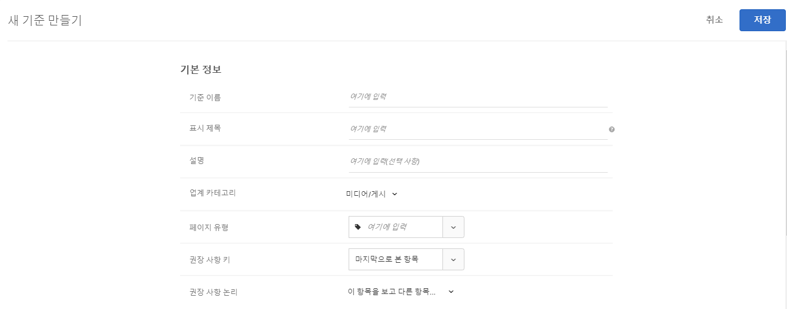

#  기준

의 기준 [!DNL Adobe Target] [!DNL Recommendations] 사전 결정된 방문자 행동 세트를 기준으로 추천할 제품 또는 콘텐츠를 결정하는 규칙입니다. 기준은 인기 있는 추세, 방문자의 현재 및 과거 행동 또는 유사한 제품 및 콘텐츠를 기반으로 지정할 수 있습니다. 여러 알고리즘을 추가하여 여러 권장 사항 유형을 서로 비교하면서 테스트할 수 있습니다.

다음 섹션에서는 각 키에 사용할 수 있는 기준 키 및 권장 사항 로직에 대해 자세히 설명합니다. 자세한 내용을 보려면 링크를 클릭합니다.

## 업계 카테고리 {#section_936BCFCF234C49A2BEC1C38AAC2D71AF}

기준을 만드는 동안 권장 사항 활동의 목표를 기반으로 수직 시장을 선택합니다.

| 업계 카테고리 | 목표 |
|--- |--- |
| 소매/Ecommerce | 구매를 발생시키는 전환 |
| 리드 생성/B2B/금융 서비스 | 구매가 없는 전환 |
| 미디어/게시 | 참여 |

기타 기준 옵션은 선택한 수직 시장에 따라 변경됩니다. 기본 수직 시장을 **[!UICONTROL Recommendations > 설정]** 페이지나 각 기준에 대해 수직 시장을 지정할 수 있습니다.

## 알고리즘 유형 {#section_885B3BB1B43048A88A8926F6B76FC482}

선택하는 알고리즘 유형에 따라 사용 가능한 알고리즘이 결정됩니다. 을 설정할 때 기준 카드로 표현되는 몇 가지 알고리즘 유형이 있습니다 [!DNL Recommendations] 활동.

다음 표에서는 다양한 알고리즘 유형 및 관련 알고리즘에 대해 설명합니다.

| 알고리즘 유형 | 사용 시기 | 사용 가능한 알고리즘 |
| --- | --- | --- |
| [!UICONTROL 장바구니 기반] | 사용자의 장바구니 콘텐츠를 기반으로 하여 권장 사항을 만듭니다. | <ul><li>이러한 항목을 보고 다른 항목도 본 사람</li><li>이 항목을 보고 다른 항목을 구입한 사람</li><li>이 항목을 구입하고 다른 항목도 구입한 사람</li></ul>자세한 내용은 [장바구니 기반](/help/c-recommendations/c-algorithms/base-the-recommendation-on-a-recommendation-key.md#cart-based) in *권장 사항 키를 기반으로 권장 사항 만들기*. |
| [!UICONTROL 인기도 기반] | 사이트에서 항목의 전체 인기도를 기반으로 하거나 사용자가 즐겨찾거나 가장 많이 본 카테고리, 브랜드, 장르 등 내에서 항목의 인기도를 기반으로 권장 사항을 만듭니다. | <ul><li>사이트에서 가장 많이 본 항목</li><li>카테고리별로 가장 많이 본 항목</li><li>품목 속성별로 가장 많이 본 항목 속성</li><li>사이트 간 최상위 판매자</li><li>카테고리별 최상위 판매자</li><li>항목별 최상위 판매자 속성</li><li>Analytics 지표별 상위</li></ul> |
| [!UICONTROL 항목 기반] | 사용자가 현재 보고 있거나 최근에 본 항목과 유사한 항목을 찾는 것을 기반으로 권장 사항을 만드십시오. | <ul><li>이 항목을 보고 다른 항목도 본 사람</li><li>이 항목을 보고 다른 항목을 구입한 사람</li><li>이 항목을 구입하고 다른 항목도 구입한 사람</li><li>비슷한 속성을 갖는 항목</li></ul> |
| [!UICONTROL 사용자 기반] | 사용자의 행동을 기반으로 권장 사항을 만드십시오. | <ul><li>최근에 본 항목</li><li>권장 사항</li></ul> |
| [!UICONTROL 사용자 지정 기준] | 업로드하는 사용자 지정 파일을 기반으로 하여 권장 사항을 만듭니다. | <ul><li>사용자 지정 알고리즘</li></ul> |

각 알고리즘에 대한 자세한 내용은 [권장 사항 키를 기반으로 권장 사항 만들기](/help/c-recommendations/c-algorithms/base-the-recommendation-on-a-recommendation-key.md).

## 사용자 지정 권장 사항 키 사용 {#custom-key}

사용자 지정 프로필 속성 값을 기준으로 하여 권장 사항을 만들 수도 있습니다.

>[!NOTE]
>
>사용자 지정 프로필 매개 변수를에 전달할 수 있습니다 [!DNL Target] JavaScript, API 또는 통합을 통해 다음을 수행할 수 있습니다. 사용자 지정 프로필 속성에 대한 자세한 내용은 [방문자 프로필](/help/c-target/c-visitor-profile/visitor-profile.md).

예를 들어 사용자가 가장 최근에 큐에 추가한 동영상을 기반으로 권장 동영상을 표시하려 한다고 가정합니다.

1. 클릭 **[!UICONTROL Recommendations]** > **[!UICONTROL 기준]**.

1. 클릭 **[!UICONTROL 기준 만들기]** > **[!UICONTROL 기준 만들기]**.

1. 정보를 [기본 정보 섹션](/help/c-recommendations/c-algorithms/create-new-algorithm.md#info).

1. 에서 [권장 알고리즘](/help/c-recommendations/c-algorithms/create-new-algorithm.md#rec-algo) 섹션, **[!UICONTROL 항목 기반]** 에서 **[!UICONTROL 알고리즘 유형]** 목록.

1. 선택 **[!UICONTROL 이 항목을 보고 다른 항목도 본 사람]** 에서 **[!UICONTROL 알고리즘]** 목록.

1. 에서 사용자 지정 프로필 속성을 선택합니다 **[!UICONTROL 권장 사항 키]** 목록(예: [!UICONTROL 감시 목록에 추가된 마지막 표시]).

   

## 기준 정보 보기 {#section_7162DE58E4594FD688A4D7FDB829FD8B}

카드 위로 마우스를 이동하고 기준을 열지 않은 상태로 기준 카드에서 정보 아이콘을 클릭하여 팝업 카드에 대한 기준 세부 사항을 볼 수 있습니다.

**[!UICONTROL 알고리즘 정보]** 탭을 클릭하여 이름, 설명, 업계, 페이지 유형, 권장 사항 키, 권장 사항 논리 및 알고리즘 ID를 포함하여 선택한 기준에 대한 일반 정보를 볼 수 있습니다.

**[!UICONTROL 알고리즘 사용]** 탭을 클릭하여 선택한 기준을 참조하는 활동 목록을 표시합니다. 카드는 활성, 비활성 및 초안 활동을 나열합니다. 라이브 활동/비활성 활동/초안 활동 드롭다운 목록을 클릭하여 해당 기준을 참조하는 전체 활동 목록을 표시합니다. 활동 링크를 클릭하여 편집할 활동을 열 수 있습니다.

>[!NOTE]
>
>다음 [!UICONTROL 알고리즘 사용] 기능은 현재 Recommendations 활동에만 지원됩니다. 이 기능은 현재 를 포함하는 A/B 테스트, 자동 할당, 자동 Target 및 XT(경험 타깃팅) 활동에 대해 지원되지 않습니다 [오퍼로서의 recommendations](/help/c-recommendations/recommendations-as-an-offer.md).
