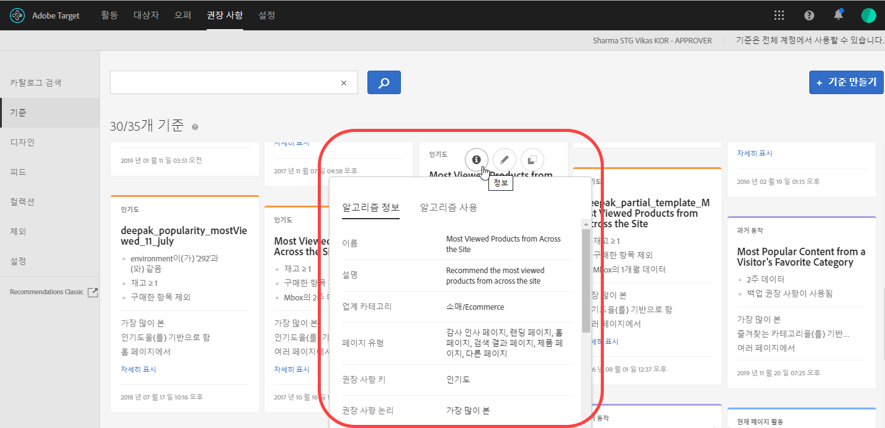
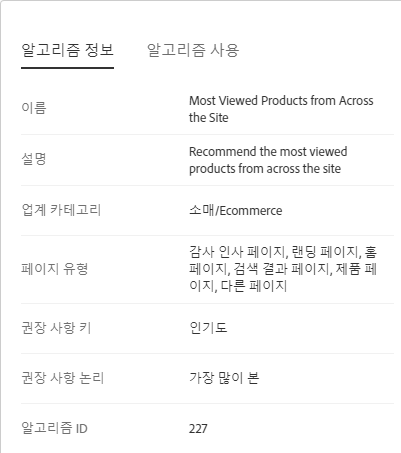
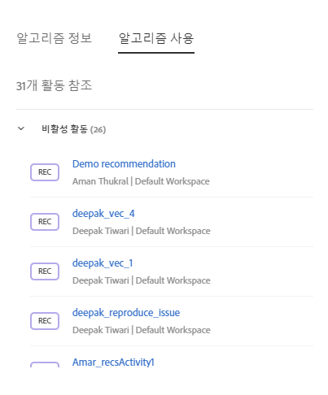

#  기준{#criteria}

기준은 사전 결정된 방문자 행동 세트를 기준으로 추천할 제품을 결정하는 규칙입니다.

기준은 어느 작업으로 인해 어느 권장 사항이 발생하는지를 결정합니다. 여러 알고리즘을 추가하여 여러 권장 사항 유형을 서로 비교하면서 테스트할 수 있습니다.

## 업계 카테고리 {#section_936BCFCF234C49A2BEC1C38AAC2D71AF}

권장 사항 활동의 목표를 기반으로 업계 카테고리를 선택합니다.

| 업계 카테고리 | 목표 |
|--- |--- |
| 소매/Ecommerce | 구매를 발생시키는 전환 |
| 리드 생성/B2B/금융 서비스 | 구매가 없는 전환 |
| 미디어/게시 | 참여 |

## 권장 사항 키 {#section_885B3BB1B43048A88A8926F6B76FC482}

선택하는 권장 사항 키는 기준 유형을 결정합니다. [!DNL Recommendations] 활동을 설정할 때 기준 카드로 표현되는 몇 가지 기준 유형이 있습니다.

| 기준 유형 | 키 |
|--- |--- |
| 현재 페이지 활동 | 사용자가 현재 페이지에서 수행하는 활동을 기준으로 항목을 추천합니다. 예를 들어, 특정 문서를 보는 방문자는 동일한 카테고리의 다른 문서를 볼 수 있습니다.<ul><li>현재 항목</li><li>현재 카테고리</li></ul> |
| 사용자 지정 | 사용자 지정 속성을 기준으로 항목을 추천합니다.<ul><li>사용자 지정 속성</li></ul>사용자 지정 속성을 권장 사항의 기반으로 사용할 때에는 사용자 지정 속성을 선택한 다음, 권장 사항 유형을 선택해야 합니다. 자신만의 사용자 지정 기준 출력의 맨 위에서 실시간 필터링을 수행할 수 있습니다. 예를 들어, 권장 사항 항목을 방문자가 선호하는 카테고리 또는 브랜드의 항목으로만 제한할 수 있습니다. 이렇게 하면 오프라인 계산을 실시간 필터링과 결합할 수 있습니다. 이 기능은 Target을 사용하여 오프라인 계산된 권장 사항이나 사용자 지정 조정 목록의 맨 위에 개인화를 추가할 수 있음을 의미합니다. 이 작업에서는 데이터 과학자 및 연구의 힘을 Adobe의 유효성이 증명된 전달, 런타임 필터링, A/B 테스트, 타깃팅, 보고, 통합 등과 결합합니다. 사용자 지정 기준에 포함 규칙을 추가하면 기존의 정적 권장 사항이 방문자의 관심 사항을 기반으로 하는 동적 권장 사항으로 변경됩니다.<ul><li>사용자 지정 기준은 권장 사항에 있는 다른 기준처럼 구성이 가능합니다.</li><li>다른 기준과 동일한 방식으로 [컬렉션](/help/c-recommendations/c-products/collections.md), [제외](/help/c-recommendations/c-products/exclusions.md) 및 [포함](/help/c-recommendations/c-algorithms/use-dynamic-and-static-inclusion-rules.md)(가격 및 재고에 대한 특수 규칙 포함)을 사용할 수 있습니다.</li></ul>가능한 사용 사례는 다음과 같습니다.<ul><li>사용자 지정 조정 목록에서 동영상을 추천하고 싶은데, 방문자가 아직 시청하지 않은 경우에만 추천하고 싶습니다.</li><li>오프라인 알고리즘을 실행하고 그 결과를 사용하여 추천하되, 재고 부족 항목을 추천하지 않도록 해야 합니다.</li><li>이 방문자의 선호 카테고리에 있는 항목만 포함하려 합니다.</li></ul> |
| 과거 동작 | 방문자가 과거에 항목에 반응을 보인 방법을 기반으로 항목을 추천합니다. 예를 들어, 특정 브랜드를 구입한 사람은 해당 브랜드의 다른 항목을 구입할 가능성이 더 높았습니다.<ul><li>마지막으로 구매한 항목</li><li>마지막으로 본 항목</li><li>가장 많이 본 항목</li><li>즐겨찾는 카테고리</li></ul> |
| 인기도 | 관련 카테고리에서 가장 인기 있는 비디오나, 사이트에서 가장 자주 보는 제품과 같이 가장 인기 있는 항목을 추천합니다.<ul><li>인기도</li></ul> |
| 최근에 본 항목 | 방문자가 마지막으로 사이트를 방문했을 때 본 항목과 같이 방문자가 가장 최근에 본 항목이나 현재 가장 트렌드가 되는 문서를 추천합니다. 최근에 본 항목 알고리즘은 [환경](/help/administrating-target/hosts.md) 내의 방문자 활동에 따른 결과를 반환합니다. 방문자가 서로 다른 환경에 속한 두 사이트 간에 전환하는 경우 알고리즘은 해당 사이트에서 최근에 본 항목만 반환합니다. 이 기준 유형은 컬렉션으로 제한되지 않습니다.<ul><li>최근에 본 항목</li></ul>**참고:** 백업 권장 사항에는 최근에 본 항목 기준을 사용할 수 없습니다. 최근에 본 항목/미디어는 특정 속성이 있는 항목만 표시되도록 필터링 할 수 있습니다.<ul><li>최근에 본 항목 기준은 권장 사항에 있는 다른 기준처럼 구성이 가능합니다.</li><li>You can use [collections](/help/c-recommendations/c-products/collections.md), [exclusions](/help/c-recommendations/c-products/exclusions.md), and [inclusions](/help/c-recommendations/c-algorithms/use-dynamic-and-static-inclusion-rules.md) (including the special rules for Price and Inventory) in the same way as any other criteria.</li></ul>가능한 사용 사례는 다음과 같습니다.<ul><li>여러 가지 비즈니스를 하는 다국적 기업에는 여러 디지털 속성을 갖는 방문자 보기 항목이 있을 수 있습니다. 이 경우 항목을 본 각각의 속성에 대해서만 표시하도록 최근에 본 항목을 제한할 수 있습니다. 이렇게 하면 최근에 본 항목이 다른 디지털 속성의 사이트에 표시되지 않습니다.</li></ul> |

## 기준/알고리즘 {#section_DC4E38A00B9744959F05F8E10A0087A1}

[!DNL Target Recommendations]에서는 정교한 알고리즘을 사용하여 방문자의 작업이 활동에 설정된 기준에 적합한 경우를 판별합니다. 사용 가능한 권장 사항 논리 선택 사항은 권장 사항 키가 판별합니다.

| 기준 | 설명 |
|--- |--- |
| 비슷한 속성을 갖는 항목/미디어 | 현재 페이지 활동 또는 과거 방문자 행동을 기반으로 한 항목 또는 미디어와 유사한 항목 또는 미디어를 추천합니다. **참고:** 속성이 비슷한 항목/미디어를 선택하면 컨텐츠 유사성 규칙을 설정할 수 있는 선택 사항이 표시됩니다. |
| 이 항목을 보고 다른 항목도 본 사람 | 지정한 항목을 본 것과 동일한 세션에서 가장 자주 본 항목을 추천합니다. |
| 이 항목을 보고 다른 항목을 구입한 사람 | 지정한 항목을 본 것과 동일한 세션에서 가장 자주 구입한 항목을 추천합니다. 이 기준은 이 항목을 본 사용자가 구입한 다른 제품을 반환하고 지정된 제품은 결과 세트에 포함되지 않습니다. |
| 이 항목을 구입하고 다른 항목도 구입한 사람 | 지정한 항목과 동시에 고객이 가장 자주 구입한 항목을 추천합니다. |
| 사이트 친화성 | 항목 간 관계의 확실성에 따라 항목을 추천합니다. 포함 규칙 슬라이더를 사용하여 권장 사항을 제시하기 위해 먼저 필요한 데이터의 양을 결정하도록 이 기준을 구성할 수 있습니다. 예를 들어 매우 강력함을 선택하면 관심도가 가장 강한 제품이 추천됩니다. 예를 들어 매우 강력한 친화성을 설정하고 디자인에 5개의 항목이 포함되어 있으며 그중 세 개 항목이 연결 임계값의 강도를 충족하는 경우, 최소 강도 요구 사항을 충족하지 않는 두 항목은 권장 사항에 표시되지 않고 정의된 백업 항목으로 교체됩니다. 친화성이 가장 강한 항목부터 표시됩니다. 제품 컬렉션과 사이트 행동이 다양한 일부 고객의 경우 사이트 친화성을 낮게 설정하면 더 좋은 결과를 얻을 수도 있습니다. |
| 최상위 판매자 | 가장 많이 완료된 주문에 포함된 항목. 단일 주문에서 여러 개의 동일한 항목은 하나의 주문으로 계산됩니다. |
| 가장 많이 본 항목 | 가장 자주 표시되는 항목 또는 미디어. |
| 최근에 본 항목/미디어 | 방문자가 최근에 본 항목입니다. 이 기준을 사용하는 경우 Target 디자인을 업데이트하여 표시하는 데 필요한 이전에 본 항목이 충분하지 않다면 빈 권장 사항이 표시되는 경우를 처리해야 합니다. |

>[!NOTE] {class="- topic/note "}
>
>권장 사항을 실행하는 중 기준을 변경하면 보고 데이터를 잃게 됩니다.

방문자에 대해 알려진 추가 정보를 사용하여 권장 사항을 향상시킬 수도 있습니다.

모든 1일 기준이 매일 두 번 실행됩니다. 모든 1주 이상 기준은 하루에 한 번 실행됩니다. 사이트 친화성 기준은 하루에 한 번 실행됩니다. 백업 기준은 하루에 두 번 실행됩니다.

## 기준 정보 보기 {#section_7162DE58E4594FD688A4D7FDB829FD8B}

카드 위로 마우스를 이동하고 기준을 열지 않은 상태로 기준 카드에서 정보 아이콘을 클릭하여 팝업 카드에 대한 기준 세부 사항을 볼 수 있습니다.

**[!UICONTROL 알고리즘 정보]탭을 클릭하여 이름, 설명, 업계, 페이지 유형, 권장 사항 키, 권장 사항 논리 및 알고리즘 ID를 포함하여 선택한 기준에 대한 일반 정보를 볼 수 있습니다.**

**[!UICONTROL 알고리즘 사용]탭을 클릭하여 선택한 기준을 참조하는 활동 목록을 표시합니다.** 카드에 활성 및 비활성 활동이 나열됩니다. 라이브 활동 또는 활동 없음 드롭다운 목록을 클릭하여 해당 기준을 참조하는 전체 활동 목록을 표시합니다. 활동 링크를 클릭하여 편집할 활동을 열 수 있습니다.

## 기준 결과를 표시할 준비가 되었는지 확인 {#section_03F328C07F234692B6D996DF745584B3}

활동 다이어그램에서는 이제 결과를 표시할 준비가 되면 기준 카드에 표시됩니다. 결과를 표시할 준비가 되었는지 알고 있으면 활동을 활성화하여 라이브로 게시할 준비가 되었는지 확인하는 데 도움이 됩니다. 결과를 표시할 준비가 되었는지 알고 있으면 기준에 문제가 있는지 파악하는 데에도 도움이 됩니다.

>[!NOTE]
>
>로드 시간에 대한 논의에 대해서는 [기준 만들기](../../c-recommendations/c-algorithms/create-new-algorithm.md#task_8A9CB465F28D44899F69F38AD27352FE)의 "예상 기준 처리 시간"을 참조하십시오.

다음 그림은 권장 사항 활동의 개요 페이지에 활동 다이어그램을 나타낸 것입니다. 또한 활동 생성 워크플로우 중 2단계의 기준 상태 결과를 사용하여 활동 다이어그램을 볼 수 있습니다.

상태 결과에는 다음 다이어그램에 나와 있는 대로 결과 준비, 결과가 준비되지 않음 및 피드 실패가 포함됩니다.

