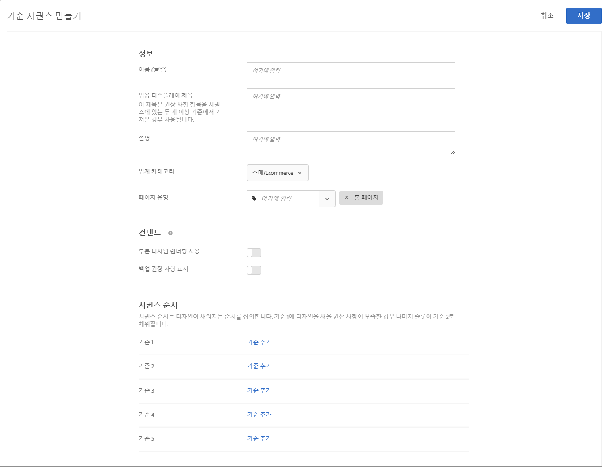

#  기준 시퀀스 만들기

[!UICONTROL 권장 사항] 활동에 나타나는 항목을 더 잘 제어하려면 기준이 최대 5개인 시퀀스를 사용하십시오.

>[!NOTE]
>
>기준 시퀀스를 2016년 10월 릴리스 이전에 만든 [!UICONTROL 권장 사항] 활동에는 사용할 수 없습니다[!DNL Target Premium].

기준 시퀀스를 만들려면 먼저 시퀀스에 포함할 기준을 만들어야 합니다. 각 유형의 대상 규칙을 구성하는 방법에 대한 자세한 내용은 [자세한 내용은 기준 만들기](/help/c-recommendations/c-algorithms/create-new-algorithm.md)를 참조하십시오.

기준이 디자인을 채울 수 있는 충분한 결과를 반환하지 않을 경우, 기준 시퀀스를 사용하여 일반적인 백업 권장 사항을 사용하는 대신 추가로 타깃팅된 권장 사항을 제공할 수 있습니다. 일반적으로 기준 시퀀스는 더 적은 결과를 반환하는 보다 구체적인 타깃팅에서 더 일반적인 타깃팅으로 진행되므로 더 많은 결과를 반환합니다.

다음 예에서 보듯이 기준 시퀀스는 페이지 유형에 따라 달라질 수 있습니다.

| 페이지 유형 | 가능한 시퀀스 순서 |
| --- | --- |
| 제품 페이지 | <ol><li>동일한 브랜드의 현재 항목 기준</li><li>모든 브랜드의 현재 항목 기준</li><li>컨텐츠 유사성 기준</li><li>최상위 판매자 기준</li><li>사이트에서 가장 많이 본 항목 기준</li></ol> |
| 홈 페이지 | <ol><li>방문자의 마지막 구매 기준 </li><li>방문자의 즐겨찾기 항목 기준</li><li>방문자의 즐겨찾기 카테고리 기준</li><li>최상위 판매자 기준</li><li>사이트에서 가장 많이 본 항목 기준</li></ol> |

## 기준 시퀀스 생성 화면에 액세스

[!UICONTROL 기준 시퀀스 만들기] 화면에 도달하는 여러 방법이 있습니다. 일부 화면 옵션은 화면에 도달하는 방법에 따라 달라집니다.

* **[!UICONTROL 권장 사항]** > **[!UICONTROL 기준]** 라이브러리 화면에서 **[!UICONTROL 기준 만들기]** > **[!UICONTROL 기준 시퀀스 만들기]**&#x200B;를 클릭합니다. 여기서 만드는 기준은 자동으로 모든 [!UICONTROL 권장 사항] 활동에 사용 가능해집니다.
* [!UICONTROL Recommendations] 활동을 생성하는 경우 기준 선택 화면에서 새로 만들기 **[!UICONTROL 만들기]** > 기준 시퀀스 **[!UICONTROL 만들기를 클릭합니다]**. 다른 [!UICONTROL 권장 사항] 활동과 함께 사용할 새 기준 시퀀스를 저장하는 옵션이 있습니다.
* [!UICONTROL Recommendations] 활동을 편집할 때 페이지의 [!UICONTROL Recommendations 위치] 상자를 클릭한 다음 기준 **[!UICONTROL 변경을 선택합니다]**. [!UICONTROL 기준 선택] 화면에서 **[!UICONTROL 새로 만들기]** > **[!UICONTROL 기준 시퀀스 만들기]**&#x200B;를 클릭합니다. 다른 [!UICONTROL 권장 사항] 활동과 함께 사용할 새 기준을 저장하는 옵션이 있습니다.

다음 단계에서는 첫 번째 방법을 사용하여 기준 시퀀스 [!UICONTROL 생성] 화면에 액세스한다고 가정합니다.[ **[!UICONTROL Recommendations]** ] > [ **[!UICONTROL 기준]** 라이브러리] 화면

1. Recommendations **[!UICONTROL >]** 기준을 클릭합니다 ****.

1. 기준 **[!UICONTROL 만들기]** > 기준 **[!UICONTROL 시퀀스 만들기를 클릭합니다]**.

   

## 정보 섹션 채우기

1. 시퀀스의 **[!UICONTROL 이름]**&#x200B;을 입력합니다.

   기준 시퀀스를 설명하는 데 사용되는 &quot;내부&quot; 이름입니다. 사이트 방문자에게는 이 이름이 표시되지 않습니다.

   

1. 시퀀스의 여러 기준이 **[!UICONTROL 권장 사항]** 디자인을 채우는 데 사용될 경우 페이지에 표시할 공개 [!UICONTROL 일반 표시 제목]을 입력합니다.

   예를 들어 디자인에 둘 이상의 [!UICONTROL 권장 사항] 키를 기준으로 하는 항목이 포함될 수 있는 경우, &quot;이 항목을 본 고객이 다음 항목도 본 경우...&quot;를 &quot;사용자에게 권장&quot;으로 바꿀 수 있습니다.

1. 기준 시퀀스에 대한 간단한 **[!UICONTROL 설명]**&#x200B;을 입력합니다.

   설명은 기준 시퀀스를 식별하는 데 도움이 되며 해당 용도에 대한 정보를 포함할 수 있습니다.

1. **[!UICONTROL 수직 시장]**&#x200B;을 선택합니다.

   Your default [industry vertical](/help/c-recommendations/c-algorithms/algorithms.md#section_936BCFCF234C49A2BEC1C38AAC2D71AF) appears automatically.

1. **[!UICONTROL 페이지 유형]**&#x200B;을 선택합니다.

   여러 페이지 유형을 선택할 수 있습니다.

   수직 시장 및 페이지 유형을 함께 사용하여 저장된 기준 시퀀스를 분류할 수 있습니다. 이렇게 하면 다른 [!UICONTROL 권장 사항] 활동에 대한 시퀀스를 좀 더 쉽게 다시 사용할 수 있습니다.

## 시퀀스 만들기 {#sequence}

시퀀스 순서는 디자인이 채워지는 순서를 정의합니다. 기준 1에 디자인을 채울 권장 사항이 충분하지 않으면 나머지 슬롯은 기준 2로 채워집니다.

1. 기준 **[!UICONTROL 시퀀스]** 섹션에서 기준 **[!UICONTROL 추가를 클릭합니다]**.

   

1. On the [!UICONTROL Select Criteria] screen, select a criteria.

   검색 상자 및 필터 드롭다운을 사용하여 원하는 기준을 찾을 수 있습니다.

   

1. **[!UICONTROL 추가를 클릭합니다]**.

1. (선택 사항) &quot; **[!UICONTROL 켜짐&quot; 위치로 전환된]** 항목의 수를 제한하고 항목 수(1과 50 사이)를 지정합니다.

   

   반환되는 항목 수 제한 [!UICONTROL 옵션의 값을] 이해하는 데 도움이 되도록 다음 사용 사례를 고려하십시오.

   * **사용 사례 1**:단일 권장 사항 트레이에 여러 종류의 항목을 혼합하려는 경우 예를 들어, 겉옷(자켓)과 윗옷(셔츠, 티셔츠)을 혼합하여 표시하려고 합니다. 이를 위해서는 컬렉션의 디자인 슬롯에서 원하는 모든 잠재적 제품 유형을 포함하는 활동을 이용하십시오. 그런 다음 기준을 제한하는 정적 필터로 첫 번째 기준을 설정하고 기준을 가장 바깥옷만 포함하도록 제한하는 정적 필터로 두 번째 기준을 설정합니다. 마지막으로 기준 시퀀스에 두 기준을 추가하고 첫 번째 기준을 2개의 슬롯으로 제한합니다.

      권장 사항 트레이는 사이트에서 다음과 같이 표시될 수 있습니다.

      

   * **사용 사례 2**:대체 항목과 보조 항목을 모두 혼합해야 합니다. 조회한/본 알고리즘을 사용하고 권장 항목을 현재 항목 카테고리로 제한하는 동적 필터를 사용하도록 한 기준을 설정합니다. 두 번째 기준을 설정하여 보고/구입한 알고리즘을 사용하고 현재 항목의 카테고리와 일치하지 않는 권장 항목만 포함하는 동적 필터를 사용하십시오. 마지막으로 두 기준을 모두 시퀀스에 추가하고 첫 번째 기준을 2개의 슬롯으로 제한합니다.

1. 시퀀스에 기준을 계속 추가합니다. 시퀀스에 최대 5개의 기준을 추가할 수 있습니다.

## 백업 컨텐츠 지정

디자인 템플릿을 채울 수 있는 권장 사항이 충분하지 않을 때 반환할 컨텐츠를 선택합니다.

기준 시퀀스를 만들 경우 백업 권장 사항 및 부분 디자인 렌더링 설정이 해당 시퀀스를 구성하는 개별 기준에 대해 무시됩니다. 백업 권장 사항 및 부분 디자인 렌더링을 사용하려면 시퀀스에 대해 해당 기능을 활성화해야 합니다. 적절한 전환 옵션을 선택합니다. 백업 권장 사항을 허용하도록 선택하는 경우 백업에 포함 규칙을 적용할지도 선택할 수 있습니다.

1. (선택 사항) **[!UICONTROL 부분 디자인 렌더링]** 전환 효과를 &quot;설정&quot; 위치로 밀면

   가능한 한 많은 슬롯이 채워지지만 디자인 템플릿에는 나머지 슬롯의 빈 공간이 포함될 수 있습니다.

1. (선택 사항) **[!UICONTROL 백업 Recommendations]** 전환을 &quot;켜기&quot; 위치로 밀십시오.

   사이트에서 가장 많이 본 제품을 임의 선택하여 디자인에 남아 있는 빈 슬롯을 채웁니다.

   자세한 내용은 백업 권장 [사항 사용을 참조하십시오](/help/c-recommendations/c-algorithms/backup-recs.md).

1. (조건부) 이전 단계에서 **[!UICONTROL Recommendations]** 백업을 선택한 경우 백업 권장 사항에 **[!UICONTROL 포함 규칙 적용을 선택할 수 있습니다]**.

   For more information see [Use dynamic and static inclusion rules](/help/c-recommendations/c-algorithms/use-dynamic-and-static-inclusion-rules.md).

1. **[!UICONTROL 저장]**&#x200B;을 클릭합니다.

   기준 시퀀스가 기준 목록에 나타납니다.

   권장 사항 논리 선택 사항에 대한 자세한 내용은 [기준](../../c-recommendations/c-algorithms/algorithms.md)을 참조하십시오.

## 교육 비디오: 추천에서 기준 만들기(12:33) 

이 비디오에는 다음 정보가 포함됩니다.

* 기준 만들기
* 기준 시퀀스 만들기
* 사용자 지정 기준 업로드

>[!VIDEO](https://video.tv.adobe.com/v/27694?quality=12)
