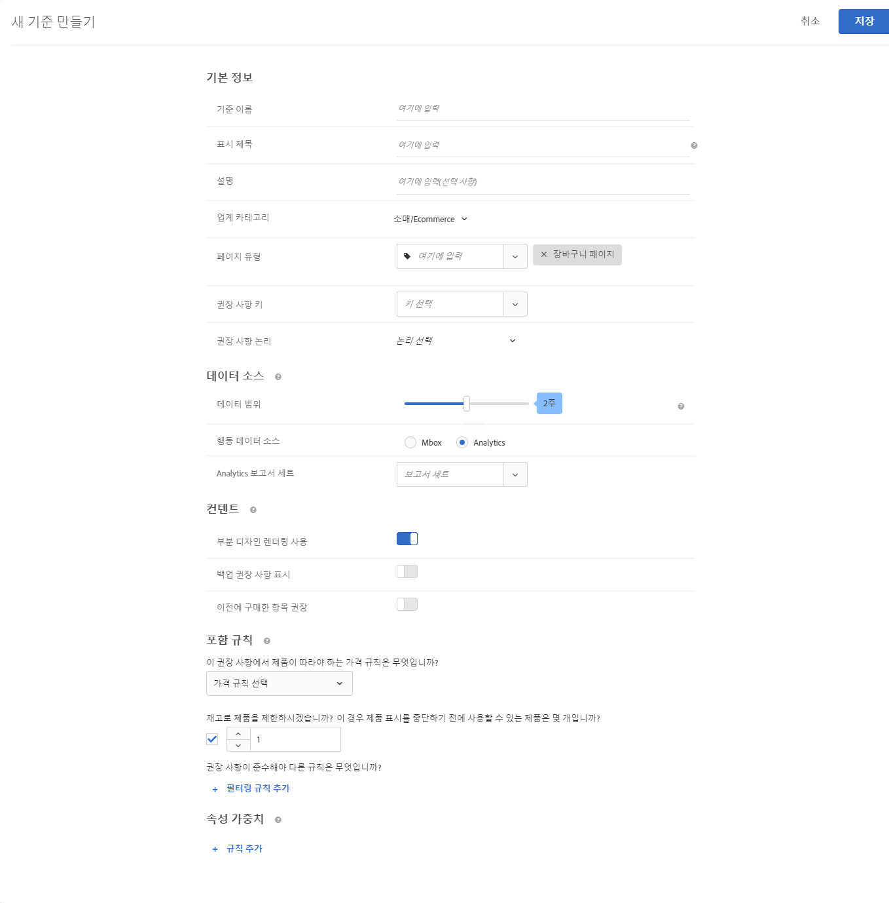
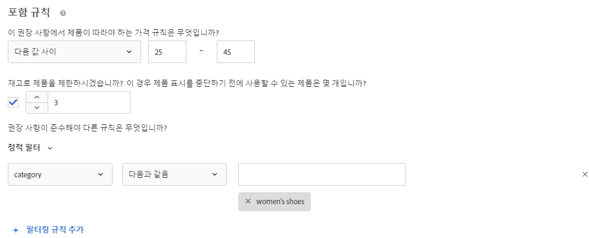

#  기준 만들기

의 기준 [!UICONTROL Adobe Target] [!UICONTROL Recommendations] 의 컨텐츠를 제어합니다 [!UICONTROL Recommendations] 활동. 활동에 가장 적합한 권장 사항을 표시하는 기준을 만드십시오. 이러한 기준은 방문자의 작업을 사용하여 표시할 컨텐츠 또는 제품을 결정합니다.

다음 섹션에서는 새 기준을 만드는 방법을 설명합니다.

## 새 기준 만들기 화면에 액세스합니다

[!UICONTROL 새 기준 만들기] 화면에 도달하는 여러 방법이 있습니다. 일부 화면 옵션은 화면에 도달하는 방법에 따라 달라집니다.

* 설정 **[!UICONTROL Recommendations]** > **[!UICONTROL 기준]** 라이브러리 화면에서 **[!UICONTROL 기준 만들기]** > **[!UICONTROL 기준 만들기]**. 여기서 만드는 기준은 자동으로 모든 [!DNL Recommendations] 활동에 사용 가능해집니다.
* 만들기 [!DNL Recommendations] 활동을 사용하여 [!UICONTROL 시각적 경험 작성기] (VEC) 즉시 로 이동됩니다. [!UICONTROL 기준 선택] 페이지에서 요소를 선택한 후 화면을 선택하고 [!UICONTROL Recommendations으로 바꾸기], [!UICONTROL 앞에 Recommendations 삽입], 또는 [!UICONTROL 다음 항목 뒤에 Recommendations 삽입]. 그런 다음 사용 가능한 기준을 선택하거나 **[!UICONTROL 기준 만들기]**. 새 기준을 만드는 경우 다른 기준과 함께 사용할 기준을 저장하는 선택 사항이 있습니다 [!DNL Recommendations] 활동. 자세한 내용은 [Recommendations 활동 만들기](/help/c-recommendations/t-create-recs-activity/create-recs-activity.md).
* [!DNL Recommendations] 활동을 편집하는 경우 페이지에서 [!UICONTROL 권장 사항 위치] 상자를 클릭하고 **[!UICONTROL 기준 변경]**&#x200B;을 선택합니다. 설정 [!UICONTROL 기준 선택] 을 클릭하고 **[!UICONTROL 기준 만들기]**. 다른 [!DNL Recommendations] 활동과 함께 사용할 새 기준을 저장하는 선택 사항이 있습니다.

다음 절차에서는 [!UICONTROL 새 기준 만들기] 첫 번째 방법을 사용하여 화면: a **[!UICONTROL Recommendations]** > **[!UICONTROL 기준]** 라이브러리 화면.

1. 클릭 **[!UICONTROL Recommendations]** > **[!UICONTROL 기준]**.

1. 클릭 **[!UICONTROL 기준 만들기]** > **[!UICONTROL 기준 만들기]**.

   

1. 다음 섹션에서 정보를 구성합니다.

## [!UICONTROL 기본 정보] {#info}

1. **[!UICONTROL 기준 이름]**&#x200B;을 입력합니다.

   기준을 설명하는 데 사용되는 &quot;내부&quot; 이름입니다. 예를 들어, &quot;최고 마진 제품&quot; 기준을 호출하려고 하지만 제목이 공개적으로 표시되는 것을 원하지 않을 수 있습니다. 공개 제목을 설정하려면 다음 단계를 참조하십시오.

   

1. 이 기준을 사용하는 모든 권장 사항에 대한 페이지에 표시할 공개 **[!UICONTROL 표시 제목]**&#x200B;을 입력합니다.

   예를 들어, 이 기준을 사용하여 권장 사항을 표시할 때 &quot;특정 항목을 본 사용자&quot; 또는 &quot;유사 제품&quot;을 표시할 수 있습니다.

1. 기준에 대한 간단한 **[!UICONTROL 설명]**&#x200B;을 입력합니다.

   설명은 기준을 식별하는 데 도움이 되어야 하며 기준의 용도에 대한 정보를 포함할 수 있습니다.

1. 권장 사항 활동의 목표를 기반으로 수직 시장을 선택합니다.

   | 업계 카테고리 | 목표 |
   |--- |--- |
   | 소매/Ecommerce | 구매를 발생시키는 전환 |
   | 리드 생성/B2B/금융 서비스 | 구매가 없는 전환 |
   | 미디어/게시 | 참여 |

   기타 기준 옵션은 선택한 수직 시장에 따라 달라집니다.

1. **[!UICONTROL 페이지 유형]**&#x200B;을 선택합니다.

   여러 페이지 유형을 선택할 수 있습니다.

   수직 시장 및 페이지 유형을 함께 사용하여 저장된 기준을 분류할 수 있습니다. 이렇게 하면 다른 [!DNL Recommendations] 활동에 대한 기준을 좀 더 쉽게 다시 사용할 수 있습니다.

## [!UICONTROL Recommendations 알고리즘] {#rec-algo}

1. 선택 **[!UICONTROL 알고리즘 유형]** 및 **[!UICONTROL 알고리즘]**:

   

   | 알고리즘 유형 | 사용 시기 | 사용 가능한 알고리즘 |
   | --- | --- | --- |
   | [!UICONTROL 장바구니 기반] | 사용자의 장바구니 콘텐츠를 기반으로 하여 권장 사항을 만듭니다. | <ul><li>이러한 항목을 보고 다른 항목도 본 사람</li><li>이 항목을 보고 다른 항목을 구입한 사람</li><li>이 항목을 구입하고 다른 항목도 구입한 사람</li></ul> |
   | [!UICONTROL 인기도 기반] | 사이트에서 항목의 전체 인기도를 기반으로 하거나 사용자가 즐겨찾거나 가장 많이 본 카테고리, 브랜드, 장르 등 내에서 항목의 인기도를 기반으로 권장 사항을 만듭니다. | <ul><li>사이트에서 가장 많이 본 항목</li><li>카테고리별로 가장 많이 본 항목</li><li>품목 속성별로 가장 많이 본 항목 속성</li><li>사이트 간 최상위 판매자</li><li>카테고리별 최상위 판매자</li><li>항목별 최상위 판매자 속성</li><li>Analytics 지표별 상위</li></ul> |
   | [!UICONTROL 항목 기반] | 사용자가 현재 보고 있거나 최근에 본 항목과 유사한 항목을 찾는 것을 기반으로 권장 사항을 만드십시오. | <ul><li>이 항목을 보고 다른 항목도 본 사람</li><li>이 항목을 보고 다른 항목을 구입한 사람</li><li>이 항목을 구입하고 다른 항목도 구입한 사람</li><li>비슷한 속성을 갖는 항목</li></ul> |
   | [!UICONTROL 사용자 기반] | 사용자의 행동을 기반으로 권장 사항을 만드십시오. | <ul><li>최근에 본 항목</li><li>권장 사항</li></ul> |
   | [!UICONTROL 사용자 지정 기준] | 업로드하는 사용자 지정 파일을 기반으로 하여 권장 사항을 만듭니다. | <ul><li>사용자 지정 알고리즘</li></ul> |

   >[!NOTE]
   >
   >선택하는 경우 **[!UICONTROL 항목]**/ **[!UICONTROL 비슷한 속성을 갖는 미디어]**&#x200B;를 설정하는 옵션이 있습니다. [콘텐츠 유사성 규칙](#similarity).

1. 필요에 따라 **항목 속성** 및 **일치하는 프로필 속성**, **권장 사항 키**, **필터링 키**, 및/또는 **Analytics 지표** 를 사용하여 알고리즘을 구성합니다.

나머지 알고리즘 구성 옵션은 선택한 알고리즘에 따라 달라집니다. 알고리즘 구성을 완료하려면 [!UICONTROL 권장 사항 키], [!UICONTROL 필터링 키], [!UICONTROL 공동 발생 기준], [!UICONTROL Analytics 지표], 및/또는 [!UICONTROL 항목 속성] 및 [!UICONTROL 일치하는 프로필 속성].

선택 [!UICONTROL 권장 사항 키]를 참조하십시오. [권장 사항 키를 기반으로 권장 사항 만들기](/help/c-recommendations/c-algorithms/base-the-recommendation-on-a-recommendation-key.md).

## [!UICONTROL 데이터 소스] {#data-source}

1. 원하는 을 선택합니다 **[!UICONTROL 행동 데이터 소스]**: [!UICONTROL Adobe Target] 또는 [!UICONTROL Analytics].

   >[!NOTE]
   >
   >다음 [!UICONTROL 행동 데이터 소스] 섹션은 구현에서 을 사용하는 경우에만 표시됩니다 [Target 분석](/help/c-integrating-target-with-mac/a4t/a4t.md) (A4T).

   

   [!UICONTROL Analytics]를 선택한 경우 원하는 보고서 세트를 선택합니다.

   기준이 을 사용하는 경우 [!DNL Adobe Analytics] 동작 데이터 소스가 생성되면 기준 가용성의 시간은 아래에서 설명한 대로 선택한 보고서 세트 및 전환 창이 다른 모든 기준에 사용되었는지 여부에 따라 달라집니다.

   * **1회성 보고서 세트 설정**: 보고서 세트가 지정된 데이터 범위 전환 확인 기간과 함께 처음 사용되는 경우, [!DNL Target Recommendations]은 2~7일 동안 [!DNL Analytics]에서 선택한 보고서 세트에 대한 동작 데이터를 완전히 다운로드할 수 있습니다. 이 기간은 [!DNL Analytics] 시스템 로드.
   * **이미 사용 가능한 보고서 세트를 사용하는 새 기준 또는 편집된 기준**: 새 기준을 만들거나 기존 기준을 편집할 때 선택한 보고서 세트를 선택한 데이터 범위와 같거나 그보다 적은 데이터 범위를 갖는 [!DNL Target Recommendations]에서 이미 사용한 경우 데이터를 즉시 사용할 수 있으며 일회성 설정이 필요하지 않습니다. 이러한 경우, 또는 선택한 보고서 세트나 데이터 범위를 수정하지 않고 알고리즘 설정이 편집된 경우 알고리즘이 12시간 이내에 실행되거나 재실행됩니다.
   * **지속적인 알고리즘 실행**: 데이터는 매일 [!DNL Analytics]에서 [!DNL Target Recommendations]으로 이동합니다. 예를 들어 [!UICONTROL 관심도 보기] 추천의 경우, 사용자가 제품을 볼 때 제품-보기 추적 호출이 실시간에 가깝게 [!DNL Analytics]에 전달됩니다. [!DNL Analytics] 데이터가 다음 날 일찍 [!DNL Target]에 푸시되고 [!DNL Target]이 12시간 이내에 알고리즘을 실행합니다.

   자세한 내용은 [Adobe Analytics과 Target Recommendations 사용](/help/c-recommendations/c-algorithms/use-adobe-analytics-with-recommendations.md).

1. 설정 **[!UICONTROL 전환 확인 기간]** 표시할 권장 사항을 결정할 때 사용할 사용 가능한 내역 사용자 동작 데이터의 시간 범위를 판별하는 데 사용됩니다. 이 옵션은 유사한 속성 및 사용자 지정 알고리즘이 있는 항목을 제외한 모든 알고리즘에 사용할 수 있습니다.

   

   사이트에 많은 트래픽이 발생하고 동작이 자주 변경되는 경우 더 짧은 데이터 기간을 선택하십시오. 더 짧은 기간을 사용하면 [!DNL Recommendations]가 시장 및 비즈니스의 변화에 보다 신속하게 대응할 수 있습니다. 예를 들어, 기간이 더 짧다는 것은 방문자가 신학기 쇼핑 또는 크리스마스와 같은 시즌 쇼핑을 시작할 때 [!DNL Recommendations]에서 방문자 동작의 변화를 감지하고 해당 쇼핑 시즌에 적합한 항목을 추천할 수 있다는 것을 의미합니다.

   데이터가 충분하지 않거나 방문자 동작이 자주 바뀌지 않을 경우에는 좀 더 긴 기간을 선택할 수 있습니다. 그러나 많은 사이트의 경우 기간이 더 짧으면 더 높은 품질의 권장 사항이 제공됩니다.

   사용 가능한 날짜 범위는 다음과 같습니다.

   | 전환 확인 기간 옵션 | 업데이트된 빈도(마우스로 가리키면 표시됨) | 지원되는 알고리즘 |
   | --- | --- | --- |
   | 6시간 | 알고리즘은 3-6시간마다 실행됩니다 | [!UICONTROL 인기도 기반] 선택된 경우 알고리즘 [!UICONTROL 행동 데이터 소스] is [!DNL Adobe Target] |
   | 하루 | 알고리즘은 12-24시간마다 실행됩니다 | [!UICONTROL 인기도 기반] 알고리즘 |
   | 2일 | 알고리즘은 12-24시간마다 실행됩니다 | <ul><li>[!UICONTROL 인기도 기반] 알고리즘</li><li>[!UICONTROL 항목 기반] 알고리즘</li><li>[!UICONTROL 사용자 기반] 알고리즘</li><li>[!UICONTROL 장바구니 기반] 알고리즘</li></ul> |
   | 1주 | 알고리즘은 24-48시간마다 실행됩니다 | <ul><li>[!UICONTROL 인기도 기반] 알고리즘</li><li>[!UICONTROL 항목 기반] 알고리즘</li><li>[!UICONTROL 사용자 기반] 알고리즘</li><li>[!UICONTROL 장바구니 기반] 알고리즘</li></ul> |
   | 2주 | 알고리즘은 24-48시간마다 실행됩니다 | <ul><li>[!UICONTROL 인기도 기반] 알고리즘</li><li>[!UICONTROL 항목 기반] 알고리즘</li><li>모두 [!UICONTROL 사용자 기반] 알고리즘</li><li>[!UICONTROL 장바구니 기반] 알고리즘</li></ul> |
   | 1개월(30일) | 알고리즘은 24-48시간마다 실행됩니다 | <ul><li>[!UICONTROL 인기도 기반] 알고리즘</li><li>[!UICONTROL 항목 기반] 알고리즘</li><li>[!UICONTROL 사용자 기반] 알고리즘</li><li>[!UICONTROL 장바구니 기반] 알고리즘</li></ul> |
   | 2개월(61일) | 알고리즘은 24-48시간마다 실행됩니다 | <ul><li>[!UICONTROL 인기도 기반] 알고리즘</li><li>[!UICONTROL 항목 기반] 알고리즘</li><li>[!UICONTROL 사용자 기반] 알고리즘</li><li>[!UICONTROL 장바구니 기반] 알고리즘</li></ul> |

## [!UICONTROL 백업 컨텐츠] {#content}

[!UICONTROL 백업 컨텐츠] 규칙은 권장 항목 수가 [권장 사항 디자인](/help/c-recommendations/c-design-overview/design-overview.md). 가능한 [!DNL Recommendations] 디자인 호출보다 적은 권장 사항을 반환하는 기준입니다. 예를 들어, 디자인에 네 개의 항목에 대한 슬롯이 있지만 기준에 따라 두 개의 항목만 추천되는 경우, 나머지 슬롯은 비워 두거나, 백업 권장 사항을 사용하여 추가 슬롯을 채우거나, 권장 사항을 표시하지 않도록 선택할 수 있습니다.

1. (선택 사항) **[!UICONTROL 부분 디자인 렌더링]** 켜짐 위치로 전환합니다.

   가능한 한 많은 슬롯이 채워지지만 디자인 템플릿에는 나머지 슬롯의 빈 공간이 포함될 수 있습니다. 이 옵션이 비활성화되어 있고 사용 가능한 모든 슬롯을 채우기에 충분한 콘텐츠가 없다면 권장 사항이 제공되지 않고 기본 콘텐츠가 대신 표시됩니다.

   빈 슬롯과 함께 권장 사항을 제공하려면 이 옵션을 활성화합니다. 다음 단계에서 설명한 대로 추천 슬롯을 사이트의 유사한 컨텐츠나 인기 있는 컨텐츠가 채워진 빈 슬롯으로 기준에 따라 컨텐츠로 채우려면 백업 권장 사항을 사용합니다.

1. (선택 사항) **[!UICONTROL 백업 컨텐츠 표시]** 켜짐 위치로 전환합니다.

   디자인에서 남은 빈 슬롯을 사이트에서 가장 많이 본 제품을 임의로 선택합니다.

   백업 권장 사항을 사용하면 권장 사항 디자인이 사용 가능한 모든 슬롯을 채우도록 할 수 있습니다. 아래 그림과 같이 4 x 1 디자인이 있다고 가정합니다.

   

   기준으로 인해 두 항목만 추천된다고 가정합니다. 를 활성화하는 경우 [!UICONTROL 부분 디자인 렌더링] 옵션을 선택하면 첫 번째 두 슬롯이 채워지지만 나머지 두 슬롯은 비어 있습니다. 그러나, [!UICONTROL 백업 Recommendations 표시] 옵션을 선택하면 처음 두 슬롯은 지정된 기준에 따라 채워지고 나머지 두 슬롯은 백업 권장 사항에 따라 채워집니다.

   다음 매트릭스는 [!UICONTROL 부분 디자인 렌더링] 및 [!UICONTROL 백업 컨텐츠] 옵션:

   | 부분 디자인 렌더링 | 백업 컨텐츠 | 결과 |
   |--- |--- |--- |
   | 비활성화됨 | 비활성화됨 | 디자인이 요구하는 곳보다 더 적은 수의 권장 사항이 반환되면 권장 사항 디자인은 기본 콘텐츠로 대체되고 추가 권장 사항은 표시되지 않습니다. |
   | 활성화됨 | 비활성화됨 | 디자인이 렌더링되지만 디자인 요구하는 것보다 더 적은 수의 권장 사항이 반환되면 빈 공백이 포함될 수 있습니다. |
   | 활성화됨 | 활성화됨 | 백업 권장 사항은 사용 가능한 디자인 &quot;슬롯&quot;을 채우고 디자인을 완전히 렌더링합니다. 백업 권장 사항에 포함 규칙을 적용하여 적격의 백업 권장 사항 수를 디자인을 채울 수 없는 지점까지 제한하면 디자인이 부분적으로 렌더링됩니다. 이 조건에 따라 어떤 권장 사항도 반환되지 않고 포함 규칙이 백업 권장 사항 수를 0으로 제한하면 디자인이 기본 콘텐츠로 바뀝니다. |
   | 비활성화됨 | 활성화됨 | 백업 권장 사항은 사용 가능한 디자인 &quot;슬롯&quot;을 채우고 디자인을 완전히 렌더링합니다. 백업 권장 사항에 포함 규칙을 적용하여 적격의 백업 권장 사항 수를 디자인을 채울 수 없는 지점까지 제한하면 디자인이 기본 콘텐츠로 바뀌고 권장 사항은 표시되지 않습니다. |

   자세한 내용은 [백업 권장 사항 사용](/help/c-recommendations/c-algorithms/backup-recs.md).

1. (조건부) 선택한 경우 **[!UICONTROL 백업 컨텐츠 표시]** 이전 단계에서 **[!UICONTROL 백업 권장 사항에 포함 규칙 적용]**.

   포함 규칙은 권장 사항에 포함된 항목을 결정합니다. 사용 가능한 옵션은 수직 시장에 따라 다릅니다.

   자세한 내용은 [포함 규칙 지정](#inclusion) 아래의 제품에서 사용할 수 있습니다.

1. (선택 사항) **[!UICONTROL 이전에 구매한 항목 권장]** 켜짐 위치로 전환합니다.

   이 설정은 `productPurchasedId`를 기준으로 합니다. 기본 동작은 이전에 구입한 항목을 추천하지 않는 것입니다. 대부분의 경우 고객이 최근에 구입한 항목을 홍보하지 않습니다. 카약처럼 일반적으로 한 번만 구매하는 항목을 판매하는 경우에 유용합니다. 샴푸나 다른 개인 품목과 같이 사람들이 다시 구입하기 위해 다시 오는 품목들을 팔면, 이 옵션을 활성화해야 합니다.

## 콘텐츠 유사성 {#similarity}

[!UICONTROL 콘텐츠 유사성] 규칙을 사용하여 항목 또는 미디어 속성에 따라 권장 사항을 제공합니다.

>[!NOTE]
>
>선택한 경우 **[!UICONTROL 항목 기반]**/ **[!UICONTROL 비슷한 속성을 갖는 미디어]** 알고리즘 유형 및 알고리즘에서는 콘텐츠 유사성 규칙을 설정할 수 있는 선택 사항이 있습니다.

콘텐츠 유사성은 항목 속성 키워드를 비교하고 여러 항목에 공통되는 키워드의 수에 따라 권장 사항을 제공합니다. 콘텐츠 유사성을 기준으로 하는 권장 사항은 강력한 결과를 전달하기 위해 과거 데이터가 필요하지 않습니다.

콘텐츠 유사성을 사용하여 권장 사항을 생성하는 방식은 *특정 항목을 본 사용자* 및 과거 동작을 기준으로 하는 기타 논리를 사용하는 권장 사항에 표시되지 않는 새 항목에 특히 유용합니다. 또한 콘텐츠 유사성을 사용하여 과거 구입 내역 또는 기타 기록 데이터가 없는 새 방문자를 위한 유용한 권장 사항을 생성할 수도 있습니다.

선택 시 **[!UICONTROL 항목 기반]**/ **[!UICONTROL 비슷한 속성을 갖는 미디어]**&#x200B;권장 사항을 결정할 때 특정 항목 속성의 중요도를 늘리거나 줄이는 규칙을 만드는 선택 사항이 있습니다. 서적과 같은 항목의 경우 *장르*, *저자*, *시리즈*&#x200B;와 같은 속성의 중요도를 높여 비슷한 서적을 권장할 수 있습니다.

콘텐츠 유사성은 키워드를 사용하여 항목을 비교하므로 일부 속성(예: *메시지* 또는 *설명*)이 비교에 &quot;영향&quot;을 줄 수 있습니다. 이러한 속성을 무시하는 규칙을 만들 수 있습니다.

기본적으로 모든 속성은 *기준선*&#x200B;으로 설정됩니다. 이 설정을 변경하려는 경우가 아니면, 규칙을 만들 필요가 없습니다.

>[!NOTE]
>
>콘텐츠 유사성 알고리즘에서는 항목 간의 컴퓨팅 유사성에 임의 샘플링을 사용할 수 있습니다. 따라서 항목 간의 유사성 등급은 알고리즘 실행 간에 다를 수 있습니다.

## 포함 규칙을 참조하십시오 {#inclusion}

여러 가지 옵션을 사용하여 권장 사항에 표시할 항목 범위를 좁힐 수 있습니다. 기준 또는 프로모션을 만들 때 포함 규칙을 사용할 수 있습니다.

포함 규칙은 선택적이지만 이러한 세부 사항을 설정하면 권장 사항에 나타나는 항목을 보다 강력하게 제어할 수 있습니다. 이후 각 세부 사항을 구성하여 표시 기준 범위를 좁힙니다.

예를 들어 재고가 50보다 많고 가격이 $25~$45 범위인 여성 신발만 표시할 것을 선택할 수 있습니다. 또한 각 속성에 가중치를 적용하여 비즈니스에 가장 중요한 항목이 가장 자주 표시되도록 할 수 있습니다.

다른 예로, 특정 도시에서만 사용자의 사이트를 방문하며 필요한 대학 학위가 있는 방문자에게만 구인 정보를 표시하도록 선택할 수 있습니다.

포함 규칙 옵션은 수직 시장에 따라 다릅니다. 기본적으로 포함 규칙은 백업 권장 사항에 적용됩니다.

>[!IMPORTANT]
>
>포함 규칙을 사용할 때는 주의해야 합니다. 이 기능은 조직에서 한 브랜드를 표시하는 동안에 다른 브랜드를 추천해선 안되는 규칙이 있는 경우 유용하지만 그러나 이 기능에는 기회비용이 있습니다. 활동 기준에 의해 정상적으로 항목이 표시될 때 일부 항목이 표시되지 않도록 제한하면 상승도 비율을 놓칠 가능성이 있습니다.

포함 규칙은 AND로 결합됩니다. 권장 사항에 항목을 포함하려면 모든 규칙을 충족해야 합니다.

앞서 언급한 것처럼 재고가 50개가 넘고 가격이 $25에서 $45 범위인 여성화만 표시하도록 단순 포함 규칙을 만들려면 다음 단계를 수행하십시오.

1. 추천할 제품에 대한 가격 범위를 설정합니다.
1. 추천할 제품에 대한 최소 재고량을 설정합니다.
1. 특정 기준을 충족할 때만 항목을 표시하도록 권장 사항을 구성합니다.

   

   목록의 속성 중 하나가 충족되거나 하나 이상의 지정된 조건과 일치하지 않을 때만 항목이 포함되도록 지정할 수 있습니다.

   사용 가능한 평가기는 첫 번째 드롭다운에서 선택한 값에 따라 다릅니다. 여러 항목을 나열할 수 있습니다. 이러한 항목은 OR로 평가됩니다.

   여러 규칙은 AND로 결합됩니다.

   >[!NOTE]
   >
   >이 선택 사항은 권장 사항에 표시되는 품목을 제한하며, 권장 사항이 어느 페이지에 표시되는지에는 영향을 주지 않습니다. 권장 사항이 표시되는 위치를 제한하려면 경험 작성기에서 페이지를 선택합니다.

자세한 내용은 [동적 및 정적 포함 규칙 사용](/help/c-recommendations/c-algorithms/use-dynamic-and-static-inclusion-rules.md).

## 속성 가중치 {#weighting}

여러 규칙을 추가하여 콘텐츠 카탈로그에 대한 중요한 정보나 메타데이터를 기반으로 알고리즘을 &quot;살짝 변경&quot;하여 특정 항목이 표시될 가능성이 높아집니다.

예를 들어, 권장 사항에 더 자주 표시되도록 세일 중인 항목에 더 높은 가중치를 적용할 수 있습니다. 판매하지 않는 항목이 완전히 제외되는 것은 아니지만 표시되는 빈도가 줄어듭니다. 여러 가중치가 적용된 속성을 동일한 알고리즘에 적용할 수 있으며 권장 사항에서 분할 트래픽에 대해 가중치가 적용된 속성을 테스트할 수 있습니다.

1. 값을 선택합니다.

   이 값은 사용 가능한 여러 기준 중 하나에 따라 표시될 가능성이 높은 항목의 유형을 결정합니다.

1. 평가자를 선택합니다.

1. 규칙 속성을 완료하기 위한 키워드를 입력합니다.

   예를 들어 전체 규칙은 &quot;카테고리에 하위 문자열 신발 포함&quot;일 수 있습니다.

   

1. 규칙에 지정할 가중치를 선택합니다.

   옵션은 0 -100 사이이며 25씩 커집니다.

1. 원하는 경우 다른 규칙을 추가합니다.

완료되면 **[!UICONTROL 저장]**&#x200B;을 클릭합니다.

새 [!UICONTROL 권장 사항] 활동을 만들거나 기존 항목을 편집하는 경우 기본적으로 **[!UICONTROL 나중에 사용하기 위해 기준 저장]** 확인란이 선택됩니다. 다른 활동에서 해당 기준을 사용하지 않으려면 저장하기 전에 이 확인란을 선택 취소합니다.

## 교육 비디오: Recommendations에서 기준 만들기(12:33) 

이 비디오에는 다음 정보가 포함됩니다.

* 기준 만들기
* 기준 시퀀스 만들기
* 사용자 지정 기준 업로드

>[!VIDEO](https://video.tv.adobe.com/v/27694?quality=12)
