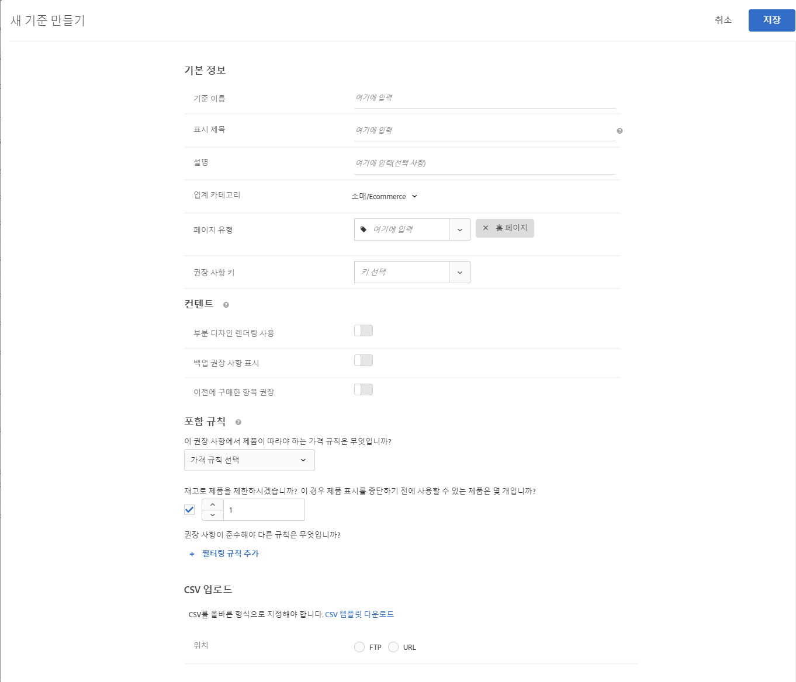

#  사용자 지정 기준 업로드{#upload-custom-criteria}

권장 사항을 사용자 지정하려면 CSV 파일을 업로드합니다.

[!UICONTROL 새 기준 만들기] 화면에 도달하는 여러 방법이 있습니다. 일부 화면 옵션은 화면에 도달하는 방법에 따라 달라집니다.

* [!UICONTROL 권장 사항] 활동을 만드는 경우 **[!UICONTROL 기준 선택]** 화면에서 [!UICONTROL 새로 만들기]를 클릭합니다. 다른 [!UICONTROL 권장 사항] 활동과 함께 사용할 새 기준을 저장하는 옵션이 있습니다.
* [!UICONTROL 권장 사항] 활동을 편집하는 경우 페이지에서 [!UICONTROL 권장 사항 위치] 상자를 클릭하고 **[!UICONTROL 기준 변경]**&#x200B;을 선택합니다. [!UICONTROL 선택 기준] 화면에서 **[!UICONTROL 새로 만들기를 클릭합니다]**. 다른 [!UICONTROL 권장 사항] 활동과 함께 사용할 새 기준을 저장하는 옵션이 있습니다.
* **[!UICONTROL 권장 사항]** > **[!UICONTROL 기준]** 라이브러리 화면에서 **[!UICONTROL 기준 만들기]**&#x200B;를 클릭합니다. 여기서 만드는 기준은 자동으로 모든 [!UICONTROL 권장 사항] 활동에 사용 가능해집니다.

1. **[!UICONTROL 기준 만들기]**&#x200B;를 클릭합니다.

   

1. **[!UICONTROL 사용자 지정 기준 업로드]**&#x200B;를 선택합니다.

   

1. **[!UICONTROL 기준 이름]**&#x200B;을 입력합니다.

   기준을 설명하는 데 사용되는 &quot;내부&quot; 이름입니다.  예를 들어, &quot;최고 마진 제품&quot; 기준을 호출하려고 하지만 제목이 공개적으로 표시되는 것을 원하지 않을 수 있습니다. 공개 제목을 설정하려면 다음 단계를 참조하십시오.
1. 이 기준을 사용하는 모든 권장 사항에 대한 페이지에 표시할 공개 **[!UICONTROL 표시 제목]**&#x200B;을 입력합니다.

   예를 들어, 이 기준을 사용하여 권장 사항을 표시할 때 &quot;특정 항목을 본 사용자&quot; 또는 &quot;유사 제품&quot;을 표시할 수 있습니다.
1. 기준에 대한 간단한 **[!UICONTROL 설명]**&#x200B;을 입력합니다.

   설명은 기준을 식별하는 데 도움이 되어야 하며 기준의 용도에 대한 정보를 포함할 수 있습니다.
1. **[!UICONTROL 수직 시장]**&#x200B;을 선택합니다.

   기타 기준 옵션은 선택한 수직 시장에 따라 달라질 수 있습니다.

1. **[!UICONTROL 페이지 유형]**&#x200B;을 선택합니다.

   여러 페이지 유형을 선택할 수 있습니다.

   수직 시장 및 페이지 유형을 함께 사용하여 저장된 기준을 분류할 수 있습니다. 이렇게 하면 다른 [!UICONTROL 권장 사항] 활동에 대한 기준을 좀 더 쉽게 다시 사용할 수 있습니다.
1. **[!UICONTROL 권장 사항 키]**&#x200B;를 선택합니다.

   키를 기반으로 기준을 지정하는 방법에 대한 자세한 내용은 [권장 사항 키를 기반으로 권장 사항 만들기](/help/c-recommendations/c-algorithms/base-the-recommendation-on-a-recommendation-key.md)를 참조하십시오.
1. **[!UICONTROL 콘텐츠]** 규칙을 설정합니다.

   콘텐츠 규칙은 권장 항목 수로 디자인을 채우지 못할 경우에 발생하는 결과를 결정합니다. 예를 들어, 디자인에 5개 항목에 대한 공간이 있지만 기준을 따를 경우 3개의 항목만 권장되는 경우 나머지 공간을 비워 두거나 백업 권장 사항을 사용하여 추가 공간을 채울 수 있습니다. 적절한 전환 옵션을 선택합니다. 자세한 내용은 [콘텐츠 설정을 지정합니다](/help/c-recommendations/c-algorithms/create-new-algorithm.md#content).
1. **[!UICONTROL 포함 규칙]**&#x200B;을 설정합니다.

   포함 규칙을 사용하여 권장 사항에 표시할 항목 범위를 좁힐 수 있습니다. See [Specify inclusion rules](/help/c-recommendations/c-algorithms/create-new-algorithm.md#inclusion). 1. **[!UICONTROL CSV 파일의 위치]**&#x200B;를 선택합니다.

   CSV 파일을 성공적으로 업로드하려면 형식이 올바르게 지정되어야 합니다. **[!UICONTROL CSV 템플릿 다운로드]**&#x200B;를 클릭하여 올바른 형식의 CSV 파일을 가져옵니다.

   다음 두 가지 위치 옵션이 있습니다.

   * **FTP:** FTP 서버에서 CSV 파일을 업로드하려면 **[!UICONTROL FTP]**&#x200B;를 선택한 다음, 필요한 정보를 입력합니다. SSL을 사용하기 위한 옵션이 제공됩니다. 이 옵션은 FTPS 프로토콜을 사용하여 CSV 파일을 안전하게 전송합니다.
   * **URL:** URL에서 CSV 파일을 업로드하려면 **[!UICONTROL URL]**&#x200B;을 선택한 다음, 피드 URL을 입력합니다.

1. **[!UICONTROL 저장]**&#x200B;을 클릭합니다.

   >[!NOTE]
   >
   >사용자 지정 기준 엔티티(행)에는 최대 1,000개의 권장 항목(열)이 포함될 수 있습니다.

사용자 지정 기준 업데이트는 기본적으로 &quot;누적&quot;입니다. CSV 업로드 파일에 지정된 새 키-값 쌍이 기존 키-값 쌍을 덮어씁니다. CSV 업로드에 지정된 키가 없는 기존 키-값 쌍은 계속 제공할 수 있으며, CSV 파일의 일부로 마지막으로 업로드한 뒤 31일 후에 만료됩니다.

Client Care에 문의하여 다음 CSV 업로드에 포함되지 않은 기존 결과를 삭제하도록 설정을 활성화합니다. 이 설정을 활성화하면 사용자 지정 CSV 피드 파일에 있는 키만 전달할 수 있습니다. 이 설정은 모든 사용자 지정 기준에 적용됩니다.

사용자 지정 기준 피드는 24시간마다 한 번씩 업데이트됩니다.

권장 사항 > 기준 페이지에서 각 기준 카드의 맨 아래에 있는 사용자 지정 기준 업로드의 업로드 및 동기화 상태를 확인할 수 있습니다. 사용자 지정 기준을 편집할 때 편집 대화 상자에서 상태를 볼 수도 있습니다.

오류가 없는 업로드에 대한 흐름은 예약됨 > 피드 파일 다운로드 >가져오기 > 성공입니다.

다음은 Target에서 업로드 문제가 발생하는 경우 수신할 수 있는 오류 메시지입니다.

| 오류 메시지 | 세부 사항 |
|--- |--- |
| 알 수 없는 오류 | 내부 기술 오류를 나타냅니다. |
| 구문 분석 오류 | 피드 파일 형식에 문제가 있을 수 있습니다. 파일 형식을 수정하고 알고리즘을 다시 저장하여 파일 다운로드 프로세스를 다시 시작합니다. |
| 서버를 찾을 수 없음 | 인터넷에 표시되는 IP 또는 호스트 이름을 제공하십시오. |
| 자격 증명 오류 | 서버의 활성 계정에 대한 유효한 사용자 및 암호를 제공합니다. |
| 디렉토리를 찾을 수 없음 | 서버에 존재하는 디렉토리를 지정합니다. |
| 파일을 찾을 수 없음 | 표시된 디렉토리의 서버에 있는 파일의 이름을 제공합니다. |

## 교육 비디오: 추천에서 기준 만들기(12:33) 

이 비디오에는 다음 정보가 포함되어 있습니다(사용자 지정 기준 업로드에 대한 세부 사항은 11:43부터 시작).

* 기준 만들기
* 기준 시퀀스 만들기
* 사용자 지정 기준 업로드

>[!VIDEO](https://video.tv.adobe.com/v/27694?quality=12)