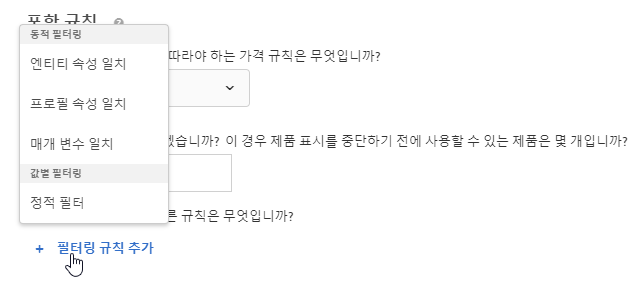
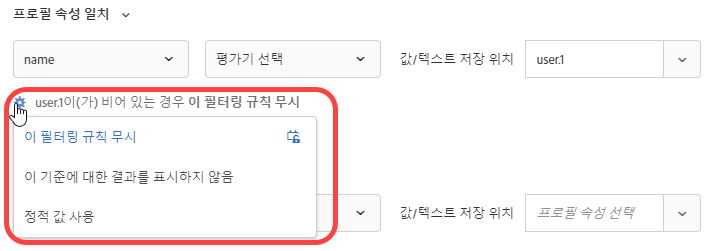

#  동적 및 정적 포함 규칙 사용{#use-dynamic-and-static-inclusion-rules}

[!DNL Adobe Target]에서 기준 및 판촉에 대한 포함 규칙을 만들고, 권장 사항에 대한 더 나은 결과를 얻기 위해 추가적인 동적 또는 정적 필터링 규칙을 추가하는 방법에 대한 정보입니다.

>[!NOTE]
>
>기준 및 프로모션에 대한 포함 규칙을 만들고 사용하는 프로세스는 사용 사례 및 예와 비슷합니다. 기준 및 판촉 행사 및 포함 규칙 사용 모두 이 섹션에 설명되어 있습니다.

## 기준에 필터링 규칙 추가 {#section_CD0D74B8D3BE4A75A78C36CF24A8C57F}

[기준을 만들려면](/help/c-recommendations/c-algorithms/create-new-algorithm.md#task_8A9CB465F28D44899F69F38AD27352FE) **[!UICONTROL 포함 규칙]** 아래의 **[!UICONTROL 필터링 규칙 추가]**&#x200B;를 클릭하십시오.

사용 가능한 선택 사항은 선택한 업계 카테고리와 권장 사항 키에 따라 다릅니다.

## 프로모션에 필터링 규칙 추가 {#section_D59AFB62E2EE423086281CF5D18B1076}

[프로모션을 만들려면](/help/c-recommendations/t-create-recs-activity/adding-promotions.md#task_CC5BD28C364742218C1ACAF0D45E0E14) **[!UICONTROL 속성별 프로모션]**&#x200B;을 선택한 다음, **[!UICONTROL 필터링 규칙 추가]**&#x200B;를 클릭하십시오.

## 필터 유형 {#section_0125F1ED10A84C0EB45325122460EBCD}

다음 섹션에서는 기준 및 판촉 행사 모두에 대해 [!UICONTROL 동적 필터링] 및 [!UICONTROL 값 기준 필터]에 대한 필터링 옵션 유형을 나열합니다.

### 동적 필터링

동적 포함 규칙은 정적 포함 규칙보다 강력하며 더 나은 결과와 참여를 제공합니다. 다음 사항을 고려하십시오.

* 동적 포함 규칙은 사용자의 프로필 매개 변수 또는 mbox 호출에서 속성을 일치시켜 권장 사항을 제공합니다.

   예를 들어, &quot;가장 빈도가 높은 기준&quot; 권장 사항을 만든 다음, 반환된 권장 사항 세트의 권장 사항을 만든 다음, 권장 사항이 표시되는 페이지에 사용자가 액세스할 때 전달된 속성에 대해 실시간으로 권장 사항을 필터링할 수 있습니다.

* 정적 규칙을 사용하여 컬렉션에 포함할 항목을 제한합니다(컬렉션 사용 대신).

* 필요한 만큼 동적 포함 규칙을 만들 수 있습니다. 포함 규칙들은 AND 연산자로 결합됩니다. 권장 사항에 항목을 포함하려면 모든 규칙을 충족해야 합니다.

동적 필터링에 사용할 수 있는 옵션은 다음과 같습니다.

| 동적 필터링 옵션 | 세부 사항 |
| --- | --- |
| [엔티티 속성 일치](/help/c-recommendations/c-algorithms/entity-attribute-matching.md) | 잠재적인 추천 항목 풀을 사용자가 상호 작용한 특정 항목과 비교하여 동적으로 필터링합니다. 방문자 [!UICONTROL 의 ] 즐겨찾기 브랜드와 같이 방문자에게 어필할 가능성이 가장 높은 추천을 표시하려면 개체 속성 일치를 사용합니다. |
| [프로필 속성 일치](/help/c-recommendations/c-algorithms/profile-attribute-matching.md) | 항목(엔티티)을 사용자 프로필의 값과 비교하여 동적으로 필터링합니다. 크기 또 [!UICONTROL 는 ] 즐겨찾기 브랜드와 같이 방문자의 프로필에 저장된 값과 일치하는 권장 사항을 표시하려면 프로필 속성 일치를 사용합니다. |
| [매개 변수 일치](/help/c-recommendations/c-algorithms/parameter-matching.md) | 항목(엔티티)을 요청의 값(API 또는 mbox)과 비교하여 동적으로 필터링합니다. 매개 변수  [!UICONTROL 일치] 를 사용하여 페이지 매개 변수 또는 장치 차원이나 지리적 위치 같은 방문자의 매개 변수와 일치하는 컨텐트를 권장하십시오. |

### 값별 필터링

값별로 필터링하려면 다음 옵션을 사용할 수 있습니다.

| 값별 필터링 옵션 | 세부 사항 |
| --- | --- |
| [정적 필터](/help/c-recommendations/c-algorithms/static-value.md) | 필터링할 정적 값을 하나 이상 수동으로 입력합니다. |

## 동적 기준 및 프로모션 예

동적 기준 및 프로모션은 정적인 기준 및 프로모션보다 훨씬 강력하며 더 나은 결과와 참여를 제공할 수 있습니다.

다음 예는 마케팅 활동에서 동적 판촉을 사용할 수 있는 방법에 대한 일반적인 아이디어를 제공합니다.

| 연산자 | 예 |
| --- | --- |
| 다음과 같음 | 방문자가 웹 사이트(예: 제품, 기사 또는 동영상)의 항목을 볼 때 동적 판촉 행사에서 &quot;같음&quot; 연산자를 사용하면 다음 제품에서 다른 항목을 홍보할 수 있습니다.<ul><li>동일한 브랜드</li><li>동일한 카테고리</li><li>동일한 카테고리 AND 판매자 브랜드</li><li>동일한 스토어</li></ul> |
| 같지 않음 | 방문자가 웹 사이트(예: 제품, 기사 또는 동영상)의 항목을 볼 때 동적 판촉 행사에서 &quot;같지 않음&quot; 연산자를 사용하면 다음 제품에서 다른 항목을 홍보할 수 있습니다.<ul><li>다른 TV 시리즈</li><li>다른 장르</li><li>다른 제품 시리즈</li><li>다른 스타일 ID</li></ul> |
| 다음 사이 | 방문자가 웹 사이트(예: 제품, 기사 또는 동영상)의 항목을 볼 때 동적 판촉 행사에서 &quot;사이&quot; 연산자를 사용하면 다음과 같은 다른 항목을 홍보할 수 있습니다.<ul><li>더 비쌈</li><li>덜 비쌈</li><li>비용 더하기 또는 빼기 30%</li><li>동일한 시즌의 나중 에피소드</li><li>시리즈에서 앞부분 책</li></ul> |

## 개체 특성 일치, 프로필 속성 일치 및 매개 변수 일치 {#section_7D30E04116DB47BEA6FF840A3424A4C8}로 필터링할 때 빈 값 처리

종료 기준 및 프로모션을 위해 [!UICONTROL 개체 특성 일치], [!UICONTROL 프로필 속성 일치] 및 [!UICONTROL 매개 변수 일치]로 필터링할 때 빈 값을 처리할 수 있는 여러 옵션을 선택할 수 있습니다.

이전에는 값이 비어 있으면 결과가 반환되지 않았습니다. &quot;*x*&#x200B;이(가) 비어 있는 경우&quot; 드롭다운 목록에서는 다음 그림과 같이 기준에 빈 값이 있을 경우 수행할 적절한 작업을 선택할 수 있습니다.

원하는 작업을 선택하려면 톱니바퀴 아이콘()을 마우스로 가리킨 다음, 원하는 작업을 선택하십시오.

| 작업 | 사용 가능한 경우 | 세부 사항 |
|--- |--- |--- |
| [!UICONTROL 이 필터링 규칙 무시] | [!UICONTROL 프로필 속성 ] [!UICONTROL 일치 및 매개 변수 일치] | 이것은 [!UICONTROL 프로필 속성 일치] 및 [!UICONTROL 매개 변수 일치]에 대한 기본 작업입니다. 이 선택 사항은 규칙이 무시되도록 지정합니다. 예를 들어 세 개의 필터링 규칙이 있고 세 번째 규칙이 어떤 값도 전달하지 않는 경우, 결과를 반환하는 대신 빈 값으로 세 번째 규칙을 무시할 수 있습니다. |
| [!UICONTROL 이 기준에 대한 결과를 표시하지]  않음(기준만) | [!UICONTROL 엔티티 속성 일치],  [!UICONTROL 프로필 속성 일치] 및  [!UICONTROL 매개 변수 일치] | [!UICONTROL 개체 특성 일치]에 대한 기본 작업입니다. 이 작업은 이 옵션을 추가하기 전에 빈 값을  [!DNL Target] 처리하는 방법입니다.이 기준에 대한 결과가 표시되지 않습니다. |
| [!UICONTROL 항목을 홍보하지  않음(판촉 행사 전용)] | [!UICONTROL 엔티티 속성 일치],  [!UICONTROL 프로필 속성 일치] 및  [!UICONTROL 매개 변수 일치] | [!UICONTROL 개체 특성 일치]에 대한 기본 작업입니다. 이 작업은 이 옵션을 추가하기 전에 빈 값을  [!DNL Target] 처리하는 방법입니다.이 기준에 대한 결과가 표시되지 않습니다. |
| [!UICONTROL 정적 값 사용] | [!UICONTROL 엔티티 속성 일치],  [!UICONTROL 프로필 속성 일치] 및  [!UICONTROL 매개 변수 일치] | 값이 비어 있으면 정적 값을 사용하도록 선택할 수 있습니다. |

## 주의 사항 {#section_A889FAF794B7458CA074DEE06DD0E345}

>[!IMPORTANT]
>
>&quot;equals&quot;(다음과 같음)와 &quot;does not equal&quot;(다음과 같지 않음) 연산자를 사용하는 런타임 동안 서로 다른 데이터 유형 속성이 동적 기준이나 프로모션에서 호환되지 않을 수 있습니다. 왼쪽에 사전 정의된 특성 또는 사용자 지정 특성이 있는 경우 오른쪽에는 [!UICONTROL 값], [!UICONTROL 여백], [!UICONTROL 인벤토리] 및 [!UICONTROL 환경] 값을 현명하게 사용해야 합니다.

다음 표는 유효 규칙과 런타임 중에 호환되지 않을 수 있는 규칙을 보여줍니다.

| 호환 규칙 | 호환되지 않는 규칙 |
|--- |--- |
| 값 - 다음 사이 - 현재 항목의 90%와 110% - salesValue | salesValue - 다음 사이 - 현재 항목의 90%와 110% - 값 |
| 값 - 다음 사이 - 현재 항목의 90%와 110% - 값 | clearancePrice - 다음 사이 - 현재 항목의 90%와 110% - 순익 |
| 순익 - 다음 사이 - 현재 항목의 90%와 110% - 순익 | storeInventory - 다음과 같음 - 현재 항목 - 재고 |
| 재고 - 다음과 같음 - 현재 항목 - 재고 |  |
