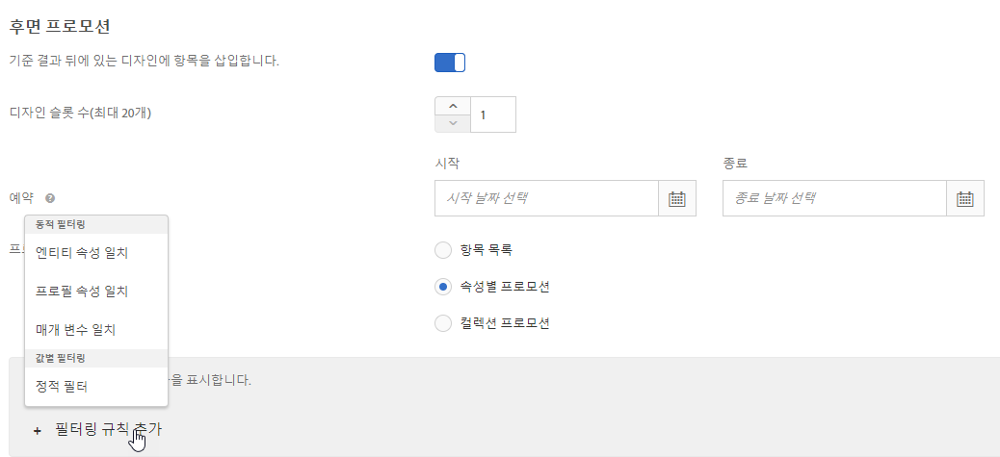
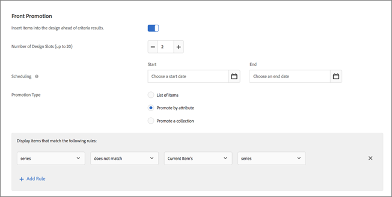

#  동적 및 정적 포함 규칙 사용{#use-dynamic-and-static-inclusion-rules}

기준 및 프로모션에 대한 포함 규칙을 생성하고, 동적 또는 정적 필터링 규칙을 추가하여 더 나은 결과를 획득하는 방법에 대한 정보입니다.

기준 및 프로모션에 대한 포함 규칙을 만들고 사용하는 프로세스는 사용 사례 및 예와 비슷합니다. 기준 및 프로모션과 포함 규칙의 사용은 모두 이 주제에서 다룹니다.

## 기준에 필터링 규칙 추가 {#section_CD0D74B8D3BE4A75A78C36CF24A8C57F}

[기준을 만들려면](../../c-recommendations/c-algorithms/create-new-algorithm.md#task_8A9CB465F28D44899F69F38AD27352FE) **[!UICONTROL 포함 규칙]** 아래의 **[!UICONTROL 필터링 규칙 추가]**를 클릭하십시오.


사용 가능한 선택 사항은 선택한 업계 카테고리와 권장 사항 키에 따라 다릅니다.

## 프로모션에 필터링 규칙 추가 {#section_D59AFB62E2EE423086281CF5D18B1076}

[프로모션을 만들려면](../../c-recommendations/t-create-recs-activity/adding-promotions.md#task_CC5BD28C364742218C1ACAF0D45E0E14) **[!UICONTROL 속성별 프로모션]**을 선택한 다음, **[!UICONTROL 필터링 규칙 추가]**를 클릭하십시오.



## 필터 유형 {#section_0125F1ED10A84C0EB45325122460EBCD}

다음 표에는 기준과 프로모션 모두에 대한 필터링 선택 사항의 유형이 나열되어 있습니다.

| 유형 | 옵션 | 사용 가능한 연산자 |
|--- |--- |--- |
| **동적 필터링** | **엔티티 속성 일치:**잠재적 추천 항목의 풀을 사용자가 상호 작용한 특정 항목과 비교하여 동적으로 필터링합니다.<br>예를 들어 현재 항목의 브랜드와 일치하는 항목만 추천합니다. | 같음<br>다음과 같지 않음<br>다음 사이<br>포함<br>다음을 포함하지 않음<br>다음으로 시작<br>다음으로 끝남<br>값이 있음<br>값이 없음<br>다음보다 크거나 같음<br>작거나 같음 |
|  | **프로필 속성 일치:**항목(엔티티)을 사용자 프로필에 있는 값과 비교하여 동적으로 필터링합니다.<br>예를 들어 현재 항목의 브랜드와 일치하는 항목만 추천합니다. | 같음<br> 다음과 같지 않음<br>포함<br>다음을 포함하지 않음<br>다음으로 시작<br>다음으로 끝남<br>다음보다 크거나 같음<br>작거나 같음<br>다음 사이 |
|  | **매개 변수 일치:**항목(엔티티)을 요청(API 또는 mbox)에 있는 값과 비교하여 동적으로 필터링합니다.<br>예를 들어, &quot;업계&quot; 페이지 매개 변수와 일치하는 컨텐츠만 추천합니다.<br>**중요:** 활동이 2016년 10월 31일 이전에 만들어진 경우 &quot;매개 변수 일치&quot; 필터를 사용하면 전달이 실패합니다. 이 문제를 해결하려면 다음을 수행하십시오.<ul><li>새 활동을 만들고 이 활동에서 기준을 추가합니다.</li><li>&quot;매개 변수 일치&quot; 필터가 들어 있지 않은 기준을 사용합니다.</li><li>기준에서 &quot;매개 변수 일치&quot; 필터를 제거합니다.</li></ul> | 다음과 같음<br>다음과 같지 않음<br>포함<br>다음을 포함하지 않음<br>다음으로 시작<br>다음으로 끝남<br>다음보다 크거나 같음<br>작거나 같음<br>다음 사이 |
| **값별 필터링** | **정적 필터:**필터링할 정적 값을 수동으로 하나 이상 입력하십시오.<br>예를 들어, MPAA 등급이 &quot;G&quot; 또는 &quot;PG&quot;인 컨텐츠만 추천합니다. | 같음<br>다음과 같지 않음<br>포함<br>다음을 포함하지 않음<br>다음으로 시작<br>다음으로 끝남<br>값이 있음<br>값이 없음<br>다음보다 크거나 같음<br>작거나 같음 |

>[!NOTE]
>
>Target 17.6.1 릴리스(2017년 6월) 이전에 포함 규칙이 구성되는 방식을 잘 알고 있다면, 일부 선택 사항과 연산자가 변경되었음을 알 수 있을 것입니다. 선택한 선택 사항에 적용 가능한 연산자만 표시되고, 일부 연산자의 이름은 더 일관되고 직관적이게 변경되었습니다(&quot;일치&quot;(matches)는 이제 &quot;다음과 같음&quot;(equals)임). 이 릴리스 이전에 만들어진 모든 기존 제외 규칙은 새 구조로 자동 마이그레이션됩니다. 여러분 쪽에서는 구조를 조정할 필요가 없습니다.

포함 규칙을 필요한 만큼 만들 수 있습니다. 포함 규칙들은 AND 연산자로 결합됩니다. 권장 사항에 항목을 포함하려면 모든 규칙을 충족해야 합니다.

동적 기준과 프로모션은 정적 기준과 프로모션보다 훨씬 더 강력하며, 더 나은 결과와 참여를 만들어냅니다. 다음 예는 마케팅 작업에서 동적 프로모션을 사용할 수 있는 방법에 대한 아이디어를 제공할 것입니다.

**다음과 같음:**동적 프로모션에서 &quot;equals&quot;(다음과 같음) 연산자를 사용할 경우, 방문자가 웹 사이트에서 항목을 보고 있으면(제품, 문서 또는 동영상 등) 다음 방법으로 다른 항목을 프로모션할 수 있습니다.

* 동일한 브랜드
* 동일한 카테고리
* 동일한 카테고리 AND 판매자 브랜드
* 동일한 스토어

**다음과 같지 않음:**동적 프로모션에서 &quot;does not equal&quot;(다음과 같지 않음) 연산자를 사용할 경우, 방문자가 웹 사이트에서 항목을 보고 있으면(제품, 문서 또는 동영상 등) 다음 방법으로 다른 항목을 프로모션할 수 있습니다.

* 다른 TV 시리즈
* 다른 장르
* 다른 제품 시리즈
* 다른 스타일 ID

**다음 사이:**동적 프로모션에서 &quot;is between&quot;(다음 사이) 연산자를 사용할 경우, 방문자가 웹 사이트에서 항목을 보고 있으면(제품, 문서 또는 동영상 등) 다음과 같은 다른 항목을 프로모션할 수 있습니다.

* 더 비쌈
* 덜 비쌈
* 비용 더하기 또는 빼기 30%
* 동일한 시즌의 나중 에피소드
* 시리즈에서 앞부분 책

## 엔티티 속성 일치, 프로필 속성 일치 및 매개 변수 일치로 필터링할 때 빈 값 처리 {#section_7D30E04116DB47BEA6FF840A3424A4C8}

종료 기준과 프로모션에 대한 엔티티 속성 일치, 프로필 속성 일치 및 매개 변수 일치로 필터링할 때 빈 값을 처리하는 몇 가지 선택 사항을 선택할 수 있습니다.

이전에는 값이 비어 있으면 결과가 반환되지 않았습니다. &quot;*x*이(가) 비어 있는 경우&quot; 드롭다운 목록에서는 다음 그림과 같이 기준에 빈 값이 있을 경우 수행할 적절한 작업을 선택할 수 있습니다.


원하는 작업을 선택하려면 톱니바퀴 아이콘()을 마우스로 가리킨 다음, 원하는 작업을 선택하십시오.

| 작업 | 사용 가능한 경우 | 세부 사항 |
|--- |--- |--- |
| 이 필터링 규칙 무시 | 프로필 속성 일치<br>매개 변수 일치 | [프로필 속성 일치]와 [매개 변수 일치]에 대한 기본 작업입니다.<br>이 선택 사항은 규칙이 무시되도록 지정합니다. 예를 들어 세 개의 필터링 규칙이 있고 세 번째 규칙이 어떤 값도 전달하지 않는 경우, 결과를 반환하는 대신 빈 값으로 세 번째 규칙을 무시할 수 있습니다. |
| 이 기준에 대한 결과를 표시하지 않음 | 엔티티 속성 일치<br>프로필 속성 일치<br>매개 변수 일치 | [엔티티 속성 일치]에 대한 기본 작업입니다.<br>이 작업은 이 선택 사항을 추가하기 전에 Target이 빈 값을 처리한 방식입니다. 이 기준에 대한 결과는 표시되지 않습니다. |
| 정적 값 사용 | 엔티티 속성 일치<br>프로필 속성 일치<br>매개 변수 일치 | 값이 비어 있으면 정적 값을 사용하도록 선택할 수 있습니다. |

빈 값을 처리하는 예로 아래의 [시나리오 9](../../c-recommendations/c-algorithms/use-dynamic-and-static-inclusion-rules.md#section_9873E2F22E094E479569D05AD5BB1D40)를 고려하십시오.

## 동적 필터 시나리오 {#section_9873E2F22E094E479569D05AD5BB1D40}

**시나리오 1:**정적 필터를 사용하여 카탈로그의 항목을 카탈로그의 다른 항목에 일치시키는 대신 동적 필터를 사용하여 카탈로그의 항목을 방문자 프로필의 속성에 일치시킬 수 있습니다.

예를 들어, [!UICONTROL 프로필 속성 일치] 선택 사항을 사용하여 브랜드가 `profile.favoritebrand`에 저장된 값 또는 텍스트와 같은 항목만을 추천하는 규칙을 만들 수 있습니다. 이러한 규칙을 사용할 때, 방문자가 특정 브랜드의 육상용 반바지를 보고 있다면 해당 사용자가 자주 이용하는 브랜드(방문자 프로필의 `profile.favoritebrand`에 저장된 값)와 일치하는 권장 사항만 표시됩니다.

**시나리오 2:** Target이 방문자 프로필의 속성 정보를 사용하는 기능을 추가하기 전에 특정 지역 출신이고 특정 대학 학위가 있는 구직자에게만 표시되는 구인 목록을 설정하는 경우에는 서로 다른 대상(각 도시와 학위에 대해 하나씩)이 있는 많은 활동을 설정했어야 했습니다. 여러 도시의 구인 목록이 있는 경우 이 작업은 부담이 되었습니다.

이제 다음 예와 같이 포함 규칙을 사용하여 방문자 프로필의 구직자 위치 및 학위를 구인 목록과 일치시킬 수 있습니다.


왼쪽에 있는 구인 목록에 따르면 방문자는 San Francisco, New York 또는 Los Angeles(`entity.jobCity`)에 있고 BSCS 또는 MBA 학위(`entity.requiredDegree`)가 있어야 합니다.

오른쪽에 있는 이 구직자는 Los Angeles(`profile.usersCity`)에 있으며 MBA 학위(`profile.degree`)를 가지고 있습니다.

프로필 속성이 일치하는 동적 필터를 사용하여 위치와 학위를 기반으로 이 방문자에게 적합한 구인 목록만 추천하도록 위 그림의 하단에 표시되는 필터를 작성할 수 있습니다.

이러한 필터의 기준은 다음과 같습니다.

```
entity.jobCity - equals - the value/text stored in - profile.usersCity
```

및

```
entity.requiredDegree - equals - the value/text stored in - profile.degree
```

프로필 속성 일치를 사용하는 동적 필터를 사용하면 아래와 같이 더 적은 수의 활동으로 더 많은 일을 수행할 수 있습니다.


위 그림의 맨 위에 있는 다이어그램은 프로필 속성을 사용하는 동적 필터가 작동하는 방식을 설명합니다. 기준(위 시나리오의 도시 및 학위)을 사용하는 하나의 대상을 만들어 방문자에게 해당하는 구인 목록을 표시할 수 있습니다. 이 필터는 위치 및 학위와 관련하여 거의 무한한 수의 가능성에 작동합니다.

그림의 아래쪽에 있는 다이어그램은 프로필 속성을 사용하는 동적 필터를 사용하여 기준이나 프로모션을 구성하지 않으려는 경우 설정해야 하는 많은 대상 중 두 가지를 보여줍니다. 각 도시와 각 학위에 대해 다른 대상을 설정해야 할 것입니다. 특히 여러 도시에 많은 수의 구인 목록이 있는 경우 필요한 대상 수는 점점 더 빠르게 처리하기 힘들어질 수 있습니다.

프로필 속성을 사용하지 않는 경우 대상 및 경험은 다음 그림의 상단과 비슷하게 표시되지만 모든 상상 가능한 시나리오에 대해 추가적인 대상/경험 쌍이 있을 수 있습니다.


엔티티 속성을 사용자 속성에 일치시키는 프로필 속성을 사용하는 동적 필터를 사용하면 위 그림의 하단에 표시된 것처럼 원하는 경험을 동적으로 즉석에서 전달하는 하나의 대상을 설정할 수 있습니다.

각 구인 목록에 필요한 정보가 포함되어 있고 사용자 프로필 내에서 필요한 정보를 캡처 중이라면 대상 및 경험을 만들고 관리하는 것이 크게 간편해집니다.

**시나리오 3:**한 스포츠 회사가 한 개인이 좋아하는 팀의 웹 사이트에 기사를 표시하려고 합니다. 모든 기사에는 기사에 나온 모든 팀을 포함하는 `entity.featuredTeams`를 사용하는 필드가 있을 수 있습니다. 모든 프로필 속성에는 사용자가 &quot;가입 중&quot;인 좋아하는 팀 목록이 있을 수 있습니다.

샘플 포함 규칙은 다음과 같은 모습일 수 있습니다.

`entity.featuredTeam`에 `profile.favoriteTeams`와 일치하는 값이 하나 이상 있는 경우에만 포함합니다.

다음 예를 고려할 때 하나 이상의 전체 문자열 값이 일치(완전히)해야 한다는 것을 잊지 마십시오. 일치하는 문자열이 없는 경우 일치하는 항목이 없습니다. 일치 규칙에서 엔티티 속성의 분리(디커플링)에 주목하십시오. 분리(디커플링)되면 서로 다른 메타데이터 필드 간에 일치시킬 수 있습니다.

예/설명

`"entity.featuredTeam" - "Athletics,Red Sox" equals "profile.favoriteTeams" - "Athletics"`

&quot;Red Sox&quot;는 같지 않지만 &quot;Athletics&quot;가 같기 때문에 일치로 간주됩니다.

`"entity.featuredTeam" - "Athletics,Red Sox" equals "profile.favoriteTeams" - "Athletics,Red Sox"`

두 팀이 모두 일치할 필요는 없지만 &quot;Athletics&quot;와 &quot;Red Sox&quot;가 모두 같으므로 일치로 간주됩니다.

`"entity.featuredTeam" - "Athletics" equals "profile.favoriteTeams" - "Athletics,Red Sox"`

&quot;Red Sox&quot;는 같지 않지만 &quot;Athletics&quot;가 같기 때문에 일치로 간주됩니다.

`"entity.featuredTeam" - "Athletics" equals "profile.favoriteTeams" - "Athletic"`

&quot;Athletics&quot;(복수)는 &quot;Athletic&quot;(단수)과 같지 않으므로 일치하지 않습니다.

또는 &quot;equals&quot;(다음과 같음)대신 &quot;contains&quot;(포함)를 사용하여 이것을 일치로 만들 수도 있습니다.

`"entity.featuredTeam" - "Athletic" equals "profile.favoriteTeams" - "Athletics"`

&quot;Athletic&quot;(단수)은 &quot;Athletics&quot;(복수)와 같지 않으므로 일치하지 않습니다.

또는 &quot;equals&quot;(다음과 같음)대신 &quot;starts with&quot;(다음으로 시작)를 사용하여 이것을 일치로 만들 수도 있습니다.

**시나리오 4:**다음 그림에서는 &quot;equals&quot;(다음과 같음)와 &quot;is between&quot;(다음 사이) 연산자를 사용하여 동일한 카테고리 및 동일한 브랜드의 더 비싼 항목을 프로모션하는 방법을 보여줍니다. 예를 들어, 스포츠 의류 회사는 육상용 반바지를 보고 있는 방문자에게 상향 판매하려고 더 비싼 런닝화를 프로모션할 수 있습니다.


이 예에는 다음 규칙이 사용됩니다.

```
category - equals - current item's - category 
And 
brand - equals - current item's - brand 
And 
value - is between - 100% and 1000% of - current item's - value
```

>[!NOTE]
>
>여러 규칙을 사용하는 동적 프로모션의 키(그림에서 처음 두 개의 규칙에서 &quot;현재 항목&quot;으로 레이블이 지정된 세 번째 드롭다운 목록)는 변경할 수 없습니다.

**시나리오 5:**두 번째 그림에서는 &quot;equals&quot;(다음과 같음)와 &quot;is between&quot;(다음 사이) 연산자를 사용하여 동일한 카테고리, 동일한 브랜드 및 판매자 브랜드의 더 비싼 항목을 프로모션하는 방법을 보여줍니다. 예를 들어, 사무용품 회사는 프린터를 보고 있는 방문자에게 상향 판매하기 위해, 동일한 브라우저와 이 회사의 자체 브랜드(판매자 브랜드), 이렇게 두 가지 중 더 비싼 토너 카트리지를 프로모션할 수 있습니다.


이 예에는 다음 규칙이 사용됩니다.

```
category - equals - current item's - category 
And 
IsHouseBrand - equals - true 
And 
value - is between - 100% and 1000% of - current item's - value
```

이 예는 두 개의 동적 규칙과 하나의 정적 규칙을 사용합니다.

**시나리오 6:**세 번째 그림에서는 &quot;does not equal&quot;(다음과 같지 않음) 연산자를 사용하여 방문자가 현재 보고 있는 시리즈와 같지 않은 시리즈를 프로모션하는 방법을 보여줍니다. 예를 들어 미디어 웹 사이트는 방문자가 현재 보고 있는 시리즈와 다른 TV 시리즈를 프로모션할 수도 있습니다.



이 예에는 다음 규칙이 사용됩니다.

```
series - does not equal - current item's - series
```

**시나리오 7:**네 번째 그림은 방문자가 가장 최근에 구매한 항목을 위한 호환되는 액세서리 항목을 프로모션하는 방법을 보여줍니다. 예를 들어 누군가가 새 TV를 구입했다면 이 사람에게 HDMI 케이블을 동적으로 프로모션할 수 있을 것입니다.


이 예에는 다음 규칙이 사용됩니다.

```
id - equals - last purchased item's - compatibleAccessoryids
```

**시나리오 8:**다음 그림에서는 방문자가 현재 보고 있는 항목의 90%~110% 가격으로 판매 중인 항목을 프로모션하는 방법을 보여줍니다. 예를 들어, 어떤 사람이 TV를 보고 있는 경우 거의 동일한 가격대에서 판매 중인 유사한 TV를 동적으로 프로모션할 수 있습니다.


이 예에는 다음 규칙이 사용됩니다.

```
salesPrice - is between - 90% and 110% of - current item's - price
```

**시나리오 9:**[엔티티 속성 일치, 프로필 속성 일치 및 매개 변수 일치로 필터링할 때 빈 값 처리](../../c-recommendations/c-algorithms/use-dynamic-and-static-inclusion-rules.md#section_7D30E04116DB47BEA6FF840A3424A4C8)에서 설명한 대로 비어 있는 값을 처리하는 방법과 관련하여 스포츠 미디어 사이트를 위한 다음 시나리오를 생각해 보십시오.

스포츠 미디어 사이트의 컨텐츠 팀은 사용자가 좋아하는 팀에 대해 사용자에게 컨텐츠를 표시하려고 합니다. 사용자가 좋아하는 팀을 지정한 경우 팀은 해당 팀에 대한 미디어를 표시하고 싶어 합니다. 사용자가 좋아하는 팀을 지정하지 않았다면 팀은 &quot;*x*이(가) 비어 있는 경우&quot; 드롭다운 목록을 사용하여 다음 중 하나를 수행할 수 있습니다.

* 다음 그림과 같이 팀 필터를 모두 무시하려면 [!UICONTROL 이 필터링 규칙 무시] 선택 사항을 사용합니다.

   

* 다음 그림과 같이 이 기준의 일부로서 어떠한 미디어도 표시하지 않으려면 [!UICONTROL 이 기준에 대한 결과를 표시하지 않음] 선택 사항을 사용합니다.

   

* 다음 그림과 같이 특정 팀(예를 들면, 49ers입니다.)에 대한 미디어를 표시하려면 [!UICONTROL 정적 값 사용] 선택 사항을 사용합니다.

   

## 주의 사항 {#section_A889FAF794B7458CA074DEE06DD0E345}

>[!IMPORTANT]
>
>&quot;equals&quot;(다음과 같음)와 &quot;does not equal&quot;(다음과 같지 않음) 연산자를 사용하는 런타임 동안 서로 다른 데이터 유형 속성이 동적 기준이나 프로모션에서 호환되지 않을 수 있습니다. 왼쪽에 사전 정의된 속성이나 사용자 지정 속성이 있는 경우 오른쪽에서 [값], [순익], [재고] 및 [환경] 값을 현명하게 사용해야 합니다.


다음 표는 유효 규칙과 런타임 중에 호환되지 않을 수 있는 규칙을 보여줍니다.

| 호환 규칙 | 잠재적으로 호환되지 않는 규칙 |
|--- |--- |
| 값 - 다음 사이 - 현재 항목의 90%와 110% - salesValue | salesValue - 다음 사이 - 현재 항목의 90%와 110% - 값 |
| 값 - 다음 사이 - 현재 항목의 90%와 110% - 값 | clearancePrice - 다음 사이 - 현재 항목의 90%와 110% - 순익 |
| 순익 - 다음 사이 - 현재 항목의 90%와 110% - 순익 | storeInventory - 다음과 같음 - 현재 항목 - 재고 |
| 재고 - 다음과 같음 - 현재 항목 - 재고 |