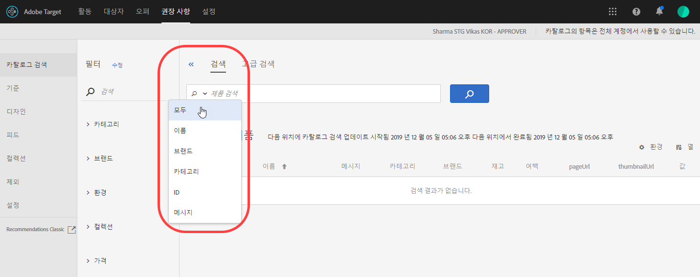

#  검색

[!DNL Adobe Recommendations]의 [!UICONTROL 카탈로그 검색] 페이지에서는 카탈로그에서 제품 또는 컨텐츠를 찾는 데 도움이 됩니다. 이 페이지에서 수행할 수 있는 가장 기본적인 작업은 항목을 검색하는 것입니다. 또한 환경을 변경하고, 검색 결과를 컬렉션이나 제외에 저장하고, 필터 패싯을 추가하고, 테이블의 열을 수정하고, 새 검색 패싯을 추가하는 등의 작업을 수행할 수 있습니다.

카탈로그는 전체 제품 세트(엔티티)를 의미합니다. 카탈로그에는 여러 컬렉션이 포함될 수 있으며 이는 제품을 논리 버킷으로 구성하는 방법입니다.

## 카탈로그 검색 액세스

[!UICONTROL 카탈로그 검색] 페이지에 액세스하려면 **[!UICONTROL Recommendations]** > **[!UICONTROL 카탈로그 검색]**&#x200B;을 클릭합니다.

## 항목 검색

단순 검색이나 고급 검색을 사용하여 카탈로그에서 항목을 찾을 수 있습니다.

### 간단한 검색 수행

1. **[!UICONTROL 제품 검색]** 필드에 검색어를 입력합니다.

1. (선택 사항) 검색 필드에서 아래쪽 화살표를 클릭하면 표시되는 옵션 메뉴에서 검색 옵션을 선택하여 검색을 세분화할 수 있습니다.

   

   검색 옵션에는 다음이 포함됩니다.

   * ALL - OR 로직을 사용하여 다른 모든 검색 기준을 검색합니다.
   * 이름
   * 브랜드
   * 카테고리
   * ID
   * 메시지

1. 이제 검색 결과의 항목을 스크롤하여 축소판과 기타 제품 정보를 볼 수 있습니다.

   다음 그림은 모두 옵션을 사용한 &quot;자전거&quot;의 결과를 보여줍니다.

   

   &quot;제품&quot; 옆에 표시되는 숫자는 지정된 환경에서 사용 가능한 전체 개수 중 검색어와 일치하는 제품의 수입니다.

   검색 자동 완성 기능을 사용할 수 있습니다. 다음 그림에서 &quot;bik&quot;를 입력하면 &quot;bike&quot;라는 단어가 포함된 모든 제품이 반환됩니다.

   

   >[!NOTE]
   >
   >숫자 값을 사용하여 사용자 지정 속성에 대해 카탈로그 검색을 수행하면 결과가 사용자 지정 속성을 숫자 값 대신 문자열 유형으로 처리합니다.
   >
   >현재 속성 유형을 변경할 수 있는 기능이 없습니다. [이(가) 문자열을 숫자로 변경해야 하는 특성을 참조하는 고객 문제](/help/cmp-resources-and-contact-information.md#reference_ACA3391A00EF467B87930A450050077C)를 엽니다.

1. 필터를 사용하여 원하는 제품을 찾을 수도 있습니다. 다음 예에서 [!UICONTROL 컬렉션] 패싯을 확장하고 &quot;자전거 도구&quot;를 선택하면 카탈로그에 있는 모든 자전거 도구가 표시됩니다.

   

1. &quot;체인&quot;과 같은 검색어를 입력하여 결과 목록에서 더 자세히 검색할 수 있습니다.

   

### 고급 검색 수행 {#advanced-search}

[!UICONTROL 고급 검색]을 사용하여 검색 결과를 더 세분화하거나 검색 결과를 [컬렉션](/help/c-recommendations/c-products/collections.md) 또는 [exclusion](/help/c-recommendations/c-products/exclusions.md)으로 저장할 수 있습니다.

1. **[!UICONTROL 고급 검색]** 링크를 클릭합니다.

   

1. 드롭다운 목록을 사용하여 검색에 대한 매개 변수, 연산자 및 값을 지정합니다.

1. (선택 사항) **[!UICONTROL 규칙 추가]**&#x200B;를 클릭하여 추가 검색 규칙을 추가합니다.

   각 추가 검색 규칙은 AND 연산자로 연결됩니다.

1. **[!UICONTROL 검색]**&#x200B;을 클릭합니다.

1. (선택 사항) **[!UICONTROL 다른 이름으로 저장을 클릭한 다음**[!UICONTROL &#x200B;컬렉션&#x200B;]**또는**[!UICONTROL &#x200B;제외&#x200B;]**을 클릭합니다.]**

   

   자세한 내용은 아래의 고급 검색](#save-as)에 따라 컬렉션 또는 제외 만들기를 참조하십시오.[

## 항목 세부 사항 보기

세부 사항을 보면 ID, 이름, 메시지, 카테고리 등 개별 항목의 세부 사항을 볼 수 있습니다.

1. 세부 사항을 보려면 검색 결과에서 항목을 클릭합니다.

   

## 카탈로그에서 항목 제거

1. 세부 사항을 보려면 검색 결과에서 항목을 클릭합니다.

1. **[!UICONTROL 카탈로그에서 제거]**&#x200B;를 클릭합니다.

1. 항목을 제거할 것인지 확인합니다.

해당 항목에 대한 모든 정보가 카탈로그 색인에서 제거됩니다. 항목이 데이터 피드에 다시 추가되는 경우에만 카탈로그에 포함됩니다. 삭제된 항목은 피드에서 별도로 삭제해야 합니다.

## 카탈로그 새로 고침

첫 번째 피드를 업로드할 때 카탈로그의 색인이 자동으로 생성되고 [지정된 일정](/help/c-recommendations/c-products/feeds.md#steps)에 따라 새로 고침됩니다.

피드 파일, API 또는 mbox 업데이트를 통해 업데이트가 수신되면 카탈로그가 자동으로 새로고침됩니다. 업데이트는 일반적으로 한 시간 내에 완료됩니다. 업데이트가 진행 중인 경우 가장 최근 업데이트가 시작된 시간이 표시됩니다. 진행 중인 업데이트가 없으면 가장 최근 업데이트가 시작되고 완료된 시간이 표시됩니다.

## 고급 검색을 기반으로 컬렉션 또는 제외 만들기 {#save-as}

카탈로그 검색 페이지의 고급 검색(추천[!UICONTROL  > ]카탈로그 검색[!UICONTROL  > ]고급 검색[!UICONTROL )을 사용하여 ]컬렉션[!UICONTROL 이나 ]제외를 만들 수 있습니다.

1. [고급 검색](#advanced-search)을 수행합니다.

1. **[!UICONTROL 다른 이름으로 저장]**&#x200B;을 클릭한 다음 **[!UICONTROL 컬렉션]** 또는 **[!UICONTROL 제외]**&#x200B;를 클릭합니다.

   

   >[!IMPORTANT]
   >
   >[!UICONTROL 고급 검색] 기능은 대소문자를 구분하지 않습니다.그러나 배달 시 반환되는 제품은 대소문자를 구분하는 검색을 기반으로 합니다. 이러한 불일치로 인해 혼동이 발생할 수 있습니다. [!UICONTROL 고급 검색] 기능을 사용하여 결과를 기반으로 컬렉션 또는 제외를 만들 때 대/소문자 구분을 고려해야 합니다. 예를 들어, &quot;Holiday&quot;를 검색할 때 초기 검색 목록에는 &quot;Holiday&quot;와 &quot;holiday&quot;를 포함하는 결과가 나열됩니다. 그런 다음 &quot;holiday&quot;를 포함하는 제품을 반환할 의도로 카탈로그를 만드는 경우 &quot;holiday&quot;를 포함하는 제품만 반환됩니다. &quot;Holiday&quot;를 포함하는 제품은 반환되지 않습니다. 제외도 유사한 방식으로 처리됩니다.

## 환경 변경

[환경](/help/administrating-target/environments.md) 에서 사이트와 사전 제작 환경을 구성하여 손쉽게 관리하고 분리하여 보고할 수 있습니다.

1. 환경 링크를 클릭합니다.

   

1. 원하는 환경을 선택합니다.

## 카탈로그 검색 페이지 수정(필터 및 열)

현재 세션의 [!UICONTROL 카탈로그 검색] 페이지에서 사용 가능한 필터 및 열을 일시적으로 수정할 수 있습니다.

### 필터 수정

[!UICONTROL 카탈로그 검색] 페이지에 추가 필터 패싯을 추가할 수 있습니다.

1. **[!UICONTROL 필터]** 패널에서 **[!UICONTROL 수정]**&#x200B;을 클릭합니다.

   

1. 원하는 검색 패싯(ID, 이름, 메시지 등)을 선택한 다음 **[!UICONTROL 저장]**&#x200B;을 클릭합니다.

   

추가 필터 패싯은 현재 세션에서만 사용할 수 있습니다.

### 열 수정

[!UICONTROL 카탈로그 검색] 페이지에서 활성 열을 일시적으로 수정할 수 있습니다.

1. **[!UICONTROL 열]** 링크를 클릭합니다.

   

1. (조건부) 활성 열의 순서를 변경하려면 원하는 순서대로 **[!UICONTROL 활성 열]** 섹션에 있는 열을 드래그하여 놓습니다.

1. (조건부) 원하는 경우 **[!UICONTROL 활성 열]**&#x200B;의 항목을 **[!UICONTROL 비활성 열]**(또는 그 반대)으로 드래그하여 놓습니다.

   활성 섹션에서 비활성 섹션으로 이동할 열 옆에 있는 삭제 아이콘( x)을 클릭할 수도 있습니다.

변경 사항은 현재 세션에만 적용됩니다.

