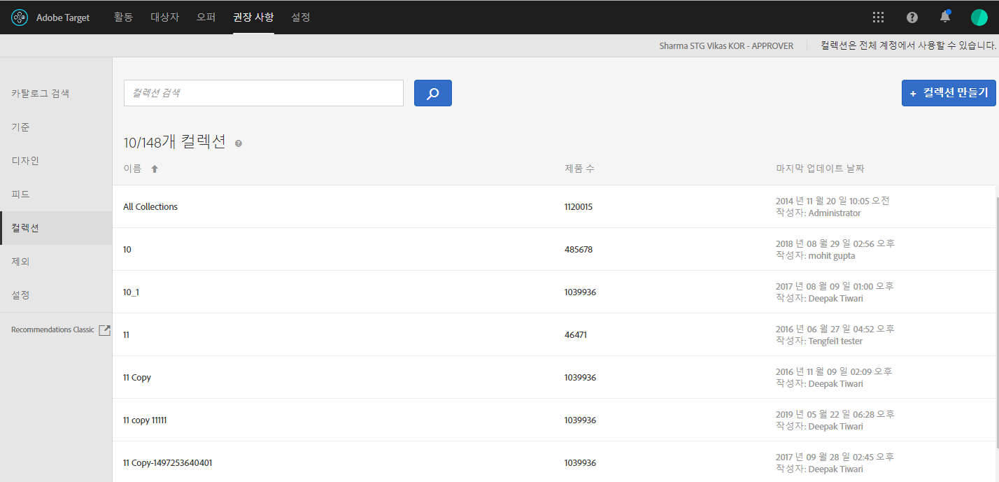

#  컬렉션 {#collections}

컬렉션은 권장 사항에 적합한 제품 또는 항목 세트입니다. 컬렉션은 해당 컬렉션의 일부가 될 항목별로 충족해야 하는 조건을 지정하여 정의됩니다.

일반적으로 컬렉션은 하나의 제품 컬렉션과 같이 유사하거나 관련성이 있는 항목들의 세트입니다. 하지만 특정 가격 범위의 제품이나 색상 또는 특정 지리적 영역에서 흥미로운 품목과 같이 비즈니스에 맞는 카테고리로 항목을 그룹화할 수 있습니다.

제품을 논리 버킷으로 구성하려면 컬렉션을 사용하십시오. 예를 들어, 일부 항목이 한 영역에서 사용할 수 있지만 다른 영역은 사용할 수 없는 경우 방문자의 영역에서 사용할 수 없는 항목을 제외하는 컬렉션을 만들 수 있습니다. 컬렉션을 사용하여 시즌별 항목을 구성하거나 비즈니스에 적용되는 다른 조직 매개 변수를 구성할 수도 있습니다.

추천 내 각 기준에 대해 생성된 백업 추천도 이 컬렉션을 사용하므로, 해당 컬렉션의 항목만 [백업 추천](/help/c-recommendations/c-algorithms/backup-recs.md)에 포함됩니다. 컬렉션을 사용하여 특정 위치에 표시되는 것이 적합한 제품만 표시되게 할 수 있습니다.

컬렉션은 각 기준이 실행될 때마다 재구성 또는 업데이트됩니다.

항목을 카탈로그에 그룹화한 다음 각 컬렉션에 대한 개별 권장 사항을 만들 수 있습니다.

포함 기준을 사용하면 유사한 작업들을 컬렉션으로서 수행할 수 있지만 활동을 만들 때마다 이러한 작업들을 설정해야 합니다. 컬렉션을 사용하면 항목 세트를 한 번 만든 후, 다시 설정하지 않고도 적절하게 사용할 수 있습니다.

[!DNL Recommendations] 활동을 만들거나 편집할 때, 활동 다이어그램의 [!UICONTROL 기준] 레이블 옆에 컬렉션 이름이 표시됩니다.

>[!NOTE]
>
>컬렉션은 [!UICONTROL 최근에 본 항목] 권장 사항 키를 사용할 때에는 적용되지 않습니다.

## 컬렉션 만들기 {#task_1256DFF6842141FCAADD9E1428EF7F08}

컬렉션을 만들어 권장 사항에 표시할 제품 또는 컨텐츠를 구성합니다.

1. **[!UICONTROL 권장 사항]** > **[!UICONTROL 컬렉션]**&#x200B;을 클릭하여 기존 컬렉션 목록을 표시합니다.

   

   [ [!UICONTROL 컬렉션] ] 페이지에는 기존 컬렉션의 목록이 표시됩니다. 컬렉션 만들기 [!UICONTROL 단추를 클릭하여 새 컬렉션을] 만듭니다. 원하는 컬렉션 위로 마우스를 가져간 다음 원하는 아이콘을 클릭하여 기존 컬렉션을 편집, 복사 및 삭제할 수도 있습니다.

   

   [!UICONTROL 컬렉션] 목록 보기의 각 컬렉션에 대해 보고된 &quot;항목 수&quot;는 구성된 기본 권장 사항 호스트 그룹(환경)에서 해당 컬렉션에 대한 규칙과 일치하는 제품의 수입니다. 기본 호스트 그룹을 변경하려면 [설정](/help/c-recommendations/plan-implement.md#concept_C1E1E2351413468692D6C21145EF0B84)을 참조하십시오.

1. **[!UICONTROL 컬렉션 만들기]**&#x200B;를 클릭합니다.

1. (조건부) 컬렉션을 만들거나 업데이트하여 해당 환경에서 컬렉션의 컨텐츠를 미리 보는 동안 **[!UICONTROL 환경]** 필터에서 환경을 선택합니다. 기본적으로 기본 호스트 그룹의 결과가 표시됩니다.

   

1. 컬렉션에 사용할 **[!UICONTROL 이름]**&#x200B;을 입력합니다.

   원할 경우 **[!UICONTROL 설명을 입력할 수도 있습니다]**.

1. 컬렉션을 만드는 데 사용되는 규칙을 설정합니다.

   예를 들어 제품 ID 또는 카테고리, 순익 또는 목록의 기타 매개 변수를 기반으로 컬렉션을 만들 수 있습니다.

   여러 매개 변수를 사용하는 규칙을 추가하여 컬렉션을 정의할 수 있습니다. 여러 규칙이 AND 연산자로 결합됩니다. 컬렉션을 적용하려면 지정된 모든 규칙이 일치해야 합니다.

1. **[!UICONTROL 저장]**&#x200B;을 클릭합니다.

## 고급 검색을 사용하여 컬렉션 만들기

또한 [카탈로그 검색](/help/c-recommendations/c-products/catalog-search.md#save-as) 페이지의 고급 검색([!UICONTROL 추천] > [!UICONTROL 카탈로그 검색] > [!UICONTROL 고급 검색])을 사용하여 컬렉션을 만들 수도 있습니다.

예를 들어 &quot;id > 포함&quot;을 사용하여 검색을 작성한 후 [!UICONTROL 다른 이름으로 저장] > [!UICONTROL 컬렉션]을 클릭할 수 있습니다.

>[!IMPORTANT]
>
>고급 검색 기능은 대소문자를 구분하지 않습니다. 그러나 배송 시 반환되는 제품은 대소문자를 구분하는 검색을 기반으로 합니다. 이러한 불일치로 인해 혼동이 발생할 수 있습니다. 따라서 고급 검색 기능을 사용하는 결과를 기반으로 컬렉션을 작성할 때에는 대소문자 구분을 고려해야 합니다. 예를 들어, &quot;Holiday&quot;를 검색할 때 초기 검색 목록에는 &quot;Holiday&quot;와 &quot;holiday&quot;를 포함하는 결과가 나열됩니다. 그런 다음 &quot;holiday&quot;를 포함하는 제품을 반환할 의도로 카탈로그를 만드는 경우 &quot;holiday&quot;를 포함하는 제품만 반환됩니다. &quot;Holiday&quot;를 포함하는 제품은 반환되지 않습니다. 

## 컬렉션 편집, 복사 또는 삭제

목록에서 원하는 컬렉션 위로 마우스를 가져간 다음 해당 아이콘을 클릭합니다.편집, 복사 또는 삭제

기존 컬렉션을 복사하여 복제 컬렉션을 만든 다음 수정할 수 있습니다. 이를 통해 유사한 제외를 손쉽게 만들 수 있습니다.

컬렉션은 전체 계정에서 사용할 수 있습니다. 컬렉션을 삭제하기 전에 이를 고려해야 합니다. 삭제된 컬렉션은 복구할 수 없습니다.

## Recommendations 활동에서 컬렉션 사용

1. 위에 언급된 방법 중 하나를 사용하여 컬렉션을 만듭니다.

1. 활동 **[!UICONTROL 을]** 클릭하고 [새 Recommendations](/help/c-recommendations/t-create-recs-activity/create-recs-activity.md) 활동을 만들거나 기존 활동을 편집합니다.

1. 기준과 디자인을 선택하면 원하는 컬렉션을 선택하는 [!UICONTROL 옵션] 페이지가 표시됩니다.

   

1. (조건부) 기존 컬렉션 설정을 변경하려면 **[!UICONTROL 경험]** 페이지(3부 안내 작업 과정의 2단계)에서 권장 사항을 배치한 위치를 클릭하고 컬렉션 **[!UICONTROL 변경]**&#x200B;을 클릭한 다음 원하는 컬렉션을 선택합니다.

   

## Training video: Create collections and exclusions in Recommendations (7:05) 

이 비디오에는 다음 정보가 포함됩니다.

* 컬렉션 만들기
* 제외 만들기

>[!VIDEO](https://video.tv.adobe.com/v/27689)