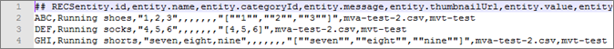

#  사용자 지정 엔티티 속성

[!DNL Adobe Target Recommendations]에서 단일 및 다중 값 사용자 지정 엔티티 속성을 사용하여 카탈로그에 있는 항목에 대한 추가 정보를 정의합니다.

## 제한 {#limits}

카탈로그에 있는 항목에 대한 추가 정보를 정의하는 데 최대 100개의 사용자 지정 엔티티 속성을 포함할 수 있습니다. 예를 들어, 책 또는 동영상을 정의하기 위해 `entity.genre`라는 사용자 지정 속성을 만들 수 있습니다. 또는 티켓 공급업체는 스포츠 경기의 원정 팀이나 콘서트의 서막 같이, 보조 참여자를 포함하도록 행사가 열리는 장소에 대한 속성을 만들 수 있습니다.

단일 값 엔티티 사용자 지정 속성의 최대 길이는 15,000자(영어 및 기타 라틴어 스크립트 알파벳과 같은 1바이트 및 2바이트 UTF-8 인코딩 언어인 경우) 또는 10,000자(중국어, 일본어 및 한국어와 같은 3바이트 UTF-8 인코딩 언어인 경우)입니다.

다중 값 엔티티 사용자 지정 속성은 최대 500개의 값을 포함할 수 있습니다. 각 개별값은 100자로 제한됩니다. 모든 값에 걸친 총 문자 수는 단일 값 엔티티 사용자 지정 속성의 최대 길이에 대한 제한을 준수해야 합니다(위 참조).

## 사용자 지정 엔티티 속성 값 {#section_313331A9F8194A89B5EDD89363018651}

사용자 지정 엔티티 속성은 단일 값 또는 다중 값을 포함할 수 있습니다. 엔티티 속성 값은 제품 보기에 표시됩니다.


단일 값을 사용하는 사용자 지정 엔티티 속성은 단일 값 사전 정의 엔티티 속성과 동일한 방식으로 형성됩니다.

`entity.genre=genre1`

다중 값 사용자 지정 엔티티 속성은 올바른 JSON 배열로 전송해야 합니다.

`entity.genre=[“genre1”, “genre2”]`

[!DNL Recommendations]에서 지원하는 올바른 JSON 배열의 예:

* `["AB","BC"]` 모든 값이 문자열입니다.
* `[1,2]` 모든 값이 숫자입니다.

>[!NOTE]
>
>[!DNL Recommendations]에서는 다중 값 엔티티 속성에서 혼합 값 유형을 지원하지 않습니다. 예를 들어, `["AB",1,true, [1,2,3]]`은 유효한 JSON 배열이지만 혼합 값 유형(문자열, 숫자, 부울, 개체)이 포함되어 있으므로 [!DNL Recommendations]에서는 지원되지 않습니다.

사용자 지정 속성이 유효한 JSON 배열로 전송되면 이 속성은 카탈로그의 모든 제품에 대한 다중 값 속성으로 처리됩니다.

>[!NOTE]
>
>속성을 다중 값에서 단일 값으로 변경하려면 카탈로그를 삭제하고 수정된 제품 데이터를 업로드해야 합니다. 카탈로그를 삭제해도 제품 ID와 연결된 이전 데이터는 삭제되지 않습니다. 자세한 내용은 *Adobe Recommendations Classic* 설명서의 [시스템에서 모든 항목 삭제](/help/assets/adobe-recommendations-classic.pdf)를 참조하십시오.

**제한 사항**:

* 사용자 지정 엔티티 속성에는 사전 정의된 엔티티 속성 이름을 사용할 수 없습니다. [엔티티 속성](/help/c-recommendations/c-products/entity-attributes.md#reference_3BCC1383FB3F44F4A2120BB36270387F)을 참조하십시오.
* `entity.environment` 속성은 시스템에 의해 예약되어 있으므로 사용자 지정 엔티티 속성에 사용할 수 없습니다. `entity.environment`, 피드 또는 API를 사용하여 `targetPageParams`를 전달하려고 시도하는 것은 무시됩니다.
* 배열에 단일 값 유형이 포함되어야 합니다. 혼합 값 배열(`["AB",1,true]`)은 지원되지 않습니다.
* 중첩 JSON 배열(`[10,12,[1,2,3]]`)을 포함하는 다중 값 속성은 단일 값 속성으로 처리됩니다.

## 다중 값 속성 구현 {#section_80FEFE49E8AF415D99B739AA3CBA2A14}

다중 값 사용자 지정 엔티티 속성은 피드(CSV), `targetPageParams` 및 배달 API를 사용하여 제품을 업로드할 때 지원됩니다. 새 값이 현재 값을 대체하며, 추가되지 않습니다. 빈 배열([])은 값이 없는 것으로 처리됩니다.

큰따옴표는 이스케이프 처리를 해야 합니다. 예를 들어, `"[""test"", ""value""]"`는 CSV로 사용할 수 있는 올바른 JSON 배열입니다.

다중 값 속성에는 최대 500개의 값을 포함할 수 있습니다.

### targetPageParams 사용

다음 예는 `targetPageParams`를 사용하는 방법을 보여줍니다.

```javascript
function targetPageParams() { 
  return { 
    'entity.id':                   '123', 
    'entity.categoryId':            '["A", "A:B", "A:B:C", "A:B:C:D"]',        
    'entity.MultiValueAttribute':   '["X", "Y", "Z"]', 
    'entity.event.detailsOnly':     'true', 
    'excludedIds":                  '[123, 3232, 2323, 4344]', 
    'orderId":                      '123456', 
    'orderTotal":                   '195.32', 
    'productPurchaseId":            '[001,002,003]' 
  }; 
}
```

### CSV 사용

텍스트 편집기를 사용하여 CSV 파일을 원시 형식으로 관리하거나 스프레드시트 소프트웨어를 사용할 수 있습니다.

원시 CSV의 모습은 다음과 유사합니다.



동일한 카탈로그를 스프레드시트에서 볼 때는 다음과 같습니다.


.csv 형식으로 변환할 때 스프레드시트 소프트웨어는 셀 컨텐츠 둘레에 큰 따옴표를 추가하여 셀 내의 쉼표가 셀 구분 기호로 작동하지 않도록 합니다. 또한 사용자 지정 다중 값 속성에 포함하는 JSON 문자열 값의 둘레에도 큰 따옴표를 추가합니다. 이는 원시 파일에서 바로 작업하는 것을 불편하게 할 수 있습니다. 예:

* 스프레드시트: `["1","2","3"]`
* 원시: `"[""1"",""2"",""3""]"`

원시 카탈로그 CSV 파일을 직접 편집할 때는 주의하십시오.

### API 사용

이스케이프 처리된 JSON 배열이 포함된 문자열 값으로 mbox 매개 변수의 배달 API를 사용하여 다중 값 속성을 전달할 수 있습니다.

```javascript
"execute": {
    "mboxes": [
      {
        "index": 0,
        "name": "first-mbox",
        "parameters": {
          "entity.id": "32323",
          "entity.categoryId": "My Category",
          "entity.MultiValueAttribute": "[\"X\", \"Y\", \"Z\"]"
        }
      }
    ]
  }
```

배달 및 저장 엔티티 API 사용에 대한 자세한 내용은 [Adobe Recommendations API 설명서](https://developers.adobetarget.com/api/recommendations)를 참조하십시오.

## 다중 값 속성에 연산자 사용 {#section_83C2288A805242D9A02EBC4F07DEE945}

알고리즘 포함 규칙, 카탈로그 규칙 및 제외 규칙의 다중 값 사용자 지정 속성에 연산자를 적용할 때, 목록에 있는 하나 이상의 값이 연산(부울 *or*)을 통과하는 경우 결과는 *true*&#x200B;가 됩니다.

다음 예에서 규칙은 `message contains abc`.

* 사례 1: `entity.genre = ["ab", "bc", "de"]`. 어떤 값도 `abc`.
* 사례 2: `entity.genre = ["abcde","de","ef"]`. 하나의 값이 `abc`.

부정 연산자의 경우, 모든 속성 값이 연산을 통과해야 합니다(부울 *and*). 예를 들어, 연산자가 `notEquals`인 경우 결과는 어느 값이든 일치하면 *false*&#x200B;가 됩니다.

알고리즘 포함 규칙, 카탈로그 규칙 및 제외 규칙의 운영자 행동에 대해서는 다음 섹션을 참조하십시오.

### 다음과 같음

어떤 속성 값이든 입력 값과 같으면 결과는 true가 됩니다.

예: `genre equals abc`

* 사례 1: `entity.genre = ["ab", "bc", "de"]`. 어떤 값도 `abc`.
* 사례 2: `entity.genre = ["abc", "de", "ef"]`. 하나의 값이 `abc`.
* 사례 3: `entity.genre = ["abcde", "de", "ef"]` `abc`가 목록에 있는 어떤 요소와도 같지 않으므로 결과는 false입니다.

### 다음과 같지 않음

입력 값과 같은 속성 값이 없으면 결과는 true가 됩니다.

예: `genre not equals abc`

* 사례 1: `entity.genre = ["ab", "bc", "de"]`. 어떤 값도 `abc`.
* 사례 2: `entity.genre = ["abc", "de", "ef"]`. 하나의 값이 `abc`.
* 사례 3: `entity.genre = ["abcde", "de", "ef"]` `abc`가 목록에 있는 어떤 요소와도 같지 않으므로 결과는 true입니다.

### 다음 포함

속성 중 어떤 값이든 입력 값을 포함하면 결과는 true가 됩니다.

예: `genre contains abc`

* 사례 1: `entity.genre = ["ab", "bc", "de"]`. 어떤 값도 `abc`.
* 사례 2: `entity.genre = ["abcde", "de", "ef"]`. 하나의 값이 `abc`.

### 다음을 포함하지 않음

속성 중 입력 값을 포함하는 값이 없으면 결과는 true가 됩니다.

예: `genre does not contain abc`

* 사례 1: `entity.genre = ["ab", "bc", "de"]`. 어떤 값도 `abc`.
* 사례 2: `entity.genre = ["abcde", "de", "ef"]`. 하나의 값이`abc`.

### 다음으로 시작

속성 중 어떤 값이든 입력 값으로 시작하면 결과는 true가 됩니다.

예: `genre starts with abc`

* 사례 1: `entity.genre = ["ab", "bc", "de"]`. 어떤 값도 `abc`.
* 사례 2: `entity.genre = ["abcde", "de", "ef"]`. 하나의 값이 `abc`.
* 사례 3: `entity.genre = ["ab", "de", "abc"]` 하나의 값이 `abc`로 시작하므로 결과는 true입니다(목록에서 첫 번째 요소일 필요는 없음).

### 다음으로 끝남

속성 중 어떤 값이든 입력 값으로 끝나면 결과는 true가 됩니다.

예: `genre ends with abc`

* 사례 1: `entity.genre = ["ab", "bc", "de"]`. 어떤 값도 `abc`.
* 사례 2: `entity.genre = ["deabc", "de", "ef"]`. 하나의 값이 `abc`.

### 다음보다 크거나 같음(숫자 값만 해당)

속성 값이 double로 변환됩니다. 규칙을 실행하는 동안 변환할 수 없는 속성은 건너뜁니다.

처리 후, 어떤 속성 값이든 입력 값보다 크거나 같으면 결과는 true가 됩니다.

예: `price greater than or equal to 100`

* 사례 1: `entity.price = ["10", "20", "45"]`. 100보다 크거나 같은 값이 없으므로 결과는 false입니다. 값 `de`는 double로 변환할 수 없으므로 건너뜁니다.
* 사례 2: `entity.price = ["100", "101", "90", "80"]`. 두 값이 100보다 크거나 같으므로 결과는 true입니다.

### 다음보다 작거나 같음(숫자 값만 해당)

속성 값이 double로 변환됩니다. 규칙을 실행하는 동안 변환할 수 없는 속성은 건너뜁니다.

처리 후, 어떤 속성 값이든 입력 값보다 작거나 같으면 결과는 true가 됩니다.

예: `price less than or equal to 100`

* 사례 1: `entity.price = ["101", "200", "141"]`. 100보다 작거나 같은 값이 없으므로 결과는 false입니다. 값 `de`는 double로 변환할 수 없으므로 건너뜁니다.
* 사례 2: `entity.price = ["100", "101", "90", "80"]`. 두 값이 100보다 작거나 같으므로 결과는 true입니다.

### 동적으로 일치(항목 기반 알고리즘에서만 사용 가능)

어떤 속성 값이든 입력 값과 일치하면 결과는 true가 됩니다.

예: `genre matches abc`

* 사례 1: `entity.genre = ["ab", "bc", "de"]`. 어떤 값도 `abc`.
* 사례 2: `entity.genre = ["abc", "de", "ef"]`. 하나의 값이 `abc`.

### 동적으로 일치하지 않음(항목 기반 알고리즘에서만 사용 가능)

어떤 속성 값이든 입력 값과 일치하면 결과는 false가 됩니다.

예: `genre does not match abc`

* 사례 1: `entity.genre = ["ab", "bc", "de"]`. 어떤 값도 `abc`.
* 사례 2: `entity.genre = ["abc", "de", "ef"]`. 하나의 값이 `abc`.

### 동적 범위(항목 기반 알고리즘에서만 사용 가능, 숫자 값만 해당)

어떤 숫자 속성 값이든 지정된 범위 내에 있으면 결과는 true가 됩니다.

예: `price dynamically ranges in 80% to 120% of 100`

* 사례 1: `entity.price = ["101", "200", "125"]`. `101`이 100의 80%~120% 범위에 있으므로 결과는 true입니다. 값 `de`는 double로 변환할 수 없으므로 건너뜁니다.
* 사례 2: `entity.price = ["130", "191", "60", "75"]`. 100의 80%~120% 범위에 있는 값이 없으므로 결과는 false입니다.

>[!NOTE]
>
>*Double*&#x200B;은 Java 데이터 유형입니다. 숫자 값이 필요한 연산자의 경우, double로 변환하면 숫자가 아닌 값은 결과에서 고려되지 않습니다.

## 디자인의 다중 값 속성 {#section_F672E4F6E1D44B3196B7ADE89334ED4A}

디자인에서 참조할 때 다중 값 속성이 쉼표로 구분된 목록으로 표시됩니다.

예:

디자인에서 `entity.genre=["genre1","genre2"]`가 `$entity<N>.genre`로 참조되는 경우 결과는 `genre1, genre2`입니다.

## 관련 항목:

* [엔티티 속성을 참조하십시오](/help/c-recommendations/c-products/entity-attributes.md#reference_3BCC1383FB3F44F4A2120BB36270387F)
